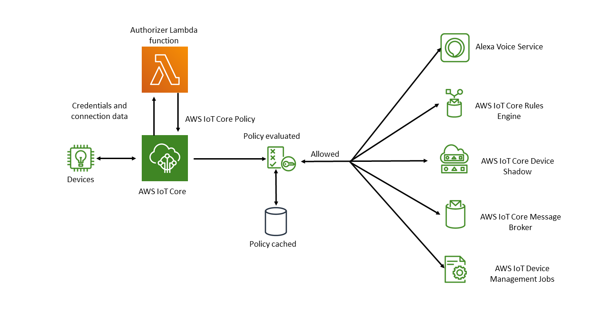

# Understanding the custom authentication

workflow

Custom authentication enables you to define how to authenticate and authorize
clients by using [authorizer
resources](../apireference/API_AuthorizerDescription.md "../apireference/API_AuthorizerDescription.md").  Each authorizer contains a reference to a customer-managed
Lambda function, an optional public key for validating device credentials, and
additional configuration information. The following diagram illustrates the
authorization workflow for custom authentication in AWS IoT Core.

## AWS IoT Core custom authentication

and authorization workflow

The following list explains each step in the custom authentication and
authorization workflow.

1.  A device connects to a customer’s AWS IoT Core data endpoint by using one
    of the supported [Device communication protocols](protocols.md "protocols.md"). The device passes
    credentials in either the request’s header fields or query parameters
    (for the HTTP Publish or MQTT over WebSockets protocols), or in the user
    name and password field of the MQTT CONNECT message (for the MQTT and
    MQTT over WebSockets protocols).
2.  AWS IoT Core checks for one of two conditions:

        * The incoming request specifies an authorizer.
        * The AWS IoT Core data endpoint receiving the request has a
         default authorizer configured for it.

    If AWS IoT Core finds an authorizer in either of these ways, AWS IoT Core
    triggers the Lambda function associated with the authorizer.

3.  (Optional) If you've enabled token signing, AWS IoT Core validates the
    request signature by using the public key stored in the authorizer
    before triggering the Lambda function. If validation fails, AWS IoT Core
    stops the request without invoking the Lambda function.
4.  The Lambda function receives the credentials and connection metadata
    in the request and makes an authentication decision.
5.  The Lambda function returns the results of the authentication decision
    and an AWS IoT Core policy document that specifies what actions are allowed
    in the connection. The Lambda function also returns information that
    specifies how often AWS IoT Core revalidates the credentials in the request
    by invoking the Lambda function.
6.  AWS IoT Core evaluates activity on the connection against the policy it
    has received from the Lambda function.
7.  After the connection is established and your custom authorizer Lambda
    is initially invoked, the next invocation can be delayed for up to 5
    minutes on idle connections without any MQTT operations. After that,
    subsequent invocations will follow the refresh interval in your custom
    authorizer Lambda. This approach can prevent excessive invocations that
    could exceed the Lambda concurrency limit of your AWS account.

## Scaling considerations

Because a Lambda function handles authentication and authorization for your
authorizer, the function is subject to Lambda pricing and service limits, such as
concurrent execution rate. For more information about Lambda pricing, see [Lambda Pricing](https://aws.amazon.com/lambda/pricing/ "https://aws.amazon.com/lambda/pricing/"). You can
manage the load on your Lambda function by adjusting the
`refreshAfterInSeconds` and `disconnectAfterInSeconds`
parameters in your Lambda function response. For more information about the
contents of your Lambda function response, see [Defining your Lambda function](custom-auth-lambda.md "custom-auth-lambda.md").

###### Note

If you leave signing enabled, you can prevent excessive triggering of your
Lambda by unrecognized clients. Consider this before you disable signing in
your authorizer.

###### Note

The Lambda function timeout limit for custom authorizer is 5
seconds.
