# Getting started with Device Advisor in the console

This tutorial helps you get started with AWS IoT Core Device Advisor on the console. Device Advisor offers
features such as required tests and signed qualification reports. You can use these
tests and reports to qualify and list devices in the [AWS Partner Device Catalog](https://devices.amazonaws.com/ "https://devices.amazonaws.com/") as
detailed in the [AWS IoT Core
qualification program](https://aws.amazon.com/partners/dqp/ "https://aws.amazon.com/partners/dqp/").

For more information about using Device Advisor, see [Device Advisor workflow](device-advisor-workflow.md "device-advisor-workflow.md") and [Device Advisor detailed console workflow](device-advisor-console-tutorial.md "device-advisor-console-tutorial.md").

To complete this tutorial, follow the steps outlined in [Setting up](device-advisor-setting-up.md "device-advisor-setting-up.md").

###### Note

Device Advisor is supported in the following AWS Regions:

- US East (N. Virginia)
- US West (Oregon)
- Asia Pacific (Tokyo)
- Europe (Ireland)

###### Getting started

1. In the [AWS IoT console's](https://console.aws.amazon.com/iot "https://console.aws.amazon.com/iot") navigation
   pane under **Test**, choose **Device Advisor**. Then,
   choose the **Start walkthrough** button on the console.

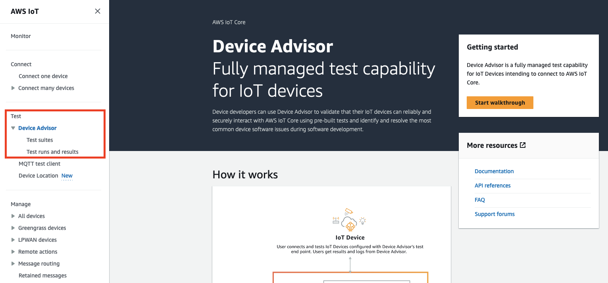 2. The **Getting started with Device Advisor** page provides an
overview of the steps required to create a test suite and run tests against your
device. You can also find the Device Advisor test endpoint for your account here. You
must configure the firmware or software on the device used for testing to
connect to this test endpoint.

To complete this tutorial, first [create a thing and certificate](device-advisor-setting-up.md#da-create-thing-certificate "device-advisor-setting-up.md#da-create-thing-certificate"). After you review the information
under **How it works**, choose
**Next**.

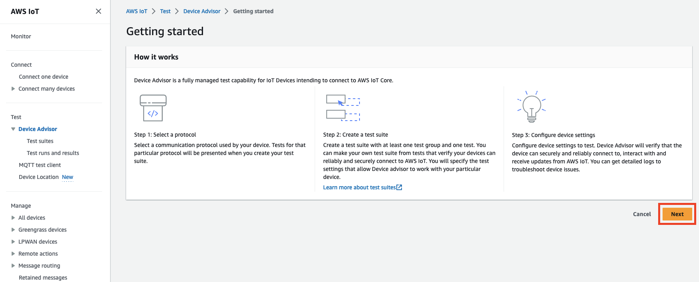 3. In **Step 1: Select a protocol**, select a protocol from the
options listed. Then, choose **Next**.

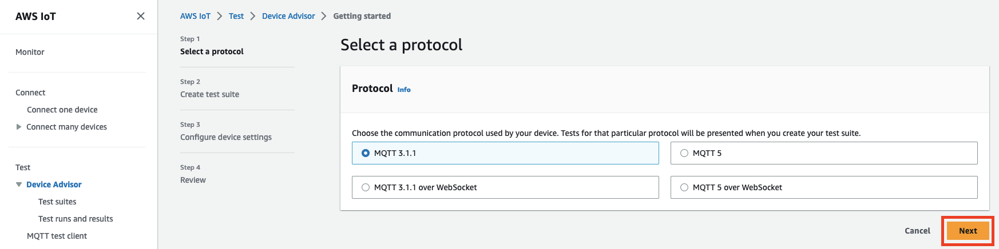 4. In **Step 2**, you create and configure a custom test suite.
A custom test suite must have at least one test group, and each test group must
have at least one test case. We've added the **MQTT Connect**
test case for you to get started.

Choose **Test suite properties**.

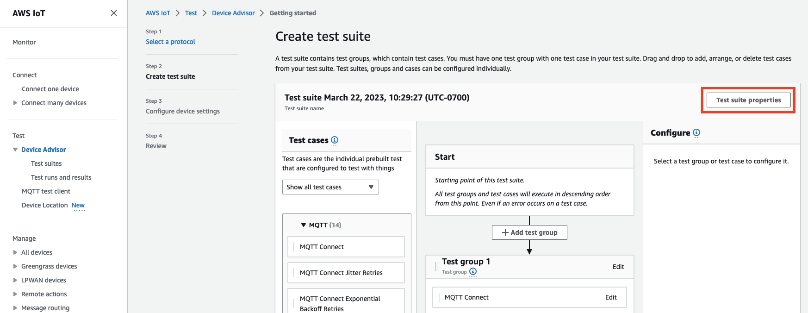

Supply the test suite properties when you create your test suite. You can
configure the following suite-level properties:

    * **Test suite name**: Enter a name for your test
     suite.
    * **Timeout** (optional): The timeout (in seconds) for
     each test case in the current test suite. If you don't specify a timeout
     value, the default value is used.
    * **Tags** (optional): Add tags to the test
     suite.

When you’ve finished, choose **Update properties**.

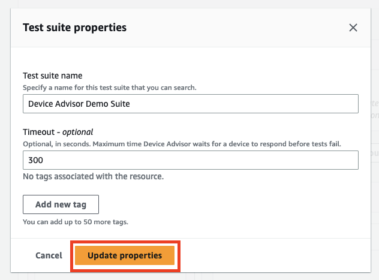 5. (Optional) To update the test suite group configuration, choose the
**Edit** button next to the test group name.

    * **Name**: Enter a custom name for the test suite
     group.
    * **Timeout** (optional): The timeout (in seconds) for
     each test case in the current test suite. If you don't specify a timeout
     value, the default value is used.

When finished, choose **Done** to continue.

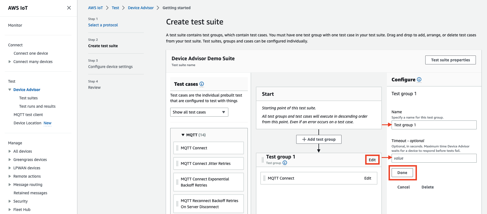 6. (Optional) To update the test case configuration for a test case, choose the
**Edit** button next to the test case name.

    * **Name**: Enter a custom name for the test suite
     group.
    * **Timeout** (optional): The timeout (in seconds) for
     the selected test case. If you don't specify a timeout value, the
     default value is used.

When finished, choose **Done** to continue.

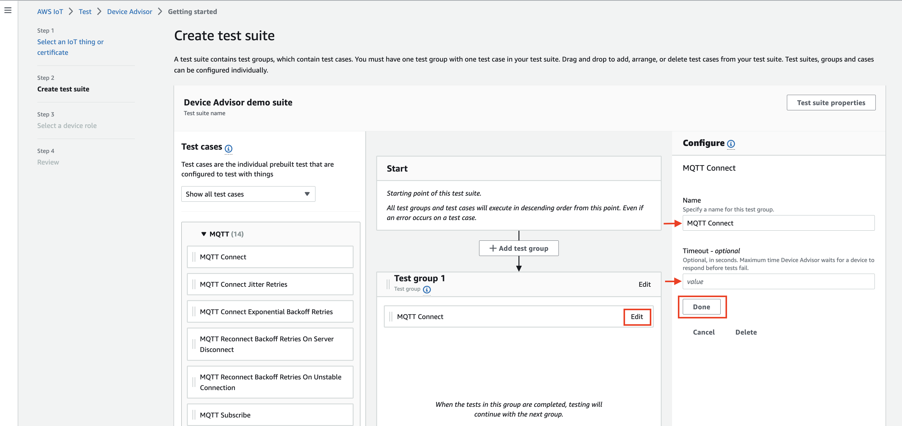 7. (Optional) To add more test groups to the test suite, choose **Add
test group**, then follow the instructions in Step 5. 8. (Optional) To add more test cases, drag the test cases in the **Test
cases** section into any of your test groups.

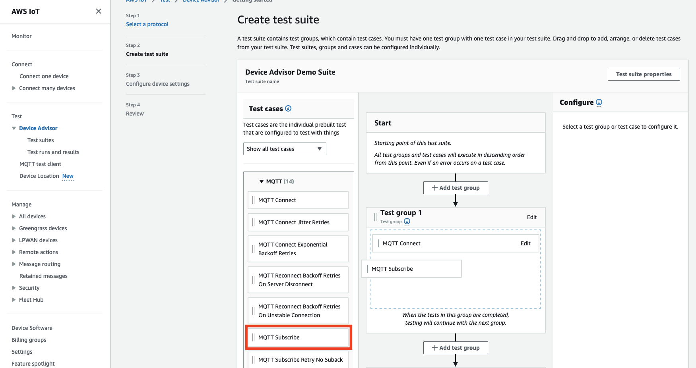 9. You can change the order of your test groups and test cases. To make changes,
drag the listed test cases up or down the list. Device Advisor runs tests in the order
you listed them in.

After you've configured your test suite, choose
**Next**. 10. In **Step 3**, select an AWS IoT thing or certificate to test
using Device Advisor. If you don't have any existing things or certificates, see [Setting up](device-advisor-setting-up.md "device-advisor-setting-up.md").

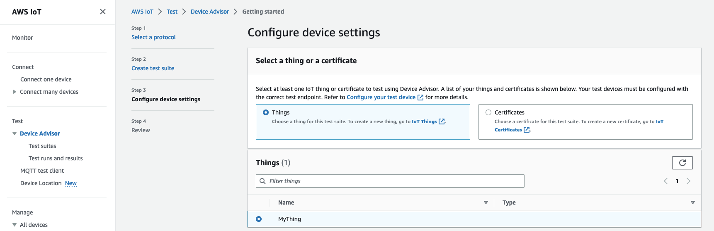 11. You can configure a device role that Device Advisor uses to perform AWS IoT MQTT
actions on behalf of your test device. For **MQTT Connect**
test case only, the **Connect** action is selected
automatically. This is because the device role requires this permission to run
the test suite. For other test cases, the corresponding actions are selected.

Provide the resource values for each of the selected actions. For example, for
the **Connect** action, provide the client ID your device uses
to connect to the Device Advisor endpoint. You can provide multiple values with comma
seperated values, and prefix values with a wildcard (\*) character. For example,
to provide permission to publish on any topic beginning with
`MyTopic`, enter `MyTopic*` as the resource
value.

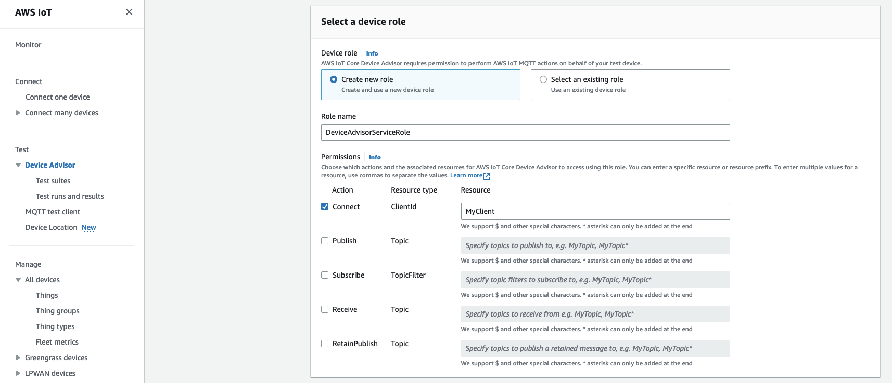

To use a previously created device role from [Setting up](device-advisor-setting-up.md "device-advisor-setting-up.md"), choose **Select an existing role**.
Then choose your device role under **Select role**.

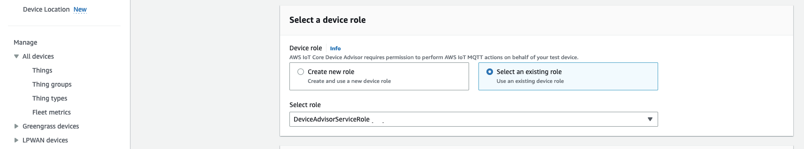

Configure your device role with one of the two provided options, and then
choose **Next**. 12. In the **Test endpoint** section, select the endpoint that
best fits your use case. To run multiple test suites simultaneously with the
same AWS account, select **Device-level endpoint**. To run
one test suite at a time, select **Account-level
endpoint**.

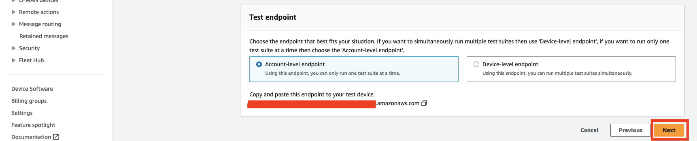 13. **Step 4** shows an overview of the selected test device,
test endpoint, test suite, and test device role configured. To make changes to a
section, choose the **Edit** button for the section you want to
edit. Once you've confirmed your test configuration, choose
**Run** to create the test suite and run your tests.

###### Note

For best results, you can connect your selected test device to the Device Advisor
test endpoint before you start the test suite run. We recommend that you
have a mechanism built for your device to try connecting to our test
endpoint every five seconds for up to one to two minutes.

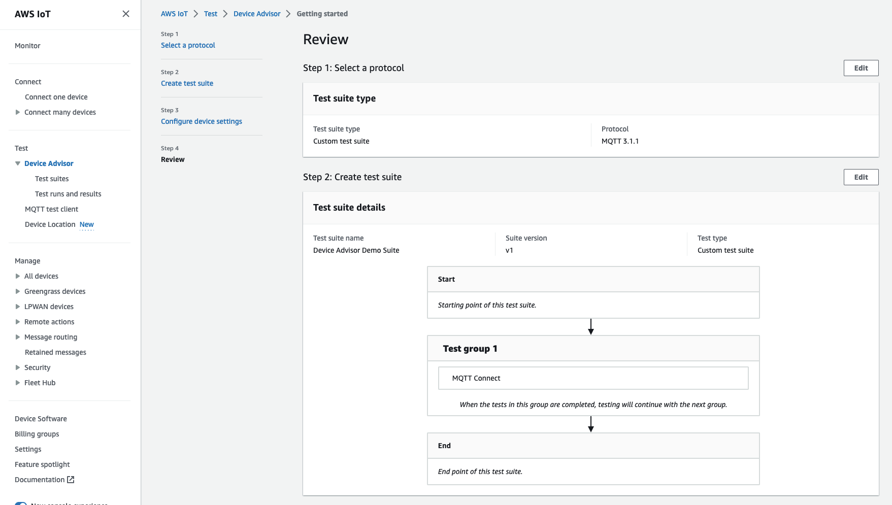

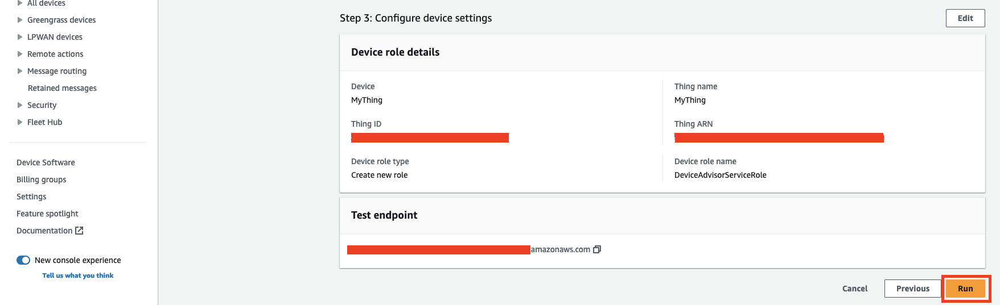 14. In the navigation pane under **Test**, choose
**Device Advisor**, and then choose **Test runs and
results**. Select a test suite run to view its run details and
logs.

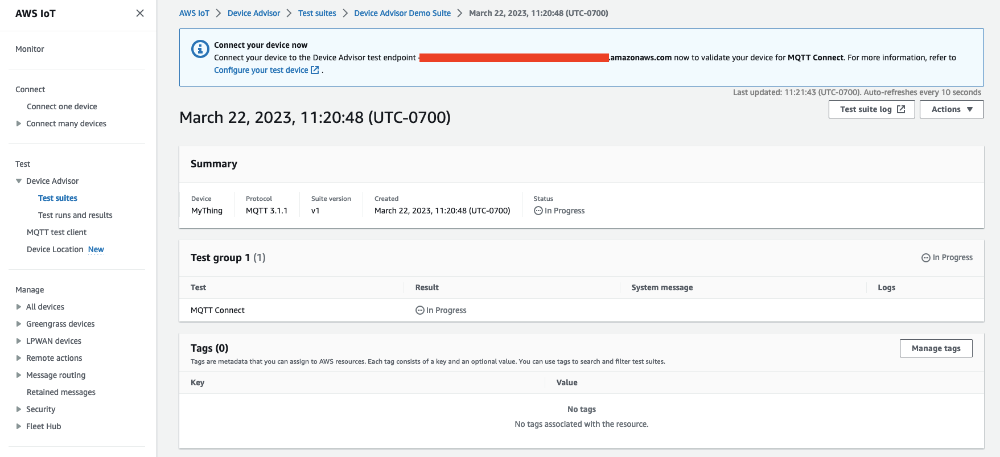 15. To access the Amazon CloudWatch logs for the suite run:

    * Choose **Test suite log** to view the CloudWatch logs for
     the test suite run.
    * Choose **Test case log** for any test case to view
     test case-specific CloudWatch logs.

16. Based on your test results, [troubleshoot](iot_troubleshooting.md#device-advisor-troubleshooting "iot_troubleshooting.md#device-advisor-troubleshooting") your device until all tests pass.
