# Device Advisor detailed console workflow

In this tutorial, you'll create a custom test suite and run tests against the device
you want to test in the console. After the tests are complete, you can view the test
results and detailed logs.

###### Tutorials

- [Prerequisites](#da-detailed-prereqs "#da-detailed-prereqs")
- [Create a test suite
  definition](#device-advisor-console-create-suite "#device-advisor-console-create-suite")
- [Start a test suite
  run](#device-advisor-console-run-test-suite "#device-advisor-console-run-test-suite")
- [Stop a test suite run (optional)](#device-advisor-stop-test-run "#device-advisor-stop-test-run")
- [View test suite run details and
  logs](#device-advisor-console-view-logs "#device-advisor-console-view-logs")
- [Download an AWS IoT
  qualification report](#device-advisor-console-qualification-report "#device-advisor-console-qualification-report")

## Prerequisites

To complete this tutorial, you need to
[create a thing and certificate](device-advisor-setting-up.md#da-create-thing-certificate "device-advisor-setting-up.md#da-create-thing-certificate").

## Create a test suite

definition

Create a test suite suite so that you can run it for your devices and
perform verification.

1. In the [AWS IoT
   console](https://console.aws.amazon.com/iot "https://console.aws.amazon.com/iot"), in the navigation pane, expand
   **Test**, **Device Advisor** and then
   choose **Test suites**.

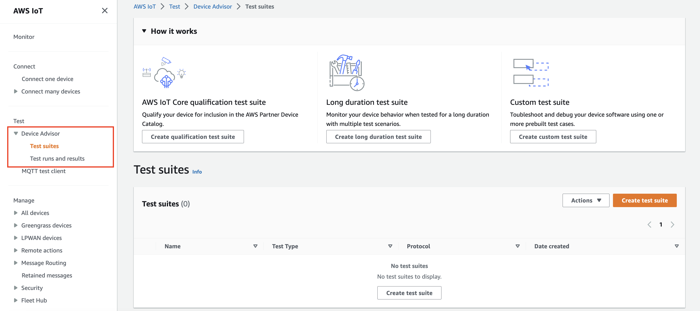

Choose **Create Test Suite**. 2. Select either `Use the AWS Qualification test suite` or
`Create a new test suite`.

For protocol, choose either **MQTT 3.1.1** or **MQTT 5**.

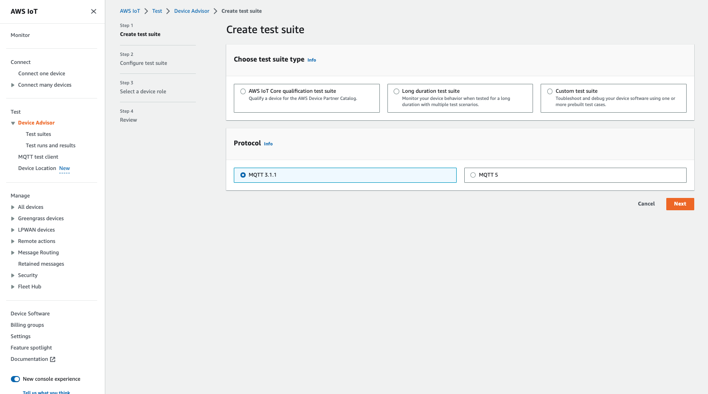

Select `Use the AWS Qualification test suite` to qualify
and list your device to the AWS Partner Device Catalog. By choosing this
option, test cases required for qualification of your device to the
AWS IoT Core qualification program are pre-selected. Test groups and test cases
can't be added or removed. You will still need to configure the test suite
properties.

Select `Create a new test suite` to create and configure a
custom test suite. We recommend starting with this option for initial
testing and troubleshooting. A custom test suite must have at least one test
group, and each test group must have at least one test case. For the purpose
of this tutorial, we'll select this option and choose
**Next**.

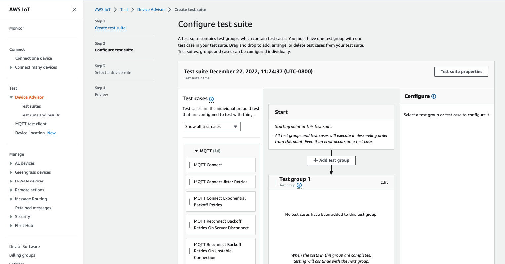 3. Choose **Test suite properties**. You must create the
test suite properties when you create your test suite.

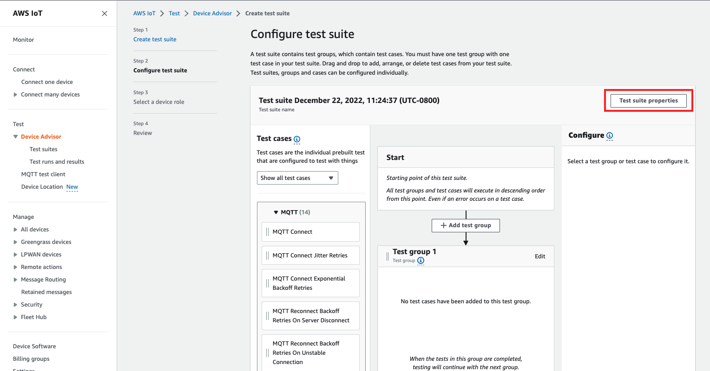

Under **Test suite properties**, fill out the
following:

    * **Test suite name**: You can create the suite
     with a custom name.
    * **Timeout** (optional): The timeout in seconds
     for each test case in the current test suite. If you don't specify a
     timeout value, the default value is used.
    * **Tags** (optional): Add tags to the test
     suite.

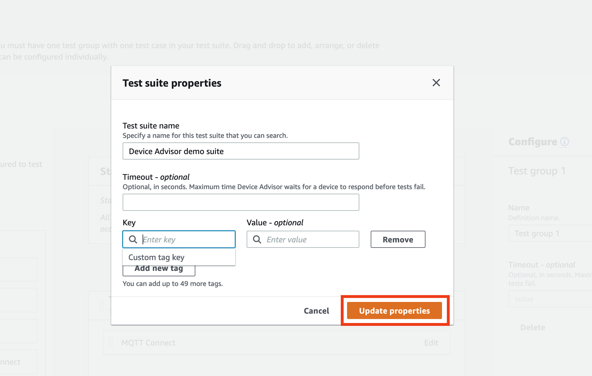

When you've finished, choose **Update
properties**. 4. To modify the group level configuration, under `Test group
 1`, choose **Edit**. Then, enter a
**Name** to give the group a custom name.

Optionally, you can also enter a **Timeout** value in
seconds under the selected test group. If you don't specify a timeout value,
the default value is used.

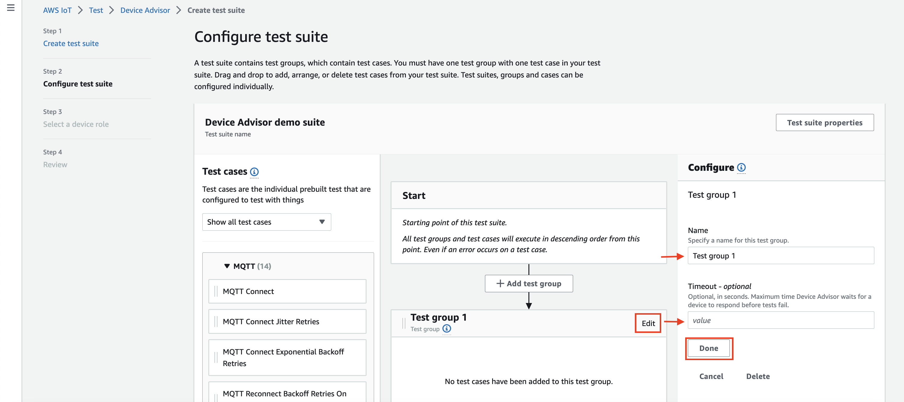

Choose **Done**. 5. Drag
one of the available test cases from **Test cases** into
the test group.

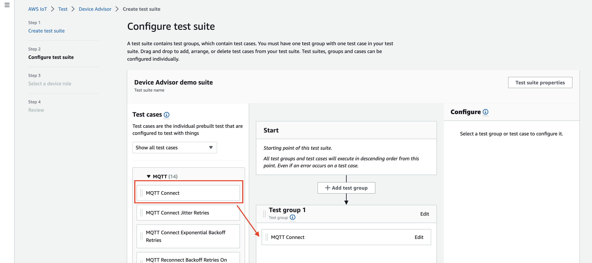 6. To modify the test case level configuration for the test case that you
added to your test group, choose **Edit**. Then, enter a
**Name** to give the group a custom name.

Optionally, you can also enter a **Timeout** value in
seconds under the selected test group. If you don't specify a timeout value,
the default value is used.

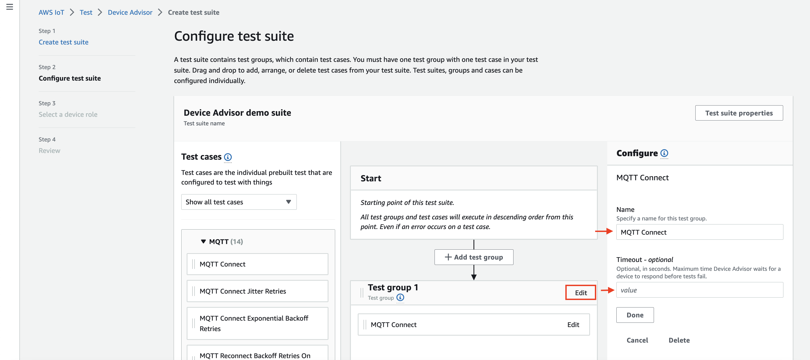

Choose **Done**.

###### Note

To add more test groups to the test suite, choose **Add test
group**. Follow the preceding steps to create and configure
more test groups, or to add more test cases to one or more test groups.
Test groups and test cases can be reordered by choosing and dragging a
test case to the desired position. Device Advisor runs tests in the order in
which you define the test groups and test cases. 7. Choose **Next**. 8. In **Step 3**, configure a device role which Device Advisor will
use to perform AWS IoT MQTT actions on behalf of your test device.

If you selected **MQTT Connect** test case only in
**Step 2**, the **Connect** action
will be checked automatically since that permission is required on device
role to run this test suite. If you selected other test cases, the
corresponding required actions will be checked. Ensure that the resource
values values for each of the actions is provided. For example, for the
**Connect** action, provide the client id that your
device will be connecting to the Device Advisor endpoint with. You can provide
multiple values by using commas to separate the values, and you can provide
prefix values using a wildcard (\*) character as well. For example, to
provide permission to publish on any topic beginning with
`MyTopic`, you can provide “`MyTopic*`” as the
resource value.

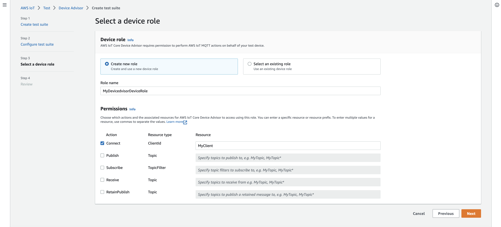

If you already created a device role previously and would like to use that
role, select **Select an existing role** and choose your
device role under **Select role**.

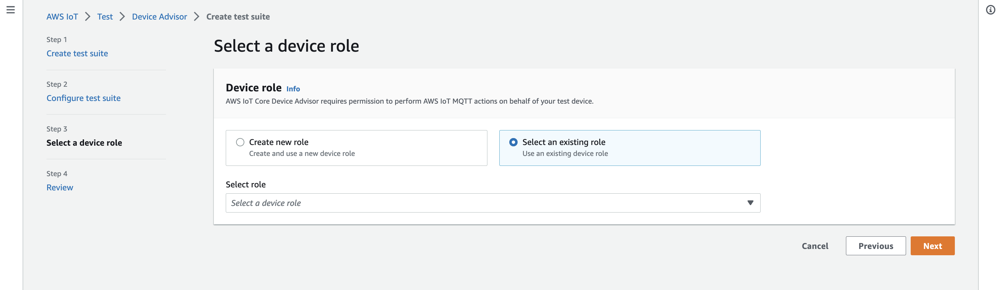

Configure your device role using one of the two provided options and choose **Next**. 9. In **Step 4**, make sure the configuration provided in
each of the steps is accurate. To edit configuration provided for a
particular step, choose **Edit** for the corresponding
step.

After you verify the configuration, choose **Create test
suite**.

The test suite should be created successfully and you'll be redirected to the **Test suites**
page where you can view all the test suite that have been created.

If the test suite creation failed, make sure the test suite, test groups,
test cases, and device role have been configured according to the previous
instructions.

## Start a test suite

run

1. In the [AWS IoT
   console](https://console.aws.amazon.com/iot "https://console.aws.amazon.com/iot"), in the navigation pane, expand
   **Test**, **Device Advisor**, and then
   choose **Test suites**.
2. Choose the test suite for which you'd like to view the test suite
   details.

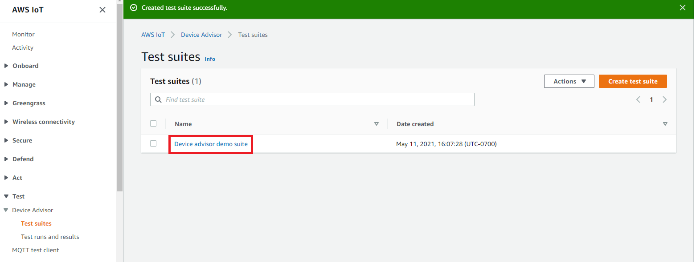

The test suite detail page displays all of the information related to the
test suite. 3. Choose **Actions**, then **Run test
suite**.

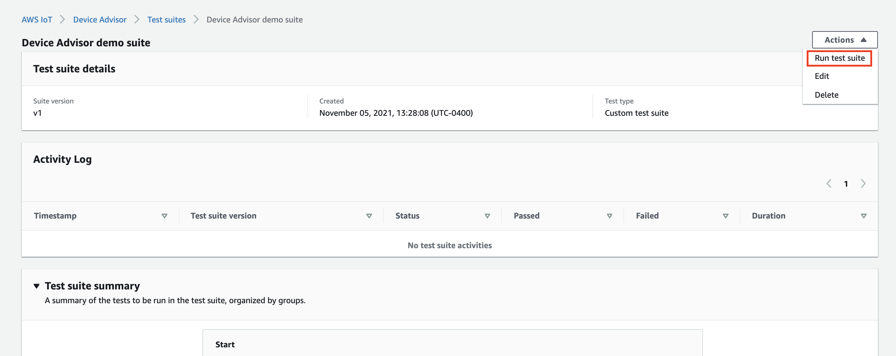 4. Under **Run configuration**, you'll need to select an AWS IoT thing or certificate to test using Device Advisor. If you don't have any
existing things or certificates, first [create AWS IoT Core resources](device-advisor-setting-up.md "device-advisor-setting-up.md").

In **Test endpoint** section, select the endpoint that
best fits your case. If you plan to run multiple test suites simultaneously
using the same AWS account in the future, select **Device-level
endpoint**. Otherwise, if you plan to only run one test suite
at a time, select **Account-level endpoint**.

Configure your test device with the selected Device Advisor's test endpoint.

After you select a thing or certificate and choose a Device Advisor endpoint, choose **Run test**.

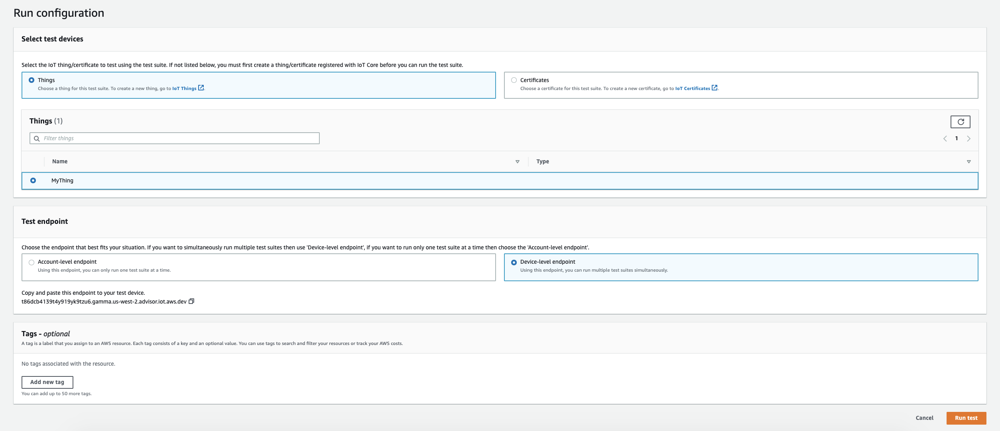 5. Choose **Go to results** on the top banner for viewing
the test run details.

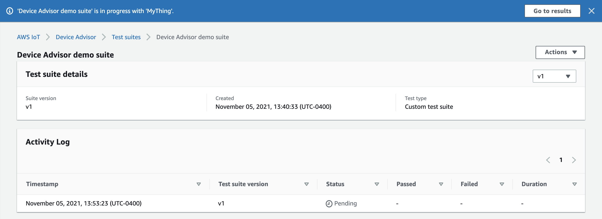

## Stop a test suite run (optional)

1. In the [AWS IoT console](https://console.aws.amazon.com/iot "https://console.aws.amazon.com/iot"), in the navigation pane, expand **Test**, **Device Advisor**, and then choose **Test runs and results**.
2. Choose the test suite in progress that you want to stop.

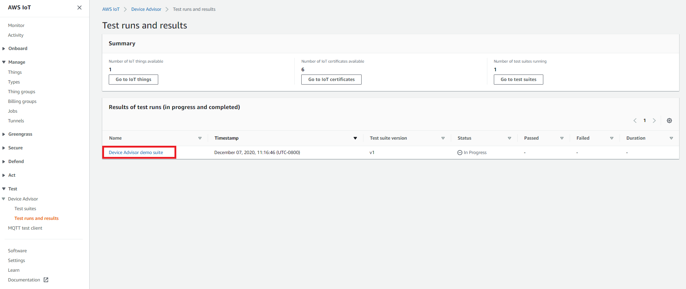 3. Choose **Actions**, then **Stop test suite**.

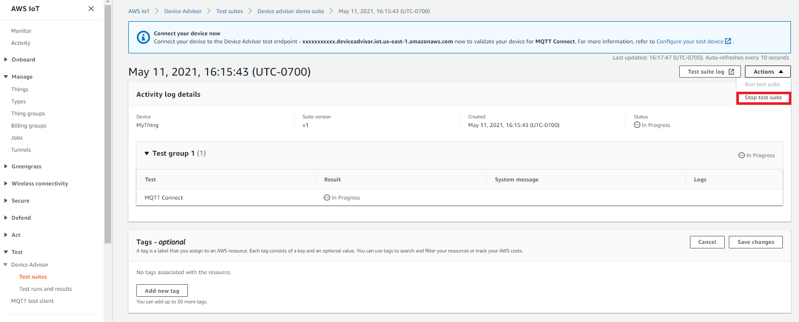 4. The cleanup process will take several minutes to complete. While the cleanup process runs, the
test run status will be `STOPPING`. Wait for the cleanup process
to complete and for the test suite status to change to the
`STOPPED` status before starting a new suite run.

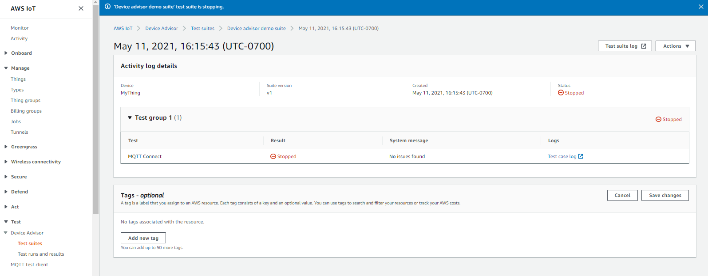

## View test suite run details and

logs

1. In the [AWS IoT
   console](https://console.aws.amazon.com/iot "https://console.aws.amazon.com/iot"), in the navigation pane, expand
   **Test**, **Device Advisor** and then
   choose **Test runs and results**.

This page displays:

    * Number of IoT things
    * Number of IoT certificates
    * Number of test suites currently running
    * All the test suite runs that have been created

2. Choose the test suite for which you'd like to view the run details and
   logs.

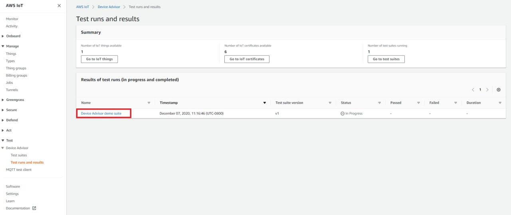

The run summary page displays the status of the current test suite run.
This page automatically refreshes every 10 seconds. We recommend that you
have a mechanism built for your device to try connecting to our test
endpoint every five seconds for one to two minutes. Then you can run
multiple test cases in sequence in an automated manner.

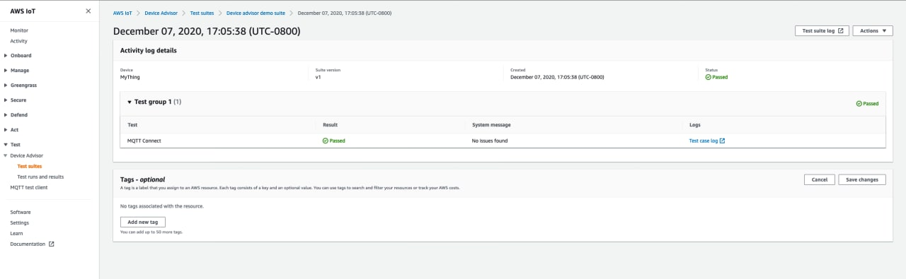 3. To access the CloudWatch logs for the test suite run, choose **Test
suite log**.

To access CloudWatch logs for any test case, choose **Test case
log**. 4. Based on your test results, [troubleshoot](iot_troubleshooting.md#device-advisor-troubleshooting "iot_troubleshooting.md#device-advisor-troubleshooting") your device until all tests pass.

## Download an AWS IoT

qualification report

If you chose the **Use the AWS IoT Qualification test suite** option while creating a test suite and were able to run a
qualification test suite, you can download a qualification report by choosing **Download qualification report** in the test run summary page.

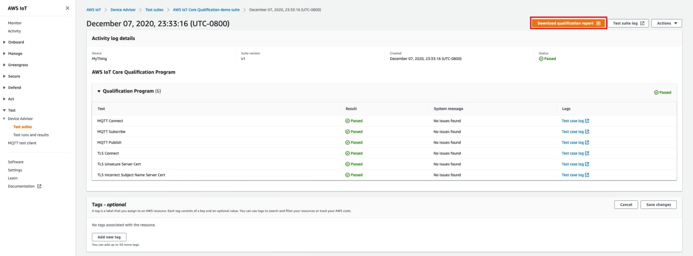
