# Long duration tests console workflow

This tutorial helps you get started with the Long duration tests on Device Advisor using the console.
To complete the tutorial, follow the steps at [Setting up](device-advisor-setting-up.md "device-advisor-setting-up.md").

1. In the [AWS IoT console](https://console.aws.amazon.com/iot "https://console.aws.amazon.com/iot") navigation pane, expand
   **Test**, then **Device Advisor**, then
   **Test suites**. On the page, select **Create long duration test suite**.

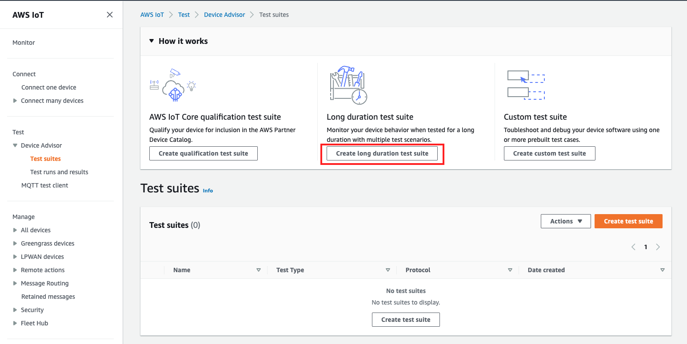 2. On the **Create test suite** page, select **Long duration test suite**
and choose **Next**.

For protocol, choose either **MQTT 3.1.1** or **MQTT 5**.

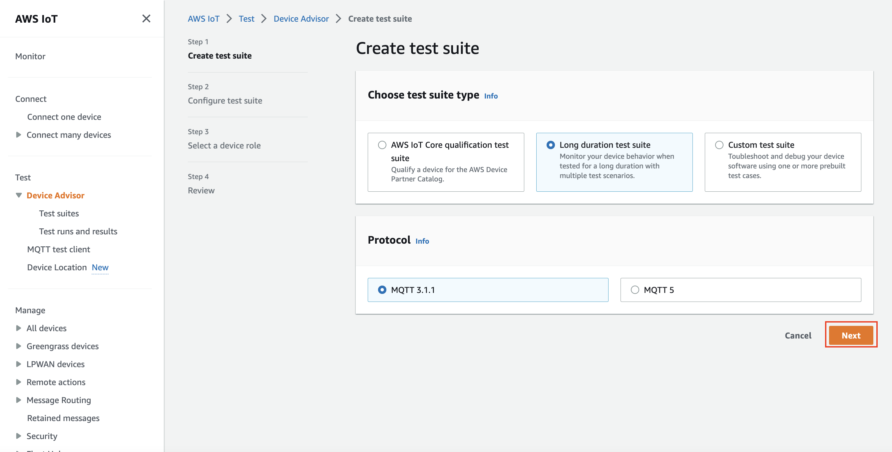 3. Do the following on the **Configure test suite** page:

    1. Update the **Test suite name** field.
    2. Update the **Test group name** field.
    3. Choose the **Device operations** the device can perform.
     This will select the tests to run.
    4. Select the **Settings** option.

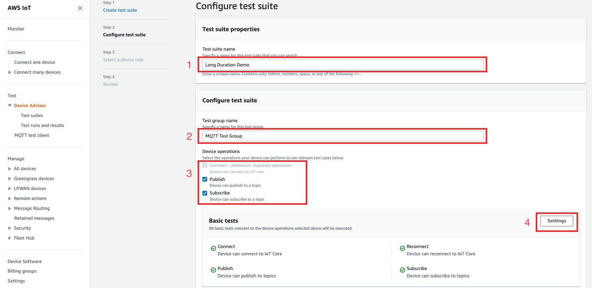 4. (Optional) Input the maximum amount of time Device Advisor must wait for the basic tests to complete.
Select **Save**.

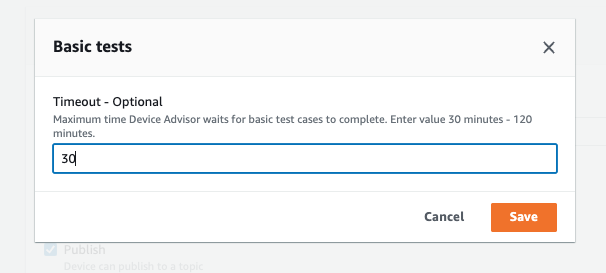 5. Do the following in the **Advanced tests** and **Additional settings** sections.

    1. Select or deselect the **Advanced tests** you want to run as part of this test.
    2. **Edit** the configurations for the tests when applicable.
    3. Configure the **Additional execution time** under the
     **Additional settings** section.
    4. Choose **Next** to do the next step.

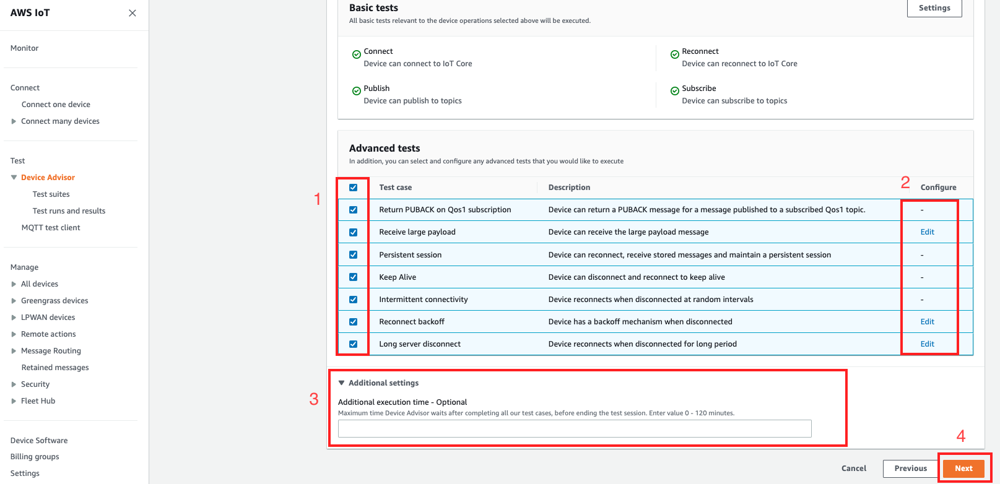 6. In this step, **Create a new role** or **Select an existing role**.
See [Create an IAM role to use as your device
role](device-advisor-setting-up.md#da-iam-role "device-advisor-setting-up.md#da-iam-role") for details.

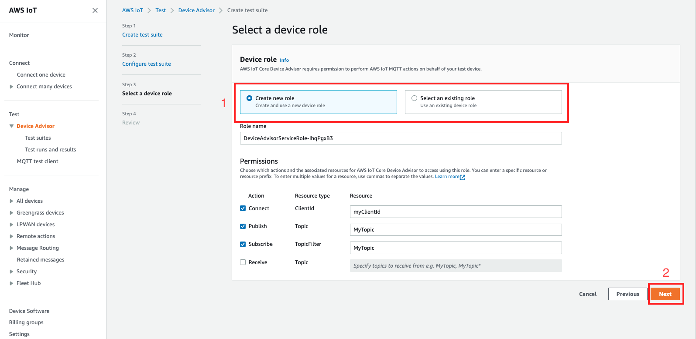 7. Review all the configurations created until this step and select **Create test suite**.

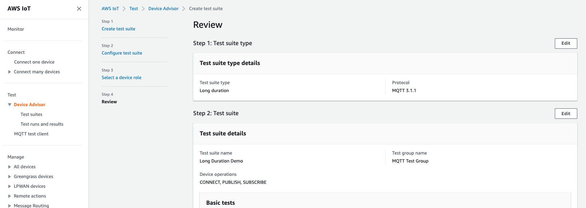

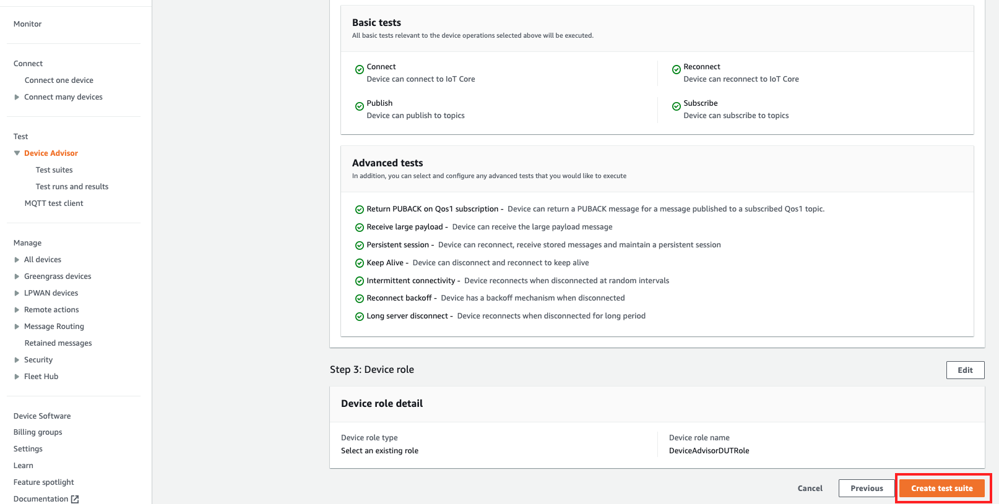 8. The created test suite is under the **Test suites** section. Select
the suite to view details.

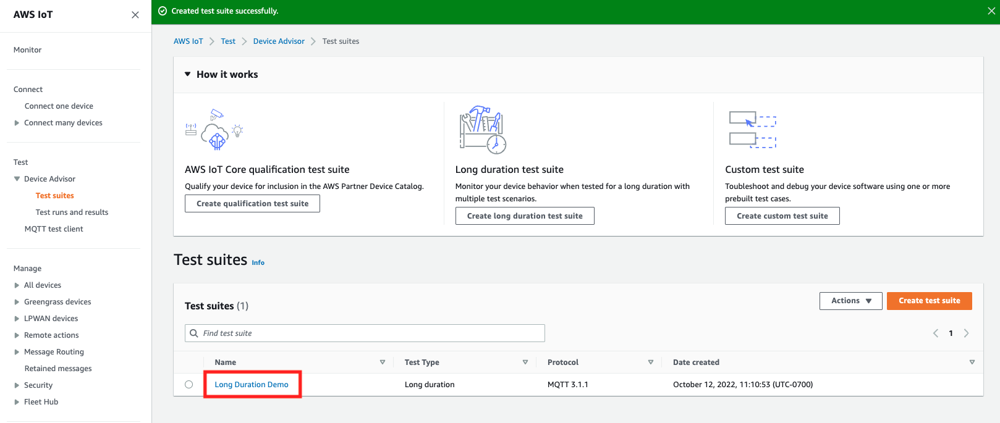 9. To run the created test suite, select **Actions** then
**Run test suite**.

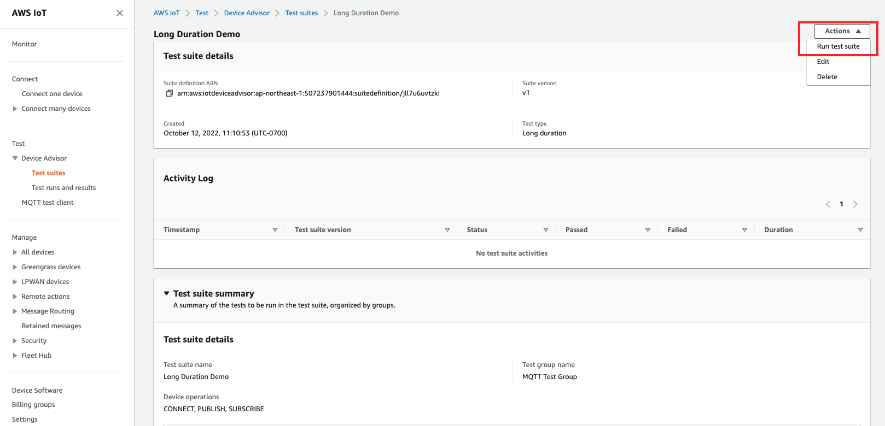 10. Choose the configuration options in the **Run configuration** page.

    1. Select the **Things** or **Certificate**
     to run the test on.
    2. Select either the **Account-level endpoint** or
     **Device-level endpoint**.
    3. Choose **Run test** to run the test.

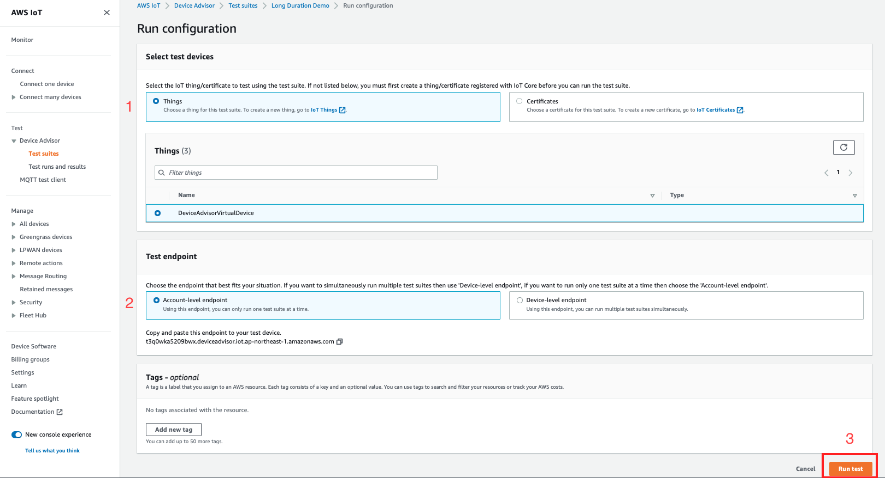 11. To view the results of the test suite run, select **Test runs and results**
in the left navigation pane. Choose the test suite that ran to view the details of the results.

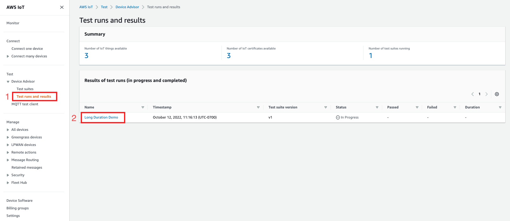 12. The previous step brings up the test summary page. All the details of the test run are displayed in this page.
When the console prompts to start the device connection, connect your device to the provided endpoint. The progress
of the tests is seen on this page.

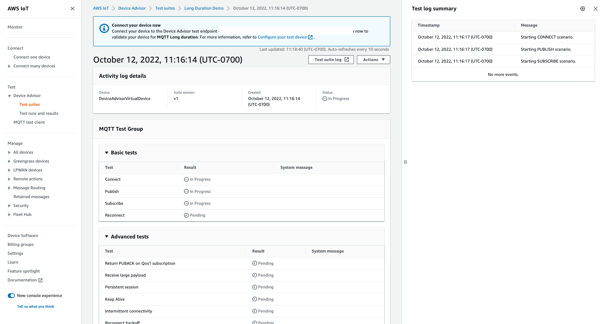 13. The Long duration test provides an additional **Test log summary** on the side panel
which displays all the important events occurring between the device and the broker in near real time.
To view more in-depth detailed logs, click on **Test case log**.

