# Long duration tests

Long duration tests is a new test suite that monitors a device's behavior when it
operates over longer periods of time. Compared to running individual tests that
focus on specific behaviors of a device, the long duration test examines the
device's behavior in a variety of real-world scenarios over the device's lifespan.
Device Advisor orchestrates the tests in the most efficient possible order. The test
generates results and logs, including a summary log with useful metrics about the
device's performance while under test.

## MQTT long duration test case

In the MQTT long duration test case, the device's behavior is initially
observed in happy case scenarios such as MQTT Connect, Subscribe, Publish, and
Reconnect. Then, the device is observed in multiple, complex failure scenarios
such as MQTT Reconnect Backoff, Long Server Disconnect, and Intermittent
Connectivity.

## MQTT long duration test case execution flow

There are three phases in the execution of a MQTT long duration test
case:

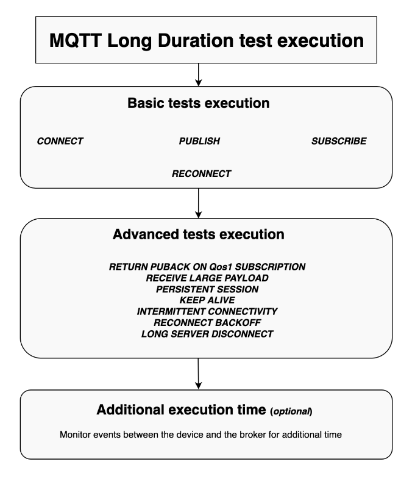

### Basic tests execution

In this phase, the test case runs simple tests in parallel.
The test validates if the device has the operations selected in the configuration.

The set of basic tests can include the following, based on the operations
selected:

#### CONNECT

This scenario validates if the device is able to make a successful connection with the broker.

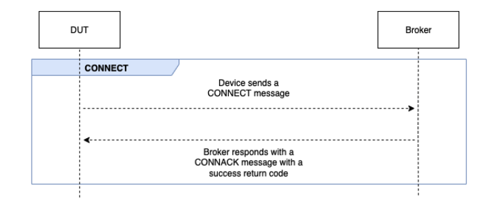

#### PUBLISH

This scenario validates if the device successfully publishes against the broker.

##### QoS 0

This test case validates if the device successfully sends a
`PUBLISH` message to the broker during a publish with
QoS 0. The test does not wait on the `PUBACK` message to
be received by the device.

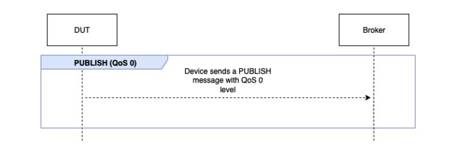

##### QoS 1

In this test case, the device is expected to send
two `PUBLISH` messages to the broker with QoS 1. After
the first `PUBLISH` message, the broker waits for up to
15 seconds before it responds. The device must retry the original
`PUBLISH` message with the same packet identifier
within the 15 second window. If it does, the broker responds with a
`PUBACK` message and the test validates. If the
device doesn't retry the `PUBLISH`, the original
`PUBACK` is sent to the device and the test is marked
as **Pass with warnings**, along with a
system message. During the test execution, if the device loses
connection and reconnects, the test scenario will reset without
failing and the device has to perform the test scenario steps again.

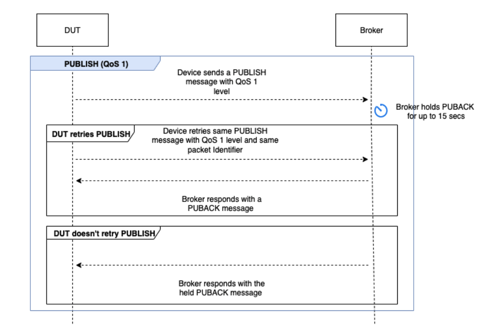

#### SUBSCRIBE

This scenario validates if the device successfully subscribes against
the broker.

##### QoS 0

This test case validates if the device successfully sends a
`SUBSCRIBE` message to the broker during a subscribe
with QoS 0. The test doesn't wait for the device to receive a SUBACK
message.

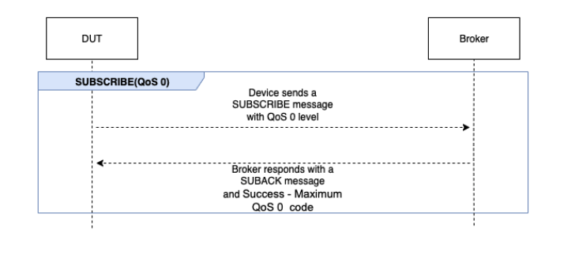

##### QoS 1

In this test case, the device is expected to send two
`SUBSCRIBE` messages to the broker with QoS 1. After
the first `SUBSCRIBE` message, the broker waits for up to
15 seconds before it responds. The device must retry the original
`SUBSCRIBE` message with the same packet identifier
within the 15 second window. If it does, the broker responds with a
`SUBACK` message and the test validates. If the
device doesn't retry the `SUBSCRIBE`, the original
`SUBACK` is sent to the device and the test is marked
as **Pass with warnings**, along with a system
message. During the test execution, if the device loses
connection and reconnects, the test scenario will reset without
failing and the device has to perform the test scenario steps again.

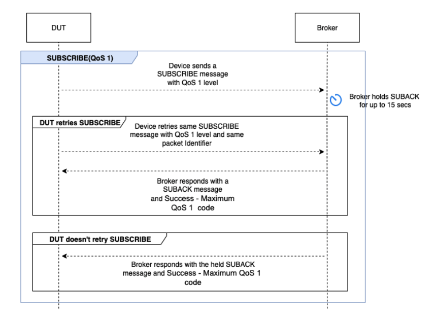

#### RECONNECT

This scenario validates if the device successfully reconnects with the
broker after the device is disconnected from a successful connection.
Device Advisor won't disconnect the device if it connected more than once
previously during the test suite. Instead, it will mark the test as
**Pass**.

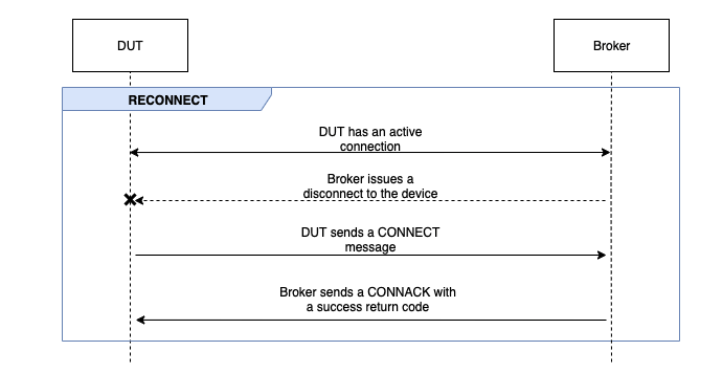

### Advanced tests execution

In this phase, the test case runs more complex tests in serial to validate
if the device follows best practices. These advanced tests are available for
selection and can be opted out if not required. Each advanced test has its
own timeout value based on what the scenario demands.

#### RETURN PUBACK ON QoS 1 SUBSCRIPTION

###### Note

Only select this scenario if your device is capable of performing QoS 1 subscriptions.

This scenario validates if, after the device subscribes
to a topic and receives a `PUBLISH` message from the broker,
it returns a `PUBACK` message.

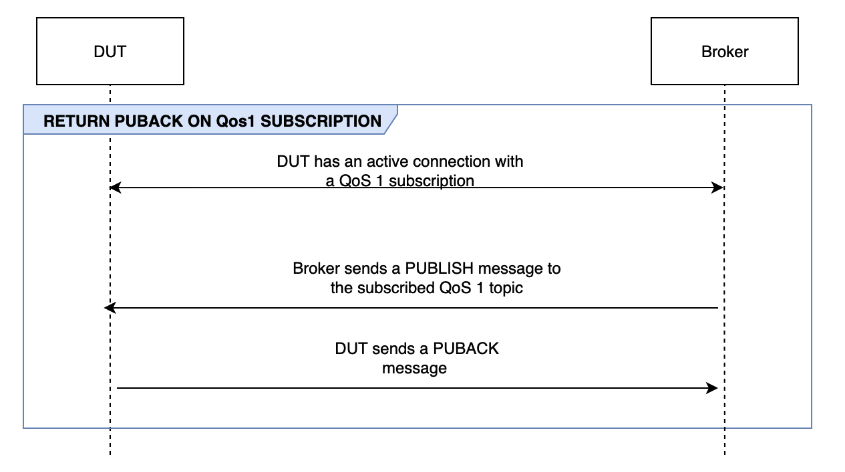

#### RECEIVE LARGE PAYLOAD

###### Note

Select this scenario only if your device is capable of performing QoS 1 subscriptions.

This scenario validates if the device responds with a
`PUBACK` message after receiving a `PUBLISH`
message from the broker for a QoS 1 topic with a large payload. The
format of the expected payload can be configured using the
`LONG_PAYLOAD_FORMAT` option.

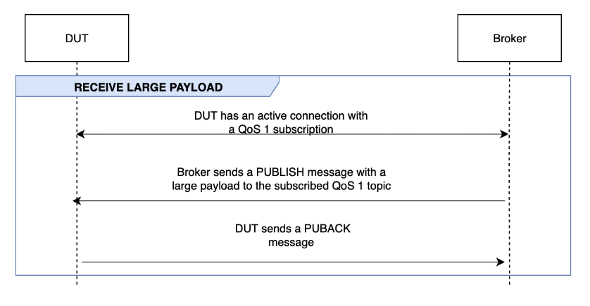

#### PERSISTENT

SESSION

###### Note

Select this scenario only if your device is capable of performing
QoS 1 subscriptions and can maintain a persistent session.

This scenario validates the device behavior in maintaining persistent
sessions. The test validates when the following conditions are
met:

- The device connects to the broker with an active QoS 1
  subscription and persistent sessions enabled.
- The device successfully disconnects from the broker during the
  session.
- The device reconnects to the broker and resumes subscriptions
  to its trigger topics without explicitly resubscribing to those
  topics.
- The device successfully receives messages stored by the broker
  for its subscribed topics and runs as expected.

For more information on AWS IoT Persistent Sessions, see [Using MQTT persistent sessions](mqtt.md#mqtt-persistent-sessions "mqtt.md#mqtt-persistent-sessions").

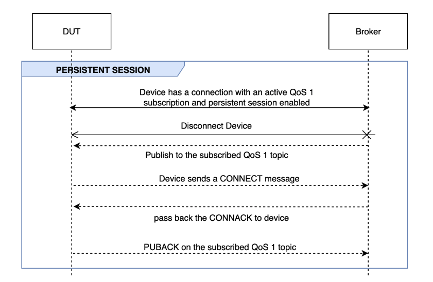

#### KEEP ALIVE

This scenario validates if the device successfully disconnects after
it doesn't receive a ping response from the broker. The connection must
have a valid keep-alive timer configured. As part of this test, the
broker blocks all responses sent for `PUBLISH`,
`SUBSCRIBE`, and `PINGREQ` messages. It also
validates if the device under test disconnects the MQTT
connection.

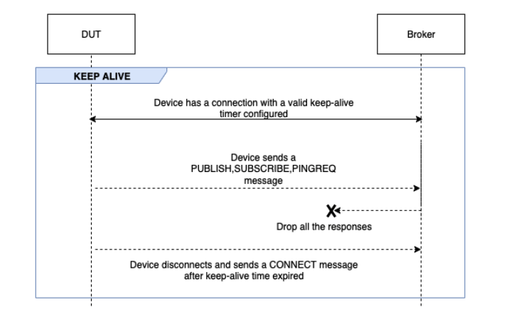

#### INTERMITTENT CONNECTIVITY

This scenario validates if the device can connect back to the broker after the broker disconnects the device at
random intervals for a random period of time.

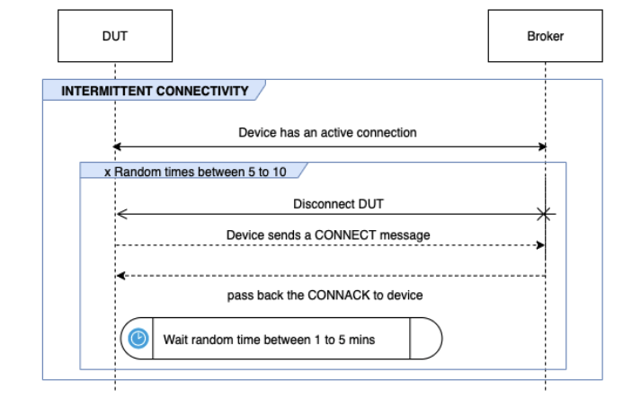

#### RECONNECT

BACKOFF

This scenario validates if the device has a backoff mechanism
implemented when the broker disconnects from it multiple times. Device Advisor
reports the backoff type as exponential, jitter, linear or constant. The
number of backoff attempts is configurable using the
`BACKOFF_CONNECTION_ATTEMPTS` option. The default value
is 5. The value is configurable between 5 and 10.

To pass this test, we recommend implementing the [Exponential Backoff And Jitter](http://aws.amazon.com/blogs/architecture/exponential-backoff-and-jitter/ "http://aws.amazon.com/blogs/architecture/exponential-backoff-and-jitter/") mechanism on the device
under test.

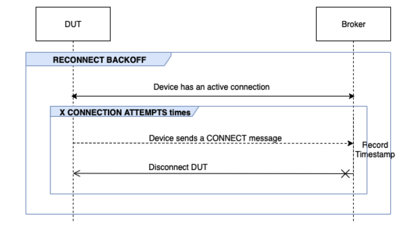

#### LONG SERVER DISCONNECT

This scenario validates if the device can successfully reconnect after
the broker disconnects the device for a long period of time (up to 120
minutes). The time for server disconnection can be configured using the
`LONG_SERVER_DISCONNECT_TIME` option. The default value
is 120 minutes. This value is configurable from 30 to 120
minutes.

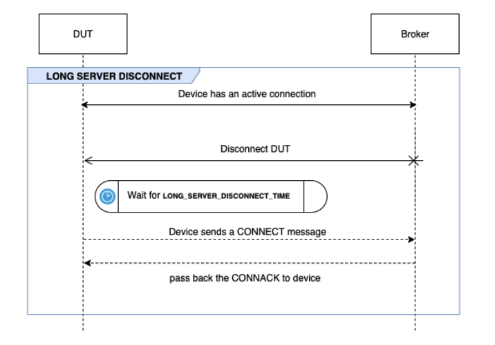

### Additional execution time

The additional execution time is the time the test waits after completing
all the above tests and before ending the test case. Customers use this
additional time period to monitor and log all communications between the
device and the broker. The additional execution time can be configured using
the `ADDITIONAL_EXECUTION_TIME` option. By default, this option
is set to 0 minutes and can be 0 to 120 minutes.

## MQTT long duration test configuration options

All configuration options provided for the MQTT long duration test are
optional. The following options are available:

**OPERATIONS**
The list of operations that the device performs, such as `CONNECT`,
`PUBLISH` and `SUBSCRIBE`. The test case
runs scenarios based on the specified operations. Operations that
aren't specified are assumed valid.

```
{
"OPERATIONS": ["PUBLISH", "SUBSCRIBE"]
//by default the test assumes device can CONNECT
}

```

**SCENARIOS**
Based on the operations selected, the test case runs scenarios to validate the device's
behavior. There are two types of scenarios:

- **Basic Scenarios** are simple tests that validate if the device
  can perform the operations selected above as part of the
  configuration. These are pre-selected based on the
  operations specified in the configuration. No more input is
  required in the configuration.
- **Advanced Scenarios** are more complex scenarios that are
  performed against the device to validate if the device
  follows best practices when met with real world conditions.
  These are optional and can be passed as an array of
  scenarios to the configuration input of the test
  suite.

```

{
    "SCENARIOS": [      // list of advanced scenarios
                "PUBACK_QOS_1",
                "RECEIVE_LARGE_PAYLOAD",
                "PERSISTENT_SESSION",
                "KEEP_ALIVE",
                "INTERMITTENT_CONNECTIVITY",
                "RECONNECT_BACK_OFF",
                "LONG_SERVER_DISCONNECT"
    ]
}

```

**BASIC_TESTS_EXECUTION_TIME_OUT:**
The maximum time the test case will wait for all the basic tests to complete.
The default value is 60 minutes. This value is configurable from 30 to 120 minutes.

**LONG_SERVER_DISCONNECT_TIME:**
The time taken for the test case to disconnect and reconnect the device
during the Long Server Disconnect test. The default value is 60 minutes.
This value is configurable from 30 to 120 minutes.

**ADDITIONAL_EXECUTION_TIME:**
Configuring this option provides a time window after
all the tests are completed, to monitor events between the device and broker.
The default value is 0 minutes. This value is configurable from 0 to 120 minutes.

**BACKOFF_CONNECTION_ATTEMPTS:**
This option configures the number of times the device is disconnected by the test case.
This is used by the Reconnect Backoff test. The default value is 5 attempts.
This value is configurable from 5 to 10.

**LONG_PAYLOAD_FORMAT:**
The format of the message payload that the device expects
when the test case publishes to a QoS 1 topic subscribed by the device.

**API test case definition:**

```
{
"tests":[
   {
      "name":"my_mqtt_long_duration_test",
      "configuration": {
         // optional
         "OPERATIONS": ["PUBLISH", "SUBSCRIBE"],
         "SCENARIOS": [
            "LONG_SERVER_DISCONNECT",
            "RECONNECT_BACK_OFF",
            "KEEP_ALIVE",
            "RECEIVE_LARGE_PAYLOAD",
            "INTERMITTENT_CONNECTIVITY",
            "PERSISTENT_SESSION",
         ],
         "BASIC_TESTS_EXECUTION_TIMEOUT": 60, // in minutes (60 minutes by default)
         "LONG_SERVER_DISCONNECT_TIME": 60,   // in minutes (120 minutes by default)
         "ADDITIONAL_EXECUTION_TIME": 60,     // in minutes (0 minutes by default)
         "BACKOFF_CONNECTION_ATTEMPTS": "5",
         "LONG_PAYLOAD_FORMAT":"{"message":"${payload}"}"
      },
      "test":{
         "id":"MQTT_Long_Duration",
         "version":"0.0.0"
      }
   }
 ]
}

```

## MQTT long duration test case summary log

The MQTT long duration test case runs for longer duration than regular test
cases. A separate summary log is provided, which lists important events such as
device connections, publish, and subscribe during the run. Details include what
was tested, what was not tested and what failed. At the end of the log, the test
includes a summary of all the events that happened during the test case run.
This includes:

- _Keep Alive timer configured on the device._
- _Persistent session flag configured on the
  device._
- _The number of device connections during the test
  run._
- _The device reconnection backoff type, if validated for the
  reconnect backoff test._
- _The topics the device published to, during the test case
  run._
- _The topics the device subscribed to, during the test case
  run._
