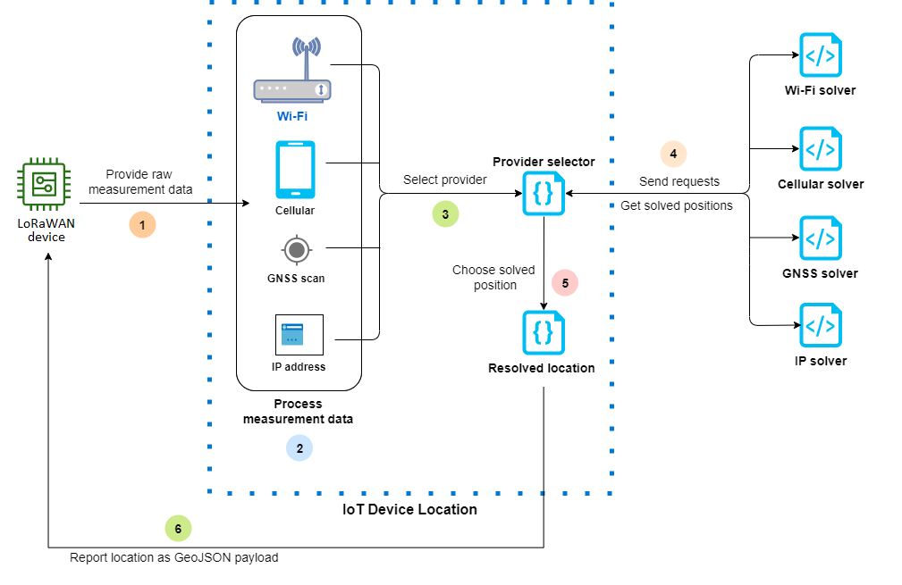

# AWS IoT Core Device Location

|                                                                                                                                                                                                                                                                                                                                                                                                                                                                                                                                                                                                                         |
| ----------------------------------------------------------------------------------------------------------------------------------------------------------------------------------------------------------------------------------------------------------------------------------------------------------------------------------------------------------------------------------------------------------------------------------------------------------------------------------------------------------------------------------------------------------------------------------------------------------------------- |
| Before using the AWS IoT Core Device Location feature, review the Terms and Conditions for this feature. Note that AWS may transmit your geolocation search request parameters, such as the location data used to run searches, and other information to your chosen third party data provider, which may be outside of the AWS Region that you are currently using. The third party provider and the solver to be used is chosen based on the input payload received. For more information, see [AWS Service Terms](https://aws.amazon.com/service-terms "https://aws.amazon.com/service-terms"). |

Use AWS IoT Core Device Location to test the location of your IoT devices using third-party solvers.
_Solvers_ are algorithms provided by third-party vendors that resolve
measurement data and estimate the location of your device. By identifying the location of
your devices, you can track and debug them in the field to troubleshoot any issues.

The measurement data collected from various sources is resolved, and the geolocation
information is reported as a [GeoJSON](https://geojson.org/ "https://geojson.org/") payload. The
GeoJSON format is a format that's used to encode geographic data structures. The payload
contains the latitude and longitude coordinates of your device location, which are based on
the [World Geodetic
System coordinate system (WGS84)](https://gisgeography.com/wgs84-world-geodetic-system/ "https://gisgeography.com/wgs84-world-geodetic-system/").

###### Topics

- [Measurement types and solvers](#location-measurement-types "#location-measurement-types")
- [How AWS IoT Core Device Location works](#location-how-works "#location-how-works")
- [How to use AWS IoT Core Device Location](#location-how-use "#location-how-use")
- [Resolving location of IoT
  devices](device-location-resolve-solvers.md "device-location-resolve-solvers.md")
- [Resolving device location using
  AWS IoT Core Device Location MQTT topics](device-location-reserved-topics.md "device-location-reserved-topics.md")
- [Location solvers and device
  payload](device-location-solvers-payload.md "device-location-solvers-payload.md")

## Measurement types and solvers

AWS IoT Core Device Location partners with third-party vendors to resolve the measurement data and to
provide an estimated device location. The following table shows the measurement types
and the third-party location solvers, and information about supported devices. For
information about LoRaWAN devices and configuring device location for them, see [Configuring
position of LoRaWAN resources](../../../iot-wireless/latest/developerguide/lorawan-configure-location.md "../../../iot-wireless/latest/developerguide/lorawan-configure-location.md").

###### Note

General IoT devices and Sidewalk devices can use the device location MQTT topics
to obtain the location information. For Wi-Fi, Cellular, and IP address measurement
types, if the devices publish the measurement data to the [reserved topics](device-location-reserved-topics.md "device-location-reserved-topics.md") in the defined
GeoJSON format, AWS IoT Core Device Location can resolve the location of the device. For GNSS measurement
type, the device must have the LR11xx chip to scan the measurement data for
obtaining the resolved location information using the GNSS solver. For information
about obtaining location information for LoRaWAN devices, see [Configuring position for LoRaWAN resources](../../../iot-wireless/latest/developerguide/lorawan-configure-location.md "../../../iot-wireless/latest/developerguide/lorawan-configure-location.md") in the
_AWS IoT Wireless documentation_.

| Measurement types and solvers                                             | Measurement type         | Third-party solvers                                       | Supported devices |
| ------------------------------------------------------------------------- | ------------------------ | --------------------------------------------------------- | ----------------- |
| Wi-Fi access points                                                       | Wi-Fi based solver       | General IoT devices, LoRaWAN, and Amazon Sidewalk devices |
| Cellular radio towers: GSM, LTE, CDMA, SCDMA, WCMDA, and TD-SCDMA data | Cellular based solver    | General IoT devices, LoRaWAN, and Amazon Sidewalk devices |
| IP address                                                                | IP reverse lookup solver | Any IoT device that connects over TCP/IP                  |
| GNSS scan data (NAV messages)                                             | GNSS solver              | General IoT devices, LoRaWAN, and Amazon Sidewalk devices |
| Bluetooth Low Energy (BLE)                                                | BLE based solver         | Amazon Sidewalk devices                                   |

For more information about the location solvers and examples that show the device
payload for the various measurement types, see [Location solvers and device
payload](device-location-solvers-payload.md "device-location-solvers-payload.md").

## How AWS IoT Core Device Location works

The following diagram shows how AWS IoT Core Device Location collects measurement data and resolves the
location information of your devices.

The following steps show how AWS IoT Core Device Location works.

1. ###### Receive measurement data

The raw measurement data related to your device location is first sent from
the device. The measurement data is specified as a JSON payload. 2. ###### Process measurement data

The measurement data is processed, and AWS IoT Core Device Location chooses the measurement data to
be used, which can be Wi-Fi, cellular, GNSS scan, or IP address
information. 3. ###### Choose solver

The third-party solver is chosen based on the measurement data. For example,
if the measurement data contains Wi-Fi and IP address information, it chooses
the Wi-Fi solver and the IP reverse lookup solver. 4. ###### Obtain resolved location

An API request is sent to the solver providers requesting to resolve the
location. AWS IoT Core Device Location then gets the estimated geolocation information from the
solvers. 5. ###### Choose resolved location

The resolved location information and its accuracy is compared, and AWS IoT Core Device Location
chooses the geolocation results with the highest accuracy. 6. ###### Output location information

The geolocation information is sent to you as a GeoJSON payload. The payload
contains the WGS84 geo coordinates, the accuracy information, confidence levels,
and the timestamp at which the resolved location was obtained.

## How to use AWS IoT Core Device Location

The following steps show how to use AWS IoT Core Device Location.

1. ###### Provide measurement data

Specify the raw measurement data related to the location of your device as a
JSON payload. To retrieve the payload measurement data, go to your device logs,
or use CloudWatch Logs, and copy the payload data information. The JSON payload must
contain one or more types of data measurement. For examples that show the
payload format for various solvers, see [Location solvers and device
payload](device-location-solvers-payload.md "device-location-solvers-payload.md"). 2. ###### Resolve location information

Using the [Device
Location](https://console.aws.amazon.com/iot/home#/device-location-test "https://console.aws.amazon.com/iot/home#/device-location-test") page in the AWS IoT console or the [GetPositionEstimate](../../../iot-wireless/latest/apireference/API_GetPositionEstimate.md "../../../iot-wireless/latest/apireference/API_GetPositionEstimate.md") API operation, pass the payload measurement
data and resolve the device location. AWS IoT Core Device Location then chooses the solver with the
highest accuracy and reports the device location. For more information, see
[Resolving location of IoT
devices](device-location-resolve-solvers.md "device-location-resolve-solvers.md"). 3. ###### Copy location information

Verify the geolocation information that was resolved by AWS IoT Core Device Location and reported
as a GeoJSON payload. You can copy the payload for use with your applications
and other AWS services. For example, you can send your geographical location
data to Amazon Location Service using the [Location](location-rule-action.md "location-rule-action.md") AWS IoT rule action.

The following topics show how to use AWS IoT Core Device Location and examples of device location
payload.

- [Resolving location of IoT
  devices](device-location-resolve-solvers.md "device-location-resolve-solvers.md")
- [Location solvers and device
  payload](device-location-solvers-payload.md "device-location-solvers-payload.md")
