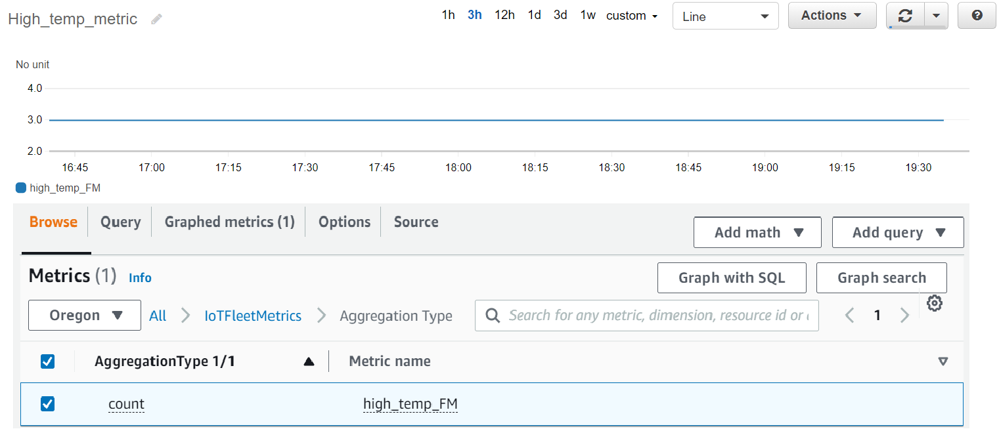

# Getting started tutorial

In this tutorial, you create a [fleet metric](iot-fleet-metrics.md "iot-fleet-metrics.md") to
monitor your sensors' temperatures to detect potential anomalies. When creating the fleet
metric, you define an [aggregation query](index-aggregate.md "index-aggregate.md") that detects
the number of sensors with temperatures exceeding 80 degrees Fahrenheit. You specify the query
to run every 60 seconds and the query results are emitted to CloudWatch, where you can view the
number of sensors that have potential high-temperature risks, and set alarms. To complete this
tutorial, you'll use [AWS CLI](../../../cli/latest/userguide/cli-chap-install.md "../../../cli/latest/userguide/cli-chap-install.md").

In this tutorial, you'll learn how to:

- [Set up](#fleet-metrics-tutorial-setup "#fleet-metrics-tutorial-setup")
- [Create fleet metrics](#fleet-metrics-tutorial-create "#fleet-metrics-tutorial-create")
- [View metrics in CloudWatch](#fleet-metrics-tutorial-view-data "#fleet-metrics-tutorial-view-data")
- [Clean up resources](#fleet-metrics-tutorial-delete-fleet-metrics "#fleet-metrics-tutorial-delete-fleet-metrics")
  This tutorial takes about 15 minutes to complete.

## Prerequisites

- Install the latest version of [AWS CLI](../../../cli/latest/userguide/cli-chap-install.md "../../../cli/latest/userguide/cli-chap-install.md")
- Familiarize yourself with [Querying for aggregate
  data](index-aggregate.md "index-aggregate.md")
- Familiarize yourself with [Using Amazon CloudWatch
  metrics](../../../AmazonCloudWatch/latest/monitoring/working_with_metrics.md "../../../AmazonCloudWatch/latest/monitoring/working_with_metrics.md")

## Set up

To use fleet metrics, enable fleet indexing. To enable fleet indexing for your things or
thing groups with specified data sources and associated configurations, follow the
instructions in [Managing thing indexing](managing-index.md#enable-index "managing-index.md#enable-index") and [Managing thing group indexing](thinggroup-index.md#enable-group-index "thinggroup-index.md#enable-group-index").

###### To set up

1. Run the following command to enable fleet indexing and specify the data sources to
   search from.

```
`aws iot update-indexing-configuration \
--thing-indexing-configuration "thingIndexingMode=REGISTRY_AND_SHADOW,customFields=[{name=attributes.temperature,type=Number},{name=attributes.rackId,type=String},{name=attributes.stateNormal,type=Boolean}],thingConnectivityIndexingMode=STATUS" \`
```

The preceding example CLI command enables fleet indexing to support searching
registry data, shadow data, and thing connectivity status using the
`AWS_Things` index.

The configuration change can take a few minutes to complete. Verify that your fleet
indexing is enabled before you create fleet metrics.

To check if your fleet indexing has been enabled, run the following CLI command:

```
`aws --region `us-east-1` iot describe-index --index-name "AWS_Things"`
```

For more information, see [Enable thing
indexing](managing-index.md#enable-index "managing-index.md#enable-index"). 2. Run the following bash script to create ten things and describe them.

```
# Bash script. Type `bash` before running in other shells.

Temperatures=(70 71 72 73 74 75 47 97 98 99)
Racks=(Rack1 Rack1 Rack2 Rack2 Rack3 Rack4 Rack5 Rack6 Rack6 Rack6)
IsNormal=(true true true true true true false false false false)

for ((i=0; i < 10; i++))
do
  thing=$(aws iot create-thing --thing-name "TempSensor$i" --attribute-payload attributes="{temperature=${Temperatures[@]:$i:1},rackId=${Racks[@]:$i:1},stateNormal=${IsNormal[@]:$i:1}}")
  aws iot describe-thing --thing-name "TempSensor$i"
done
```

This script creates ten things to represent ten sensors. Each thing has attributes
of `temperature`, `rackId`, and `stateNormal` as
described in the following table:

| Attribute     | Data type | Description                                             |
| ------------- | --------- | ------------------------------------------------------- | --------------------------------------------------------------------------------------------------------------------------------------------------------------------------------------------------------------------------------------------------------------------------------------------------------------------------------------------------------------------------------------------------------------------------------------------------------------------------------------------------------------------------------------------------------------------------------------------------------------------------------------------------------------------------------------------------------------------------------------------------------------------------------------------------------------------------------------------------------------------------------------------------------------------------------------------------------------------------------------------------------------------------------------------------------------------------------------------------------------------------------------------------------------------------------------------------------------------------------------------------------------------------------------------------------------------------------------------------------------------------------------------------------------------------------------------------------------------------------------------------------------------------------------------------------------------------------------------------------------------------------------------------------------------------------------------------------------------------------------------------------------------------------------------------------------------------------------------------------------------------------------------------------------------------------------------------------------------------------------------------------------------------------------------------------------------------------------------------------------------------------------------------------------------------------------------------------------------------------------------------------------------------------------------------------------------------------------------------------------------------------------------------------------------------------------------------------------------------------------------------------------------------------------------------------------------------------------------------------------------------------------------------------------------------------------------------------------------------------------------------------------------------------------------------------------------------------------------------------------------------------------------------------------------------------------------------------------------------------------------------------------------------------------------------------------------------------------------------------------------------------------------------------------------------------------------------------------------------------------------------------------------------------------------------------------------------------------------------------------------------------------------------------------------------------------------------------------------------------------------------------------------------------------------------------------------------------------------------------------------------------------------------------------------------------------------------------------------------------------------------------------------------------------------------------------------------------------------------------------------------------------------------------------------------------------------------------------------------------------------------------------------------------------------------------------------------------------------------------------------------------------------------------------------------------------------------------------------------------------------------------------------------------------------------------------------------------------------------------------------------------------------------------------------------------------------------------------------------------------------------------------------------------------------------------------------------------------------------------------------------------------------------------------------------------------------------------------------------------------------------------------------------------------------------------------------------------------------------------------------------------------------------------------------------------------------------------------------------------------------------------------------------------------------------------------------------------------------------------------------------------------------------------------------------------------------------------------------------------------------------------------------------------------------------------------------------------------------------------------------------------------------------------------------------------------------------------------------------------------------------------------------------------------------------------------------------------------------------------------------------------------------------------------------------------------------------------------------------------------------------------------------------------------------------------------------------------------------------------------------------------------------------------------------------------------------------------------------------------------------------------------------------------------------------------------------------------------------------------------------------------------------------------------------------------------------------------------------------------------------------------------------------------------------------------------------------------------------------------------------------------------------------------------------------------------------------------------------------------------------------------------------------------------------------------------------------------------------------------------------------------------------------------------------------------------------------------------------------------------------------------------------------------------------------------------------------------------------------------------------------------------------------------------------------------------------------------------------------------------------------------------------------------------------------------------------------------------------------------------------------------------------------------------------------------------------------------------------------------------------------------------------------------------------------------------------------------------------------------------------------------------------------------------------------------------------------------------------------------------------------------------------------------------------------------------------------------------------------------------------------------------------------------------------------------------------------------------------------------------------------------------------------------------------- |
| `temperature` | Number    | Temperature value in Fahrenheit                         |
| `rackId`      | String    | ID of the server rack that contains sensors             |
| `stateNormal` | Boolean   | Whether the sensor's temperature value is normal or not | The output of this script contains ten JSON files. One of the JSON file looks like the following: ``{ "version": 1, "thingName": "TempSensor0", "defaultClientId": "TempSensor0", "attributes": { "rackId": "Rack1", "stateNormal": "true", "temperature": "70" }, "thingArn": "arn:aws:iot:`region`:`account`:thing/TempSensor0", "thingId": "`example-thing-id`" }`` For more information, see [Create a thing](thing-registry.md#create-thing "thing-registry.md#create-thing"). ## Create fleet metrics ###### To create a fleet metric 1. Run the following command to create a fleet metric named `high_temp_FM`. You create the fleet metric to monitor the number of sensors with temperatures exceeding 80 degrees Fahrenheit in CloudWatch. `` `aws iot create-fleet-metric --metric-name "high_temp_FM" --query-string "thingName:TempSensor* AND attributes.temperature >80" --period 60 --aggregation-field "attributes.temperature" --aggregation-type name=Statistics,values=count` `` --metric-name Data type: string. The `--metric-name` parameter specifies a fleet metric name. In this example, you're creating a fleet metric named _high_temp_FM_. --query-string Data type: string. The `--query-string` parameter specifies the query string. In this example, the query string means to query all the things with names starting with _TempSensor_ and with temperatures higher than 80 degrees Fahrenheit. For more information, see [Query syntax](query-syntax.md "query-syntax.md"). --period Data type: integer. The `--period` parameter specifies the time to retrieve the aggregated data in seconds. In this example, you specify that the fleet metric you're creating retrieves the aggregated data every 60 seconds. --aggregation-field Data type: string. The `--aggregation-field` parameter specifies the attribute to evaluate. In this example, the temperature attribute is to be evaluated. --aggregation-type The `--aggregation-type` parameter specifies the statistical summary to display in the fleet metric. For your monitoring tasks, you can customize the aggregation query properties for the different aggregation types (**Statistics**, **Cardinality**, and **Percentile**). In this example, you specify **count** for the aggregation type and **Statistics** to return the count of devices that have attributes that match the query, in other words, to return the count of the devices with names starting with _TempSensor_ and with temperatures higher than 80 degrees Fahrenheit. For more information, see [Querying for aggregate data](index-aggregate.md "index-aggregate.md"). The output of this command looks like the following: ``{ "metricArn": "arn:aws:iot:`region`:`111122223333`:fleetmetric/high_temp_FM", "metricName": "`high_temp_FM`" }`` ###### Note It can take a moment for the data points to display in CloudWatch. To learn more about how to create a fleet metric, read [Managing fleet metrics](managing-fleet-metrics.md "managing-fleet-metrics.md"). If you can't create a fleet metric, read [Troubleshooting fleet metrics](fleet-indexing-troubleshooting.md#fleet-metrics-troubleshooting "fleet-indexing-troubleshooting.md#fleet-metrics-troubleshooting"). 2. (Optional) Run the following command to describe your fleet metric named _high_temp_FM_: `` `aws iot describe-fleet-metric --metric-name "`high_temp_FM`"` `` The output of this command looks like the following: ``{ "queryVersion": "2017-09-30", "lastModifiedDate": 1625249775.834, "queryString": "*", "period": 60, "metricArn": "arn:aws:iot:`region`:`111122223333`:fleetmetric/high_temp_FM", "aggregationField": "registry.version", "version": 1, "aggregationType": { "values": [ "count" ], "name": "Statistics" }, "indexName": "AWS_Things", "creationDate": 1625249775.834, "metricName": "high_temp_FM" }`` ## View fleet metrics in CloudWatch After creating the fleet metric, you can view the metric data in CloudWatch. In this tutorial, you will see the metric that shows the number of sensors with names starting with _TempSensor_ and with temperatures higher than 80 degrees Fahrenheit. ###### To view data points in CloudWatch 1. Open the CloudWatch console at [https://console.aws.amazon.com/cloudwatch/](https://console.aws.amazon.com/cloudwatch/ "https://console.aws.amazon.com/cloudwatch/"). 2. On the CloudWatch menu on the left panel, choose **Metrics** to expand the submenu and then choose **All metrics**. This opens the page with the upper half to display the graph and the lower half containing four tabbed sections. 3. The first tabbed section **All metrics** lists all the metrics that you can view in groups, choose **IoTFleetMetrics**. This contains all of your fleet metrics. 4. On the **Aggregation type** section of the **All metrics** tab, choose **Aggregation type** to view all the fleet metrics you created. 5. Choose the fleet metric to display graph on the left of the **Aggregation type** section. You will see the value `count` to the left of your **Metric name**, and this is the value of the aggregation type that you specified in the [Create fleet metrics](#fleet-metrics-tutorial-create "#fleet-metrics-tutorial-create") section of this tutorial. 6. Choose the second tab named **Graphed metrics** to the right of the **All metrics** tab to view the fleet metric you chose from the previous step. You should be able to see a graph that displays the number of sensors with temperatures higher than 80 degrees Fahrenheit like the following:  ###### Note The **Period** attribute in CloudWatch defaults to 5 minutes. It's the time interval between data points displaying in CloudWatch. You can change the **Period** setting based on your needs. 7. (Optional) You can set a metric alarm. 1. On the CloudWatch menu on the left panel, choose **Alarms** to expand the submenu and then choose **All alarms**. 2. On the **Alarms** page, choose **Create alarm** on the upper right corner. Follow the **Create alarm** instructions in console to create an alarm as needed. For more information, see [Using Amazon CloudWatch alarms](../../../AmazonCloudWatch/latest/monitoring/AlarmThatSendsEmail.md "../../../AmazonCloudWatch/latest/monitoring/AlarmThatSendsEmail.md"). To learn more, read [Using Amazon CloudWatch metrics](../../../AmazonCloudWatch/latest/monitoring/working_with_metrics.md "../../../AmazonCloudWatch/latest/monitoring/working_with_metrics.md"). If you can't see data points in CloudWatch, read [Troubleshooting fleet metrics](fleet-indexing-troubleshooting.md#fleet-metrics-troubleshooting "fleet-indexing-troubleshooting.md#fleet-metrics-troubleshooting"). ## Clean up **To delete fleet metrics** You use the **delete-fleet-metric** CLI command to delete fleet metrics. To delete the fleet metric named _high_temp_FM_, run the following command. ``aws iot delete-fleet-metric --metric-name "`high_temp_FM`"`` **To clean up things** You use the **delete-thing** CLI command to delete things. To delete the ten things that you created, run the following script: ``# Bash script. Type `bash` before running in other shells. for ((i=0; i < 10; i++)) do thing=$(aws iot delete-thing --thing-name "TempSensor$i") done`` **To clean up metrics in CloudWatch** CloudWatch doesn't support metrics deletion. Metrics expire based on their retention schedules. To learn more, [Using Amazon CloudWatch metrics](../../../AmazonCloudWatch/latest/monitoring/working_with_metrics.md "../../../AmazonCloudWatch/latest/monitoring/working_with_metrics.md"). |
