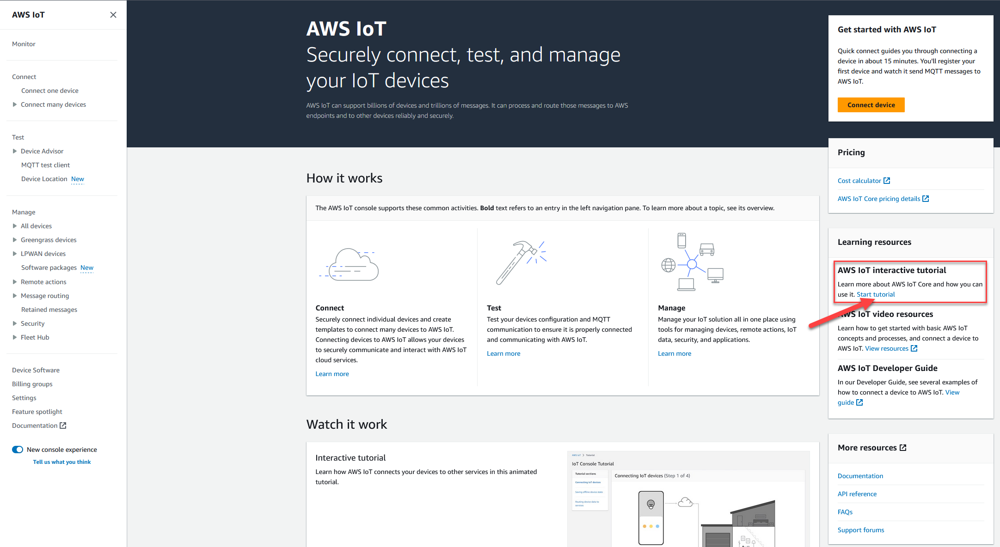
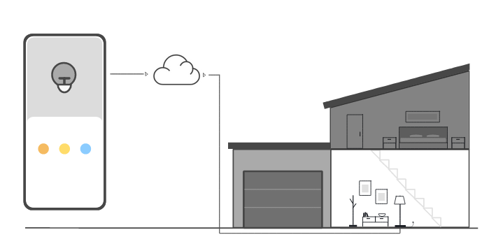
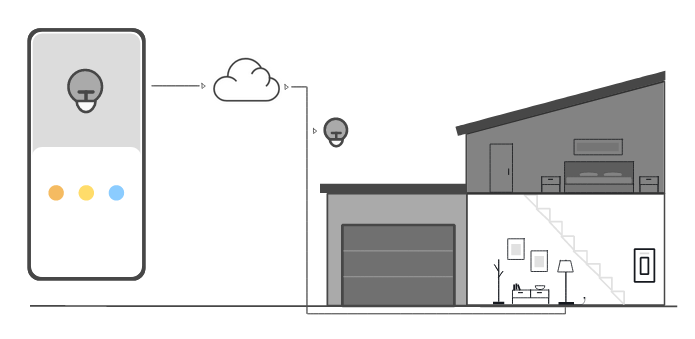
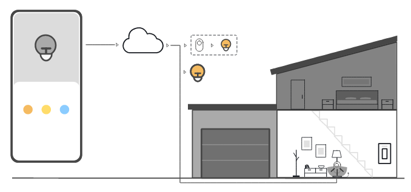

# Interactive tutorial

The interactive tutorial shows the components of a simple IoT solution built on AWS IoT.
The tutorial shows how IoT devices interact with AWS IoT Core services. This
topic provides a preview of the AWS IoT Core interactive tutorial.

###### Note

The images in the console include animations that don't appear in the images
in this tutorial.

To run the demo, you must first [Set up AWS account](setting-up.md "setting-up.md"). The tutorial, however,
doesn't require any AWS IoT resources, additional software, or any coding.

Expect to spend approximately 5-10 minutes on this demo. Giving yourself 10 minutes
will allow more time to comprehend each of the steps.

###### To run the AWS IoT Core interactive tutorial

1. Open the [AWS IoT home page](https://console.aws.amazon.com//iot/home#/home "https://console.aws.amazon.com//iot/home#/home")
   in the AWS IoT console.

On the **AWS IoT home page**, in the **Learning
resources** window pane, choose **Start
tutorial**.

 2. In the **AWS IoT Console Tutorial** page, review the tutorial
sections and choose **Start section** when you're ready to
continue.

###### The following sections describe how the AWS IoT Console

Tutorial presents these AWS IoT Core features:

- [Connecting IoT devices](#interactive-demo-part1 "#interactive-demo-part1")
- [Saving offline device state](#interactive-demo-part2 "#interactive-demo-part2")
- [Routing device data to services](#interactive-demo-part3 "#interactive-demo-part3")

## Connecting IoT devices

Learn how IoT devices communicate with AWS IoT Core.

The animation in this step shows how two devices, the control device on the left
and a smart lamp in the house on the right, connect and communicate with AWS IoT Core
in the cloud. The animation shows the devices communicating with AWS IoT Core and
reacting to the messages they receive.

For more information about connecting devices to AWS IoT Core, see [Connect to AWS IoT Core](connect-to-iot.md "connect-to-iot.md").

## Saving offline device state

Learn how AWS IoT Core saves device state for while a device or app is
offline.

The animation in this step shows how the Device Shadow service in AWS IoT Core saves
device state information for the control device and the smart lamp. While the smart
lamp is offline, the Device Shadow saves commands from the control device.

When the smart lamp reconnects to AWS IoT Core, it retrieves those commands. When the
control device is offline, the Device Shadow saves state information from the smart
lamp. When the control device reconnects, it retrieves the current state of the
smart lamp to update its display.

For more information about Device Shadows, see [AWS IoT Device Shadow service](iot-device-shadows.md "iot-device-shadows.md").

## Routing device data to services

Learn how AWS IoT Core sends device state to other AWS services.

The animation in this step shows how AWS IoT Core sends data from the devices to
other AWS services by using AWS IoT rules. AWS IoT rules subscribe to specific
messages from the devices, interpret the data in those messages, and route the
interpreted data to other services. In this example, an AWS IoT rule interprets data
from a motion sensor and sends commands to a Device Shadow, which then sends them to
the smart bulb. As in the previous example, the Device Shadow stores the
device-state info for the control device.

For more information about AWS IoT rules, see [Rules for AWS IoT](iot-rules.md "iot-rules.md").
