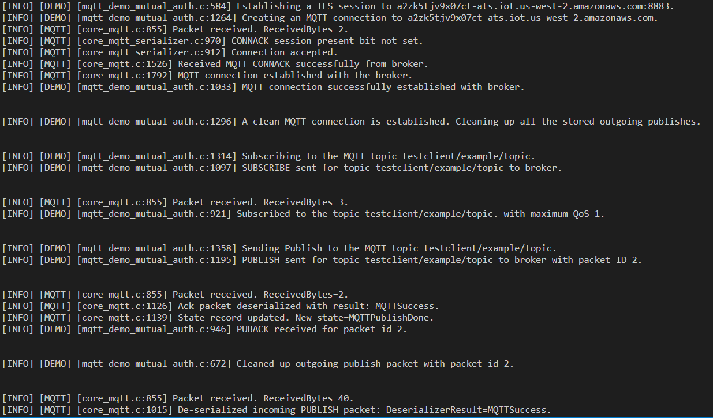

# Tutorial: Using the AWS IoT Device SDK for Embedded C

This section describes how to run the AWS IoT Device SDK for Embedded C.

###### Procedures in this section

- [Step1: Install the AWS IoT Device SDK for Embedded C](#install-embedded-c-sdk "#install-embedded-c-sdk")
- [Step 2: Configure the sample app](#iot-c-sdk-app-config "#iot-c-sdk-app-config")
- [Step 3: Build and run the sample application](#iot-c-sdk-app-run "#iot-c-sdk-app-run")

## Step1: Install the AWS IoT Device SDK for Embedded C

The AWS IoT Device SDK for Embedded C is generally targeted at resource constrained devices that require an optimized C
language runtime. You can use the SDK on any operating system and host it on any processor type (for example,
MCUs and MPUs). If you have more memory and processing resources available, we recommend that you use one of
the higher order AWS IoT Device and Mobile SDKs (for example, C++, Java, JavaScript, and Python).

In general, the AWS IoT Device SDK for Embedded C is intended for systems that use MCUs or low-end MPUs that run embedded
operating systems. For the programming example in this section, we
assume your device uses Linux.

###### Example

1. Download the AWS IoT Device SDK for Embedded C to your device from [GitHub](https://github.com/aws/aws-iot-device-sdk-embedded-C "https://github.com/aws/aws-iot-device-sdk-embedded-C").

```
git clone https://github.com/aws/aws-iot-device-sdk-embedded-c.git --recurse-submodules
```

This creates a directory named `aws-iot-device-sdk-embedded-c` in the current
directory. 2. Navigate to that directory and checkout the latest release. Please see [github.com/aws/aws-iot-device-sdk-embedded-C/tags](https://github.com/aws/aws-iot-device-sdk-embedded-C/tags "https://github.com/aws/aws-iot-device-sdk-embedded-C/tags") for the latest release tag.

```
cd aws-iot-device-sdk-embedded-c
git checkout `latest-release-tag`
```

3. Install OpenSSL version 1.1.0 or later. The OpenSSL development libraries are usually called
   "libssl-dev" or "openssl-devel" when installed through a package manager.

```
sudo apt-get install libssl-dev
```

## Step 2: Configure the sample app

The AWS IoT Device SDK for Embedded C includes sample applications for you to try. For
simplicity, this tutorial uses the `mqtt_demo_mutual_auth`
application, that illustrates how to connect to the AWS IoT Core message broker and
subscribe and publish to MQTT topics.

1. Copy the certificate and private key you created in
   [Getting started with AWS IoT Core tutorials](iot-gs.md "iot-gs.md") into the
   `build/bin/certificates` directory.

###### Note

Device and root CA certificates are subject to expiration or revocation. If these certificates
expire or are revoked, you must copy a new CA certificate or private key and device certificate
onto your device. 2. You must configure the sample with your personal AWS IoT Core endpoint, private key, certificate, and
root CA certificate. Navigate to the
`aws-iot-device-sdk-embedded-c/demos/mqtt/mqtt_demo_mutual_auth` directory.

If you have the AWS CLI installed, you can use this command to find your account's endpoint URL.

```
aws iot describe-endpoint --endpoint-type iot:Data-ATS
```

If you don't have the AWS CLI installed, open your
[AWS IoT console](https://console.aws.amazon.com/iot/home "https://console.aws.amazon.com/iot/home"). From the navigation pane,
choose **Manage**, and then choose **Things**. Choose the IoT thing
for your device, and then choose **Interact**. Your endpoint is
displayed in the **HTTPS** section of the thing details page. 3. Open the `demo_config.h` file and update the values for the following:

AWS_IOT_ENDPOINT

Your personal endpoint.

CLIENT_CERT_PATH

Your certificate file path, for example
`certificates/device.pem.crt"`.

CLIENT_PRIVATE_KEY_PATH

Your private key file name, for example
`certificates/private.pem.key`.

For example:

```
// Get from demo_config.h
// =================================================
#define AWS_IOT_ENDPOINT               "`my-endpoint`-ats.iot.us-east-1.amazonaws.com"
#define AWS_MQTT_PORT                  8883
#define CLIENT_IDENTIFIER              "testclient"
#define ROOT_CA_CERT_PATH              "certificates/AmazonRootCA1.crt"
#define CLIENT_CERT_PATH               "certificates/`my-device-cert`.pem.crt"
#define CLIENT_PRIVATE_KEY_PATH        "certificates/`my-device-private-key`.pem.key"
// =================================================
```

4. Check to see if you have CMake installed on your device by using this command.

```
cmake --version
```

If you see the version information for the compiler, you can continue to the next section.

If you get an error or don't see any information, then you'll need to install the cmake package
using this command.

```
sudo apt-get install cmake
```

Run the **cmake --version** command again and confirm that CMake has been installed
and that you are ready to continue. 5. Check to see if you have the development tools installed on your device
by using this command.

```
gcc --version
```

If you see the version information for the compiler, you can continue
to the next section.

If you get an error or don't see any compiler information, you'll need to
install the `build-essential` package using this command.

```
sudo apt-get install build-essential
```

Run the **gcc --version** command again and confirm that the build tools have been
installed and that you are ready to continue.

## Step 3: Build and run the sample application

This procedure exaplains how to generate the `mqtt_demo_mutual_auth`
application on your device and connect it to the [AWS IoT console](https://console.aws.amazon.com/iot/home "https://console.aws.amazon.com/iot/home") using the
AWS IoT Device SDK for Embedded C.

###### To run the AWS IoT Device SDK for Embedded C sample applications

1. Navigate to `aws-iot-device-sdk-embedded-c` and create a build directory.

```
mkdir build && cd build
```

2. Enter the following CMake command to generate the Makefiles needed to build.

```
cmake ..
```

3. Enter the following command to build the executable app file.

```
make
```

4. Run the `mqtt_demo_mutual_auth` app with this command.

```
cd bin
./mqtt_demo_mutual_auth
```

You should see output similar to the following:



Your device is now connected to AWS IoT using the AWS IoT Device SDK for Embedded C.

You can also use the AWS IoT console to view the MQTT messages that the sample app
is publishing. For information about how to use the MQTT client in the [AWS IoT console](https://console.aws.amazon.com/iot/home "https://console.aws.amazon.com/iot/home"), see [View MQTT messages with the AWS IoT MQTT
client](view-mqtt-messages.md "view-mqtt-messages.md") .
