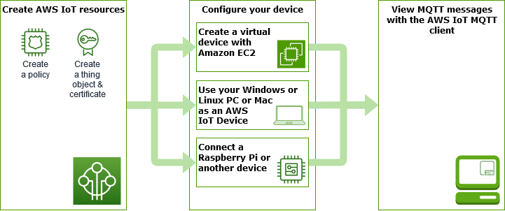

# Explore AWS IoT Core in hands-on tutorials

In this tutorial, you'll install the software and create the AWS IoT resources necessary
to connect a device to AWS IoT Core so that it can send and receive MQTT messages with
AWS IoT Core. You'll see the messages in the MQTT client in the AWS IoT console.

You can expect to spend 20-30 minutes on this tutorial. If you are using an IoT device
or a Raspberry Pi, this tutorial might take longer if, for example, you need to install
the operating system and configure the device.

This tutorial is best for developers who want to get started with AWS IoT Core so they
can continue to explore more advanced features, such as the [rules engine](iot-rules.md "iot-rules.md") and [shadows](iot-device-shadows.md "iot-device-shadows.md"). This tutorial prepares you to continue learning about AWS IoT Core
and how it interacts with other AWS services by explaining the steps in greater detail
than [the quick start tutorial](iot-quick-start.md "iot-quick-start.md"). If you are looking
for just a quick, _Hello World_, experience, try the [Try the AWS IoT Core quick connect tutorial](iot-quick-start.md "iot-quick-start.md").

After setting up your AWS account and AWS IoT console, you'll follow these steps to
see how to connect a device and have it send messages to AWS IoT Core.

###### Next steps

- [Choose which device option is the best
  for you](#choosing-a-gs-system "#choosing-a-gs-system")
- [Create AWS IoT resources](create-iot-resources.md "create-iot-resources.md") if you are not going to create a
  virtual device with Amazon EC2
- [Configure your device](configure-device.md "configure-device.md")
- [View MQTT messages with the AWS IoT MQTT
  client](view-mqtt-messages.md "view-mqtt-messages.md")
  For more information about AWS IoT Core, see [What Is
  AWS IoT Core](what-is-aws-iot.md "what-is-aws-iot.md")?

## Which device option is best for you?

If you're not sure which option to pick, use the following list of each option's
advantages and disadvantages to help you decide which one is best for you.

| Option                                                                                                               | This might be a good option if:                                                                                                                               | This might not be a good option if:                                                                                                                             |
| -------------------------------------------------------------------------------------------------------------------- | ------------------------------------------------------------------------------------------------------------------------------------------------------------- | --------------------------------------------------------------------------------------------------------------------------------------------------------------- |
| [Create a virtual device with Amazon EC2](creating-a-virtual-thing.md "creating-a-virtual-thing.md")              | • You don't have your own device to test. • You don't want to install any software on your own system. • You want to test on a Linux OS.             | • You're not comfortable using command-line commands. • You don't want to incur any additional AWS charges. • You don't want to test on a Linux OS. |
| [Use your Windows or Linux PC or Mac as an AWS IoT device](using-laptop-as-device.md "using-laptop-as-device.md") | • You don't want to incur any additional AWS charges. • You don't want to configure any additional devices.                                          | • You don't want to install any software on your personal computer. • You want a more representative test platform.                                       |
| [Connect a Raspberry Pi or other device](connecting-to-existing-device.md "connecting-to-existing-device.md")     | • You want to test AWS IoT with an actual device. • You already have a device to test with. • You have experience integrating hardware into systems. | • You don't want to buy or configure a device just to try it out. • You want to test AWS IoT as simply as possible, for now.                           |
