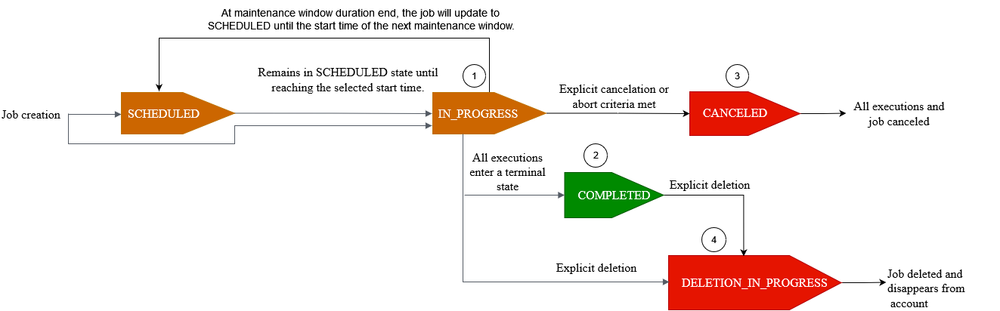
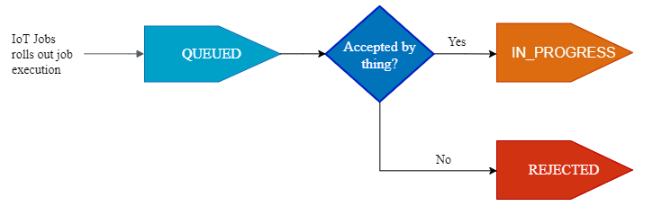
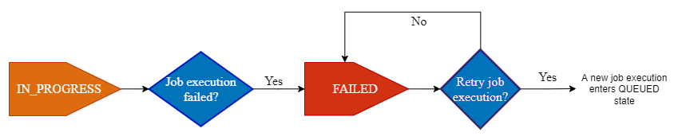
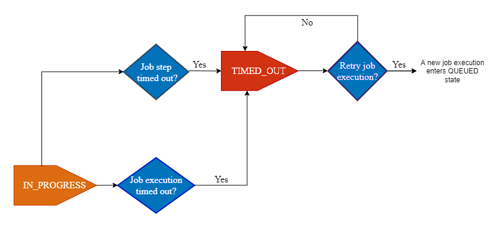

# Jobs and job execution states

The following sections describe the lifecycle of an AWS IoT job
and the lifecycle of a job execution.

## Job states

The following diagram shows the different states of an AWS IoT job.

A job that you create using AWS IoT Jobs can be in one of the following
states:

- ###### SCHEDULED

During the initial job or job template creation using the AWS IoT
console, [CreateJob](../apireference/API_CreateJob.md "../apireference/API_CreateJob.md") API, or [CreateJobTemplate](../apireference/API_CreateJobTemplate.md "../apireference/API_CreateJobTemplate.md") API, you can select the optional
scheduling configuration in the AWS IoT console or the
`SchedulingConfig` in the [CreateJob](../apireference/API_CreateJob.md "../apireference/API_CreateJob.md") API or
[CreateJobTemplate](../apireference/API_CreateJobTemplate.md "../apireference/API_CreateJobTemplate.md") API. When you
start a scheduled job containing a specific `startTime`,
`endTime`, and `endBehavior`, the job
status updates to `SCHEDULED`.
When
the job reaches your selected `startTime` or the
`startTime` of the next maintenance window (if you
selected job rollout during a maintenance window), the status will
update from `SCHEDULED` to `IN_PROGRESS` and
begin rollout of the job document to all devices in the target
group.

- ###### IN_PROGRESS

When you create a job using the AWS IoT console or the [CreateJob](../apireference/API_CreateJob.md "../apireference/API_CreateJob.md") API, the
job status updates to `IN_PROGRESS`. During job creation,
AWS IoT Jobs starts rolling out job executions to the devices in your
target group. After all the job executions have rolled out, AWS IoT
Jobs waits for devices to complete the remote action.

For information about concurrency and limits that apply to in-progress
jobs, see [AWS IoT Jobs limits](job-limits.md "job-limits.md").

###### Note

When an `IN_PROGRESS` job reaches the end of the
current maintenance window, the rollout of the job document will
stop. The job will update to `SCHEDULED` until the
`startTime` of the next maintenance window.

- ###### COMPLETED

A continuous job is handled in one of the following ways:

    + For a continuous job *without* the optional
     scheduling configuration selected, it's always in progress and
     continues to run for any new devices that are added to the
     target group. It will never reach a status state of
     `COMPLETED`.
    + For a continuous job *with* the optional
     scheduling configuration selected, the following is true:

    	- If an `endTime`
    	*was* provided, a continuous job will
    	 reach `COMPLETED` status when
    	 `endTime` has passed and all job
    	 executions have reached a terminal status state.
    	- If an `endTime`
    	*was not* provided in the optional
    	 scheduling configuration, the continuous job will
    	 continue to perform the job document rollout.

For a snapshot job, the job status changes to
`COMPLETED` when all of its job executions enter a
terminal state, such as `SUCCEEDED`, `FAILED`,
`TIMED_OUT`, `REMOVED`, or
`CANCELED`.

- ###### CANCELED

When you cancel a job using the AWS IoT console, the [CancelJob](../apireference/API_CancelJob.md "../apireference/API_CancelJob.md") API, or
the [Job abort
configuration](jobs-configurations-details.md#job-abort-using "jobs-configurations-details.md#job-abort-using"), the job status changes to `CANCELED`. During job
cancellation, AWS IoT Jobs starts canceling previously created job
executions.

For information about concurrency and limits that apply to jobs that
are being canceled, see [AWS IoT Jobs limits](job-limits.md "job-limits.md").

- ###### DELETION_IN_PROGRESS

When you delete a job using the AWS IoT console or the [DeleteJob](../apireference/API_DeleteJob.md "../apireference/API_DeleteJob.md") API, the
job status changes to `DELETION_IN_PROGRESS`. During job
deletion, AWS IoT Jobs starts deleting previously created job
executions. After all job executions have been deleted, the job
disappears from your AWS account.

## Job execution states

The following table shows the different states of an AWS IoT job
execution and whether the state change is initiated by the device or by
AWS IoT Jobs.

| Job execution states and source | Job execution state | Initiated by device? | Initiated by AWS IoT Jobs? | Terminal status? | Can be retried? |
| ------------------------------- | ------------------- | -------------------- | -------------------------- | ---------------- | --------------- |
| `QUEUED`                        | No                  | Yes                  | No                         | Not applicable   |
| `IN_PROGRESS`                   | Yes                 | No                   | No                         | Not applicable   |
| `SUCCEEDED`                     | Yes                 | No                   | Yes                        | Not applicable   |
| `FAILED`                        | Yes                 | No                   | Yes                        | Yes              |
| `TIMED_OUT`                     | No                  | Yes                  | Yes                        | Yes              |
| `REJECTED`                      | Yes                 | No                   | Yes                        | No               |
| `REMOVED`                       | No                  | Yes                  | Yes                        | No               |
| `CANCELED`                      | No                  | Yes                  | Yes                        | No               |

The following section describes more about the states of a job execution
that's rolled out when you create a job with AWS IoT Jobs.

- ###### QUEUED

When AWS IoT Jobs rolls out a job execution for a target device, the
job execution status is set to `QUEUED`. The job
execution remains in the `QUEUED` state until:

    + Your device receives the job execution and invokes the Jobs
     API operations and reports the status as
     `IN_PROGRESS`.
    + You
     cancel the job or job execution, or when the abort criteria that
     you specified is met, and the status changes to
     `CANCELED`.
    + Your device is removed from the target group and the status changes
     to `REMOVED`.

- ###### IN_PROGRESS

If your IoT device subscribes to the reserved [Job topics](reserved-topics.md#reserved-topics-job "reserved-topics.md#reserved-topics-job")
`$notify` and `$notify-next`, and your device
invokes either the `StartNextPendingJobExecution` API or the
`UpdateJobExecution` API with a status of
`IN_PROGRESS`, AWS IoT Jobs will set the job execution
status to `IN_PROGRESS`.

The `UpdateJobExecution` API can be invoked multiple times
with a status of `IN_PROGRESS`. You can specify additional
details about the execution steps using the `statusDetails`
object.

###### Note

If you create multiple jobs for each device, AWS IoT Jobs and the
MQTT protocol don't guarantee order of delivery.

- ###### SUCCEEDED

When your device successfully completes the remote operation, the
device must invoke the `UpdateJobExecution` API with a
status of `SUCCEEDED` to indicate that the job execution
succeeded. AWS IoT Jobs then updates and returns the job execution
status as `SUCCEEDED`.

- ###### FAILED

When your device fails to complete the remote operation, the
device must invoke the `UpdateJobExecution` API with a
status of `Failed` to indicate that the job execution
failed. AWS IoT Jobs then updates and returns the job execution status
as `Failed`. You can retry this job execution for the
device using the [Job execution retry
configuration](jobs-configurations-details.md#job-retry-configuration "jobs-configurations-details.md#job-retry-configuration").

- ###### TIMED_OUT

When your device fails to complete a job step when the status is
`IN_PROGRESS`, or when it fails to complete the
remote operation within the timeout duration of the in-progress
timer, AWS IoT Jobs sets the job execution status to
`TIMED_OUT`. You also have a step timer for each job
step of an in-progress job and applies only to the job execution.
The in-progress timer duration is specified using the
`inProgressTimeoutInMinutes` property of the [Job execution timeout
configuration](jobs-configurations-details.md#job-timeout-configuration "jobs-configurations-details.md#job-timeout-configuration"). You can retry this
job execution for the device using the [Job execution retry
configuration](jobs-configurations-details.md#job-retry-configuration "jobs-configurations-details.md#job-retry-configuration").

- ###### REJECTED

When your device receives an invalid or incompatible request, the
device must invoke the `UpdateJobExecution` API with a
status of `REJECTED`. AWS IoT Jobs then updates and returns
the job execution status as `REJECTED`.

- ###### REMOVED

When your device is no longer a valid target for the job
execution, such as when it's detached from a dynamic thing group,
AWS IoT Jobs sets the job execution status to `REMOVED`.
You can re-attach the thing to your target group and restart the job
execution for the device.

- ###### CANCELED

When you cancel a job or cancel a job execution using the console
or the `CancelJob` or `CancelJobExecution`
API, or when the abort criteria specified using the [Job abort
configuration](jobs-configurations-details.md#job-abort-using "jobs-configurations-details.md#job-abort-using") is
met, AWS IoT Jobs cancels the job and sets the job execution status to
`CANCELED`.
