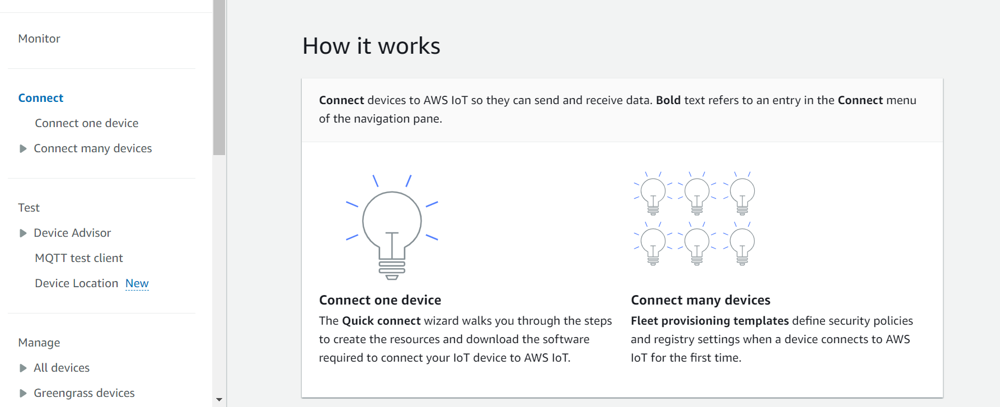
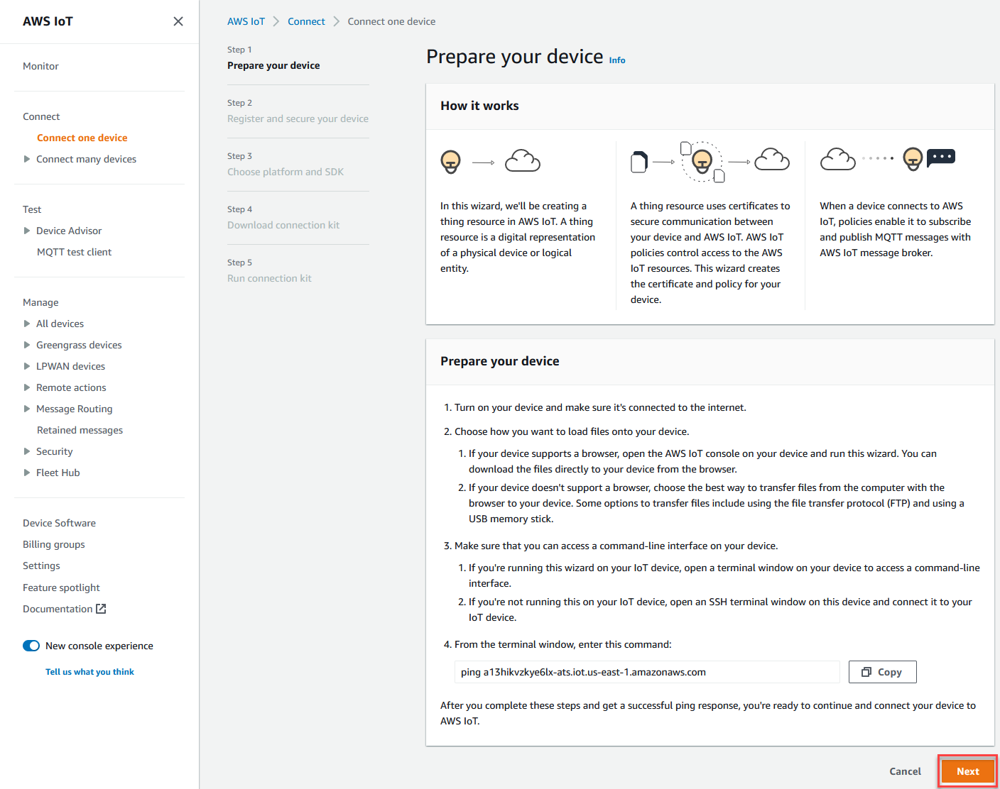
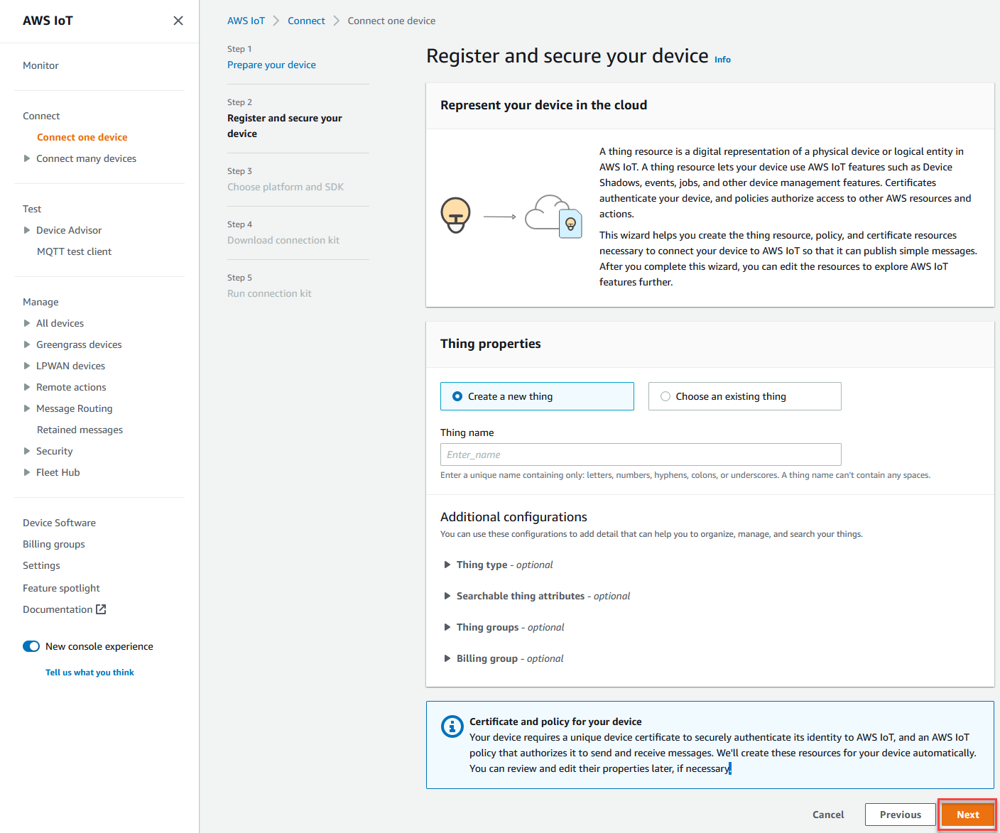
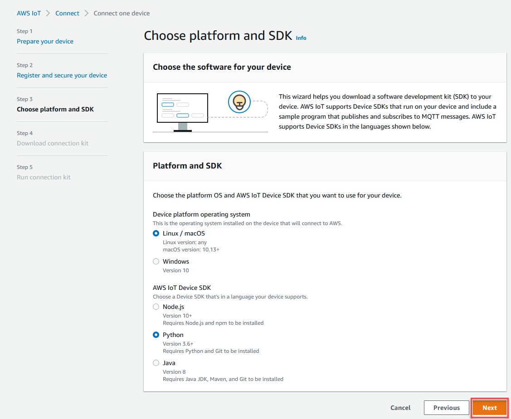
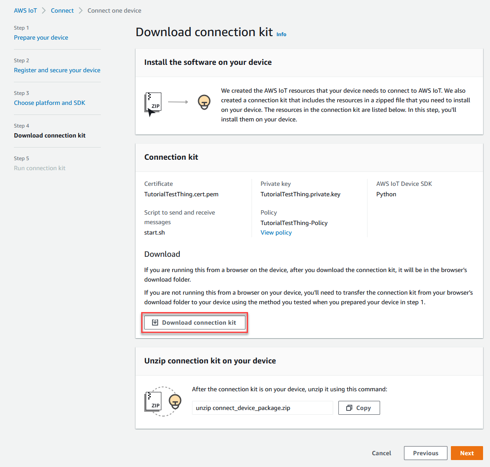
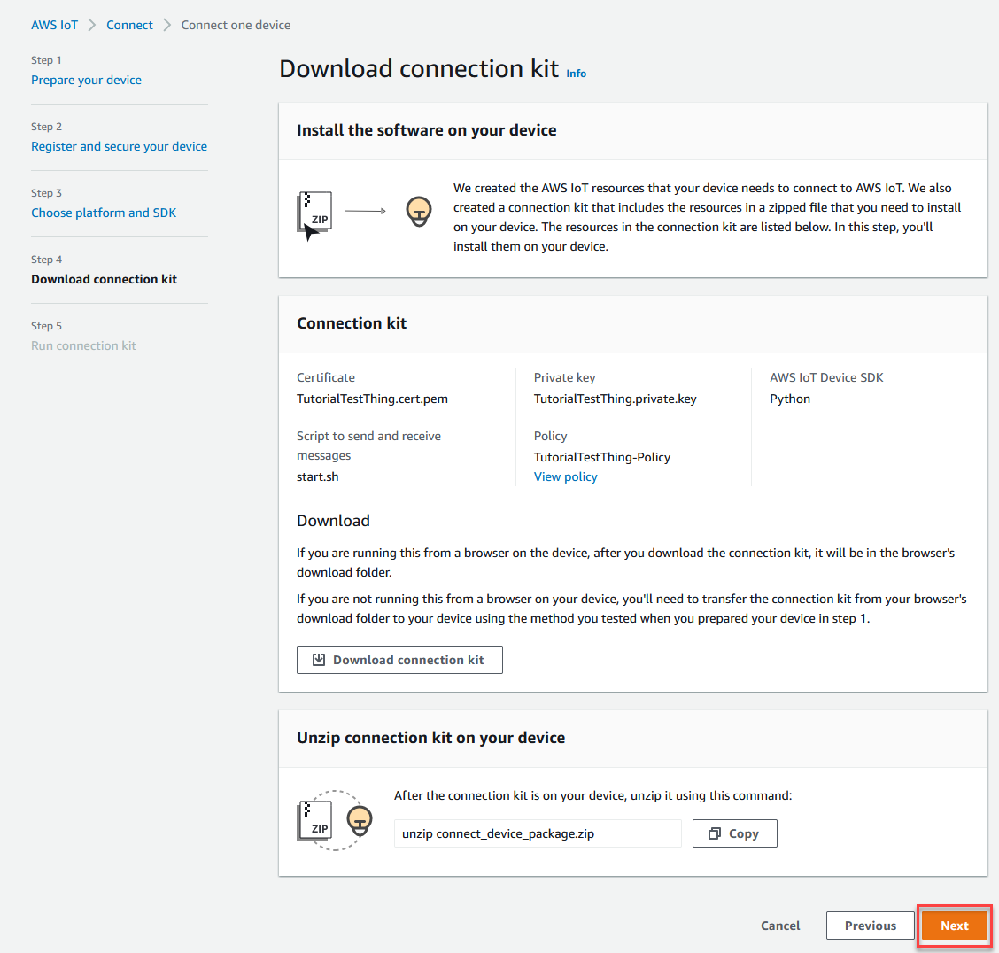
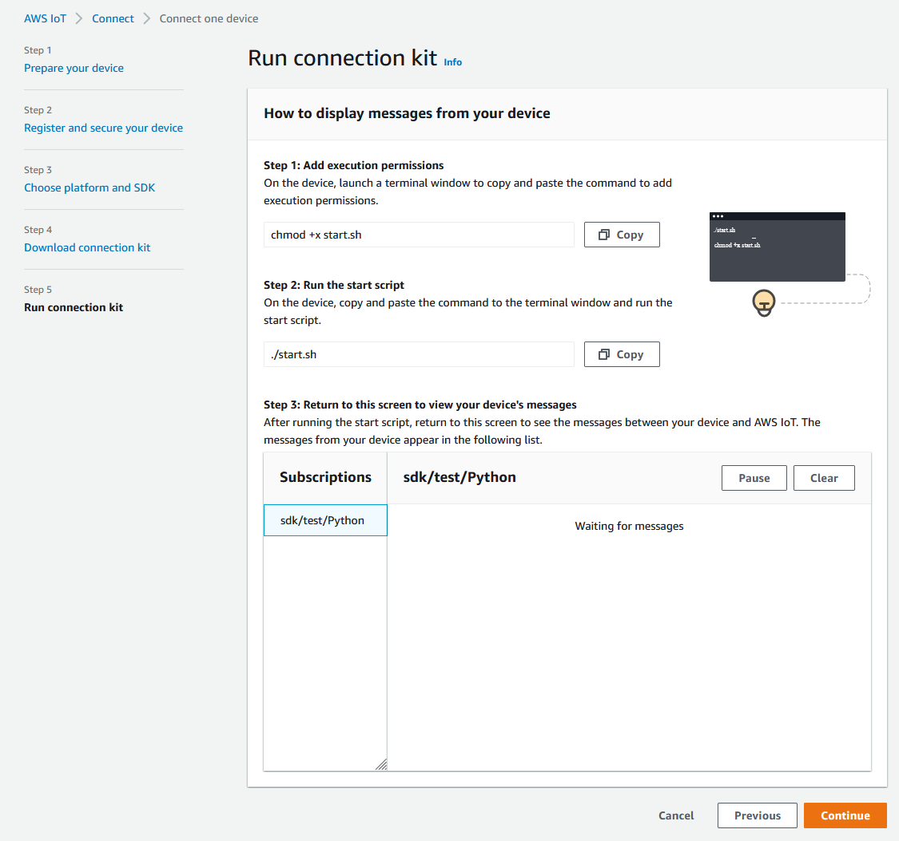
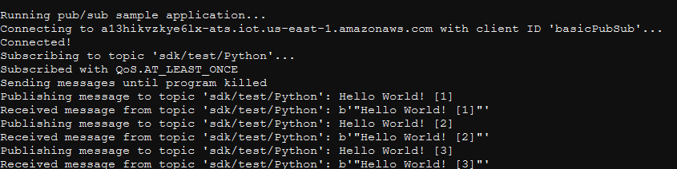
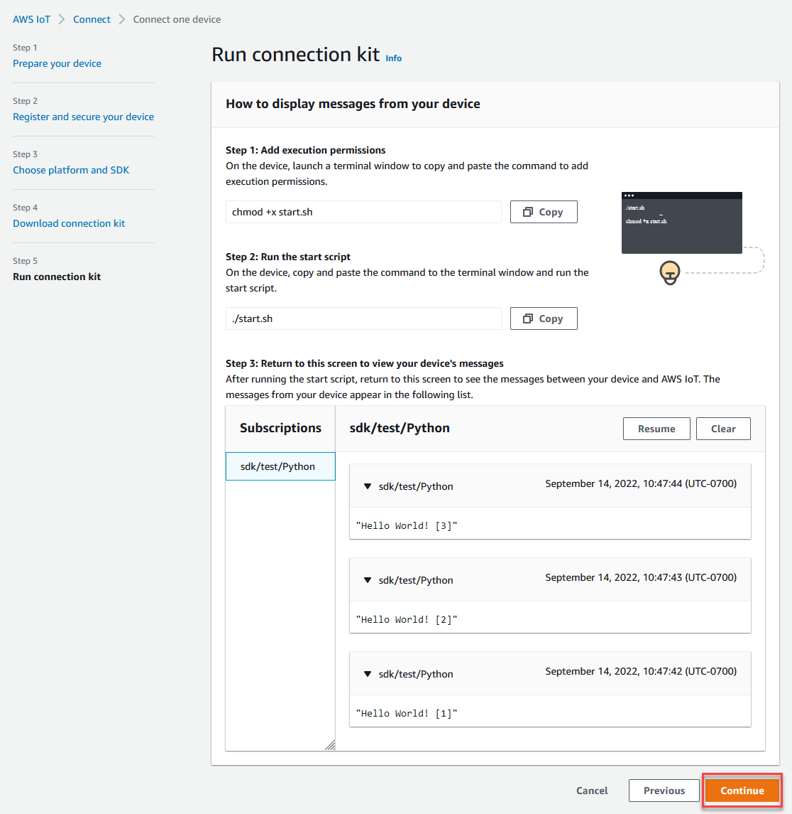
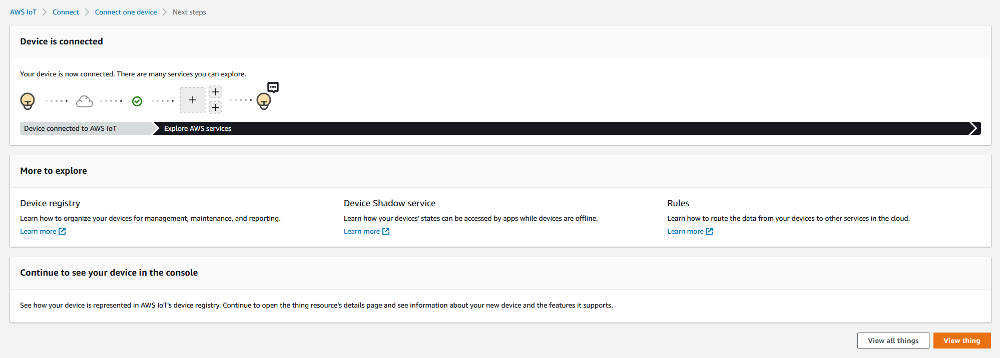

# Try the AWS IoT Core quick connect tutorial

In this tutorial, you'll create your first thing object, connect a device to it, and
watch it send MQTT messages.

You can expect to spend 15-20 minutes on this tutorial.

This tutorial is best for people who want to quickly get started with AWS IoT to see how
it works in a limited scenario. If you're looking for an example that will get you
started so that you can explore more features and services, try [Explore AWS IoT Core in hands-on tutorials](iot-gs-first-thing.md "iot-gs-first-thing.md").

In this tutorial, you'll download and run software on a device that connects to a
_thing resource_ in AWS IoT Core as part of a very small IoT
solution. The device can be an IoT device, such as a Raspberry Pi, or it can also be a
computer that is running Linux, OS and OSX, or Windows. If you're looking to connect a
Long Range WAN (LoRaWAN) device to AWS IoT, refer to the tutorial [>Connecting
devices and gateways to AWS IoT Core for LoRaWAN](../../../iot-wireless/latest/developerguide/lorawan-getting-started.md "../../../iot-wireless/latest/developerguide/lorawan-getting-started.md").

If your device supports a browser that can run the [AWS IoT console](https://console.aws.amazon.com//iot/home "https://console.aws.amazon.com//iot/home"), we recommend you complete this tutorial on
that device.

###### Note

If your device doesn't have a compatible browser, follow this tutorial on a
computer. When the procedure asks you to download the file, download it to your
computer, and then transfer the downloaded file to your device by using Secure Copy
(SCP) or a similar process.

The tutorial requires your IoT device to communicate with port 8443 on your
AWS account's device data endpoint. To test whether it can access that port, try the
procedures in [Test connectivity with your device data endpoint](iot-quick-start-test-connection.md "iot-quick-start-test-connection.md").

## Step 1. Start the tutorial

If possible, complete this procedure on your device; otherwise, be ready to
transfer a file to your device later in this procedure.

To start the tutorial, sign in to the [AWS IoT
console](https://console.aws.amazon.com//iot/home "https://console.aws.amazon.com//iot/home"). In the AWS IoT console home page, on the left, choose
**Connect** and then choose **Connect one
device**.



## Step 2. Create a thing object

1. In the **Prepare your device** section, follow the
   on-screen instructions to prepare your device for connecting to
   AWS IoT.

 2. In the **Register and secure your device** section,
choose **Create a new thing** or **Choose an
existing thing**. In the **Thing name** field,
enter the name for your thing object. The thing name used in this example is
`TutorialTestThing`

###### Important

Double-check your thing name before you continue.

A thing name can't be changed after the thing object is created. If
you want to change a thing name, you must create a new thing object with
the correct thing name and then delete the one with the incorrect
name.

In the **Additional configurations** section, customize
your thing resource further using the optional configurations listed.

After you provide your thing object a name and select any additional
configurations, choose **Next**.

 3. In the **Choose platform and SDK** section, choose the
platform and the language of the AWS IoT Device SDK that you want to use. This
example uses the Linux/OSX platform and the Python SDK. Make sure that you
have python3 and pip3
installed on your target device before you continue to the next step.

###### Note

Be sure to check the list of prerequisite software required by your
chosen SDK at the bottom of the console page.

You must have the required software installed on your target computer
before you continue to the next step.

After you choose the platform and device SDK language, choose
**Next**.



## Step 3. Download files to your device

This page appears after AWS IoT has created the connection kit, which includes
the following files and resources that your device requires:

- The thing's certificate files used to authenticate the device
- A policy resource to authorize your thing object to interact with
  AWS IoT
- The script to download the AWS Device SDK and run the sample program
  on your device

1. When you're ready to continue, choose the **Download
   connection kit for** button to download the connection kit for
   the platform that you chose earlier.

 2. If you're running this procedure on your device, save the connection kit
file to a directory from which you can run command line commands.

If you're not running this procedure on your device, save the connection
kit file to a local directory and then transfer the file to your
device. 3. In the **Unzip connection kit on your device** section,
enter **unzip connect_device_package.zip** in the directory
where the connection kit files are located.

If you're using a Windows PowerShell command window and the
**unzip** command doesn't work, replace
**unzip** with **expand-archive**, and try
the command line again. 4. After you have the connection kit file on the device, continue the
tutorial by choosing **Next**.



## Step 4. Run the sample

You do this procedure in a terminal or command window on your device while you
follow the directions displayed in the console. The commands you see in the console
are for the operating system you chose in [Step 2. Create a thing object](#iot-quick-start-configure "#iot-quick-start-configure"). Those shown here are for the Linux/OSX operating systems.

1. In a terminal or command window on your device, in the directory with the
   connection kit file, perform the steps shown in the AWS IoT console.

 2. After you enter the command from **Step 2** in the
console, you should see an output in the device's terminal or command window
that is similar to the following. This output is from the messages the
program is sending to and then receiving back from AWS IoT Core.



While the sample program is running, the test message `Hello
 World!` will appear as well. The test message appears in the
terminal or command window on your device.

###### Note

For more information about topic subscription and publish, see the
example code of your chosen SDK. 3. To run the sample program again, you can repeat the commands from
**Step 2** in the console of this procedure. 4. (Optional) If you want to see the messages from your IoT client in the
[AWS IoT console](https://console.aws.amazon.com//iot/home "https://console.aws.amazon.com//iot/home"), open the
[MQTT test client](https://console.aws.amazon.com//iot/home#/test "https://console.aws.amazon.com//iot/home#/test") on
the **Test** page of the AWS IoT console. If you chose Python
SDK, then in the **MQTT test client**, in **Topic
filter**, enter the topic, such as
`sdk/test/`python`` to
subscribe to the messages from your device. The topic filters are case
sensitive and depend on the programming language of the SDK you chose in
**Step 1**. For more information about topic
subscription and publish, see the code example of your chosen SDK. 5. After you subscribe to the test topic, run **./start.sh**
on your device. For more information, see [View MQTT messages with the AWS IoT MQTT
client](view-mqtt-messages.md "view-mqtt-messages.md").

After you run **./start.sh**, messages appear in the MQTT
client, similar to the following:

```
{
  "message": "Hello World!" [1]
}
```

The `sequence` number encased in `[]` increments by
one each time a new `Hello World!` message is received and stops
when you end the program. 6. To finish the tutorial and see a summary, in the AWS IoT console, choose
**Continue**.

 7. A summary of your AWS IoT quick connect tutorial will now appear.



## Step 5. Explore further

Here are some ideas to explore AWS IoT further after you complete the quick
start.

- ###### [View MQTT
  messages in the MQTT test client](https://console.aws.amazon.com/iot/home#/test "https://console.aws.amazon.com/iot/home#/test")

From the [AWS IoT console](https://console.aws.amazon.com//iot/home "https://console.aws.amazon.com//iot/home"),
you can open the [MQTT
client](https://console.aws.amazon.com//iot/home#/test "https://console.aws.amazon.com//iot/home#/test") on the **Test** page of the AWS IoT
console. In the **MQTT test client**, subscribe to
`#`, and then, on your device, run the program
**./start.sh** as described in the previous step. For
more information, see [View MQTT messages with the AWS IoT MQTT
client](view-mqtt-messages.md "view-mqtt-messages.md").

- ###### Run tests on your devices with [Device Advisor](device-advisor.md "device-advisor.md")

Use Device Advisor to test if your devices can securely and reliably connect
to, and interact with, AWS IoT.

- ###### [Interactive tutorial](interactive-demo.md "interactive-demo.md")

To start the interactive tutorial, from the **Learn**
page of the AWS IoT console, in the **See how AWS IoT
works** tile, choose **Start the
tutorial**.

- ###### [Get ready to explore more
  tutorials](iot-gs-first-thing.md "iot-gs-first-thing.md")

This quick start gives you just a sample of AWS IoT. If you want to
explore AWS IoT further and learn about the features that make it a
powerful IoT solution platform, start preparing your development
platform by [Explore AWS IoT Core in hands-on tutorials](iot-gs-first-thing.md "iot-gs-first-thing.md").
