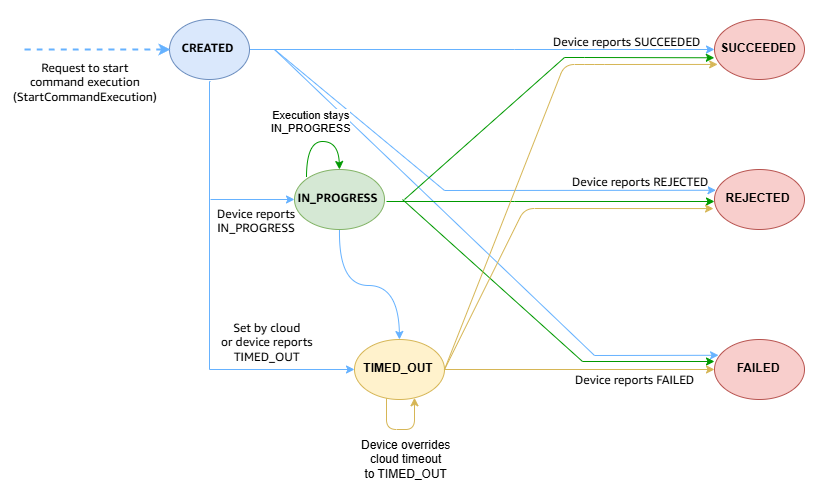

# Commands concepts and status

Use AWS IoT commands to send an instruction from the cloud to a device that's connected
to AWS IoT. To use the commands feature:

1. First, create a command resource with a payload that contains the
   configurations required to run the command on the device.
2. Specify the target device that will receive the payload and perform the
   specified actions.
3. Run the command on the target device, and retrieve the status information from
   the device. To troubleshoot any issues, see the CloudWatch logs.
   For more information about this workflow, see [High level commands workflow](iot-remote-command-workflow.md "iot-remote-command-workflow.md").

###### Topics

- [Commands key concepts](#iot-command-concepts "#iot-command-concepts")
- [Command states](#iot-command-states "#iot-command-states")
- [Command execution status](#iot-command-execution-status "#iot-command-execution-status")

## Commands key concepts

The following shows some key concepts for using the commands feature.

**Commands**

Commands are instructions that are sent from the cloud to your IoT
devices. These instructions (command payload) are sent to the devices as
MQTT messages. After the devices receive the command payload, they can
process the instructions to take the corresponding action. Examples of
such actions include modifying device configuration settings,
transmitting sensor readings, or uploading logs. The devices can then
run the command and return the result to the cloud. This enables you to
remotely monitor and control connected devices.

**Namespace**

When you use the commands feature, you can specify the namespace for
the command. When you want to create a command in AWS IoT Device Management, you must use
the default `AWS-IoT` namespace. When you use this namespace,
you must provide a payload when creating the command. The payload will
be used when you run the command on your target device. If you want to
create a command for AWS IoT FleetWise instead, you must use
the `AWS-IoT-FleetWise` namespace instead. For more
information, see [Remote commands](../../../iot-fleetwise/latest/developerguide/remote-commands.md "../../../iot-fleetwise/latest/developerguide/remote-commands.md") in the
_AWS IoT FleetWise developer guide for
commands_.

**Payload**

When you create the command, you must provide a payload that defines
the actions the device must perform. The payload can use any format of
your choice. To make sure that the device can correctly read and
understand the information that you're sending, we recommend that you
specify the payload format type in the command. If your devices use
MQTT5, they can follow the MQTT standard to identify the payload format.
A format indicator for JSON or CBOR will be available in the commands
request topic.

**Target device**

When you want to run the command, you must specify a target device
that will receive the command and perform actions. If your device has
been registered as a _thing_ with AWS IoT, you can use
the thing name. If your device hasn't been registered, you can use the
MQTT client ID instead. The client ID is a unique identifier for your
device or client defined in the [MQTT](mqtt.md "mqtt.md") protocol. It can be used to connect your
device to AWS IoT.

**Command execution**

A command execution is an instance of a command that runs on the
target device. When you start the execution, the command (payload) is
delivered to the target device. A unique command execution ID is now
generated for the target. The device can then execute the command and
report its progress to AWS IoT. The device-side logic determines how the
command will be executed and how the status gets published to the
reserved topics.

**Commands topics**

Before you run the command, your device must have subscribed to the
commands request topic. When you send the request to the cloud to
execute the command, the payload will be sent to the device on the
commands request topic. After the device executes the command, it can
publish the result and status of the execution to the commands response
topic. For more information, see [Commands topics](reserved-topics.md#reserved-topics-commands "reserved-topics.md#reserved-topics-commands").

## Command states

A command that you create in your AWS account can be either in an
_Available_, _Deprecated_, or a
_Pending deletion_ state.

**Available**

After you've successfully created a command resource, it will be in an
available state. The command can now be used to send a command execution
to the device.

**Deprecated**

If you no longer intend to use a command, you can mark it for
deprecation. In this state, you cannot send any new executions of the
command to your devices. Any pending executions that had already started
will continue running on the device to completion. To send new
executions, you must restore the command so that it becomes
available.

**Pending deletion**

When you mark a command for deletion, if the command has been
deprecated for a duration that's longer than the maximum timeout, the
command will be deleted automatically. This action is permanent and
can't be undone. By default, the maximum timeout duration is 12 hours.
If the command isn't deprecated, or has been deprecated for a duration
shorter than the maximum timeout, the command will be in a pending
deletion state. The command will be removed automatically from your
account after the maximum timeout duration.

## Command execution status

When you start the command execution on the target device, the command execution
enters a `CREATED` status. It can then transition to any of the other
command execution statuses depending on the status reported by the device. You can
then retrieve the status information and track your command executions.

###### Note

For a given target device, you can run multiple commands concurrently. You can
use the concurrency control feature to limit the maximum number of executions
that are sent to the same device, which prevents the device from being
overloaded. For information about the maximum number of concurrent executions
that you can run for each device, see [AWS IoT Device Management
commands quotas](../../../general/latest/gr/iot_device_management.md#commands-limits "../../../general/latest/gr/iot_device_management.md#commands-limits").

The following table shows the different statuses of a command execution and how
the command execution transitions between the various statuses depending on the
progress of the execution.

| Command execution status and source | Command execution status | Initiated by device/cloud? | Terminal execution?                                                   | Allowed status transitions |
| ----------------------------------- | ------------------------ | -------------------------- | --------------------------------------------------------------------- | -------------------------- |
| `CREATED`                           | Cloud                    | No                         | • IN_PROGRESS • SUCCEEDED • FAILED • REJECTED • TIMED_OUT |
| `IN_PROGRESS`                       | Device                   | No                         | • IN_PROGRESS • SUCCEEDED • FAILED • REJECTED • TIMED_OUT |
| `TIMED_OUT`                         | Device and cloud         | No                         | • SUCCEEDED • FAILED • REJECTED • TIMED_OUT                  |
| `SUCCEEDED`                         | Device                   | Yes                        | Not applicable                                                        |
| `FAILED`                            | Device                   | Yes                        | Not applicable                                                        |
| `REJECTED`                          | Device                   | Yes                        | Not applicable                                                        |

As your devices execute the command, it can publish updates to the status and
result any time to the cloud using the commands reserved MQTT topics. To provide
additional context about the status of each command execution to the cloud, it can
use the `reasonCode` and `reasonDescription` that are
contained within the `statusReason` object.

The following diagram shows the various command execution statuses and how the
transition occurs between them.

###### Note

When AWS IoT detects no device response within the timeout period, it sets `TIMED_OUT` as a temporary status that allows retries and
state changes. If your device explicitly reports `TIMED_OUT` during command execution, this becomes a terminal status with no further transitions
possible. See [Non-terminal command
executions](#iot-command-execution-status-nonterminal "#iot-command-execution-status-nonterminal").

The following section describes terminal and non-terminal command executions, the
various execution statuses, and how it works.

###### Topics

- [Non-terminal command
  executions](#iot-command-execution-status-nonterminal "#iot-command-execution-status-nonterminal")
- [Terminal command
  executions](#iot-command-execution-status-terminal "#iot-command-execution-status-terminal")

### Non-terminal command

executions

Your command execution is non-terminal if the execution can accept updates
from devices or clients. An execution in a non-terminal status is considered
_Active_. The following statuses are non-terminal.

- ###### CREATED

When you start a command execution from the AWS IoT console, or use
the `StartCommandExecution` API to send the command to
your device using the commands request topic. If the request is
successful, the command execution status changes to
`CREATED`. From this status, the command execution
can transition to any of the other non-terminal or terminal
statuses.

- ###### IN_PROGRESS

After receiving the command payload, your device can start
executing the instructions in the payload and perform the actions
specified. While executing the command, the device can publish a
response to the commands response topic and update the command
execution status as `IN_PROGRESS`. From the
`IN_PROGRESS` status, the command execution can
transition to any of the other terminal or non-terminal statuses
other than `CREATED`.

###### Note

The `UpdateCommandExecution` API can be invoked
multiple times with a status of `IN_PROGRESS`. You can
specify additional details about the execution using the
`statusReason` object.

- ###### TIMED_OUT

This command execution status can be triggered by both the cloud
and the device. An execution in `CREATED` or
`IN_PROGRESS` status can change to the
`TIMED_OUT` status due to the following
reasons.

    + After the command is sent to the device, a timer starts. If
     there is no response from the device within a specified
     duration, the cloud changes the command execution status to
     `TIMED_OUT`. In this case, the command execution
     is non-terminal.
    + The device can override the status to any of the other
     terminal statuses, or report that a time out occurred when
     executing the command, and set the status to
     `TIMED_OUT`. In this case, the execution status
     stays at `TIMED_OUT` but the fields of the
     `StatusReason` object change depending on the
     information reported by the devices. The command execution now
     becomes terminal.

For more information, see [Time out value and
TIMED_OUT execution status](iot-remote-command-execution-start-monitor.md#iot-command-execution-timeout-status "iot-remote-command-execution-start-monitor.md#iot-command-execution-timeout-status").

### Terminal command

executions

A command execution becomes terminal if the execution no longer accepts any
additional updates from the devices. The following statuses are terminal. An
execution can transition to the terminal statuses from any of the non-terminal
statuses, `CREATED`, `IN_PROGRESS`, or
`TIMED_OUT`.

- ###### SUCCEEDED

If the device successfully completed executing the command, it can
publish a response to the commands response topic and update the
command execution status to `SUCCEEDED`.

- ###### FAILED

When your device fails to complete executing the command, it can
publish a response to the commands response topic and update the
command execution status to `FAILED`. You can use the
`reasonCode` and `reasonDescription`
fields of the `statusReason` object, or the CloudWatch logs, to
further troubleshoot the failures.

- ###### REJECTED

When your device receives an invalid or incompatible request, the
device can invoke the `UpdateCommandExecution` API with a
status of `REJECTED`. You can use the
`reasonCode` and `reasonDescription`
fields of the `statusReason` object, or the CloudWatch logs, to
further troubleshoot any issues.
