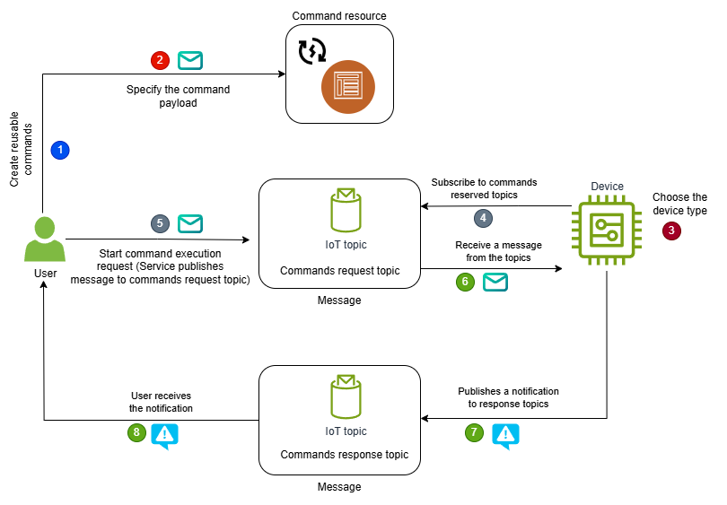

# High level commands workflow

The following steps provide an overview of the commands workflow between your devices and
AWS IoT Device Management commands. When you use any of the commands HTTP API operations, the request is
signed using [Sigv4 credentials](../../../IAM/latest/UserGuide/reference_sigv.md "../../../IAM/latest/UserGuide/reference_sigv.md").



###### Workflow overview

- [Create and manage commands](#command-create-command "#command-create-command")
- [Choose target device for your commands and
  subscribe to MQTT topics](#command-choose-target "#command-choose-target")
- [Start and monitor command executions for
  your target device](#command-command-executions "#command-command-executions")
- [(Optional) Enable
  notifications for commands events](#iot-remote-command-commands-notifications "#iot-remote-command-commands-notifications")

## Create and manage commands

To create and manage commands for your devices, perform the following steps.

1. ###### Create a command resource

Before you can send the command to your devices, create a command resource
from the [Command Hub](https://console.aws.amazon.com/iot/home#/commandHub "https://console.aws.amazon.com/iot/home#/commandHub") of
the AWS IoT console, or using the [`CreateCommand`](../apireference/API_CreateCommand.md "../apireference/API_CreateCommand.md") control plane API operation. 2. ###### Specify the payload

When creating the command, you must provide a payload for your command. The
payload content can use any format of your choice. To make sure that the device
correctly interprets the payload, we recommend that you also specify
the payload content type. 3. ###### (Optional) Manage the created commands

After you create the command, you can update the command's display name and
description. You can also mark a command as deprecated if you no longer intend
to use it, or completely remove the command from your account. If you want to
modify the payload information, you must create a new command and upload the new
payload file.

## Choose target device for your commands and

subscribe to MQTT topics

To prepare for the commands workflow, choose your target device and specify the AWS IoT
reserved MQTT topics to receive commands and publish response messages.

1. ###### Choose the target device for your command

To prepare for the commands workflow, choose your target device that will
receive the command and perform the actions specified. The target device can be
an AWS IoT thing that you have registered in the AWS IoT registry, or can be
specified using the MQTT client ID, if your device hasn't been registered
with AWS IoT. For more information, see [Target device
considerations](iot-remote-command-execution-start-monitor.md#iot-command-execution-target "iot-remote-command-execution-start-monitor.md#iot-command-execution-target"). 2. ###### Configure the IoT device policy

Before your device can receive command executions and publish updates, it must
use a IAM policy that grants permissions to perform these actions. For examples
of sample policies that you can use depending on whether your device is registered
as an AWS IoT thing, or being specified as an MQTT client ID, see
[Sample IAM
policy](iot-remote-command-execution-start-monitor.md#iot-remote-command-execution-update-policy "iot-remote-command-execution-start-monitor.md#iot-remote-command-execution-update-policy"). 3. ###### Establish an MQTT connection

To prepare your devices to use the commands feature, your devices must first
connect to the message broker and subscribe to the request and response topics.
Your device must be allowed to perform the `iot:Connect` action to
connect to AWS IoT Core and establish an MQTT connection with the message broker.
To find the data plane endpoint for your AWS account, use the
`DescribeEndpoint` API or the `describe-endpoint` CLI
command as shown below.

```
aws iot describe-endpoint --endpoint-type iot:Data-ATS
```

Running this command returns the account-specific data plane endpoint as shown
below.

```
`account-specific-prefix`.iot.`region`.amazonaws.com
```

4. ###### Susbcribe to commands topics

After a connection has been established, your devices can then subscribe to
the commands request topic. When you create a command and start the
command execution on your target device, the payload message will be published
to the request topic by the message broker. Your device can then receive the
payload message and process the command.

(Optional) Your devices can also subscribe to these commands response topics
(`accepted` or `rejected`)
to receive a message that indicates whether the cloud service accepted or
rejected the response from the device.

In this example, replace:

    * ``<device>``
     with `thing` or `client` depending on
     whether the device you're targeting has been registered as an
     IoT thing, or specified as an MQTT client.
    * ``<DeviceID>``
     with the unique identifier of your target device. This ID can
     be the unique MQTT client ID or a thing name.

###### Note

If the payload type is not JSON or CBOR, the
`<PayloadFormat>` field might not be
present in the commands request topic. To get the payload format, we
recommend that you use MQTT 5 to get the format information from the
MQTT message headers. For more information, see
[Commands topics](reserved-topics.md#reserved-topics-commands "reserved-topics.md#reserved-topics-commands").

```
$aws/commands/`<devices>`/`<DeviceID>`/executions/+/request/`<PayloadFormat>`
$aws/commands/`<devices>`/`<DeviceID>`/executions/+/response/accepted/`<PayloadFormat>`
$aws/commands/`<devices>`/`<DeviceID>`/executions/+/response/rejected/`<PayloadFormat>`

```

## Start and monitor command executions for

your target device

After you have created the commands and specified the targets for the command, you can
start the execution on the target device by performing the following steps.

1. ###### Start command execution on the target device

Start the command execution on the target device from the [Command Hub](https://console.aws.amazon.com/iot/home#/commandHub "https://console.aws.amazon.com/iot/home#/commandHub") of the AWS IoT
console, or using the `StartCommandExecution` data plane API with
your account-specific endpoint. If you're using dual-stack endpoints (IPv4 and
IPv6), use the `iot:Data-ATS`. The `iot:Jobs` endpoint is
for IPv4 only.

The API publishes the payload message to the commands request topic mentioned
above that the device has subscribed to.

###### Note

If the device was offline when the command was sent from the cloud and
if it uses MQTT persistent sessions, the
command waits at the message broker. If the device comes back online before
the time out duration, and if it has subscribed to the commands request topic,
the device can then process the command and publish the result to the
commands response topic. If the device doesn't come back online before the time out
duration, the command execution will time out and the payload message might
expire and be discarded by the message broker. 2. ###### Update the result of the command execution

The device now receives the payload message and can process the command and
perform the actions specified, and then publish the result of the command
execution to the following commands response topic using the
`UpdateCommandExecution` API. If your device subscribed to the
commands accepted and rejected response topics, it will receive a message that
indicates whether the response was accepted or rejected by the cloud
service.

Depending on how you specified in the request topic, `<devices>`
can be either things or clients, and `<DeviceID>`
can be your IoT thing name or the MQTT client ID.

###### Note

The `<PayloadFormat>` can only be JSON
or CBOR in the commands response topic.

```
$aws/commands/`<devices>`/`<DeviceID>`/executions/`<ExecutionId>`/response/`<PayloadFormat>`
```

3. ###### (Optional) Retrieve command execution result

To retrieve the result of the command execution, you can view the command
history from the AWS IoT console, or use the `GetCommandExecution`
control plane API operation. To get the latest information, your device
must have published the command execution result to the commands response
topic. You can also obtain additional information about the execution data,
such as when it was last updated, the execution result, and when the
execution was completed.

## (Optional) Enable

notifications for commands events

You can subscribe to commands events to receive notifications when the status of a
command execution changes. The following steps show you how to subscribe to commands
events, and then process them.

1. ###### Create a topic rule

You can subscribe to the commands events topic and receive notifications when
the status of a command execution changes. You can also create a topic rule to
route the data processed by the device to other AWS IoT services supported by
rules, such as AWS Lambda, Amazon SQS, and AWS Step Functions. You
can create a topic rule either using the AWS IoT console, or the
`CreateTopicRule` AWS IoT Core control plane API
operation. For more information, see [Creating an AWS IoT rule](iot-create-rule.md "iot-create-rule.md").

In this example, replace
`<CommandID>` with the
identifier of the command for which you want to receive notifications and
`<CommandExecutionStatus>`
with the status of the command execution.

```
$aws/events/commandExecution/`<CommandID>`/`<CommandExecutionStatus>`
```

###### Note

To receive notifications for all commands and command execution statuses,
you can use wildcard characters and subscribe to the following topic.

```
$aws/events/commandExecution/+/#
```

2. ###### Receive and process commands events

If you created a topic rule in the previous step to subscribe to commands
events, then you can manage the commands push notifications that you receive
and build application on top of these services.

The following code shows a sample payload for the commands events notifications that
you'll receive.

```
{
    "executionId": "`2bd65c51-4cfd-49e4-9310-d5cbfdbc8554`",
    "status":"FAILED",
    "statusReason": {
         "reasonCode": "DEVICE_TOO_BUSY",
         "reasonDescription": ""
    },
    "eventType": "COMMAND_EXECUTION",
    "commandArn":"arn:aws:iot:`us-east-1`:`123456789012`:command/`0b9d9ddf-e873-43a9-8e2c-9fe004a90086`",
    "targetArn":"arn:aws:iot:`us-east-1`:`123456789012`:thing/`5006c3fc-de96-4def-8427-7eee36c6f2bd`",
    "timestamp":`1717708862107`
}
```
