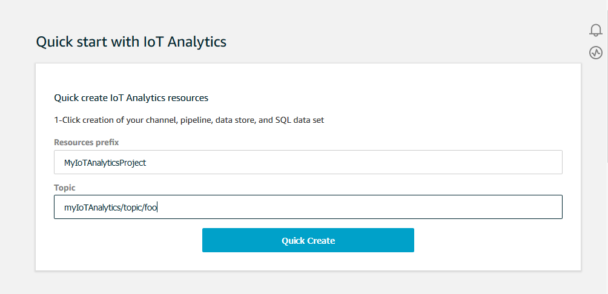

# IoT Analytics

The AWS IoT Analytics (`iotAnalytics`) action sends data from an MQTT message to an
AWS IoT Analytics channel.

## Requirements

This rule action has the following requirements:

- An IAM role that AWS IoT can assume to perform the `iotanalytics:BatchPutMessage` operation.
  For more information, see [Granting an AWS IoT rule the access it requires](iot-create-role.md "iot-create-role.md").

In the AWS IoT console, you can choose or create a role to allow AWS IoT to perform this rule action.

The policy attached to the role you specify should look like the
following example.

JSON

```
`{
 "Version":"2012-10-17",
 "Statement": [
 {
 "Effect": "Allow",
 "Action": "iotanalytics:BatchPutMessage",
 "Resource": [
 "arn:aws:iotanalytics:us-west-2:`111122223333`:channel/mychannel"
 ]
 }
 ]
}`

```

## Parameters

When you create an AWS IoT rule with this action, you must specify the following information:

`batchMode`

(Optional) Whether to process the action as a batch. The default
value is `false`.

When `batchMode` is `true` and the rule SQL
statement evaluates to an Array, each Array element is delivered as
a separate message when passed by [`BatchPutMessage`](../../../iotanalytics/latest/APIReference/API_BatchPutMessage.md "../../../iotanalytics/latest/APIReference/API_BatchPutMessage.md") to the AWS IoT Analytics channel.
The resulting array can't have more than 100 messages.

Supports [substitution templates](iot-substitution-templates.md "iot-substitution-templates.md"): No

`channelName`

The name of the AWS IoT Analytics channel to which to write the data.

Supports [substitution templates](iot-substitution-templates.md "iot-substitution-templates.md"): API and AWS CLI only

`roleArn`

The IAM role that allows access to the AWS IoT Analytics channel. For more
information, see [Requirements](#iotanalytics-rule-action-requirements "#iotanalytics-rule-action-requirements").

Supports [substitution templates](iot-substitution-templates.md "iot-substitution-templates.md"): No

## Examples

The following JSON example defines an AWS IoT Analytics action in an AWS IoT rule.

```
{
    "topicRulePayload": {
        "sql": "SELECT * FROM 'some/topic'",
        "ruleDisabled": false,
        "awsIotSqlVersion": "2016-03-23",
        "actions": [
            {
                "iotAnalytics": {
                    "channelName": "mychannel",
                    "roleArn": "arn:aws:iam::123456789012:role/analyticsRole",
                }
            }
        ]
    }
}
```

## See also

- [What is AWS IoT Analytics?](../../../iotanalytics/latest/userguide.md "../../../iotanalytics/latest/userguide.md") in the
  _AWS IoT Analytics User Guide_
- The AWS IoT Analytics console also has a **Quick start** feature
  that lets you create a channel, data store, pipeline, and data store
  with one click. For more information, see [AWS IoT Analytics console quickstart
  guide](../../../iotanalytics/latest/userguide/quickstart.md "../../../iotanalytics/latest/userguide/quickstart.md") in the _AWS IoT Analytics User Guide_.


