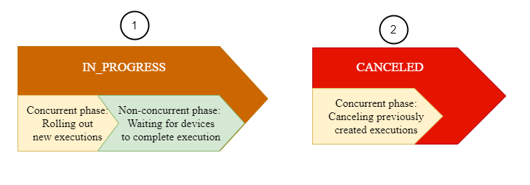

# AWS IoT Jobs limits

AWS IoT Jobs has Service quotas, or limits, that correspond to the maximum
number of service resources or operations for your AWS account.

###### Topics

- [Job executions limits](#job-execution-limits "#job-execution-limits")
- [Active and concurrent
  job limits](#job-limits-active-concurrent "#job-limits-active-concurrent")

## Job executions limits

This section provides information about the job execution limits for
AWS IoT Device Management.

###### Note

These limits are not part of the service quotas that you can find in
the [AWS IoT Device Management
Service Quotas documentation](../../../general/latest/gr/iot_device_management.md#iot_device_management_quotas "../../../general/latest/gr/iot_device_management.md#iot_device_management_quotas").

To get information about the number of pending job executions, you can
either use the `GetPendingJobExecutions` API, or subscribe to the
MQTT reserved topics for AWS IoT Jobs and receive [Job notification types](jobs-comm-notifications.md#jobs-comm-notifications-types "jobs-comm-notifications.md#jobs-comm-notifications-types").

The number of pending job executions in your account can vary depending on
whether you have the scheduling configuration enabled and use a recurring maintenance
window.

| Maximum number of pending job executions | API/notification name                                                                                                                                                                                                                                                                                                                                                                                                                                                           | Description | Without scheduling configuration                                                                  | With scheduling configuration |
| ---------------------------------------- | ------------------------------------------------------------------------------------------------------------------------------------------------------------------------------------------------------------------------------------------------------------------------------------------------------------------------------------------------------------------------------------------------------------------------------------------------------------------------------- | ----------- | ------------------------------------------------------------------------------------------------- | ----------------------------- |
| `ListNotification`                       | A `ListNotification` is published whenever an old job execution enters a terminal status, or when a new job execution is queued or changes to a non-terminal status. It can display up to 15 pending job executions that are either `QUEUED` or `IN_PROGRESS`.                                                                                                                                                                                                         | 10          | 15 (Up to 5 job executions only appears in the `ListNotification` during a maintenace window). |
| `GetPendingJobExecutions`                | When you invoke the `GetPendingJobExecutions` API, it returns a list of job executions that have not yet started, and can be started after the API call. The API can return up to a maximum of 10 pending job executions. • Out of the 10 pending job executions, executions that are `IN_PROGRESS` will be filtered from the result. • Out of the 10 pending job executions, if their jobs are in `SCHEDULED` status, they will be filtered from the result. | 10          | 15                                                                                                |

## Active and concurrent

job limits

This section will help you learn more about active and concurrent jobs and the
limits that apply to them.

###### Active jobs and active job limit

When you create a job by using the AWS IoT console or the `CreateJob`
API, the job status changes to `IN_PROGRESS`. All in-progress jobs
are _active jobs_ and count towards the active jobs limit.
This includes jobs that are either rolling out new job executions, or jobs that
are waiting for devices to complete their job executions. This limit applies to
both continuous and snapshot jobs.

###### Concurrent jobs and job concurrency limit

In-progress jobs that are either rolling out new job executions, or jobs that
are canceling previously created job executions are _concurrent
jobs_ and count towards the job concurrency limit. AWS IoT Jobs can
roll out and cancel job executions swiftly at a rate of 1000 devices per minute.
Each job is `concurrent` and counts towards the job concurrency limit
only for a short time. After the job executions have been rolled out or
canceled, the job is no longer concurrent and does not count towards the job
concurrency limit. You can use the job concurrency to create a large number of
jobs while waiting for devices to complete the job execution.

###### Note

If a job with the optional scheduling configuration and job document rollout
scheduled to take place during a maintenance window reaches the selected
`startTime` and you're at your maximum job concurrency limit,
then that scheduled job will move to a status state of
`CANCELED`.

To determine whether a job is concurrent, you can use the `IsConcurrent` property
of a job from the AWS IoT console, or by using the `DescribeJob` or `ListJob`
API. This limit applies to both continuous and snapshot jobs.

To view the active jobs and job concurrency limits and other AWS IoT Jobs quotas for your
AWS account and to request a limit increase, see [AWS IoT Device
Management endpoints and quotas](../../../general/latest/gr/iot_device_management.md#job-limits "../../../general/latest/gr/iot_device_management.md#job-limits") in the AWS General Reference.

The following diagram shows how the job concurrency applies to in-progress jobs and
jobs that are being canceled.

###### Note

New jobs with the optional `SchedulingConfig` will maintain an
initial status state of `SCHEDULED` and update to
`IN_PROGRESS` upon reaching the selected `startTime`.
After the new job with the optional `SchedulingConfig` reaches the
selected `startTime` and updates to `IN_PROGRESS`, it will
count towards the active jobs limit and job concurrency limit. Jobs with a
status state of `SCHEDULED` will count towards the active jobs limit,
but will not count towards the job concurrency limit.

The following table shows the limits that apply to active and concurrent jobs and
the concurrent and non-concurrent phases of the job states.

| Active and concurrent job limits                                                                                                                                                                                                 | Job status                                                                                                                                                                                                                                                                                                                                                                                          | Phase          | Active jobs limit | Job concurrency limit |
| -------------------------------------------------------------------------------------------------------------------------------------------------------------------------------------------------------------------------------- | --------------------------------------------------------------------------------------------------------------------------------------------------------------------------------------------------------------------------------------------------------------------------------------------------------------------------------------------------------------------------------------------------- | -------------- | ----------------- | --------------------- |
| `SCHEDULED`                                                                                                                                                                                                                      | Non-concurrent phase: AWS IoT Jobs waits for the scheduled `startTime` of the job to begin job execution notifications to your devices. Jobs in this phase only count towards the active jobs limit and will have the `IsConcurrent` property set to false.                                                                                                                             | Applies        | Does not apply    |
| `IN_PROGRESS`                                                                                                                                                                                                                    | Concurrent phase: AWS IoT Jobs accepts the request for creating the job and starts rolling out job execution notifications to your devices. Jobs in this phase are concurrent, as denoted by the `IsConcurrent` property set to true, and count towards both the active jobs and the job concurrency limits.                                                                            | Applies        | Applies           |
| Non-concurrent phase: AWS IoT Jobs waits for devices to report the results of their job executions. Jobs in this phase only count towards the active jobs limit and will have the `IsConcurrent` property set to false. | Applies                                                                                                                                                                                                                                                                                                                                                                                             | Does not apply |
| `Canceled`                                                                                                                                                                                                                       | Concurrent phase: AWS IoT Jobs accepts the request for canceling the job and starts canceling job executions previously created for your devices. Jobs in this phase are concurrent and will have the `IsConcurrent` property set to true. Once the job and job executions have been canceled, the job is no longer concurrent and does not count towards the job concurrency limit. | Does not apply | Applies           |

###### Note

The max duration of a recurring maintenance window is 23 hours, 50 minutes.
