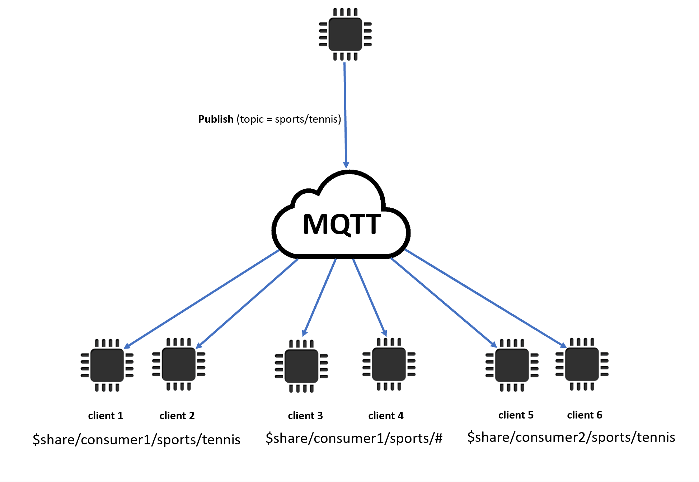

# MQTT

[MQTT](http://mqtt.org/ "http://mqtt.org/") (Message Queuing Telemetry Transport) is a
lightweight and widely adopted messaging protocol that is designed for constrained devices.
AWS IoT Core support for MQTT is based on the [MQTT v3.1.1
specification](http://docs.oasis-open.org/mqtt/mqtt/v3.1.1/os/mqtt-v3.1.1-os.html "http://docs.oasis-open.org/mqtt/mqtt/v3.1.1/os/mqtt-v3.1.1-os.html") and the [MQTT v5.0
specification](http://docs.oasis-open.org/mqtt/mqtt/v5.0/mqtt-v5.0.html "http://docs.oasis-open.org/mqtt/mqtt/v5.0/mqtt-v5.0.html"), with some differences, as documented in [AWS IoT differences from MQTT specifications](#mqtt-differences "#mqtt-differences"). As the latest version of the standard, MQTT 5 introduces
several key features that make an MQTT-based system more robust, including new scalability
enhancements, improved error reporting with reason code responses, message and session
expiry timers, and custom user message headers. For more information about MQTT 5 features
that AWS IoT Core supports, see [MQTT 5 supported features](#mqtt5 "#mqtt5").
AWS IoT Core also supports cross MQTT version (MQTT 3 and MQTT 5) communication. An MQTT 3
publisher can send an MQTT 3 message to an MQTT 5 subscriber that will be receiving an MQTT
5 publish message, and vice versa.

AWS IoT Core supports device connections that use the MQTT protocol and MQTT over WSS
protocol and that are identified by a _client ID_. The [AWS IoT Device SDKs](iot-connect-devices.md#iot-connect-device-sdks "iot-connect-devices.md#iot-connect-device-sdks") support both
protocols and are the recommended ways to connect devices to AWS IoT Core. The AWS IoT Device
SDKs support the functions necessary for devices and clients to connect to and access AWS IoT
services. The Device SDKs support the authentication protocols that the AWS IoT services
require and the connection ID requirements that the MQTT protocol and MQTT over WSS
protocols require. For information about how to connect to AWS IoT using the AWS Device SDKs
and links to examples of AWS IoT in the supported languages, see [Connecting with MQTT using the AWS IoT Device SDKs](#mqtt-sdk "#mqtt-sdk").
For more information about authentication methods and the port mappings for MQTT messages,
see [Protocols, port mappings, and
authentication](protocols.md#protocol-mapping "protocols.md#protocol-mapping").

While we recommend using the AWS IoT Device SDKs to connect to AWS IoT, they are not required.
If you do not use the AWS IoT Device SDKs, however, you must provide the necessary connection
and communication security. Clients must send the [Server Name Indication (SNI) TLS
extension](https://tools.ietf.org/html/rfc3546#section-3.1 "https://tools.ietf.org/html/rfc3546#section-3.1") in the connection request. Connection attempts that don't include the
SNI are refused. For more information, see [Transport
Security in AWS IoT](transport-security.md "transport-security.md"). Clients that use IAM users and AWS credentials to
authenticate clients must provide the correct [Signature Version 4](../../../general/latest/gr/signature-version-4.md "../../../general/latest/gr/signature-version-4.md")
authentication.

After your clients are connected, you can monitor and manage their MQTT client connections using APIs. For more information, see [Managing MQTT connections](#mqtt-client-disconnect "#mqtt-client-disconnect").

###### In this topic:

- [Connecting with MQTT using the AWS IoT Device SDKs](#mqtt-sdk "#mqtt-sdk")
- [MQTT Quality of Service (QoS) options](#mqtt-qos "#mqtt-qos")
- [MQTT persistent sessions](#mqtt-persistent-sessions "#mqtt-persistent-sessions")
- [MQTT retained messages](#mqtt-retain "#mqtt-retain")
- [MQTT Last Will and Testament (LWT) messages](#mqtt-lwt "#mqtt-lwt")
- [Using connectAttributes](#connect-attribute "#connect-attribute")
- [MQTT 5 supported features](#mqtt5 "#mqtt5")
- [MQTT 5 properties](#mqtt5-properties "#mqtt5-properties")
- [MQTT reason codes](#mqtt5-reason-codes "#mqtt5-reason-codes")
- [AWS IoT differences from MQTT specifications](#mqtt-differences "#mqtt-differences")
- [Managing MQTT connections](#mqtt-client-disconnect "#mqtt-client-disconnect")

## Connecting with MQTT using the AWS IoT Device SDKs

This section contains links to the AWS IoT Device SDKs and to the source code of sample
programs that illustrate how to connect a device to AWS IoT. The sample apps linked here
show how to connect to AWS IoT using the MQTT protocol and MQTT over WSS.

###### Note

The AWS IoT Device SDKs have released an MQTT 5 client.

C++
**Using the AWS IoT C++ Device SDK to connect
devices**

- [Source code of a sample app that shows an MQTT connection
  example in C++](https://github.com/aws/aws-iot-device-sdk-cpp-v2/blob/main/samples/mqtt/basic_connect/main.cpp "https://github.com/aws/aws-iot-device-sdk-cpp-v2/blob/main/samples/mqtt/basic_connect/main.cpp")
- [AWS IoT Device SDK for C++ v2 on GitHub](https://github.com/aws/aws-iot-device-sdk-cpp-v2 "https://github.com/aws/aws-iot-device-sdk-cpp-v2")

Python
**Using the AWS IoT Device SDK for Python to connect
devices**

- [Source code of a sample app that shows an MQTT connection
  example in Python](https://github.com/aws/aws-iot-device-sdk-python-v2/blob/master/samples/pubsub.py "https://github.com/aws/aws-iot-device-sdk-python-v2/blob/master/samples/pubsub.py")
- [AWS IoT Device SDK v2 for Python on GitHub](https://github.com/aws/aws-iot-device-sdk-python-v2 "https://github.com/aws/aws-iot-device-sdk-python-v2")

JavaScript
**Using the AWS IoT Device SDK for JavaScript to connect
devices**

- [Source code of a sample app that shows an MQTT connection
  example in JavaScript](https://github.com/aws/aws-iot-device-sdk-js-v2/blob/master/samples/node/pub_sub/index.ts "https://github.com/aws/aws-iot-device-sdk-js-v2/blob/master/samples/node/pub_sub/index.ts")
- [AWS IoT
  Device SDK for JavaScript v2 on GitHub](https://github.com/aws/aws-iot-device-sdk-js-v2 "https://github.com/aws/aws-iot-device-sdk-js-v2")

Java
**Using the AWS IoT Device SDK for Java to connect
devices**

###### Note

The AWS IoT Device SDK for Java v2 now supports Android development. For
more information, see [AWS IoT Device SDK for Android](https://github.com/aws/aws-iot-device-sdk-java-v2/blob/main/documents/ANDROID.md "https://github.com/aws/aws-iot-device-sdk-java-v2/blob/main/documents/ANDROID.md").

- [Source code of a sample app that shows an MQTT connection
  example in Java](https://github.com/aws/aws-iot-device-sdk-java-v2/blob/master/samples/BasicPubSub/src/main/java/pubsub/PubSub.java "https://github.com/aws/aws-iot-device-sdk-java-v2/blob/master/samples/BasicPubSub/src/main/java/pubsub/PubSub.java")
- [AWS IoT Device SDK for Java v2 on GitHub](https://github.com/aws/aws-iot-device-sdk-java-v2 "https://github.com/aws/aws-iot-device-sdk-java-v2")

Embedded C
**Using the AWS IoT Device SDK for Embedded C to connect
devices**

###### Important

This SDK is intended for use by experienced embedded-software
developers.

- [Source code of a sample app that shows an MQTT connection
  example in Embedded C](https://github.com/aws/aws-iot-device-sdk-embedded-C/blob/master/demos/mqtt/mqtt_demo_basic_tls/mqtt_demo_basic_tls.c "https://github.com/aws/aws-iot-device-sdk-embedded-C/blob/master/demos/mqtt/mqtt_demo_basic_tls/mqtt_demo_basic_tls.c")
- [AWS IoT Device SDK for Embedded C on GitHub](https://github.com/aws/aws-iot-device-sdk-embedded-C "https://github.com/aws/aws-iot-device-sdk-embedded-C")

## MQTT Quality of Service (QoS) options

AWS IoT and the AWS IoT Device SDKs support the [MQTT Quality of Service (QoS) levels `0` and `1`](http://docs.oasis-open.org/mqtt/mqtt/v3.1.1/os/mqtt-v3.1.1-os.html#_Toc385349263 "http://docs.oasis-open.org/mqtt/mqtt/v3.1.1/os/mqtt-v3.1.1-os.html#_Toc385349263"). The
MQTT protocol defines a third level of QoS, level `2`, but AWS IoT does not
support it. Only the MQTT protocol supports the QoS feature. HTTPS supports QoS by
passing a query string parameter `?qos=qos` where the value can be 0 or

1.

This table describes how each QoS level affects messages published to and by the
message broker.

| With a QoS level of... | The message is...                                                                    | Comments                                                                                                                           |
| ---------------------- | ------------------------------------------------------------------------------------ | ---------------------------------------------------------------------------------------------------------------------------------- |
| QoS level 0            | Sent zero or more times                                                              | This level should be used for messages that are sent over reliable<br>communication links or that can be missed without a problem. |
| QoS level 1            | Sent at least one time, and then repeatedly until a<br>`PUBACK` response is received | The message is not considered complete until the sender receives a<br>`PUBACK` response to indicate successful<br>delivery.        |

## MQTT persistent sessions

Persistent sessions store a client’s subscriptions and messages, with a Quality of
Service (QoS) of 1, that haven't been acknowledged by the client. When the device
reconnects to a persistent session, the session resumes, subscriptions are reinstated,
and unacknowledged subscribed messages received and stored prior to the reconnection are
sent to the client.

The processing of the stored messages is recorded in CloudWatch metrics and CloudWatch Logs.
For information about the entries written to CloudWatch and CloudWatch Logs, see [Message broker metrics](metrics_dimensions.md#message-broker-metrics "metrics_dimensions.md#message-broker-metrics") and [Queued log entry](cwl-format.md#log-mb-queued "cwl-format.md#log-mb-queued").

### Creating a persistent

session

In MQTT 3, you create an MQTT persistent session by sending a `CONNECT`
message and setting the `cleanSession` flag to `0`. If no
session exists for the client sending the `CONNECT` message, a new
persistent session is created. If a session already exists for the client, the
client resumes the existing session. To create a clean session, you send a
`CONNECT` message and set the `cleanSession` flag to
`1`, and the broker will not store any session state when the client
disconnects.

In MQTT 5, you handle persistent sessions by setting the `Clean Start`
flag and `Session Expiry Interval`. Clean Start controls the beginning of
the connecting session and the end of the previous session. When you set `Clean
 Start` = `1`, a new session is created and a previous session
is terminated if it exists. When you set `Clean Start`= `0`,
the connecting session resumes a previous session if it exists. Session Expiry
Interval controls the end of the connecting session. Session Expiry Interval
specifies the time, in seconds (4-byte integer), that a session will persist after
disconnect. Setting `Session Expiry interval`=`0` causes the
session to terminate immediately upon disconnect. If the Session Expiry Interval is
not specified in the CONNECT message, the default is 0.

| MQTT 5 Clean Start and Session Expiry | Property value                                                            | Description |
| ------------------------------------- | ------------------------------------------------------------------------- | ----------- |
| `Clean Start`= `1`                    | Creates a new session and terminates a previous session if one<br>exists. |
| `Clean Start`= `0`                    | Resumes a session if a previous session exists.                           |
| `Session Expiry Interval`> `0`        | Persists a session.                                                       |
| `Session Expiry interval`= `0`        | Does not persist a session.                                               |

In MQTT 5, if you set `Clean Start` = `1` and `Session
 Expiry Interval` = `0`, this is the equivalent of an MQTT 3
clean session. If you set `Clean Start` = `0` and
`Session Expiry Interval`> `0`, this is the equivalent of
an MQTT 3 persistent session.

###### Note

Cross MQTT version (MQTT 3 and MQTT 5) persistent sessions are not supported.
An MQTT 3 persistent session can't be resumed as an MQTT 5 session, and vice
versa.

### Operations during a persistent

session

Clients use the `sessionPresent` attribute in the connection
acknowledged (`CONNACK`) message to determine if a persistent session is
present. If `sessionPresent` is `1`, a persistent session is
present and any stored messages for the client are delivered to the client after the
client receives the `CONNACK`, as described in [Message traffic after reconnection to a
persistent session](#persistent-session-reconnect "#persistent-session-reconnect"). If `sessionPresent` is `1`, the
client does not need to resubscribe. However, if `sessionPresent` is
`0`, no persistent session is present and the client must resubscribe
to its topic filters.

After the client joins a persistent session, it can publish messages and subscribe
to topic filters without any additional flags on each operation.

### Message traffic after reconnection to

a persistent session

A persistent session represents an ongoing connection between a client and an MQTT
message broker. When a client connects to the message broker using a persistent
session, the message broker saves all subscriptions that the client makes during the
connection. When the client disconnects, the message broker stores unacknowledged
QoS 1 messages and new QoS 1 messages published to topics to which the client is
subscribed. Messages are stored according to account limit. Messages that exceed the
limit will be dropped. For more information about persistent message limits, see
[AWS IoT Core endpoints
and quotas](../../../general/latest/gr/iot-core.md#message-broker-limits "../../../general/latest/gr/iot-core.md#message-broker-limits"). When the client reconnects to its persistent session, all
subscriptions are reinstated and all stored messages are sent to the client at a
maximum rate of 10 messages per second. In MQTT 5, if an outbound QoS 1 with the
Message Expiry Interval expires when a client is offline, after the connection
resumes, the client won't receive the expired message.

After reconnection, the stored messages are sent to the client, at a rate that is
limited to 10 stored messages per second, along with any current message traffic
until the [`Publish
 requests per second per connection`](../../../general/latest/gr/iot-core.md#message-broker-limits "../../../general/latest/gr/iot-core.md#message-broker-limits") limit is reached. Because
the delivery rate of the stored messages is limited, it will take several seconds to
deliver all stored messages if a session has more than 10 stored messages to deliver
after reconnection.

For shared subscribers, messages will be queued if at least one subscriber of a group uses a persistent session and no subscribers are online to receive
the QoS 1 message. Dequeuing of messages is done at a maximum speed of 20 messages per second per active subscriber in a group. For more information, see [shared subscriptions message queuing](mqtt.md#mqtt5-shared-subscription-queuing "mqtt.md#mqtt5-shared-subscription-queuing").

### Ending a persistent session

Persistent sessions can end in the following ways:

- The persistent session expiration time elapses. The persistent session
  expiration timer starts when the message broker detects that a client has
  disconnected, either by the client disconnecting or the connection timing
  out.
- The client sends a `CONNECT` message that sets the
  `cleanSession` flag to `1`.
- You manually disconnect the client and clear the session using `DeleteConnection` API. For more information, see [Managing MQTT connections](#mqtt-client-disconnect "#mqtt-client-disconnect").

In MQTT 3, the default value of persistent sessions expiration time is an hour,
and this applies to all the sessions in the account.

In MQTT 5, you can set the Session Expiry Interval for each session on CONNECT and
DISCONNECT packets.

For Session Expiry Interval on DISCONNECT packet:

- If the current session has a Session Expiry Interval of 0, you can't set
  Session Expiry Interval to greater than 0 on the DISCONNECT packet.
- If the current session has a Session Expiry Interval of greater than 0,
  and you set the Session Expiry Interval to 0 on the DISCONNECT packet, the
  session will be ended on DISCONNECT.
- Otherwise, the Session Expiry Interval on DISCONNECT packet will update
  the Session Expiry Interval of the current session.

###### Note

The stored messages waiting to be sent to the client when a session ends are
discarded; however, they are still billed at the standard messaging rate, even
though they could not be sent. For more information about message pricing, see
[AWS IoT Core
Pricing](https://aws.amazon.com/iot-core/pricing "https://aws.amazon.com/iot-core/pricing"). You can configure the expiration time interval.

### Reconnection after a persistent

session has expired

If a client doesn't reconnect to its persistent session before it expires, the
session ends and its stored messages are discarded. When a client reconnects after
the session has expired with a `cleanSession` flag to `0`, the
service creates a new persistent session. Any subscriptions or messages from the
previous session are not available to this session because they were discarded when
the previous session expired.

### Persistent session message

charges

Messages are charged to your AWS account when the message broker sends a message
to a client or an offline persistent session. When an offline device with a
persistent session reconnects and resumes its session, the stored messages are
delivered to the device and charged to your account again. For more information
about message pricing, see [AWS IoT Core pricing -
Messaging](https://aws.amazon.com/iot-core/pricing/#Messaging "https://aws.amazon.com/iot-core/pricing/#Messaging").

The default persistent session expiration time of one hour can be increased by
using the standard limit increase process. Note that increasing the session
expiration time might increase your message charges because the additional time
could allow for more messages to be stored for the offline device and those
additional messages would be charged to your account at the standard messaging rate.
The session expiration time is approximate and a session could persist for up to 30
minutes longer than the account limit; however, a session will not be shorter than
the account limit. For more information about session limits, see [AWS Service
Quotas](../../../general/latest/gr/iot-core.md#message-broker-limits "../../../general/latest/gr/iot-core.md#message-broker-limits").

## MQTT retained messages

AWS IoT Core supports the `RETAIN` flag described in the MQTT protocol. When a client sets
the `RETAIN` flag on an MQTT message that it publishes, AWS IoT Core saves the message. It
can then be sent to new subscribers, retrieved by calling the [`GetRetainedMessage`](../apireference/API_iotdata_GetRetainedMessage.md "../apireference/API_iotdata_GetRetainedMessage.md") operation, and viewed in the [AWS IoT console](https://console.aws.amazon.com/iot/home#/retainedMessages "https://console.aws.amazon.com/iot/home#/retainedMessages").

###### Examples of using MQTT retained messages

- ###### As an initial configuration message

MQTT retained messages are sent to a client after the client subscribes to
a topic. If you want all clients that subscribe to a topic to receive the
MQTT retained message right after their subscription, you can publish
a configuration message with the `RETAIN` flag set. Subscribing clients also
receive updates to that configuration whenever a new configuration message
is published.

- ###### As a last-known state message

Devices can set the `RETAIN` flag on current-state messages so that
AWS IoT Core will save them. When applications connect or reconnect, they can
subscribe to this topic and get the last reported state right after
subscribing to the retained message topic. This way they can avoid having to
wait until the next message from the device to see the current state.

###### In this section:

- [Common tasks with MQTT retained messages in
  AWS IoT Core](#mqtt-retain-using "#mqtt-retain-using")
- [Billing and retained messages](#mqtt-retain-billing "#mqtt-retain-billing")
- [Comparing MQTT retained messages and MQTT
  persistent sessions](#mqtt-retain-persist "#mqtt-retain-persist")
- [MQTT retained messages and AWS IoT Device
  Shadows](#mqtt-retain-shadow "#mqtt-retain-shadow")

### Common tasks with MQTT retained messages in

AWS IoT Core

AWS IoT Core saves MQTT messages with the `RETAIN` flag set. These _retained
messages_ are sent to all clients that have subscribed to the topic,
as a normal MQTT message, and they are also stored to be sent to new subscribers to
the topic.

MQTT retained messages require specific policy actions to authorize clients to
access them. For examples of using retained message policies, see [Retained message policy
examples](retained-message-policy-examples.md "retained-message-policy-examples.md").

This section describes common operations that involve retained messages.

- ###### Creating a retained message

The client determines whether a message is retained when it publishes
an MQTT message. Clients can set the `RETAIN` flag when they publish a
message by using a [Device SDK](iot-sdks.md "iot-sdks.md").
Applications and services can set the `RETAIN` flag when they use the
[`Publish` action](../apireference/API_iotdata_Publish.md "../apireference/API_iotdata_Publish.md") to publish an MQTT
message.

Only one message per topic name is retained. A new message with the RETAIN
flag set published to a topic replaces any existing retained message that
was sent to the topic earlier.

###### Note

You can't publish to a [reserved topic](reserved-topics.md "reserved-topics.md") with the `RETAIN` flag
set.

- ###### Subscribing to a retained message topic

Clients subscribe to retained message topics as they would any other
MQTT message topic. Retained messages received by subscribing to a
retained message topic have the `RETAIN` flag set.

Retained messages are deleted from AWS IoT Core when a client publishes a
retained message with a 0-byte message payload to the retained message
topic. Clients that have subscribed to the retained message topic will also
receive the 0-byte message.

Subscribing to a wild card topic filter that includes a retained message
topic lets the client receive subsequent messages published to the retained
message's topic, but it doesn't deliver the retained message upon
subscription.

###### Note

To receive a retained message upon
subscription, the topic filter in the subscription request must match the
retained message topic exactly.

Retained messages received upon subscribing to a retained message topic
have the `RETAIN` flag set. Retained messages that are received by a
subscribing client after subscription, don't.

- ###### Retrieving a retained message

Retained messages are delivered to clients automatically when they
subscribe to the topic with the retained message. For a client to
receive the retained message upon subscription, it must subscribe to the
exact topic name of the retained message. Subscribing to a wild card
topic filter that includes a retained message topic lets the client
receive subsequent messages published to the retained message's topic,
but it does not deliver the retained message upon subscription.

Services and apps can list and retrieve retained messages by calling
[`ListRetainedMessages`](../apireference/API_iotdata_ListRetainedMessages.md "../apireference/API_iotdata_ListRetainedMessages.md") and
[`GetRetainedMessage`](../apireference/API_iotdata_GetRetainedMessage.md "../apireference/API_iotdata_GetRetainedMessage.md").

A client is not prevented from publishing messages to a retained message
topic _without_ setting the `RETAIN` flag.
This could cause unexpected results, such as the retained message not
matching the message received by subscribing to the topic.

With MQTT 5, if a retained message has the Message Expiry Interval set and
the retained message expires, a new subscriber that subscribes to that topic
will not receive the retained message upon successful subscription.

- ###### Listing retained message topics

You can list retained messages by calling [`ListRetainedMessages`](../apireference/API_iotdata_ListRetainedMessages.md "../apireference/API_iotdata_ListRetainedMessages.md") and
the retained messages can be viewed in the [AWS IoT console](https://console.aws.amazon.com/iot/home#/retainedMessages "https://console.aws.amazon.com/iot/home#/retainedMessages").

- ###### Getting retained message details

You can get retained message details by calling [`GetRetainedMessage`](../apireference/API_iotdata_GetRetainedMessage.md "../apireference/API_iotdata_GetRetainedMessage.md") and
they can be viewed in the [AWS IoT console](https://console.aws.amazon.com/iot/home#/retainedMessages "https://console.aws.amazon.com/iot/home#/retainedMessages").

- ###### Retaining a Will message

MQTT [_Will_ messages](http://docs.oasis-open.org/mqtt/mqtt/v3.1.1/errata01/os/mqtt-v3.1.1-errata01-os-complete.html#_Will_Flag "http://docs.oasis-open.org/mqtt/mqtt/v3.1.1/errata01/os/mqtt-v3.1.1-errata01-os-complete.html#_Will_Flag") that
are created when a device connects can be retained by setting the
`Will Retain` flag in the `Connect Flag bits`
field.

- ###### Deleting a retained message

Devices, applications, and services can delete a retained message by
publishing a message with the `RETAIN` flag set and an empty (0-byte)
message payload to the topic name of the retained message to delete.
Such messages delete the retained message from AWS IoT Core, are sent to
clients with a subscription to the topic, but they are not retained by
AWS IoT Core.

Retained messages can also be deleted interactively by accessing the
retained message in the [AWS IoT console](https://console.aws.amazon.com/iot/home#/retainedMessages "https://console.aws.amazon.com/iot/home#/retainedMessages"). Retained
messages that are deleted by using the [AWS IoT console](https://console.aws.amazon.com/iot/home#/retainedMessages "https://console.aws.amazon.com/iot/home#/retainedMessages") also send a
0-byte message to clients that have subscribed to the retained message's
topic.

Retained messages can't be restored after they are deleted. A client would
need to publish a new retained message to take the place of the deleted
message.

- ###### Debugging and troubleshooting retained messages

The [AWS IoT console](https://console.aws.amazon.com/iot/home# "https://console.aws.amazon.com/iot/home#")
provides several tools to help you troubleshoot retained
messages:

    + ###### The **[Retained
     messages](https://console.aws.amazon.com/iot/home#/retainedMessages "https://console.aws.amazon.com/iot/home#/retainedMessages")** page


    The **Retained messages** page in the AWS IoT
     console provides a paginated list of the retained messages that
     have been stored by your Account in the current Region. From
     this page, you can:


    	- See the details of each retained message, such as the
    	 message payload, QoS, the time it was received.


    	- Update the contents of a retained message.
    	- Delete a retained message.
    + ###### The **[MQTT test client](https://console.aws.amazon.com/iot/home#/test "https://console.aws.amazon.com/iot/home#/test")**


    The **MQTT test client** page in the AWS IoT
     console can subscribe and publish to MQTT topics. The publish
     option lets you set the RETAIN flag on the messages that you
     publish to simulate how your devices might behave. You can also use the MQTT test client to monitor messages from connected clients that you manage through the client connections interface. For more information about managing client connections, see [Managing MQTT connections](#mqtt-client-disconnect "#mqtt-client-disconnect").

Some unexpected results might be the result of these aspects of how
retained messages are implemented in AWS IoT Core.

    + ###### Retained message limits


    When an account has stored the maximum number of retained
     messages, AWS IoT Core returns a throttled response to messages
     published with RETAIN set and payloads greater than 0 bytes
     until some retained messages are deleted and the retained
     message count falls below the limit.
    + ###### Retained message delivery order


    The sequence of retained message and subscribed message
     delivery is not guaranteed.

### Billing and retained messages

Publishing messages with the `RETAIN` flag set from a client, by using AWS IoT
console, or by calling [`Publish`](../apireference/API_iotdata_Publish.md "../apireference/API_iotdata_Publish.md") incurs additional messaging charges described
in [AWS IoT Core pricing -
Messaging](https://aws.amazon.com/iot-core/pricing/#Messaging "https://aws.amazon.com/iot-core/pricing/#Messaging").

Retrieving retained messages by a client, by using AWS IoT console, or by calling
[`GetRetainedMessage`](../apireference/API_iotdata_GetRetainedMessage.md "../apireference/API_iotdata_GetRetainedMessage.md") incurs messaging
charges in addition to the normal API usage charges. The additional charges are
described in [AWS IoT Core
pricing - Messaging](https://aws.amazon.com/iot-core/pricing/#Messaging "https://aws.amazon.com/iot-core/pricing/#Messaging").

MQTT [_Will_ messages](http://docs.oasis-open.org/mqtt/mqtt/v3.1.1/errata01/os/mqtt-v3.1.1-errata01-os-complete.html#_Will_Flag "http://docs.oasis-open.org/mqtt/mqtt/v3.1.1/errata01/os/mqtt-v3.1.1-errata01-os-complete.html#_Will_Flag") that are published
when a device disconnects unexpectedly incur messaging charges described in [AWS IoT Core pricing -
Messaging](https://aws.amazon.com/iot-core/pricing/#Messaging "https://aws.amazon.com/iot-core/pricing/#Messaging").

For more information about messaging costs, see [AWS IoT Core pricing - Messaging](https://aws.amazon.com/iot-core/pricing/#Messaging "https://aws.amazon.com/iot-core/pricing/#Messaging").

### Comparing MQTT retained messages and MQTT

persistent sessions

Retained messages and persistent sessions are standard features of MQTT that make
it possible for devices to receive messages that were published while they were
offline. Retained messages can be published from persistent sessions. This section
describes key aspects of these features and how they work together.

|                                                             | Retained messages                                                                                                                                                                                                                                                                             | Persistent sessions                                                                                                                                                                                                                                                                                                                                                                                                                                                                                              |
| ----------------------------------------------------------- | --------------------------------------------------------------------------------------------------------------------------------------------------------------------------------------------------------------------------------------------------------------------------------------------- | ---------------------------------------------------------------------------------------------------------------------------------------------------------------------------------------------------------------------------------------------------------------------------------------------------------------------------------------------------------------------------------------------------------------------------------------------------------------------------------------------------------------- |
| **Key features**                                            | Retained messages can be used to configure or notify large<br>groups of devices after they connect.<br>Retained messages can also be used where you want devices to<br>receive only the last message published to a topic after a<br>reconnection.                                            | Persistent sessions are useful for devices that have<br>intermittent connectivity and could miss several important<br>messages.<br>Devices can connect with a persistent session to receive<br>messages sent while they are offline.                                                                                                                                                                                                                                                                             |
| **Examples**                                                | Retained messages can give devices configuration information<br>about their environment when they come online. The initial<br>configuration could include a list of other message topics to<br>which it should subscribe or information about how it should<br>configure its local time zone. | Devices that connect over a cellular network with intermittent<br>connectivity could use persistent sessions to avoid missing<br>important messages that are sent while a device is out of<br>network coverage or needs to turn off its cellular radio.                                                                                                                                                                                                                                                          |
| **Messages received on initial<br>subscription to a topic** | After subscribing to a topic with a retained message, the most<br>recent retained message is received.                                                                                                                                                                                        | After subscribing to a topic without a retained message, no<br>message is received until one is published to the topic.                                                                                                                                                                                                                                                                                                                                                                                          |
| **Subscribed topics after<br>reconnection**                 | Without a persistent session, the client must subscribe to<br>topics after reconnection.                                                                                                                                                                                                      | Subscribed topics are restored after reconnection.                                                                                                                                                                                                                                                                                                                                                                                                                                                               |
| **Messages received after<br>reconnection**                 | After subscribing to a topic with a retained message, the most<br>recent retained message is received.                                                                                                                                                                                        | All messages published with a QOS = 1 and subscribed to with a<br>QOS =1 while the device was disconnected are sent after the<br>device reconnects.                                                                                                                                                                                                                                                                                                                                                              |
| **Data/session expiration**                                 | In MQTT 3, retained messages do not expire. They are stored<br>until they are replaced or deleted. In MQTT 5, retained messages<br>expire after the Message Expiry Interval you set. For more<br>information, see [Message<br>Expiry](#mqtt5 "#mqtt5").                                       | Persistent sessions expire if the client doesn't reconnect<br>within the timeout period. After a persistent session expires,<br>the client's subscriptions and saved messages that were<br>published with a QOS = 1 and subscribed to with a QOS =1 while<br>the device was disconnected are deleted. Expired messages won't<br>be delivered. For more information about session expirations<br>with persistent sessions, see [MQTT persistent sessions](#mqtt-persistent-sessions "#mqtt-persistent-sessions"). |

For information about persistent sessions, see [MQTT persistent sessions](#mqtt-persistent-sessions "#mqtt-persistent-sessions").

With Retained Messages, the publishing client determines whether a message should
be retained and delivered to a device after it connects, whether it had a previous
session or not. The choice to store a message is made by the publisher and the
stored message is delivered to all current and future clients that subscribe to
QoS 0 or QoS 1 subscriptions. Retained messages keep only one message on a given
topic at a time.

When an account has stored the maximum number of retained messages, AWS IoT Core
returns a throttled response to messages published with RETAIN set and payloads
greater than 0 bytes until some retained messages are deleted and the retained
message count falls below the limit.

### MQTT retained messages and AWS IoT Device

Shadows

Retained messages and Device Shadows both retain data from a device, but they
behave differently and serve different purposes. This section describes their
similarities and differences.

|                                                              | Retained messages                                                                                                          | Device Shadows                                                                                                                                                                        |
| ------------------------------------------------------------ | -------------------------------------------------------------------------------------------------------------------------- | ------------------------------------------------------------------------------------------------------------------------------------------------------------------------------------- |
| **Message payload has a pre-defined<br>structure or schema** | As defined by the implementation. MQTT does not specify a<br>structure or schema for its message payload.                  | AWS IoT supports a specific data structure.                                                                                                                                           |
| **Updating the message payload generates<br>event messages** | Publishing a retained message sends the message to subscribed<br>clients, but doesn't generate additional update messages. | Updating a Device Shadow produces [update messages that describe the<br>change](device-shadow-mqtt.md#update-delta-pub-sub-topic "device-shadow-mqtt.md#update-delta-pub-sub-topic"). |
| **Message updates are<br>numbered**                          | Retained messages are not numbered automatically.                                                                          | Device Shadow documents have automatic version numbers and<br>timestamps.                                                                                                             |
| **Message payload is attached to a thing<br>resource**       | Retained messages are not attached to a thing resource.                                                                    | Device Shadows are attached to a thing resource.                                                                                                                                      |
| **Updating individual elements of the<br>message payload**   | Individual elements of the message can't be changed without<br>updating the entire message payload.                        | Individual elements of a Device Shadow document can be updated<br>without the need to update the entire Device Shadow<br>document.                                                    |
| **Client receives message data upon<br>subscription**        | The client automatically receives a retained message after it<br>subscribes to a topic with a retained message.            | Clients can subscribe to Device Shadow updates, but they must<br>request the current state deliberately.                                                                              |
| **Indexing and<br>searchability**                            | Retained messages are not indexed for search.                                                                              | Fleet indexing indexes Device Shadow data for search and<br>aggregation.                                                                                                              |

## MQTT Last Will and Testament (LWT) messages

Last Will and Testament (LWT) is a feature in MQTT. With LWT, clients can specify a
message which the broker will publish to a client-defined topic and send to all clients
that subscribed to the topic when an uninitiated disconnection occurs. The message that
clients specify is called an LWT message or a Will Message, and the topic that clients
define is referred to as a Will Topic. You can specify an LWT message when a device
connects to the broker. These messages can be retained by setting the `Will
 Retain` flag in the `Connect Flag bits` field during the
connection. For example, if the `Will Retain` flag is set to `1`,
a Will Message will be stored in the broker in the associated Will Topic. For more
information, see [Will Messages](https://docs.oasis-open.org/mqtt/mqtt/v5.0/os/mqtt-v5.0-os.html#_Toc479576982 "https://docs.oasis-open.org/mqtt/mqtt/v5.0/os/mqtt-v5.0-os.html#_Toc479576982").

When managing client connections, you can control whether LWT messages are published when you disconnect a client. For more information, see [Managing MQTT connections](#mqtt-client-disconnect "#mqtt-client-disconnect").

The broker will store the Will Messages until an uninitiated disconnection occurs.
When that happens, the broker will publish the messages to all clients that subscribed
to the Will Topic to notify the disconnection. If the client disconnects from the broker
with a client-initiated disconnection using the MQTT DISCONNECT message, the broker
won't publish the stored LWT messages. In all other cases, the LWT messages will be
dispatched. Due to the asynchronous nature of disconnect processing, LWT messages are not guaranteed to be dispatched in order during reconnection. We recommend that you use [lifecycle events](life-cycle-events.md "life-cycle-events.md") to improve the accuracy of connectivity state detection, as these events provide attributes such as timestamps and version numbers to manage out-of-order events. For a complete list of the disconnect scenarios when the broker will send
the LWT messages, see [Connect/Disconnect events](life-cycle-events.md#connect-disconnect "life-cycle-events.md#connect-disconnect").

## Using connectAttributes

`ConnectAttributes` allow you to specify what attributes you want to use in
your connect message in your IAM policies such as `PersistentConnect` and
`LastWill`. With `ConnectAttributes`, you can build policies
that don't give devices access to new features by default, which can be helpful if a
device is compromised.

`connectAttributes` supports the following features:

`PersistentConnect`

Use the `PersistentConnect` feature to save all subscriptions
the client makes during the connection when the connection between the
client and broker is interrupted.

`LastWill`

Use the `LastWill` feature to publish a message to the
`LastWillTopic` when a client unexpectedly
disconnects.

By default, your policy has a non-persistent connection and there are no attributes
passed for this connection. You must specify a persistent connection in your IAM
policy if you want to have one.

When managing client connections, you can view the connection attributes and session configuration for connected clients. For more information, see [Managing MQTT connections](#mqtt-client-disconnect "#mqtt-client-disconnect").

For `ConnectAttributes` examples, see [Connect Policy Examples](connect-policy.md "connect-policy.md").

## MQTT 5 supported features

AWS IoT Core support for MQTT 5 is based on the [MQTT v5.0
specification](http://docs.oasis-open.org/mqtt/mqtt/v5.0/mqtt-v5.0.html "http://docs.oasis-open.org/mqtt/mqtt/v5.0/mqtt-v5.0.html") with some differences as documented in [AWS IoT differences from MQTT specifications](#mqtt-differences "#mqtt-differences").

###### AWS IoT Core supports the following MQTT 5 features:

- [Shared subscriptions](#mqtt5-shared-subscription "#mqtt5-shared-subscription")
- [Clean Start and Session Expiry](#mqtt5-clean-start "#mqtt5-clean-start")
- [Reason code on all ACKs](#mqtt5-reason-code "#mqtt5-reason-code")
- [Topic aliases](#mqtt5-topic-alias "#mqtt5-topic-alias")
- [Message expiry](#mqtt5-message-expiry "#mqtt5-message-expiry")
- [Other MQTT 5 features](#mqtt5-other-features "#mqtt5-other-features")

### Shared subscriptions

AWS IoT Core supports shared subscriptions for both MQTT 3.1.1 and MQTT 5. Shared
subscriptions allow multiple clients to share a subscription to a topic and only one
client will receive messages published to that topic using a random distribution.
Shared subscriptions can effectively load balance MQTT messages across a number of
subscribers. For example, say you have 1,000 devices publishing to the same topic,
and 10 backend applications processing those messages. In that case, the backend
applications can subscribe to the same topic, and each would randomly receive
messages published by the devices to the shared topic. This is effectively "sharing"
the load of those messages. Shared subscriptions also allow for better resiliency.
When any backend application disconnects, the broker distributes the load to
remaining subscribers in the group. When all the subscribers disconnect, messages are queued.

Message queuing capabilities are available for shared subscriptions on both MQTT 3.1.1 and MQTT 5 connections to enhance message delivery reliability.

To use shared subscriptions, clients subscribe to a shared subscription's [topic filter](topics.md#topicfilters "topics.md#topicfilters") as follows:

```
$share/{ShareName}/{TopicFilter}
```

- `$share` is a literal string to indicate a Shared
  Subscription's topic filter, which must start with
  `$share`.
- `{ShareName}` is a character string to specify the shared name
  used by a group of subscribers. A shared subscription's topic filter must
  contain a `ShareName` and be followed by the `/`
  character. The `{ShareName}` must not include the following
  characters: `/`, `+`, or `#`. The maximum
  size for `{ShareName}` is 128 UTF-8 characters.
- `{TopicFilter}` follows the same [topic
  filter](topics.md#topicfilters "topics.md#topicfilters") syntax as a non-shared subscription. The maximum size for
  `{TopicFilter}` is 256 UTF-8 characters.
- The two required slashes (`/`) for
  `$share/{ShareName}/{TopicFilter}` are not included in the
  [Maximum number of slashes in topic and topic filter](https://console.aws.amazon.com/servicequotas/home/services/iotcore/quotas/L-AD5A8D4F "https://console.aws.amazon.com/servicequotas/home/services/iotcore/quotas/L-AD5A8D4F") limit.

Subscriptions that have the same `{ShareName}/{TopicFilter}` belong to
the same shared subscription group. You can create multiple shared subscription
groups and don't exceed the [Shared
Subscriptions per group limit](../../../general/latest/gr/iot-core.md#message-broker-limits "../../../general/latest/gr/iot-core.md#message-broker-limits"). For more information, see [AWS IoT Core endpoints
and quotas](../../../general/latest/gr/iot-core.md "../../../general/latest/gr/iot-core.md") from the _AWS General
Reference_.

The following tables compare non-shared subscriptions and shared
subscriptions:

| Subscription             | Description                                                                                                                                                                               | Topic filter examples                                               |
| ------------------------ | ----------------------------------------------------------------------------------------------------------------------------------------------------------------------------------------- | ------------------------------------------------------------------- |
| Non-shared subscriptions | Each client creates a separate subscription to receive the<br>published messages. When a message is published to a topic, all<br>subscribers to that topic receive a copy of the message. | `<br>sports/tennis<br>sports/#<br>`                                 |
| Shared subscriptions     | Multiple clients can share a subscription to a topic and only one<br>client will receive messages published to that topic at a random<br>distribution.                                    | `<br>$share/consumer/sports/tennis<br>$share/consumer/sports/#<br>` |

| Non-shared subscriptions flow                                     | Shared subscriptions flow                                        |
| ----------------------------------------------------------------- | ---------------------------------------------------------------- |
| Regular subscriptions for both MQTT 3 and MQTT 5 in AWS IoT Core. | Shared subscriptions for both MQTT 3 and MQTT 5 in AWS IoT Core. |

**Important notes for using shared
subscriptions**

- If the shared subscriber group consists of any persistent session subscribers, when all the subscribers in the shared group are disconnected, or if any subscribers breach the Publish requests per second per connection limit, any unacknowledged QoS 1 messages and undelivered QoS 1 messages published to a shared subscription group will be queued. For more information, see [shared subscriptions message queuing](#mqtt5-shared-subscription-message-queuing "#mqtt5-shared-subscription-message-queuing").
- QoS 0 messages published to a shared subscription group will be dropped upon any failure.
- Shared subscriptions don't receive [retained messages](mqtt.md#mqtt-retain "mqtt.md#mqtt-retain") when subscribing to topic patterns as part of a shared subscriber group. Messages that are published on topics that have shared
  subscribers and have the `RETAIN` flag set are delivered to shared subscribers like any other publish message.
- When shared subscriptions contain wildcard characters (# or +), there
  might be multiple matching shared subscriptions to a topic. If that happens,
  the message broker copies the publishing message and sends it to a random
  client in each matching shared subscription. The wildcard behavior of shared
  subscriptions can be explained in the following diagram.



In this example, there are three matching shared subscriptions to the
publishing MQTT topic `sports/tennis`. The message broker copies
the published message and sends the message to a random client in each
matching group.

Client 1 and client 2 share the subscription:
`$share/consumer1/sports/tennis`

Client 3 and client 4 share the subscription:
`$share/consumer1/sports/#`

Client 5 and client 6 share the subscription:
`$share/consumer2/sports/tennis`

For more information about shared subscriptions limits, see [AWS IoT Core endpoints
and quotas](../../../general/latest/gr/iot-core.md "../../../general/latest/gr/iot-core.md") from the _AWS General
Reference_. To test shared subscriptions using the AWS IoT MQTT client
in the [AWS IoT console](https://console.aws.amazon.com/iot/home "https://console.aws.amazon.com/iot/home"),
see [Testing Shared Subscriptions in the
MQTT client](view-mqtt-messages.md#view-mqtt-shared-subscriptions "view-mqtt-messages.md#view-mqtt-shared-subscriptions"). You can also view which topics connected clients are subscribed to, including shared subscriptions, by using the client connection management features. For more information, see [Managing MQTT connections](#mqtt-client-disconnect "#mqtt-client-disconnect"). For more information about
shared subscriptions, see [Shared Subscriptions](https://docs.oasis-open.org/mqtt/mqtt/v5.0/os/mqtt-v5.0-os.html#_Toc3901250 "https://docs.oasis-open.org/mqtt/mqtt/v5.0/os/mqtt-v5.0-os.html#_Toc3901250") from the MQTTv5.0 specification.

#### Shared subscriptions message queuing

To enhance message delivery reliability, shared subscriptions include message queuing capabilities that store messages when no
online subscribers are available. When a shared subscription group contains at least one member with a persistent session, the queuing feature
is enabled for the group. When distributing messages, online members are selected as recipients. QoS 1 messages are queued when no members are found online or when subscribers exceed the [`Publish requests per second per connection`](../../../general/latest/gr/iot-core.md#message-broker-limits "../../../general/latest/gr/iot-core.md#message-broker-limits") limit.
Queued messages are delivered when either existing members resume their persistent sessions, or new members join the group. Queued messages are delivered
at up to 20 queued messages per second per active group subscriber, along with any other messages delivered to the subscriber as per the subscriptions.

By default, queued message retention follows the [`Persistent Session expiry period`](../../../general/latest/gr/iot-core.md#message-broker-limits "../../../general/latest/gr/iot-core.md#message-broker-limits") quota.
However, if a Message Expiry Interval (MEI) is set in the inbound publish message, the MEI takes precedence. When MEI is present, it determines
the message retention period, regardless of the Persistent Session expiry period.

Message queue rates are limited according to the [`Queued messages per second per account`](../../../general/latest/gr/iot-core.md#message-broker-limits "../../../general/latest/gr/iot-core.md#message-broker-limits") quota,
and the number of messages is limited by the [`Maximum number of queued messages per shared subscription group`](../../../general/latest/gr/iot-core.md#message-broker-limits "../../../general/latest/gr/iot-core.md#message-broker-limits") quota.

When these limits are exceeded, only the messages that were already queued before reaching the limit are retained. New incoming messages that would exceed the limits are dropped. The system does not replace older queued messages with newer ones.

The queuing of messages is recorded in CloudWatch metrics and CloudWatch Logs. For information about the entries written to CloudWatch and CloudWatch Logs, see [Message broker metrics](metrics_dimensions.md#message-broker-metrics "metrics_dimensions.md#message-broker-metrics") and [Queued log entry](cwl-format.md#log-mb-queued "cwl-format.md#log-mb-queued"). Queued messages are still billed at the standard messaging rate. For more information about message pricing, see [AWS IoT Core Pricing](https://aws.amazon.com/iot-core/pricing "https://aws.amazon.com/iot-core/pricing").

**Session lifecycle in shared subscription group**

When a clean session subscribes to a group, it becomes an online member of the group. When it unsubscribes or disconnects, the clean session leaves the group.

When a persistent session subscribes to a group, it becomes an online member of the group. When it disconnects, it still remains in the group, but becomes an offline member of the group. When it reconnects, it becomes an online member again. The persistent session leaves the group when it explicitly unsubscribes or when it expires after disconnect.

### Clean Start and Session Expiry

You can use Clean Start and Session Expiry to handle your persistent sessions with
more flexibility. A Clean Start flag indicates whether the session should start
without using an existing session. A Session Expiry interval indicates how long to
retain the session after a disconnect. The session expiry interval can be modified
at disconnect. For more information, see [MQTT persistent sessions](#mqtt-persistent-sessions "#mqtt-persistent-sessions").

### Reason code on all ACKs

You can debug or process error messages more easily using the reason codes. Reason
codes are returned by the message broker based on the type of interaction with the
broker (Subscribe, Publish, Acknowledge). For more information, see [MQTT reason codes](#mqtt5-reason-codes "#mqtt5-reason-codes"). For a complete list of
MQTT reason codes, see [MQTT v5 specification](https://docs.oasis-open.org/mqtt/mqtt/v5.0/os/mqtt-v5.0-os.html#_Toc3901031 "https://docs.oasis-open.org/mqtt/mqtt/v5.0/os/mqtt-v5.0-os.html#_Toc3901031").

### Topic aliases

You can substitute a topic name with a topic alias, which is a two-byte integer.
Using topic aliases can optimize the transmission of topic names to potentially
reduce data costs on metered data services. AWS IoT Core has a default limit of 8 topic
aliases. For more information, see [AWS IoT Core endpoints and quotas](../../../general/latest/gr/iot-core.md "../../../general/latest/gr/iot-core.md")
from the _AWS General Reference_.

### Message expiry

You can add message expiry values to published messages. These values represent
the Message Expiry Interval (MEI) in seconds. If the messages haven't been sent to the
subscribers within that interval, the message will expire and be removed. If you
don't set the message expiry value, the message will not expire.

On the outbound, the subscriber will receive a message with the remaining time
left in the expiry interval. For example, if an inbound publish message has a
message expire of 30 seconds, and it's routed to the subscriber after 20 seconds,
the message expiry field will be updated to 10. It is possible for the message
received by the subscriber to have an updated MEI of 0. This is because as soon as
the time remaining is 999 ms or less, it will be updated to 0.

In AWS IoT Core, the minimum MEI is 1. If the interval is set to
0 from the client side, it will be adjusted to 1. The maximum message expiry
interval is 604800 (7 days). Any values higher than this will be adjusted to the
maximum value.

In cross version communication, the behavior of message expiry is decided by MQTT
version of the inbound publish message. For example, a message with message expiry
sent by a session connected via MQTT5 can expire for devices subscribed with MQTT3
sessions. The table below lists how message expiry supports the following types of
publish messages:

| Publish Message Type | Message Expiry Interval                                                                                                                                                                                                                     |
| -------------------- | ------------------------------------------------------------------------------------------------------------------------------------------------------------------------------------------------------------------------------------------- |
| Regular Publish      | If a server fails to deliver the message within the specified<br>time, the expired message will be removed and the subscriber won't<br>receive it. This includes situations such as when a device is not<br>pubacking their QoS 1 messages. |
| Retain               | If a retained message expires and a new client subscribes to the<br>topic, the client won't receive the message upon<br>subscription.                                                                                                       |
| Last Will            | The interval for last will messages starts after the client<br>disconnects and the server attempts to deliver the last will message<br>to its subscribers.                                                                                  |
| Queued messages      | If an outbound QoS 1 with Message Expiry Interval expires when a<br>client is offline, after the [persistent session](#mqtt-persistent-sessions "#mqtt-persistent-sessions")<br>resumes, the client won't receive the expired message.      |

### Other MQTT 5 features

**Server disconnect**

When a disconnection happens, the server can proactively send the client a
DISCONNECT to notify connection closure with a reason code for disconnection.

**Request/Response**

Publishers can request a response be sent by the receiver to a publisher-specified
topic upon reception.

**Maximum Packet Size**

Client and Server can independently specify the maximum packet size that they
support.

**Payload format and content type**

You can specify the payload format (binary, text) and content type when a message
is published. These are forwarded to the receiver of the message.

## MQTT 5 properties

MQTT 5 properties are important additions to the MQTT standard to support new MQTT 5
features such as Session Expiry and the Request/Response pattern. In AWS IoT Core, you can
create [rules](republish-rule-action.md "republish-rule-action.md") that can
forward the properties in outbound messages, or use [HTTP Publish](../apireference/API_iotdata_Publish.md "../apireference/API_iotdata_Publish.md") to
publish MQTT messages with some of the new properties.

The following table lists all the MQTT 5 properties that AWS IoT Core supports.

| Property                          | Description                                                                                                                                                                                                                                                                               | Input type        | Packet                                                                   |
| --------------------------------- | ----------------------------------------------------------------------------------------------------------------------------------------------------------------------------------------------------------------------------------------------------------------------------------------- | ----------------- | ------------------------------------------------------------------------ |
| Payload Format Indicator          | A Boolean value that indicates whether the payload is formatted as<br>UTF-8.                                                                                                                                                                                                              | Byte              | PUBLISH, CONNECT                                                         |
| Content Type                      | A UTF-8 string that describes the content of the payload.                                                                                                                                                                                                                                 | UTF-8 string      | PUBLISH, CONNECT                                                         |
| Response Topic                    | A UTF-8 string that describes the topic the receiver should publish<br>to as part of the request-response flow. The topic must not have<br>wildcard characters.                                                                                                                           | UTF-8 string      | PUBLISH, CONNECT                                                         |
| Correlation Data                  | Binary data used by the sender of the request message to identify<br>which request the response message is for.                                                                                                                                                                           | Binary            | PUBLISH, CONNECT                                                         |
| User Property                     | A UTF-8 string pair. This property can appear multiple times in one<br>packet. Receivers will receive the key-value pairs in the same order<br>they are sent.                                                                                                                             | UTF-8 string pair | CONNECT, PUBLISH, Will Properties, SUBSCRIBE, DISCONNECT,<br>UNSUBSCRIBE |
| Message Expiry Interval           | A 4-byte integer that represents the Message Expiry Interval in<br>seconds. If absent, the message doesn't expire.                                                                                                                                                                        | 4-byte integer    | PUBLISH, CONNECT                                                         |
| Session Expiry Interval           | A 4-byte integer that represents the session expiry interval in<br>seconds. AWS IoT Core supports a maximum of 7 days, with a default<br>maximum of one hour. If the value you set exceeds the maximum of<br>your account, AWS IoT Core will return the adjusted value in the<br>CONNACK. | 4-byte integer    | CONNECT, CONNACK, DISCONNECT                                             |
| Assigned Client Identifier        | A random client ID generated by AWS IoT Core when a client ID isn’t<br>specified by devices. The random client ID must be a new client<br>identifier that's not used by any other session currently managed by the<br>broker.                                                             | UTF-8 string      | CONNACK                                                                  |
| Server Keep Alive                 | A 2-byte integer that represents the keep alive time assigned by the<br>server. The server will disconnect the client if the client is inactive<br>for more than the keep alive time.                                                                                                     | 2-byte integer    | CONNACK                                                                  |
| Request Problem Information       | A Boolean value that indicates whether the Reason String or User<br>Properties are sent in the case of failures.                                                                                                                                                                          | Byte              | CONNECT                                                                  |
| Receive Maximum                   | A 2-byte integer that represents the maximum number of PUBLISH QOS ><br>0 packets which can be sent without receiving an PUBACK.                                                                                                                                                          | 2-byte integer    | CONNECT, CONNACK                                                         |
| Topic Alias Maximum               | This value indicates the highest value that will be accepted as a<br>Topic Alias. Default is 0.                                                                                                                                                                                           | 2-byte integer    | CONNECT, CONNACK                                                         |
| Maximum QoS                       | The maximum value of QoS that AWS IoT Core supports. Default is 1.<br>AWS IoT Core doesn't support QoS 2.                                                                                                                                                                                 | Byte              | CONNACK                                                                  |
| Retain Available                  | A Boolean value that indicates whether AWS IoT Core message broker<br>supports retained messages. The default is 1.                                                                                                                                                                       | Byte              | CONNACK                                                                  |
| Maximum Packet Size               | The maximum packet size that AWS IoT Core accepts and sends. Cannot<br>exceed 128 KB.                                                                                                                                                                                                     | 4-byte integer    | CONNECT, CONNACK                                                         |
| Wildcard Subscription Available   | A Boolean value that indicates whether AWS IoT Core message broker<br>supports Wildcard Subscription Available. The default is 1.                                                                                                                                                         | Byte              | CONNACK                                                                  |
| Subscription Identifier Available | A Boolean value that indicates whether AWS IoT Core message broker<br>supports Subscription Identifier Available. The default is 0.                                                                                                                                                       | Byte              | CONNACK                                                                  |

## MQTT reason codes

MQTT 5 introduces improved error reporting with reason code responses. AWS IoT Core can
return reason codes including but not limited to the following grouped by packets. For a
complete list of reason codes supported by MQTT 5, see [MQTT 5 specifications](https://docs.oasis-open.org/mqtt/mqtt/v5.0/os/mqtt-v5.0-os.html#_Toc3901031 "https://docs.oasis-open.org/mqtt/mqtt/v5.0/os/mqtt-v5.0-os.html#_Toc3901031").

| CONNACK Reason Codes | Value | Hex                         | Reason Code name                                                                                           | Description |
| -------------------- | ----- | --------------------------- | ---------------------------------------------------------------------------------------------------------- | ----------- |
| 0                    | 0x00  | Success                     | The connection is accepted.                                                                                |
| 128                  | 0x80  | Unspecified error           | The server does not wish to reveal the reason for the failure, or<br>none of the other reason codes apply. |
| 133                  | 0x85  | Client Identifier not valid | The client identifier is a valid string but is not allowed by the<br>server.                               |
| 134                  | 0x86  | Bad User Name or Password   | The server does not accept the user name or password specified by the<br>client.                           |
| 135                  | 0x87  | Not authorized              | The client is not authorized to connect.                                                                   |
| 144                  | 0x90  | Topic Name invalid          | The Will Topic Name is correctly formed but is not accepted by the<br>server.                              |
| 151                  | 0x97  | Quota exceeded              | An implementation or administrative imposed limit has been<br>exceeded.                                    |
| 155                  | 0x9B  | QoS not supported           | The server does not support the QoS set in Will QoS.                                                       |

| PUBACK Reason Codes | Value | Hex                      | Reason Code name                                                                                                                          | Description |
| ------------------- | ----- | ------------------------ | ----------------------------------------------------------------------------------------------------------------------------------------- | ----------- |
| 0                   | 0x00  | Success                  | The message is accepted. Publication of the QoS 1 message<br>proceeds.                                                                    |
| 128                 | 0x80  | Unspecified error        | The receiver does not accept the publish, but either does not want to<br>reveal the reason, or it does not match one of the other values. |
| 135                 | 0x87  | Not authorized           | The PUBLISH is not authorized.                                                                                                            |
| 144                 | 0x90  | Topic Name invalid       | The topic name is not malformed, but is not accepted by the client or<br>server.                                                          |
| 145                 | 0x91  | Packet identifier in use | The packet identifier is already in use. This might indicate a<br>mismatch in the session state between the client and server.            |
| 151                 | 0x97  | Quota exceeded           | An implementation or administrative imposed limit has been<br>exceeded.                                                                   |

| DISCONNECT Reason Codes | Value | Hex                                    | Reason Code name                                                                                                                                                 | Description |
| ----------------------- | ----- | -------------------------------------- | ---------------------------------------------------------------------------------------------------------------------------------------------------------------- | ----------- |
| 129                     | 0x81  | Malformed Packet                       | The received packet does not conform to this specification.                                                                                                      |
| 130                     | 0x82  | Protocol Error                         | An unexpected or out of order packet was received.                                                                                                               |
| 135                     | 0x87  | Not authorized                         | The request is not authorized.                                                                                                                                   |
| 139                     | 0x8B  | Server shutting down                   | The server is shutting down.                                                                                                                                     |
| 141                     | 0x8D  | Keep Alive timeout                     | The connection is closed because no packet has been received for 1.5<br>times the Keep Alive time.                                                               |
| 142                     | 0x8E  | Session taken over                     | Another connection using the same ClientID has connected, causing<br>this connection to be closed.                                                               |
| 143                     | 0x8F  | Topic Filter invalid                   | The topic filter is correctly formed but is not accepted by the<br>server.                                                                                       |
| 144                     | 0x90  | Topic Name invalid                     | The topic name is correctly formed but is not accepted by this client<br>or server.                                                                              |
| 147                     | 0x93  | Receive Maximum exceeded               | The client or server has received more than the Receive Maximum<br>publication for which it has not sent PUBACK or PUBCOMP.                                      |
| 148                     | 0x94  | Topic Alias invalid                    | The client or server has received a PUBLISH packet containing a topic<br>alias greater than the Maximum Topic Alias it sent in the CONNECT or<br>CONNACK packet. |
| 151                     | 0x97  | Quota exceeded                         | An implementation or administrative imposed limit has been<br>exceeded.                                                                                          |
| 152                     | 0x98  | Administrative action                  | The connection is closed due to an administrative action.                                                                                                        |
| 155                     | 0x9B  | QoS not supported                      | The client specified a QoS greater than the QoS specified in a<br>Maximum QoS in the CONNACK.                                                                    |
| 161                     | 0xA1  | Subscription Identifiers not supported | The server does not support subscription identifiers; the<br>subscription is not accepted.                                                                       |

| SUBACK Reason Codes | Value | Hex                      | Reason Code name                                                                                                                      | Description |
| ------------------- | ----- | ------------------------ | ------------------------------------------------------------------------------------------------------------------------------------- | ----------- |
| 0                   | 0x00  | Granted QoS 0            | The subscription is accepted and the maximum QoS sent will be QoS 0.<br>This might be a lower QoS than was requested.                 |
| 1                   | 0x01  | Granted QoS 1            | The subscription is accepted and the maximum QoS sent will be QoS 1.<br>This might be a lower QoS than was requested.                 |
| 128                 | 0x80  | Unspecified error        | The subscription is not accepted and the Server either does not wish<br>to reveal the reason or none of the other Reason Codes apply. |
| 135                 | 0x87  | Not authorized           | The Client is not authorized to make this subscription.                                                                               |
| 143                 | 0x8F  | Topic Filter invalid     | The Topic Filter is correctly formed but is not allowed for this<br>Client.                                                           |
| 145                 | 0x91  | Packet Identifier in use | The specified Packet Identifier is already in use.                                                                                    |
| 151                 | 0x97  | Quota exceeded           | An implementation or administrative imposed limit has been<br>exceeded.                                                               |

| UNSUBACK Reason Codes | Value | Hex                      | Reason Code name                                                                                                                               | Description |
| --------------------- | ----- | ------------------------ | ---------------------------------------------------------------------------------------------------------------------------------------------- | ----------- |
| 0                     | 0x00  | Success                  | The subscription is deleted.                                                                                                                   |
| 128                   | 0x80  | Unspecified error        | The unsubscribe could not be completed and the Server either does not<br>wish to reveal the reason or none of the other Reason Codes<br>apply. |
| 143                   | 0x8F  | Topic Filter invalid     | The Topic Filter is correctly formed but is not allowed for this<br>Client.                                                                    |
| 145                   | 0x91  | Packet Identifier in use | The specified Packet Identifier is already in use.                                                                                             |

## AWS IoT differences from MQTT specifications

The message broker implementation is based on the [MQTT v3.1.1
specification](http://docs.oasis-open.org/mqtt/mqtt/v3.1.1/os/mqtt-v3.1.1-os.html "http://docs.oasis-open.org/mqtt/mqtt/v3.1.1/os/mqtt-v3.1.1-os.html") and the [MQTT v5.0
specification](http://docs.oasis-open.org/mqtt/mqtt/v5.0/mqtt-v5.0.html "http://docs.oasis-open.org/mqtt/mqtt/v5.0/mqtt-v5.0.html"), but it differs from the specifications in these ways:

- AWS IoT doesn't support the following packets for MQTT 3: PUBREC, PUBREL, and
  PUBCOMP.
- AWS IoT doesn't support the following packets for MQTT 5: PUBREC, PUBREL,
  PUBCOMP, and AUTH.
- AWS IoT doesn't support MQTT 5 server redirection.
- AWS IoT supports MQTT quality of service (QoS) levels 0 and 1 only. AWS IoT
  doesn't support publishing or subscribing with QoS level 2. When QoS level 2 is
  requested, the message broker doesn't send a PUBACK or SUBACK.
- In AWS IoT, subscribing to a topic with QoS level 0 means that a message is
  delivered zero or more times. A message might be delivered more than once.
  Messages delivered more than once might be sent with a different packet ID. In
  these cases, the DUP flag is not set.
- When responding to a connection request, the message broker sends a CONNACK
  message. This message contains a flag to indicate if the connection is resuming
  a previous session.
- Before sending additional control packets or a disconnect request, the client
  must wait for the CONNACK message to be received on their device from the AWS IoT
  message broker.
- When a client subscribes to a topic, there might be a delay between the time
  the message broker sends a SUBACK and the time the client starts receiving new
  matching messages.
- When a client uses the wildcard character `#` in the topic filter
  to subscribe to a topic, all strings at and below its level in the topic
  hierarchy are matched. However, the parent topic is not matched. For example, a
  subscription to the topic `sensor/#` receives messages published to
  the topics `sensor/`, `sensor/temperature`,
  `sensor/temperature/room1`, but not messages published to
  `sensor`. For more information about wildcards, see [Topic name filters](topics.md#topicfilters "topics.md#topicfilters").
- The message broker uses the client ID to identify each client. The client ID
  is passed in from the client to the message broker as part of the MQTT payload.
  Two clients with the same client ID can't be connected concurrently to the
  message broker. When a client connects to the message broker using a client ID
  that another client is using, the new client connection is accepted and the
  previously connected client is disconnected. You can also manually disconnect clients using APIs. For more information, see [Managing MQTT connections](#mqtt-client-disconnect "#mqtt-client-disconnect").
- On rare occasions, the message broker might resend the same logical PUBLISH
  message with a different packet ID.
- Subscription to topic filters that contain a wildcard character can't receive
  retained messages. To receive a retained message, the subscribe request must
  contain a topic filter that matches the retained message topic exactly.
- The message broker doesn't guarantee the order in which messages and ACK are
  received.
- AWS IoT can have limits that are different from the specifications. For more
  information, see [AWS IoT Core
  message broker and protocol limits and quotas](../../../general/latest/gr/iot-core.md#message-broker-limits "../../../general/latest/gr/iot-core.md#message-broker-limits") from the _AWS IoT Reference Guide_.
- The MQTT DUP flag is not supported.

## Managing MQTT connections

AWS IoT Core provides APIs to help you manage MQTT connections, including the ability to disconnect clients and manage their sessions. These capabilities give you more control over your AWS IoT client fleet and help with troubleshooting connection issues.

### DeleteConnection API

Use the `DeleteConnection` API to disconnect MQTT devices from AWS IoT Core by specifying their client IDs. When you disconnect a client, AWS IoT Core disconnects the client from the AWS IoT Core message broker and can optionally clean the session state and suppress the Last Will and Testament (LWT) message.

When you call the `DeleteConnection` API, AWS IoT Core performs several actions to ensure a clean disconnection. AWS IoT Core first sends
an MQTT disconnect message to the client to terminate the MQTT session. The service then closes the underlying TCP/TLS socket.

The message broker sends a `DISCONNECT` packet to the device and publishes a [lifecycle event](life-cycle-events.md "life-cycle-events.md") with the disconnect reason
`API_INITIATED_DISCONNECT`. This helps you identify when a disconnection was initiated through the API rather than by the client or due
to network issues. You can monitor these events for visibility, troubleshooting, and auditing purposes. For example, you can use AWS IoT rules to
process these events to track when and why clients were disconnected.

If you set the `cleanSession` parameter to `true`, AWS IoT Core removes the client's session state, including all
subscriptions and queued messages. If you clean a session, the persistent session is terminated. If the client was a persistent session and
the `preventWillMessage` parameter is set to `false`, the service dispatches the LWT message if available, which is
useful during planned maintenance operations.

When you call the `DeleteConnection` API, the disconnection process begins immediately, but the exact timing of when the client recognizes the disconnection can vary based on network conditions and client implementation. Most clients will detect the disconnection within a few seconds, but in some cases with poor network connectivity, it might take longer for the client to recognize that it has been disconnected.

###### Note

By forcing a disconnect, a client has to re-authenticate and re-authorize with a fresh session state. The API call itself doesn't prevent reconnection of clients. If this is desired, then additionally a client's credential or policy must be modified before issuing the `DeleteConnection` API call.

For information about pricing, see [AWS IoT Core pricing](https://aws.amazon.com/iot-core/pricing/ "https://aws.amazon.com/iot-core/pricing/").

#### Use cases

The `DeleteConnection` API is useful for managing misbehaving clients that exhibit problematic behavior or consume excessive resources. By forcing a disconnect, you can ensure that clients re-establish their connections with proper authentication and authorization, which can help resolve resource consumption problems.

Client redirection scenarios also benefit from this API. When you need to redirect clients to different endpoints or AWS Regions, you can disconnect them programmatically and have them reconnect to a different AWS IoT Core endpoint by changing DNS settings. This API can help resolve stuck connections or clear problematic session states that might be preventing normal operation.

#### API parameters

The `DeleteConnection` API accepts the following parameters:

clientId (required)

The unique identifier of the MQTT client to disconnect. This is specified in the URL path. The client ID can't start with a dollar sign ($).

###### Note

MQTT client IDs can contain characters that are not valid in HTTP requests. When using the `DeleteConnection` API,
you must URL encode (percent-encode) any characters in the client ID that are valid in MQTT but not in HTTP. This includes
special characters like spaces, forward slashes (/), and UTF-8 characters. For example, a space becomes %20, a forward slash
becomes %2F, and the UTF-8 character ü becomes %C3%BC. Proper encoding ensures that MQTT client IDs are correctly transmitted
in the HTTP-based API call.

cleanSession (optional)

Specifies whether to remove the client's session state when disconnecting. Set to `true` to delete all session
information, including subscriptions and queued messages. Set to `false` to preserve the session state. By default,
this is set to `false` (preserves the session state). For clean sessions this parameter will be ignored.

preventWillMessage (optional)

Controls whether AWS IoT Core dispatches the Last Will and Testament (LWT) message if available upon disconnection. Set to `true` to prevent dispatching the LWT message. Set to `false` to allow dispatching. By default, this is set to `false` (dispatches LWT if available).

#### API syntax

The `DeleteConnection` API uses the following HTTP request format:

```
DELETE /connections/<clientId>?cleanSession=<cleanSession>&preventWillMessage=<preventWillMessage> HTTP/1.1
```

Example requests:

```
// Basic disconnect (preserves session, allows LWT message)
DELETE /connections/myDevice123 HTTP/1.1

// Disconnect and clear session
DELETE /connections/myDevice123?cleanSession=TRUE HTTP/1.1

// Disconnect, clear session, and prevent LWT message
DELETE /connections/myDevice123?cleanSession=TRUE&preventWillMessage=TRUE HTTP/1.1
```

Successful requests return HTTP 200 OK with no response body.

###### Note

The service name used by [AWS Signature Version 4](../../../general/latest/gr/signature-version-4.md "../../../general/latest/gr/signature-version-4.md") to sign requests is: _iotdevicegateway_. You can find your endpoint by using the `aws iot describe-endpoint --endpoint-type iot:Data-ATS` command.

#### Required permissions

To use the `DeleteConnection` API, you need the following IAM permission:

```
iot:DeleteConnection
```

You can scope this permission to specific client IDs using resource-based policies. For example:

```
{
    "Version": "2012-10-17",
    "Statement": [
        {
            "Effect": "Allow",
            "Action": "iot:DeleteConnection",
            "Resource": "arn:aws:iot:region:account:client/myDevice*"
        }
    ]
}
```

#### Important considerations

Disconnected clients can immediately attempt to reconnect unless you have implemented additional logic to prevent reconnection. The disconnect operation only terminates the current connection and doesn't prevent a connection from reconnecting. If you need to prevent reconnection, consider implementing client-side logic or disabling the credential of a device.

Rate limits apply to the API as part of standard AWS IoT Core API rate limiting. When planning bulk disconnection operations, ensure you account for these limits and implement appropriate retry logic and batching strategies to avoid throttling. For more information, see [AWS IoT Core endpoints and quotas](../../../general/latest/gr/iot-core.md#message-broker-limits "../../../general/latest/gr/iot-core.md#message-broker-limits").

#### Error responses

The `DeleteConnection` API can return the following error responses:

InvalidRequestException

The request is not valid. This can occur if the client ID format is invalid, contains a dollar sign ($) prefix, or if required parameters are missing.

ResourceNotFoundException

The specified client ID does not exist or is not currently connected, and doesn't have a persistent session.

UnauthorizedException

You are not authorized to perform this operation. Ensure you have the required `iot:DeleteConnection` permission.

ForbiddenException

The caller isn't authorized to make the request. This might occur due to insufficient IAM permissions or resource-based policy restrictions.

ThrottlingException

The rate exceeds the limit. Reduce the frequency of your API calls and implement appropriate retry logic with exponential backoff.

InternalFailureException

An unexpected error has occurred. Retry the request after a brief delay.

ServiceUnavailableException

The service is temporarily unavailable. Retry the request after a brief delay.
