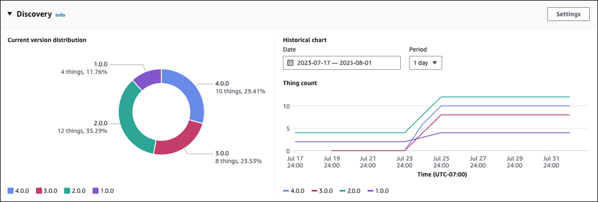

# Preparing fleet indexing

With AWS IoT fleet indexing, you can search and aggregate data by using the reserved named shadow (`$package`). You can also group AWS IoT things by querying the [Reserved named shadow](preparing-to-use-software-package-catalog.md#reserved-named-shadow "preparing-to-use-software-package-catalog.md#reserved-named-shadow") and [dynamic thing groups](dynamic-thing-groups.md "dynamic-thing-groups.md"). For example, you can find information about which AWS IoT things use a specific package version, don't have a specific package version installed, or don’t have any package version installed. You can gain further insight by combining attributes. For example, identifying things that have a specific version and are of a specific thing type (such as version 1.0.0 and thing type of pump_sensor). For more information, see [Fleet indexing](iot-indexing.md "iot-indexing.md").

## Setting the `$package` shadow as a data source

To use fleet indexing with Software Package Catalog, you must enable fleet indexing, set the named shadow as the data source,
and define `$package` as the named shadow filter. If you haven’t enabled fleet indexing, you can enable
it within this process. From [AWS IoT Core](https://console.aws.amazon.com/iot/home "https://console.aws.amazon.com/iot/home")
in the console, open **Settings**,
choose **Manage indexing**, then **Add named shadows**,
**Add device software packages and versions**, and
**Update**. For more information, see
[Manage thing indexing](managing-fleet-index.md#thing-index "managing-fleet-index.md#thing-index").

Alternately, you can enable fleet indexing when you create your first package. When the **Enable dependencies for package management** dialog box appears, choose the option to add device software packages and versions as data sources to fleet indexing. By selecting this option, you also enable fleet indexing.

###### Note

Enabling fleet indexing for Software Package Catalog incurs standard service costs.
For more information, see [AWS IoT Device Management, Pricing](https://aws.amazon.com/iot-device-management/pricing/ "https://aws.amazon.com/iot-device-management/pricing/").

## Metrics displayed in the console



On the AWS IoT console software package details page, the **Discovery** panel displays standard metrics ingested through the `$package` shadow.

- The **Current version distribution** chart shows the number of devices and percentage for the 10 most recent package versions that are associated to an AWS IoT thing from all the devices associated to this software package. **Note:** If the software package has more package versions than those labeled in the chart, you can find them grouped within **Other**.
- The **Historical chart** shows the number of
  devices associated with selected package versions over a specified time
  period. The chart is initially empty until you select up to 5 package versions and define the date range and time interval. To select the chart’s parameters, choose **Settings**. The data displayed in the **Historical chart** might be different than the **Current version distribution** chart because of the difference in number of package versions that they display and also because you can choose which package versions to analyze in the **Historical chart**. **Note:** When you select a package version to visualize, it counts toward the maximum number of fleet metrics limits. For more information, see [Fleet indexing limits and quotas](../../../general/latest/gr/iot_device_management.md#fleet-indexing-limits "../../../general/latest/gr/iot_device_management.md#fleet-indexing-limits").

For another method to gain insight into collecting package version distribution, see [Collecting package version distribution through `getBucketsAggregation`](preparing-fleet-indexing.md#package-version-distribution "preparing-fleet-indexing.md#package-version-distribution").

## Query patterns

Fleet indexing with Software Package Catalog uses most standard supported features (such as terms, phrases, and search fields). However,
comparison operators (for example, less than `<` and greater than `>`) and `range` queries are not available for the reserved named
shadow (`$package`) `version` key. These queries are available for the `attributes` key. For more information, see
[Query syntax](query-syntax.md "query-syntax.md").

### Example data

**Note:** for information about the reserved named shadow and its structure, see [Reserved named shadow](preparing-to-use-software-package-catalog.md#reserved-named-shadow "preparing-to-use-software-package-catalog.md#reserved-named-shadow").

In this example, a first device is named `AnyThing` and has the following packages installed:

- Software package: `SamplePackage`

Package version: `1.0.0`

Package ID: `1111`

The shadow looks as follows:

```
{
    "state": {
        "reported": {
            "SamplePackage": {
                "version": "1.0.0",
                "attributes": {
                    "s3UrlForSamplePackage": "https://EXAMPIEBUCKET.s3.us-west-2.amazonaws.com/exampleCodeFile1",
                    "packageID": "1111"
                    }
            }
        }
    }
}
```

A second device is named `AnotherThing` and has the following package installed:

- Software package: `SamplePackage`

Package version: `1.0.0`

Package ID: `1111`

- Software package: `OtherPackage`

Package version: `1.2.5`

Package ID: `2222`

The shadow looks as follows:

```
{
    "state": {
        "reported": {
            "SamplePackage": {
                "version": "1.0.0",
                "attributes": {
                    "s3UrlForSamplePackage": "https://EXAMPIEBUCKET.s3.us-west-2.amazonaws.com/exampleCodeFile1",
                    "packageID": "1111"
                }
            },
            "OtherPackage": {
                "version": "1.2.5",
                "attributes": {
                    "s3UrlForOtherPackage": "https://EXAMPIEBUCKET.s3.us-west-2.amazonaws.com/exampleCodeFile2",
                    "packageID": "2222"
                    }
            },
        }
    }
}
```

### Sample queries

The following table lists sample queries based on the example device shadows for `AnyThing` and `AnotherThing`.
For more information, see [Example thing queries](example-queries.md "example-queries.md").

| Latest version of AWS IoT Device Tester for FreeRTOS                                   | **Requested information**                                                                                  | **Query**                | **Result** |
| -------------------------------------------------------------------------------------- | ---------------------------------------------------------------------------------------------------------- | ------------------------ | ---------- |
| Things that have a specific package version installed                                  | `shadow.name.$package.reported.SamplePackage.version:1.0.0`                                                | `AnyThing`, `OtherThing` |
| Things that don't have a specific package version installed                            | `NOT shadow.name.$package.reported.OtherPackage.version:1.2.5`                                             | `AnyThing`               |
| Any device using a package version whose package ID is greater than 1500               | `shadow.name.$package.reported.*.attributes.packageID>1500"`                                               | `OtherThing`             |
| Things that have a specific package installed and have more than one package installed | `shadow.name.$package.reported.SamplePackage.version:1.0.0 AND shadow.name.$package.reported.totalCount:2` | `OtherThing`             |

## Collecting package version distribution through `getBucketsAggregation`

In addition to the **Discovery** panel within the AWS IoT console, you can also get package version distribution information by using the [`GetBucketsAggregation`](../apireference/API_GetBucketsAggregation.md "../apireference/API_GetBucketsAggregation.md") API operation. To get the package version distribution information, you must do the following:

- Define a custom field within fleet indexing for each software package. **Note:** Creating custom fields count toward [AWS IoT fleet indexing service quotas](../../../general/latest/gr/iot_device_management.md#fleet-indexing-limits "../../../general/latest/gr/iot_device_management.md#fleet-indexing-limits").
- Format the custom field as follows:

`shadow.name.$package.reported.`<packageName>`.version`

For more information, see the [Custom fields](managing-fleet-index.md#custom-field "managing-fleet-index.md#custom-field") section in AWS IoT fleet indexing.
