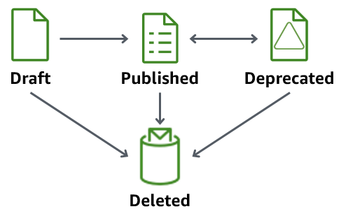
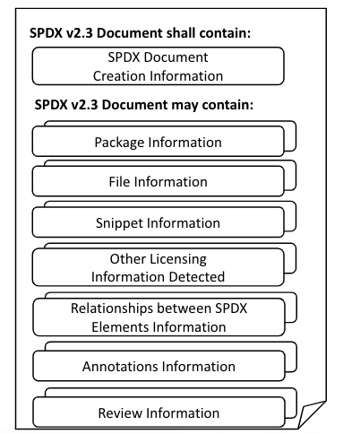

# Preparing to use Software Package Catalog

The following section provides an overview of the package version lifecycle and
information for using AWS IoT Device Management Software Package Catalog.

## Package version lifecycle

A package version can evolve through the following lifecycle states: `draft`,
`published`, and `deprecated`. It can also be `deleted`.



- **Draft**

When you create a package version, it’s in a `draft` state. This state indicates that the software package is being prepared or is incomplete.

While the package version in this state, you can’t deploy it. You can edit the package version’s description, attributes, and tags.

You can transition a package version that’s in the `draft` state to `published` or be `deleted` by using the console, or by issuing either the [UpdatePackageVersion](../apireference/API_UpdatePackageVersion.md "../apireference/API_UpdatePackageVersion.md") or [DeletePackageVersion](../apireference/API_DeletePackageVersion.md "../apireference/API_DeletePackageVersion.md") API operations.

- **Published**

When your package version is ready to deploy, transition the package version to a `published` state. While in this state, you can choose to identify the package version as the default version by editing the software package in the console or through the [UpdatePackage](../apireference/API_UpdatePackage.md "../apireference/API_UpdatePackage.md") API operation. In this state, you can edit only the description and tags.

You can transition a package version that’s in the `published` state to
`deprecated` or be `deleted` by using the console, or issuing either the [UpdatePackageVersion](../apireference/API_UpdatePackageVersion.md "../apireference/API_UpdatePackageVersion.md") or [DeletePackageVersion](../apireference/API_DeletePackageVersion.md "../apireference/API_DeletePackageVersion.md") API operations.

- **Deprecated**

If a new package version is available, you can transition earlier package versions to `deprecated`. You can still deploy jobs with a deprecated package version. You can also name a deprecated package version as the default version, and edit only the description and tags.

Consider transitioning a package version to `deprecated` when the version is outdated, but you still have devices in the field using the older version or needs to maintain it due to run-time dependency.

You can transition a package version that’s in the `deprecated` state to
`published` or be `deleted` by using the console, or issuing either the
[UpdatePackageVersion](../apireference/API_UpdatePackageVersion.md "../apireference/API_UpdatePackageVersion.md") or [DeletePackageVersion](../apireference/API_DeletePackageVersion.md "../apireference/API_DeletePackageVersion.md") API operattions.

- **Deleted**

When you no longer intend to use a package version, you can delete it by using the console or issuing the
[DeletePackageVersion](../apireference/API_DeletePackageVersion.md "../apireference/API_DeletePackageVersion.md") API operation.

###### Note

If you delete a package version while there are pending jobs that reference it, you will receive an error message when the job successfully completes and attempts to update the reserved named shadow.

If the software package version you want to delete is named as the default package version, you must first update the package to name another version as default or leave the field unnamed. You can do this by using the console or the [UpdatePackageVersion](../apireference/API_UpdatePackageVersion.md "../apireference/API_UpdatePackageVersion.md") API operation. (To remove any named package version as default, set the [unsetDefaultVersion](../apireference/API_UpdatePackage.md#iot-UpdatePackage-request-unsetDefaultVersion "../apireference/API_UpdatePackage.md#iot-UpdatePackage-request-unsetDefaultVersion") parameter to true when you issue the [UpdatePackage](../apireference/API_UpdatePackage.md "../apireference/API_UpdatePackage.md") API operation).

If you delete a software package through the console, it deletes all of the package versions associated with that package, unless one is named as the default version.

## Package version naming conventions

When you name package versions, it's important to plan and apply a logical naming strategy so that you and others can easily identify the latest package version and the version progression. You must provide a version name when creating the package version, but the strategy and format is largely up to your business case.

As a best practice, we recommend using the Semantic Versioning [SemVer](https://semver.org/ "https://semver.org/") format. For example, `1.2.3` where `1` is the major version for functionally incompatible changes, `2` the major version for functionally compatible changes, and `3` is the patch version (for bug fixes). For more information, see [Semantic Versioning 2.0.0](https://semver.org/ "https://semver.org/"). For more information about the package version name requirements, see [versionName](../apireference/API_CreatePackageVersion.md#API_CreatePackageVersion_RequestSyntax "../apireference/API_CreatePackageVersion.md#API_CreatePackageVersion_RequestSyntax") in the AWS IoT API reference guide.

## Default version

Setting a version as default is optional. You can add or remove default package versions. You can also deploy a package version that is not named as the default version.

When you create a package version, it’s placed in a `draft` state and can’t be named as the default version until you transition the package version to published. Software Package Catalog doesn’t automatically select a version as default or update a newer package version as the default. You must intentionally name the package version you choose through the console or by issuing the [UpdatePackageVersion](../apireference/API_UpdatePackageVersion.md "../apireference/API_UpdatePackageVersion.md") API operation.

## Version attributes

Version attributes and their values hold important information about your package versions. We recommend that you define general purpose attributes for a package or package version. For example, you might create a name-value pair for platform, architecture, operating system, release date, author, or Amazon S3 URL.

When you create an AWS IoT job with a job document, you can also choose to use a substitution variable (`$parameter`) that refers to an attribute’s value. For more information, see [Preparing AWS IoT Jobs](preparing-jobs-for-service-package-catalog.md "preparing-jobs-for-service-package-catalog.md").

Version attributes that are used in package versions will not be automatically added to the reserved named shadow and can’t be indexed or queried through Fleet Indexing directly. To index or query package version attributes through Fleet Indexing, you can populate the version attribute in the reserved named shadow.

We recommend that the version attribute parameter in the reserved named shadow capture device-reported properties , such as operation system and installation time. They can also be indexed and queried through Fleet Indexing.

Version attributes aren't required to follow a specific naming convention. You can create name-value pairs to meet your business needs. The combined size of all the attributes on a package version is limited to 3KB. For more information, see [Software Package Catalog software package and package versions limits](../../../general/latest/gr/iot_device_management.md#software_package_catalog_limits "../../../general/latest/gr/iot_device_management.md#software_package_catalog_limits").

**Using all attributes in a job document**

You can have all package version attributes automatically added to your job
deployment for selected devices. To automatically use all package version attributes
programmatically in an API or CLI command, refer to the following job document
example:

```
"`TestPackage`": "${aws:iot:package:`TestPackage`:version:`PackageVersion`:attributes}"
```

## Software Bill of Materials

The software bill of materials (SBOM) provides a central repository for all
aspects of your software package. In addition to storing software packages and
package versions, you can store the software bill of materials (SBOM) associated
with each package version in AWS IoT Device Management Software Package Catalog. A software package contains one or more
package versions and each package version consists of one or more components. Each
of those components supporting the composition of a specific package version can be
described and cataloged using a software bill of materials. The industry standards
for software bill of materials supported are SPDX and CycloneDX. When a SBOM is
first created, it undergoes validation against the SPDX and CycloneDX industry
standard format. For more information on SPDX, see [System Package Data Exchange](https://spdx.dev/ "https://spdx.dev/"). For more information on CycloneDX, see
[CycloneDX](https://cyclonedx.org/ "https://cyclonedx.org/").

The software bill of materials describes all aspects of a specific package
version's components such as package information, file information, and other
pertinent metadata. See the below example of a software bill of materials document
structure in the SPDX format:



### Software Bill of Materials Benefits

One of the key benefits for adding your software bill of materials for a
package version in Software Package Catalog is vulnerability management.

**Vulnerability management**

Assessing and mitigating your vulnerability to apparent security risks in
software components remains critical to protecting the integrity of your device
fleet. With the addition of the software bill of materials stored in Software Package Catalog
for each package version, you can proactively expose gaps in security by knowing
what devices are at risk based on their package version and SBOM using your own
in-house vulnerability management solution. You can deploy fixes to those
affected devices and protect your fleet of devices.

### Software Bill of Materials Storage

The software bill of materials (SBOM) for each software package version are
stored in an Amazon S3 bucket using the Amazon S3 versioning feature. The Amazon S3 bucket
storing the SBOM must be located in the same region where the package version
was created. An Amazon S3 bucket using the versioning feature maintains multiple
variants of an object in the same bucket. For more information on using
versioning in an Amazon S3 bucket, see [Using
versioning in Amazon S3 buckets](../../../AmazonS3/latest/userguide/Versioning.md "../../../AmazonS3/latest/userguide/Versioning.md").

###### Note

Each software package version can have multiple SBOM files attached to it,
but the SBOM files must be stored in a single zip archive file.

The specific Amazon S3 key and version ID for your bucket are used to uniquely
identify each version of a software bill of materials for a package
version.

###### Note

For a package version with a single SBOM file, you can store that SBOM
file in your Amazon S3 bucket as a zip archive file.

For a package version with multiple SBOM files, you must place all SBOM
files in a single zip archive file and then store that zip archive file in
your Amazon S3 bucket.

All SBOM files stored in the single zip archive file in both scenarios are
formatted as either SPDX or CycloneDX .json files.

**Permissions Policy**

In order for AWS IoT acting as the specified principal to access the SBOM zip
archive files stored in the Amazon S3 bucket, you need a resource-based permissions
policy. Refer to the following example for the correct resource-based
permissions policy:

JSON

```
`{
 "Version":"2012-10-17",
 "Statement": [
 {
 "Effect": "Allow",
 "Principal": {
 "Service": [
 "iot.amazonaws.com"
 ]
 },
 "Action": "s3:*",
 "Resource": "arn:aws:s3:::bucketName/*"
 }
 ]
}`

```

For more information on resource-based permission policies, see [AWS IoT
resource-based policies](security_iam_service-with-iam.md#security_iam_service-with-iam-resource-based-policies "security_iam_service-with-iam.md#security_iam_service-with-iam-resource-based-policies")

**Updating the SBOM**

You can update the software bill of materials as often as needed to protect
and enhance your device fleet. Each time the software bill of materials is
updated in your Amazon S3 bucket, the version ID changes and you must associate the
new Amazon S3 bucket URL with the appropriate software package version. You will see
the new version ID in the **Amazon S3 Object version ID** column on
the package version page in the AWS Management Console. Additionally, you can use the API
operation `GetPackageVersion` or the CLI command
`get-package-version` to view the new
version ID.

###### Note

Updating your software bill of materials, which will cause a new version
ID, will not cause a new package version to be created.

For more information on Amazon S3 object keys, see [Creating object key names](../../../AmazonS3/latest/userguide/object-keys.md "../../../AmazonS3/latest/userguide/object-keys.md").

## Enabling AWS IoT fleet indexing

Enabling AWS IoT fleet indexing is a requirement to use AWS IoT Device Management Software Package Catalog. To leverage
AWS IoT fleet indexing with Software Package Catalog, set the reserved named shadow
(`$package`) as the data source for each device you want to index on
and gather metrics. For more information on reserved named shadows, see [Reserved named shadow](#reserved-named-shadow "#reserved-named-shadow").

Fleet indexing provides support that enables AWS IoT things to be grouped through
dynamic thing groups that are filtered by software package version. For example,
fleet indexing can identify things that have or don’t have a specific package
version installed, don’t have any package versions installed, or match specific
name-value pairs. Finally, fleet indexing provides standard and custom metrics that
you can use to gain insight about the state of your device fleet. For more
information, see [Preparing fleet indexing](preparing-fleet-indexing.md "preparing-fleet-indexing.md").

###### Note

Enabling fleet indexing for Software Package Catalog incurs standard service costs. For more information, see
[AWS IoT Device Management, Pricing](https://aws.amazon.com/iot-device-management/pricing/ "https://aws.amazon.com/iot-device-management/pricing/").

## Reserved named shadow

The reserved named shadow, `$package`, reflects the state of the device's installed software packages and package versions. Fleet indexing uses the reserved named shadow as a data source to build standard and custom metrics so you can query the state of your fleet. For more information, see [Preparing fleet indexing](preparing-fleet-indexing.md "preparing-fleet-indexing.md").

A reserved named shadow is similar to a [named shadow](iot-device-shadows.md "iot-device-shadows.md") with the exception that its name is predefined and you can’t change it. In addition, the reserved named shadow doesn’t update with metadata, and uses only the `version` and `attributes` keywords.

Update requests that include other keywords, such as `description`, will receive an error response under the `rejected` topic. For more information, see [Device Shadow error messages](device-shadow-error-messages.md "device-shadow-error-messages.md").

It can be created when you create an AWS IoT thing through the console, when an AWS IoT job successfully completes and updates the shadow, and if you issue the [`UpdateThingShadow`](../apireference/API_iotdata_UpdateThingShadow.md "../apireference/API_iotdata_UpdateThingShadow.md") API operation. For more information, see [UpdateThingShadow](device-shadow-rest-api.md#API_UpdateThingShadow "device-shadow-rest-api.md#API_UpdateThingShadow") in the AWS IoT Core developer guide.

###### Note

Indexing the reserved named shadow doesn’t count toward the number of named shadows that fleet indexing can index. For more information, see [AWS IoT Device Management fleet indexing limits and quotas](../../../general/latest/gr/iot_device_management.md#fleet-indexing-limits "../../../general/latest/gr/iot_device_management.md#fleet-indexing-limits"). In addition, if you choose to have AWS IoT jobs update the reserved named shadow when a job successfully completes, the API call is counted toward your Device Shadow and registry operations and can incur a cost. For more information, see [AWS IoT Device Management jobs limits and quotas](../../../general/latest/gr/iot_device_management.md#job-limits "../../../general/latest/gr/iot_device_management.md#job-limits") and the [IndexingFilter](../apireference/API_IndexingFilter.md "../apireference/API_IndexingFilter.md") API data type.

**Structure of the `$package` shadow**

The reserved named shadow contains the following:

```
{
    "state": {
        "reported": {
            "`<packageName>`": {
                "version": "",
                "attributes": {
                }
            }
        }
    },
    "version" : `1`
    "timestamp" : `1672531201`
}
```

The shadow properties are updated with the following information:

- `<packageName>`: The name of the installed software package, which is updated with the [packageName](../apireference/API_CreatePackage.md#API_CreatePackage_RequestSyntax "../apireference/API_CreatePackage.md#API_CreatePackage_RequestSyntax")
  parameter.
- `version`:
  The name of the installed package version, which is updated with the
  [versionName](../apireference/API_CreatePackageVersion.md#API_CreatePackageVersion_RequestSyntax "../apireference/API_CreatePackageVersion.md#API_CreatePackageVersion_RequestSyntax") parameter.
- `attributes`: Optional metadata stored by the device and indexed
  by Fleet indexing. This allows customers to query their indexes based on the
  data stored.
- `version`: The shadow's version number. It's automatically incremented each time the shadow is updated and begins at `1`.
- `timestamp`: Indicates when the shadow was last updated and is recorded in [Unix time](https://en.wikipedia.org/wiki/Unix_time "https://en.wikipedia.org/wiki/Unix_time").

For more information about the format and behavior of a named shadow, see
[AWS IoT Device Shadow service Message order](iot-device-shadows.md#message-ordering "iot-device-shadows.md#message-ordering").

## Deleting a software package and its package versions

Before you delete a software package, do the following:

- Confirm that the package and its
  versions aren’t actively being deployed.
- Delete all the associated versions first. If one of the versions is designated as the **default version**, you must remove the named default version from the package. Because designating a default version is optional, there is no conflict removing it. To remove the default version from the software package, edit the package through the console or use the [UpdatePackageVersion](../apireference/API_UpdatePackageVersion.md "../apireference/API_UpdatePackageVersion.md") API operation.

As long as there is no named default package version, you can use the console
to delete a software package and all of its package versions will also be deleted.
If you use an API call to delete software packages, you must delete the
package versions first and then the software package.
