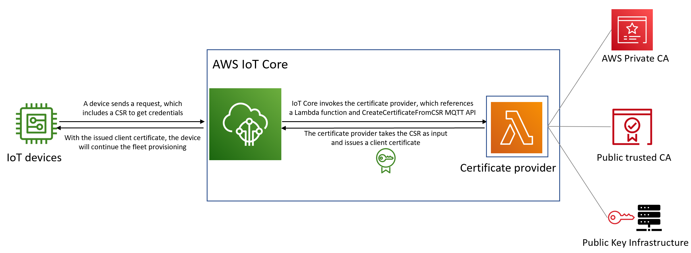

# Self-managed certificate signing using

AWS IoT Core certificate provider

You can create an AWS IoT Core certificate provider to sign certificate signing requests
(CSRs) in AWS IoT fleet provisioning. A certificate provider references a Lambda function
and the [`CreateCertificateFromCsr` MQTT API for fleet provisioning](fleet-provision-api.md#create-cert-csr "fleet-provision-api.md#create-cert-csr").
The Lambda function accepts a CSR and returns a signed client certificate.

When you don't have a certificate provider with your AWS account, the [CreateCertificateFromCsr MQTT API](fleet-provision-api.md#create-cert-csr "fleet-provision-api.md#create-cert-csr") is called in fleet provisioning to
generate the certificate from a CSR. After you create a certificate provider, the
behavior of the [CreateCertificateFromCsr MQTT API](fleet-provision-api.md#create-cert-csr "fleet-provision-api.md#create-cert-csr") will change and all calls to this MQTT
API will invoke the certificate provider to issue the certificate.

With AWS IoT Core certificate provider, you can implement solutions that utilize private
certificate authorities (CAs) such as [AWS Private CA](../../../privateca/latest/userguide/PcaWelcome.md "../../../privateca/latest/userguide/PcaWelcome.md"), other publicly trusted CAs, or your own Public Key Infrastructure
(PKI) to sign the CSR. In addition, you can use certificate provider to customize your
client certificate's fields such as validity periods, signing algorithms, issuers, and
extensions.

###### Important

You can only create one certificate provider per AWS account. The signing
behavior change applies to the entire fleet that calls the [CreateCertificateFromCsr MQTT API](fleet-provision-api.md#create-cert-csr "fleet-provision-api.md#create-cert-csr") until you delete the certificate
provider from your AWS account.

###### In this topic:

- [How self-managed
  certificate signing works in fleet provisioning](#provisioning-cert-provider-how-it-works "#provisioning-cert-provider-how-it-works")
- [Certificate provider Lambda
  function input](#provisioning-cert-provider-lambda-input "#provisioning-cert-provider-lambda-input")
- [Certificate provider
  Lambda function return value](#provisioning-cert-provider-lambda-return "#provisioning-cert-provider-lambda-return")
- [Example Lambda function](#provisioning-cert-provider-lambda "#provisioning-cert-provider-lambda")
- [Self-managed certificate
  signing for fleet provisioning](#provisioning-self-certificate-signing "#provisioning-self-certificate-signing")
- [AWS CLI commands for certificate
  provider](#provisioning-cert-provider-cli "#provisioning-cert-provider-cli")

## How self-managed

certificate signing works in fleet provisioning

### Key concepts

The following concepts provide details that can help you understand how
self-managed certificate signing works in AWS IoT fleet provisioning. For more
information, see [Provisioning devices
that don't have device certificates using fleet provisioning](provision-wo-cert.md "provision-wo-cert.md").

**AWS IoT fleet provisioning**

With AWS IoT fleet provisioning (short for fleet provisioning),
AWS IoT Core generates and securely delivers device certificates to
your devices when they connect to AWS IoT Core for the first time. You
can use fleet provisioning to connect devices that don't have device
certificates to AWS IoT Core.

**Certificate signing request
(CSR)**

In the process of fleet provisioning, a device makes a request to
AWS IoT Core through the [fleet
provisioning MQTT APIs](fleet-provision-api.md "fleet-provision-api.md"). This request includes a
certificate signing request (CSR), which will be signed to create a
client certificate.

**AWS managed certificate signing in fleet
provisioning**

AWS managed is the default setting for certificate signing in
fleet provisioning. With AWS managed certificate signing,
AWS IoT Core will sign CSRs using its own CAs.

**Self-managed certificate signing in fleet
provisioning**

Self-managed is another option for certificate signing in fleet
provisioning. With self-managed certificate signing, you create an
AWS IoT Core certificate provider to sign CSRs. You can use
self-managed certificate signing to sign CSRs with a CA generated by
AWS Private CA, other publicly trusted CA, or your own Public Key
Infrastructure (PKI).

**AWS IoT Core certificate provider**

AWS IoT Core certificate provider (short for certificate provider) is
a customer-managed resource that's used for self-managed certificate
signing in fleet provisioning.

### Diagram

The following diagram is a simplified illustration of how self-certificate
signing works in AWS IoT fleet provisioning.



- When a new IoT device is manufactured or introduced to the fleet, it
  needs client certificates to authenticate itself with AWS IoT Core.
- As part of the fleet provisioning process, the device makes a request
  to AWS IoT Core for client certificates through the [fleet
  provisioning MQTT APIs](fleet-provision-api.md "fleet-provision-api.md"). This request includes a certificate
  signing request (CSR).
- AWS IoT Core invokes the certificate provider and passes the CSR as input
  to the provider.
- The certificate provider takes the CSR as input and issues a client
  certificate.

For AWS managed certificate signing, AWS IoT Core signs the CSR using
its own CA and issues a client certificate.

- With the issued client certificate, the device will continue the fleet
  provisioning and establish a secure connection with AWS IoT Core.

## Certificate provider Lambda

function input

AWS IoT Core sends the following object to the Lambda function when a device registers
with it. The value of `certificateSigningRequest` is the CSR in [Privacy-Enhanced Mail (PEM) format](../../../acm/latest/userguide/import-certificate-format.md "../../../acm/latest/userguide/import-certificate-format.md") that's provided in the
`CreateCertificateFromCsr` request. The `principalId` is
the ID of the principal used to connect to AWS IoT Core when making the
`CreateCertificateFromCsr` request. `clientId` is the
client ID set for the MQTT connection.

```
{
	"certificateSigningRequest": "string",
	"principalId": "string",
	"clientId": "string"
}
```

## Certificate provider

Lambda function return value

The Lambda function must return a response that contains the
`certificatePem` value. The following is an example of a successful
response. AWS IoT Core will use the return value (`certificatePem`) to
create the certificate.

```
{
	"certificatePem": "string"
}
```

If the registration is successful, `CreateCertificateFromCsr` will
return the same `certificatePem` in the
`CreateCertificateFromCsr` response. For more information, see the
response payload example of [CreateCertificateFromCsr](fleet-provision-api.md#create-cert-csr "fleet-provision-api.md#create-cert-csr").

## Example Lambda function

Before creating a certificate provider, you must create a Lambda function to sign a
CSR. The following is an example Lambda function in Python. This function calls AWS Private CA
to sign the input CSR, using a private CA and the `SHA256WITHRSA` signing
algorithm. The returned client certificate will be valid for one year. For more
information about AWS Private CA and how to create a private CA, see [What is AWS Private CA?](../../../privateca/latest/userguide/PcaWelcome.md "../../../privateca/latest/userguide/PcaWelcome.md") and [Creating a private CA](../../../privateca/latest/userguide/create-CA.md "../../../privateca/latest/userguide/create-CA.md").

```
import os
import time
import uuid
import boto3

def lambda_handler(event, context):
    ca_arn = os.environ['CA_ARN']
    csr = (event['certificateSigningRequest']).encode('utf-8')

    acmpca = boto3.client('acm-pca')
    cert_arn = acmpca.issue_certificate(
        CertificateAuthorityArn=ca_arn,
        Csr=csr,
        Validity={"Type": "DAYS", "Value": 365},
        SigningAlgorithm='SHA256WITHRSA',
        IdempotencyToken=str(uuid.uuid4())
    )['CertificateArn']

    # Wait for certificate to be issued
    time.sleep(1)
    cert_pem = acmpca.get_certificate(
        CertificateAuthorityArn=ca_arn,
        CertificateArn=cert_arn
    )['Certificate']

    return {
        'certificatePem': cert_pem
    }
```

###### Important

- Certificates returned by the Lambda function must have the same subject
  name and public key as the Certificate Signing Request (CSR).
- The Lambda function must finish running in 5 seconds.
- The Lambda function must be in the same AWS account and Region as the
  certificate provider resource.
- The AWS IoT service principal must be granted the invoke permission to
  the Lambda function. To avoid [confused deputy
  issues](../../../IAM/latest/UserGuide/confused-deputy.md "../../../IAM/latest/UserGuide/confused-deputy.md"), we recommend that you set `sourceArn` and
  `sourceAccount` for the invoke permissions. For more
  information, see [Cross-service confused deputy prevention](cross-service-confused-deputy-prevention.md "cross-service-confused-deputy-prevention.md").

The following resource-based policy example for [Lambda](../../../lambda/latest/dg/access-control-resource-based.md "../../../lambda/latest/dg/access-control-resource-based.md") grants
AWS IoT the permission to invoke the Lambda function:

```
`{
 "Version":"2012-10-17",
 "Id": "InvokePermission",
 "Statement": [
 {
 "Sid": "LambdaAllowIotProvider",
 "Effect": "Allow",
 "Principal": {
 "Service": "iot.amazonaws.com"
 },
 "Action": "lambda:InvokeFunction",
 "Resource": "arn:aws:lambda:us-east-1:123456789012:function:my-function",
 "Condition": {
 "StringEquals": {
 "AWS:SourceAccount": "123456789012"
 },
 "ArnLike": {
 "AWS:SourceArn": "arn:aws:iot:`us-east-1`:`123456789012`:certificateprovider/my-certificate-provider"
 }
 }
 }
 ]
}`

```

## Self-managed certificate

signing for fleet provisioning

You can choose self-managed certificate signing for fleet provisioning using AWS CLI
or AWS Management Console.

To choose self-managed certificate signing, you must create an AWS IoT Core
certificate provider to sign CSRs in fleet provisioning. AWS IoT Core invokes
the certificate provider, which takes a CSR as input and returns a client
certificate. To create a certificate provider, use the
`CreateCertificateProvider` API operation or the
`create-certificate-provider` CLI command.

###### Note

After you create a certificate provider, the behavior of [`CreateCertificateFromCsr` API for fleet
provisioning](fleet-provision-api.md#create-cert-csr "fleet-provision-api.md#create-cert-csr") will change so that all calls to
`CreateCertificateFromCsr` will invoke the certificate
provider to create the certificates. It can take a few minutes for this
behavior to change after a certificate provider is created.

```
`aws iot create-certificate-provider \
 --certificateProviderName `my-certificate-provider` \
 --lambdaFunctionArn `arn:aws:lambda:us-east-1:123456789012:function:my-function-1` \
 --accountDefaultForOperations CreateCertificateFromCsr`
```

The following shows an example output for this command:

```
{
	"certificateProviderName": "my-certificate-provider",
	"certificateProviderArn": "arn:aws:iot:us-east-1:123456789012:certificateprovider:my-certificate-provider"
}
```

For more information, see `CreateCertificateProvider` from the _AWS IoT_
_API Reference_.

To choose self-managed certificate signing using AWS Management Console, follow the
steps:

1. Go to the [AWS IoT
   console](https://console.aws.amazon.com//iot/home "https://console.aws.amazon.com//iot/home").
2. On the left navigation, under **Security**,
   choose **Certificate signing**.
3. On the **Certificate signing** page, under
   **Certificate signing details**, choose
   **Edit certificate signing method**.
4. On the **Edit certificate signing method** page,
   under **Certificate signing method**, choose
   **Self-managed**.
5. In the **Self-managed settings** section, enter a
   name for certificate provider, then create or choose a Lambda
   function.
6. Choose **Update certificate signing**.

## AWS CLI commands for certificate

provider

### Create certificate

provider

To create a certificate provider, use the
`CreateCertificateProvider` API operation or the
`create-certificate-provider` CLI command.

###### Note

After you create a certificate provider, the behavior of [`CreateCertificateFromCsr` API for fleet
provisioning](fleet-provision-api.md#create-cert-csr "fleet-provision-api.md#create-cert-csr") will change so that all calls to
`CreateCertificateFromCsr` will invoke the certificate
provider to create the certificates. It can take a few minutes for this
behavior to change after a certificate provider is created.

```
`aws iot create-certificate-provider \
 --certificateProviderName `my-certificate-provider` \
 --lambdaFunctionArn `arn:aws:lambda:us-east-1:123456789012:function:my-function-1` \
 --accountDefaultForOperations CreateCertificateFromCsr`
```

The following shows an example output for this command:

```
{
	"certificateProviderName": "my-certificate-provider",
	"certificateProviderArn": "arn:aws:iot:us-east-1:123456789012:certificateprovider:my-certificate-provider"
}
```

For more information, see `CreateCertificateProvider` from the _AWS IoT_
_API Reference_.

### Update certificate

provider

To update a certificate provider, use the
`UpdateCertificateProvider` API operation or the
`update-certificate-provider` CLI command.

```
`aws iot update-certificate-provider \
 --certificateProviderName `my-certificate-provider` \
 --lambdaFunctionArn `arn:aws:lambda:us-east-1:123456789012:function:my-function-2` \
 --accountDefaultForOperations CreateCertificateFromCsr`
```

The following shows an example output for this command:

```
{
	"certificateProviderName": "my-certificate-provider",
	"certificateProviderArn": "arn:aws:iot:us-east-1:123456789012:certificateprovider:my-certificate-provider"
}
```

For more information, see `UpdateCertificateProvider` from the _AWS IoT_ _API
Reference_.

### Describe certificate

provider

To describe a certificate provider, use the
`DescribeCertificateProvider` API operation or the
`describe-certificate-provider` CLI command.

```
`aws iot describe-certificate-provider --certificateProviderName `my-certificate-provider``
```

The following shows an example output for this command:

```
{
	"certificateProviderName": "my-certificate-provider",
	"lambdaFunctionArn": "arn:aws:lambda:us-east-1:123456789012:function:my-function",
	"accountDefaultForOperations": [
		"CreateCertificateFromCsr"
	],
	"creationDate": "2022-11-03T00:15",
	"lastModifiedDate": "2022-11-18T00:15"
}
```

For more information, see `DescribeCertificateProvider` from the _AWS IoT_
_API Reference_.

### Delete certificate

provider

To delete a certificate provider, use the
`DeleteCertificateProvider` API operation or the
`delete-certificate-provider` CLI command. If you delete the
certificate provider resource, the behavior of
`CreateCertificateFromCsr` will resume, and AWS IoT will create
certificates signed by AWS IoT from a CSR.

```
`aws iot delete-certificate-provider --certificateProviderName `my-certificate-provider``
```

This command doesn't produce any output.

For more information, see `DeleteCertificateProvider` from the _AWS IoT_
_API Reference_.

### List certificate

provider

To list the certificate providers within your AWS account, use the
`ListCertificateProviders` API operation or the
`list-certificate-providers` CLI command.

```
`aws iot list-certificate-providers`
```

The following shows an example output for this command:

```
{
	"certificateProviders": [
		{
			"certificateProviderName": "my-certificate-provider",
			"certificateProviderArn": "arn:aws:iot:us-east-1:123456789012:certificateprovider:my-certificate-provider"
		}
	]
}
```

For more information, see [`ListCertificateProvider`](../apireference/API_ListCertificateProviders.md "../apireference/API_ListCertificateProviders.md") from the _AWS IoT_
_API Reference_.
