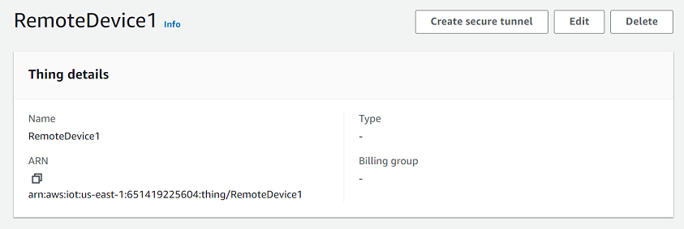

# Open a tunnel for remote device and

use browser-based SSH

From the AWS IoT console, you can create a tunnel either from the **Tunnels
hub** or from the details page of an IoT thing that you created. When you
create a tunnel from the **Tunnels** hub, you can specify whether to
create a tunnel using the quick setup or the manual setup. For an example tutorial, see
[Open a tunnel and start
SSH session to remote device](secure-tunneling-tutorial-open-tunnel.md "secure-tunneling-tutorial-open-tunnel.md").

When you create a tunnel from the thing details page of the AWS IoT console, you can
also specify whether to create a new tunnel or open an existing tunnel for that thing as
illustrated in this tutorial. If you choose an existing tunnel, you can access the most
recent, open tunnel that you created for this device. You can then use the command line
interface within the terminal to SSH into the device.

## Prerequisites

- The firewalls that the remote device is behind must allow outbound traffic
  on port 443. The tunnel that you create will use this port to connect to the
  remote device.
- You have created an IoT thing (for example, `RemoteDevice1`) in
  the AWS IoT registry. This thing corresponds to the representation of your
  remote device in the cloud. For more information, see [Register a device in the AWS IoT
  registry](register-device.md "register-device.md").
- You have an IoT device agent (see [IoT agent snippet](configure-remote-device.md#agent-snippet "configure-remote-device.md#agent-snippet"))
  running on the remote device that connects to the AWS IoT device gateway and is
  configured with an MQTT topic subscription. For more information, see [connect a device to the AWS IoT device gateway](sdk-tutorials.md "sdk-tutorials.md").
- You must have an SSH daemon running on the remote device.

## Open a new tunnel for the

remote device

Say you want to open a tunnel into your remote device, `RemoteDevice1`.
First, create an IoT thing with the name `RemoteDevice1` in the AWS IoT
registry. You can then create a tunnel using the AWS Management Console, the AWS IoT API Reference API,
or the AWS CLI.

By configuring a destination when creating a tunnel, the secure tunneling service
delivers the destination client access token to the remote device over MQTT and the
reserved MQTT topic (`$aws/things/RemoteDeviceA/tunnels/notify`). For
more information, see [Tunnel creation methods in AWS IoT console](secure-tunneling-tutorial-open-tunnel.md#tunneling-tutorial-flows "secure-tunneling-tutorial-open-tunnel.md#tunneling-tutorial-flows").

###### To create a tunnel for remote device from console

1. Choose the thing, `RemoteDevice1`, to view its details, and then choose
   **Create secure tunnel**.

 2. Choose whether to create a new tunnel or open an existing tunnel.
To create a new tunnel, choose **Create new tunnel**. You
can then choose whether to use the manual setup or the quick setup method
to create the tunnel. For more information, see [Open a tunnel using manual setup and
connect to remote device](tunneling-tutorial-manual-setup.md "tunneling-tutorial-manual-setup.md") and [Open a tunnel and use browser-based
SSH to access remote device](tunneling-tutorial-quick-setup.md "tunneling-tutorial-quick-setup.md").

###### To create a tunnel for remote device using API

To open a new tunnel, you can use the [OpenTunnel](../apireference/API_iot-secure-tunneling_OpenTunnel.md "../apireference/API_iot-secure-tunneling_OpenTunnel.md") API operation. The following code shows an example of
running this command.

```
aws iotsecuretunneling open-tunnel \
    --region `us-east-1` \
    --endpoint https://api.`us-east-1`.tunneling.iot.amazonaws.com
    --cli-input-json `file://input.json`
```

Following shows the contents for the `input.json` file. You can use the
`destinationConfig` parameter to specify the name of the destination
device (for example, `RemoteDevice1`) and the
service that you want to use to access the destination device, such as
`SSH`. Optionally, you can also
specify additional parameters such as tunnel description and tags.

**Contents of input.json**

```
{
   "description": "`Tunnel to remote device1`",
   "destinationConfig": {
      "services": [ "`SSH`" ],
      "thingName": "`RemoteDevice1`"
   }
}
```

Running this command creates a new tunnel and provides you the source and
destination access tokens.

```
{
    "tunnelId": "01234567-89ab-0123-4c56-789a01234bcd",
    "tunnelArn": "arn:aws:iot:`us-east-1`:`123456789012`:tunnel/01234567-89ab-0123-4c56-789a01234bcd",
    "sourceAccessToken": "`<SOURCE_ACCESS_TOKEN>`",
    "destinationAccessToken": "`<DESTINATION_ACCESS_TOKEN>`"
}
```

## Open an existing tunnel

and use browser-based SSH

Say you created the tunnel for your remote device, `RemoteDevice1`, using the manual
setup method or using the AWS IoT API Reference API. You can then open the existing tunnel for the device
and choose **Quick setup** to use the browser-based SSH feature. The configurations
of an existing tunnel can't be edited so you can't use the manual setup method.

To use the browser-based SSH feature, you won't have to download the source access token or
configure the local proxy. A web-based local proxy will be automatically configured for you so you
can start interacting with your remote device.

###### To use the quick setup method and browser-based SSH

1. Go to the details page of the thing that you created, `RemoteDevice1`,
   and **Create secure tunnel**.
2. Choose **Use existing tunnel** to open the most recent, open
   tunnel that you created for the remote device. The tunnel configurations can't be
   edited so you can't use the manual setup method for the tunnel. To use the quick setup
   method, choose **Quick setup**.
3. Proceed to review and confirm the tunnel configuration details and create
   the tunnel. The tunnel configurations can't be edited.

When you create the tunnel, secure tunneling will use the [RotateTunnelAccessToken](../apireference/API_iot-secure-tunneling_RotateTunnelAccessToken.md "../apireference/API_iot-secure-tunneling_RotateTunnelAccessToken.md") API operation to revoke the original
access tokens and generate new access tokens. If your remote device uses
MQTT, these tokens will be automatically delivered to the remote device on
the MQTT topic that it's subscribed to. You can also choose to download
these tokens manually to your source device.

After you've created the tunnel, you can use the browser-based SSH to interact
with the remote device directly from the console using the in-context command-line
interface. To use this command- line interface, choose the tunnel for the thing that
you created, and in the details page, expand the **Command-line
interface** section. As the local proxy has already been configured for
you, you can start entering commands to quickly get started with accessing and
interacting with your remote device, `RemoteDevice1`.

For more information about the quick setup method and using the browser-based SSH, see [Open a tunnel and use browser-based
SSH to access remote device](tunneling-tutorial-quick-setup.md "tunneling-tutorial-quick-setup.md").

## Cleaning up

- ###### Close tunnel

We recommend that you close the tunnel after you've finished using it.
A tunnel can also become closed if it stayed open for longer than the
specified tunnel duration. A tunnel cannot be reopened once
closed. You can still duplicate a tunnel by opening the closed
tunnel and then choosing **Duplicate tunnel**.
Specify the tunnel duration that you want to use and then create the
new tunnel.

    + To close an individual tunnel or multiple tunnels from the AWS IoT
     console, go to the [Tunnels
     hub](https://console.aws.amazon.com/iot/home#/tunnels "https://console.aws.amazon.com/iot/home#/tunnels"), choose the tunnels that you want to close, and
     then choose **Close tunnel**.
    + To close an individual tunnel or multiple tunnels using the
     AWS IoT API Reference API, use the [CloseTunnel](../apireference/API_iot-secure-tunneling_CloseTunnel.md "../apireference/API_iot-secure-tunneling_CloseTunnel.md") API operation.


    ```
    aws iotsecuretunneling close-tunnel \
        --tunnel-id "01234567-89ab-0123-4c56-789a01234bcd"
    ```

- ###### Delete tunnel

You can delete a tunnel permanently from your AWS account.

###### Warning

Deletion actions are
permanent and can't be undone.

    + To delete an individual tunnel or multiple tunnels from the AWS IoT
     console, go to the [Tunnels
     hub](https://console.aws.amazon.com/iot/home#/tunnels "https://console.aws.amazon.com/iot/home#/tunnels"), choose the tunnels that you want to delete, and
     then choose **Delete tunnel**.
    + To delete an individual tunnel or multiple tunnels using the
     AWS IoT API Reference API, use the [CloseTunnel](../apireference/API_iot-secure-tunneling_CloseTunnel.md "../apireference/API_iot-secure-tunneling_CloseTunnel.md") API operation. When using the API, set the
     `delete` flag to `true`.


    ```
    aws iotsecuretunneling close-tunnel \
        --tunnel-id "01234567-89ab-0123-4c56-789a01234bcd"
        --delete true
    ```
