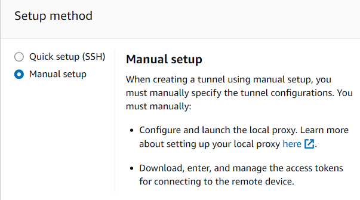
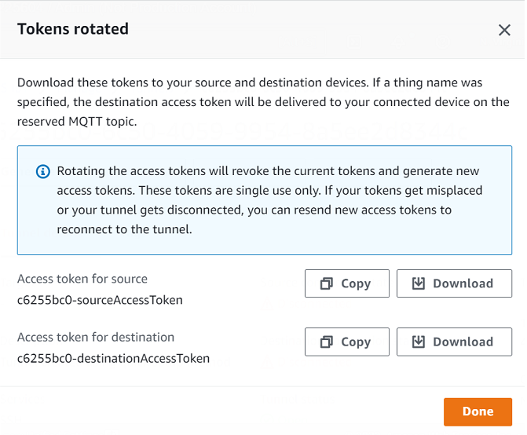

# Open a tunnel using manual setup and

connect to remote device

When you open a tunnel, you can choose the quick setup or the manual setup method
for opening a tunnel into the remote device. This tutorial shows how to open a
tunnel using the manual setup method and configure and start the local proxy to connect
to the remote device.

When you use the manual setup method, you must manually specify the tunnel
configurations when creating the tunnel. After creating the tunnel, you can SSH
within the browser or open a terminal outside the AWS IoT console. This tutorial
shows how to use the terminal outside the console to access the remote device.
You'll also learn how to configure the local proxy and then connect to the
local proxy to interact with the remote device. To connect to the local proxy, you
must download the source access token when creating the tunnel.

With this setup method, you can use services other than SSH, such as FTP to
connect to the remote device. For more information about the different setup
methods, see [Tunnel setup methods](secure-tunneling-tutorial-open-tunnel.md#tunneling-tutorial-setup-methods "secure-tunneling-tutorial-open-tunnel.md#tunneling-tutorial-setup-methods").

## Prerequisites for manual

setup method

- The firewalls that the remote device is behind must allow outbound traffic
  on port 443. The tunnel that you create will use this port to connect to the
  remote device.
- You have an IoT device agent (see [IoT agent snippet](configure-remote-device.md#agent-snippet "configure-remote-device.md#agent-snippet"))
  running on the remote device that connects to the AWS IoT device gateway and is
  configured with an MQTT topic subscription. For more information, see [connect a device to the AWS IoT device gateway](sdk-tutorials.md "sdk-tutorials.md").
- You must have an SSH daemon running on the remote device.
- You have downloaded the local proxy source code from [GitHub](https://github.com/aws-samples/aws-iot-securetunneling-localproxy "https://github.com/aws-samples/aws-iot-securetunneling-localproxy") and built it for the platform of your choice. We'll refer to
  the built local proxy executable file as `localproxy` in this
  tutorial.

## Open a tunnel

You can open a secure tunnel using the AWS Management Console, the AWS IoT API Reference, or the
AWS CLI. You can optionally configure a destination name but it's not required for
this tutorial. If you configure the destination, secure tunneling will
automatically deliver the access token to the remote device using MQTT. For more
information, see [Tunnel creation methods in AWS IoT console](secure-tunneling-tutorial-open-tunnel.md#tunneling-tutorial-flows "secure-tunneling-tutorial-open-tunnel.md#tunneling-tutorial-flows").

###### To open a tunnel in the console

1. Go to the [Tunnels hub of the
   AWS IoT console](https://console.aws.amazon.com/iot/home#/tunnelhub "https://console.aws.amazon.com/iot/home#/tunnelhub") and choose **Create
   tunnel**.

 2. For this tutorial, choose **Manual setup** as the tunnel
creation method and then choose **Next**. For information
about using the **quick setup** method to create a tunnel,
see [Open a tunnel and use browser-based
SSH to access remote device](tunneling-tutorial-quick-setup.md "tunneling-tutorial-quick-setup.md").

###### Note

If you create a secure tunnel from the details page of a thing, you can choose
whether to create a new tunnel or use an existing one. For more information, see [Open a tunnel for remote device and
use browser-based SSH](tunneling-tutorial-existing-tunnel.md "tunneling-tutorial-existing-tunnel.md").

 3. (Optional) Enter the configuration settings for your tunnel. You can
also skip this step and proceed to the next step to create a tunnel.

Enter a tunnel description, a tunnel timeout duration, and resource
tags as key-value pairs to help you identify your resource. For this
tutorial, you can skip the destination configuration.

###### Note

You won't be charged based on the duration for which you keep a
tunnel open. You only incur charges when creating a new tunnel. For
pricing information, see **Secure
Tunneling** in [AWS IoT Device Management
pricing](https://aws.amazon.com/iot-device-management/pricing/ "https://aws.amazon.com/iot-device-management/pricing/"). 4. Download the client access tokens and then choose
**Done**. The tokens will not be available to
download after you choose **Done**.

These tokens can only be used once to connect to the tunnel. If you misplace the
tokens or the tunnel gets disconnected, you can generate and send new tokens to your
remote device for reconnecting to the tunnel.


###### To open a tunnel using the API

To open a new tunnel, you can use the [OpenTunnel](../apireference/API_iot-secure-tunneling_OpenTunnel.md "../apireference/API_iot-secure-tunneling_OpenTunnel.md") API operation. You can also specify additional
configurations using the API, such as the tunnel duration and the
destination configuration.

```
aws iotsecuretunneling open-tunnel \
    --region `us-east-1` \
    --endpoint https://api.`us-east-1`.tunneling.iot.amazonaws.com
```

Running this command creates a new tunnel and provides you the source and
destination access tokens.

```
{
    "tunnelId": "01234567-89ab-0123-4c56-789a01234bcd",
    "tunnelArn": "arn:aws:iot:`us-east-1`:`123456789012`:tunnel/01234567-89ab-0123-4c56-789a01234bcd",
    "sourceAccessToken": "`<SOURCE_ACCESS_TOKEN>`",
    "destinationAccessToken": "`<DESTINATION_ACCESS_TOKEN>`"
}
```

## Resend tunnel access tokens

The tokens that you obtained when creating a tunnel can only be used once to connect to the tunnel.
If you misplace the access token or the tunnel gets disconnected, you can resend new access tokens to
the remote device using MQTT at no additional charge. AWS IoT secure tunneling will revoke the current
tokens and return new access tokens for reconnecting to the tunnel.

###### To rotate the tokens from the console

1. Go to the [Tunnels
   hub of the AWS IoT console](https://console.aws.amazon.com/iot/home#/tunnels "https://console.aws.amazon.com/iot/home#/tunnels") and choose the tunnel that you created.
2. In the tunnel details page, choose **Generate new access tokens**
   and then choose **Next**.
3. Download the new access tokens for your tunnel and choose **Done**.
   These tokens can be used only once. If you misplace these tokens or the tunnel gets
   disconnected, you can resend new access tokens.



###### To rotate access tokens using the API

To rotate the tunnel access tokens, you can use the [RotateTunnelAccessToken](../apireference/API_iot-secure-tunneling_RotateTunnelAccessToken.md "../apireference/API_iot-secure-tunneling_RotateTunnelAccessToken.md") API operation to revoke the current
tokens and return new access tokens for reconnecting to the tunnel. For
example, the following command rotates the access tokens for the destination
device, `RemoteThing1`.

```
aws iotsecuretunneling rotate-tunnel-access-token \
    --tunnel-id `<tunnel-id>` \
    --client-mode `DESTINATION` \
    --destination-config thingName=`<RemoteThing1>`,services=SSH \
    --region `<region>`
```

Running this command generates the new access token as shown in the following
example. The token is then delivered to the device using MQTT to connect to the
tunnel, if the device agent is set up correctly.

```
{
    "destinationAccessToken": "`destination-access-token`",
    "tunnelArn": "arn:aws:iot:`region`:`account-id`:tunnel/`tunnel-id`"
}
```

For examples that show how and when to rotate the access tokens, see
[Resolving AWS IoT secure tunneling
connectivity issues by rotating client access tokens](iot-secure-tunneling-troubleshooting.md "iot-secure-tunneling-troubleshooting.md").

## Configure and start the local proxy

To connect to the remote device, open a terminal on your laptop and configure and
start the local proxy. The local proxy transmits data sent by the application
running on the source device by using secure tunneling over a WebSocket secure
connection. You can download the local proxy source from [GitHub](https://github.com/aws-samples/aws-iot-securetunneling-localproxy "https://github.com/aws-samples/aws-iot-securetunneling-localproxy").

After you configure the local proxy, copy the source client access token, and
use it to start the local proxy in source mode. Following shows an example command
to start the local proxy. In the following command, the local proxy is configured to
listen for new connections on port 5555. In this command:

- `-r` specifies the AWS Region, which must be the same Region where
  your tunnel was created.
- `-s` specifies the port to which the proxy should connect.

- `-t` specifies the client token text.

```
./localproxy -r us-east-1 -s 5555 -t `source-client-access-token`
```

Running this command will start the local proxy in source mode. If you receive the following error
after running the command, set up the CA path. For information, see [Secure tunneling local
proxy on GitHub](https://github.com/aws-samples/aws-iot-securetunneling-localproxy "https://github.com/aws-samples/aws-iot-securetunneling-localproxy").

```
Could not perform SSL handshake with proxy server: certificate verify failed
```

The following shows a sample output of running the local proxy in `source` mode.

```
...
...

**Starting proxy in source mode**
Attempting to establish web socket connection with endpoint wss://data.tunneling.iot.`us-east-1`.amazonaws.com:443
Resolved proxy  server IP: 10.10.0.11
**Connected successfully with proxy server
Performing SSL handshake with proxy server
Successfully completed SSL handshake with proxy server**
HTTP/1.1 101 Switching Protocols

...

Connection: upgrade
channel-id: 01234567890abc23-00001234-0005678a-b1234c5de677a001-2bc3d456
upgrade: websocket

...

Web socket session ID: 01234567890abc23-00001234-0005678a-b1234c5de677a001-2bc3d456
Web socket subprotocol selected: aws.iot.securetunneling-2.0
**Successfully established websocket connection with proxy server: wss://data.tunneling.iot.`us-east-1`.amazonaws.com:443**
Setting up web socket pings for every 5000 milliseconds
Scheduled next read:

...

Starting web socket read loop continue reading...
Resolved bind IP: 127.0.0.1
Listening for new connection on port 5555
```

## Start an SSH session

Open another terminal and use the following command to start a new SSH session by
connecting to the local proxy on port 5555.

```
ssh `username`@localhost -p 5555
```

You might be prompted for a password for the SSH session. When you are done with the
SSH session, type `exit` to close the session.

## Cleaning up

- ###### Close tunnel

We recommend that you close the tunnel after you've finished using it.
A tunnel can also become closed if it stayed open for longer than
the specified tunnel duration. A tunnel cannot be reopened once
closed. You can still duplicate a tunnel by opening the closed
tunnel and then choosing **Duplicate tunnel**.
Specify the tunnel duration that you want to use and then create the
new tunnel.

    + To close an individual tunnel or multiple tunnels from the AWS IoT
     console, go to the [Tunnels hub](https://console.aws.amazon.com/iot/home#/tunnels "https://console.aws.amazon.com/iot/home#/tunnels"), choose the tunnels that you want to
     close, and then choose **Close
     tunnel**.
    + To close an individual tunnel or multiple tunnels using the
     AWS IoT API Reference API, use the [CloseTunnel](../apireference/API_iot-secure-tunneling_CloseTunnel.md "../apireference/API_iot-secure-tunneling_CloseTunnel.md") API operation.


    ```
    aws iotsecuretunneling close-tunnel \
        --tunnel-id "01234567-89ab-0123-4c56-789a01234bcd"
    ```

- ###### Delete tunnel

You can delete a tunnel permanently from your AWS account.

###### Warning

Deletion actions are permanent and can't be undone.

    + To delete an individual tunnel or multiple tunnels from the AWS IoT
     console, go to the [Tunnels hub](https://console.aws.amazon.com/iot/home#/tunnels "https://console.aws.amazon.com/iot/home#/tunnels"), choose the tunnels that you want to
     delete, and then choose **Delete
     tunnel**.
    + To delete an individual tunnel or multiple tunnels using the
     AWS IoT API Reference API, use the [CloseTunnel](../apireference/API_iot-secure-tunneling_CloseTunnel.md "../apireference/API_iot-secure-tunneling_CloseTunnel.md") API operation. When using the API, set
     the `delete` flag to `true`.


    ```
    aws iotsecuretunneling close-tunnel \
        --tunnel-id "01234567-89ab-0123-4c56-789a01234bcd"
        --delete true
    ```
