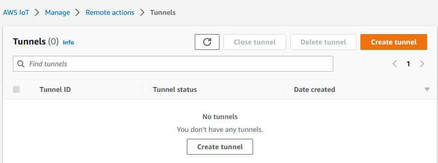
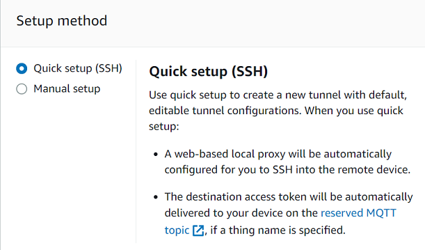
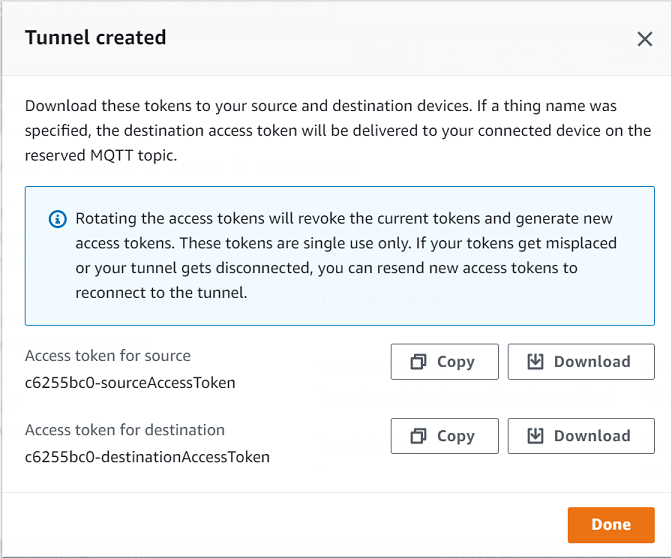
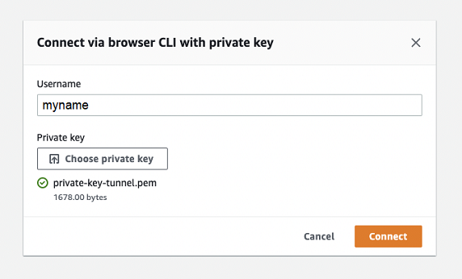
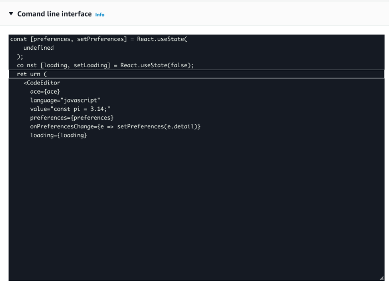

# Open a tunnel and use browser-based

SSH to access remote device

You can use the quick setup or the manual setup method for creating a tunnel. This
tutorial shows how to open a tunnel using the quick setup method and use the
browser-based SSH to connect to the remote device. For an example that shows how to
open a tunnel using the manual setup method, see [Open a tunnel using manual setup and
connect to remote device](tunneling-tutorial-manual-setup.md "tunneling-tutorial-manual-setup.md").

Using the quick setup method, you can create a new tunnel with default
configurations that can be edited. A web-based local proxy is configured for you and
the access token is automatically delivered to your remote destination device using
MQTT. After creating a tunnel, you can start interacting with your remote device
using a command line interface within the console.

With the quick setup method, you must use SSH as the destination service to access
the remote device. For more information about the different setup methods, see [Tunnel setup methods](secure-tunneling-tutorial-open-tunnel.md#tunneling-tutorial-setup-methods "secure-tunneling-tutorial-open-tunnel.md#tunneling-tutorial-setup-methods").

## Prerequisites for quick

setup method

- The firewalls that the remote device is behind must allow outbound traffic
  on port 443. The tunnel that you create will use this port to connect to the
  remote device.
- You have an IoT device agent (see [IoT agent snippet](configure-remote-device.md#agent-snippet "configure-remote-device.md#agent-snippet"))
  running on the remote device that connects to the AWS IoT device gateway and is
  configured with an MQTT topic subscription. For more information, see [connect a device to the AWS IoT device gateway](sdk-tutorials.md "sdk-tutorials.md").
- You must have an SSH daemon running on the remote device.

## Open a tunnel

You can open a secure tunnel using the AWS Management Console, the AWS IoT API Reference, or the
AWS CLI. You can optionally configure a destination name but it's not required for
this tutorial. If you configure the destination, secure tunneling will
automatically deliver the access token to the remote device using MQTT. For more
information, see [Tunnel creation methods in AWS IoT console](secure-tunneling-tutorial-open-tunnel.md#tunneling-tutorial-flows "secure-tunneling-tutorial-open-tunnel.md#tunneling-tutorial-flows").

###### To open a tunnel using the console

1. Go to the [Tunnels hub of the
   AWS IoT console](https://console.aws.amazon.com/iot/home#/tunnels "https://console.aws.amazon.com/iot/home#/tunnels") and choose **Create tunnel**.

 2. For this tutorial, choose **Quick setup** as the tunnel
creation method and then choose **Next**.

###### Note

If you create a secure tunnel from the details page of a thing you
created, you can choose whether to create a new tunnel or use an
existing one. For more information, see [Open a tunnel for remote device and
use browser-based SSH](tunneling-tutorial-existing-tunnel.md "tunneling-tutorial-existing-tunnel.md").

 3. Review and confirm the tunnel configuration details. To create a
tunnel, choose **Confirm and create**. If you want to
edit these details, choose **Previous** to go back to
the previous page and then confirm and create the tunnel.

###### Note

When using quick setup, the service name can't be edited. You must
use **SSH** as the
**Service**. 4. To create the tunnel, choose **Done**.

For this tutorial, you don't have to download the source or
destination access tokens. These tokens can only be used once to connect
to the tunnel. If your tunnel gets disconnected, you can generate and
send new tokens to your remote device for reconnecting to the tunnel.
For more information, see [Resend tunnel access tokens](tunneling-tutorial-manual-setup.md#resend-access-tokens "tunneling-tutorial-manual-setup.md#resend-access-tokens").



###### To open a tunnel using the API

To open a new tunnel, you can use the [OpenTunnel](../apireference/API_iot-secure-tunneling_OpenTunnel.md "../apireference/API_iot-secure-tunneling_OpenTunnel.md") API operation.

###### Note

You can create a tunnel using the quick setup method only from the AWS IoT
console. When you use the AWS IoT API Reference API or the AWS CLI, it will use the
manual setup method. You can open the existing tunnel that you created and
then change the setup method of the tunnel to use the quick setup. For more
information, see [Open an existing tunnel
and use browser-based SSH](tunneling-tutorial-existing-tunnel.md#tunneling-tutorial-existing-convert-tunnel "tunneling-tutorial-existing-tunnel.md#tunneling-tutorial-existing-convert-tunnel").

The following shows an example of how to run this API operation. Optionally, if
you want to specify the thing name and the destination service, use the
`DestinationConfig` parameter. For an example that shows how to
use this parameter, see [Open a new tunnel for the
remote device](tunneling-tutorial-existing-tunnel.md#tunneling-tutorial-existing-open-tunnel "tunneling-tutorial-existing-tunnel.md#tunneling-tutorial-existing-open-tunnel").

```
aws iotsecuretunneling open-tunnel
```

Running this command creates a new tunnel and provides you the source and
destination access tokens.

```
{
    "tunnelId": "01234567-89ab-0123-4c56-789a01234bcd",
    "tunnelArn": "arn:aws:iot:`us-east-1`:`123456789012`:tunnel/01234567-89ab-0123-4c56-789a01234bcd",
    "sourceAccessToken": "`<SOURCE_ACCESS_TOKEN>`",
    "destinationAccessToken": "`<DESTINATION_ACCESS_TOKEN>`"
}
```

## Using the browser-based SSH

After you create a tunnel using the quick setup method, and your destination
device has connected to the tunnel, you can access the remote device using a
browser-based SSH. Using the browser-based SSH, you can directly communicate
with the remote device by entering commands into an in-context command line
interface within the console. This feature makes it easier for you to interact
with the remote device because you don't have to open a terminal outside the
console or configure the local proxy.

###### To use the browser-based SSH

1. Go to the [Tunnels hub of the
   AWS IoT console](https://console.aws.amazon.com/iot/home#/tunnels "https://console.aws.amazon.com/iot/home#/tunnels") and choose the tunnel that you created to view
   its details.
2. Expand the **Secure Shell (SSH)** section and then choose
   **Connect**.
3. Choose whether you want to authenticate into the SSH connection by
   providing your username and password, or, for more secure
   authentication, you can use your device's private key. If you're
   authenticating using the private key, note that only PEM formatted (256
   and 512) RSA keys work with AWS IoT Secure Tunneling SSH console.
   - To connect using your username and password, choose **Use
     password**. You can then enter your username and
     password and start using the in-browser CLI.
   - To connect using your destination device's private key, choose
     **Use private key**. Specify your username
     and upload the device's private key file, and then choose
     **Connect** to start using the in-browser
     CLI.

   

After you've authenticated into the SSH connection, you can quickly get started
with entering commands and interact with the device using the browser CLI, as
the local proxy has already been configured for you.



If the browser CLI stays open after the tunnel duration, it might time out,
causing the command line interface to get disconnected. You can duplicate the
tunnel and start another session to interact with the remote device within the
console itself.

## Troubleshooting issues when using

the browser-based SSH

The following shows how to troubleshoot some issues that you might run into when
using the browser-based SSH.

- ###### You see an error instead of the command line interface

You might be seeing the error because your destination device got
disconnected. You can choose **Generate new access tokens**
to generate new access tokens and send the tokens to your remote device
using MQTT. The new tokens can be used to reconnect to the tunnel.
Reconnecting to the tunnel clears the history and refreshes the command line
session.

- ###### You see a tunnel disconnected error when authenticating using private key

You might be seeing the error because your private key might not have
been accepted by the destination device. To troubleshoot this error,
check the private key file that you uploaded for authentication. If
you still see an error, check your device logs. You can also try
reconnecting to the tunnel by sending new access tokens to your
remote device.

- ###### Your tunnel was closed when using the session

If your tunnel was closed because it stayed open for more than the specified
duration, your command line session might get disconnected. A tunnel cannot
be reopened once closed. To reconnect, you must open another tunnel to the
device.

You can duplicate a tunnel to create a new tunnel with the same
configurations as the closed tunnel. You can duplicate a closed tunnel from
the AWS IoT console. To duplicate the tunnel, choose the tunnel that was
closed to view its details, and then choose **Duplicate
tunnel**. Specify the tunnel duration that you want to use and
then create the new tunnel.

## Cleaning up

- ###### Close tunnel

We recommend that you close the tunnel after you've finished using it.
A tunnel can also become closed if it stayed open for longer than
the specified tunnel duration. A tunnel cannot be reopened once
closed. You can still duplicate a tunnel by choosing the closed
tunnel and then choosing **Duplicate tunnel**.
Specify the tunnel duration that you want to use and then create the
new tunnel.

    + To close an individual tunnel or multiple tunnels from the AWS IoT
     console, go to the [Tunnels hub](https://console.aws.amazon.com/iot/home#/tunnels "https://console.aws.amazon.com/iot/home#/tunnels"), choose the tunnels that you want to
     close, and then choose **Close
     tunnel**.
    + To close an individual tunnel or multiple tunnels using the AWS IoT API Reference API,
     use the [CloseTunnel](../apireference/API_iot-secure-tunneling_CloseTunnel.md "../apireference/API_iot-secure-tunneling_CloseTunnel.md") API.


    ```
    aws iotsecuretunneling close-tunnel \
        --tunnel-id "01234567-89ab-0123-4c56-789a01234bcd"
    ```

- ###### Delete tunnel

You can delete a tunnel permanently from your AWS account.

###### Warning

Deletion actions are permanent and can't be undone.

    + To delete an individual tunnel or multiple tunnels from the AWS IoT
     console, go to the [Tunnels hub](https://console.aws.amazon.com/iot/home#/tunnels "https://console.aws.amazon.com/iot/home#/tunnels"), choose the tunnels that you want to
     delete, and then choose **Delete
     tunnel**.
    + To delete an individual tunnel or multiple tunnels using the AWS IoT API Reference API,
     use the [CloseTunnel](../apireference/API_iot-secure-tunneling_CloseTunnel.md "../apireference/API_iot-secure-tunneling_CloseTunnel.md") API. When using the API, set the `delete` flag to
     `true`.


    ```
    aws iotsecuretunneling close-tunnel \
        --tunnel-id "01234567-89ab-0123-4c56-789a01234bcd"
        --delete true
    ```
