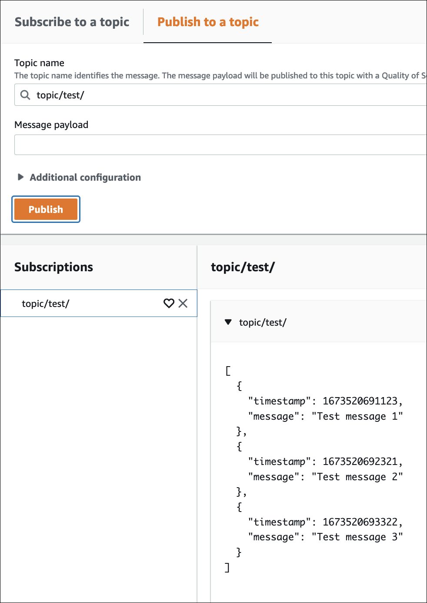

# Uploading device-side logs by using

AWS IoT rules

You can use the AWS IoT rules engine to upload log records from existing device-side log
files (system, application, and device-client logs) to Amazon CloudWatch. When device-side logs are
published to an MQTT topic, the CloudWatch Logs rules action transfers the messages to CloudWatch Logs. This
process outlines how to upload device logs in batches using the rules action
`batchMode` parameter turned on (set to `true`).

To begin uploading device-side logs to CloudWatch, complete the following
prerequisites.

## Prerequisites

Before you begin, do the following:

- Create at least one target IoT device that's registered with AWS IoT Core as an AWS IoT
  thing. For more information, see [Create a
  thing object](create-iot-resources.md#create-aws-thing "create-iot-resources.md#create-aws-thing").
- Determine the MQTT topic space for ingestion and errors. For more information
  about MQTT topics and recommended naming conventions, see the [MQTT topics](upload-device-logs-to-cloudwatch.md#upload-mqtt-topics-overview "upload-device-logs-to-cloudwatch.md#upload-mqtt-topics-overview")
  [MQTT topics](upload-device-logs-to-cloudwatch.md#upload-mqtt-topics-overview "upload-device-logs-to-cloudwatch.md#upload-mqtt-topics-overview") section in [Upload
  device-side logs to Amazon CloudWatch](upload-device-logs-to-cloudwatch.md "upload-device-logs-to-cloudwatch.md").

For more information about these prerequisites, see [Upload device-side logs
to CloudWatch](upload-device-logs-to-cloudwatch.md "upload-device-logs-to-cloudwatch.md").

## Creating a CloudWatch log group

To create a CloudWatch log group, complete the following steps. Choose the appropriate tab
depending on whether you prefer to perform the steps through the AWS Management Console or the
AWS Command Line Interface (AWS CLI).

AWS Management Console

###### To create a CloudWatch log group by using the AWS Management Console

1. Open the AWS Management Console and navigate to [CloudWatch](https://console.aws.amazon.com/cloudwatch "https://console.aws.amazon.com/cloudwatch").
2. On the navigation bar, choose **Logs**, and then
   **Log groups**.
3. Choose **Create log group**.
4. Update the **Log group name** and, optionally, update the
   **Retention setting** fields.
5. Choose **Create**.

AWS CLI

###### To create a CloudWatch log group by using the AWS CLI

1. To create the log group, run the following command. For more information,
   see `create-log-group` in the AWS CLI v2 Command Reference.

Replace the log group name in the example (`uploadLogsGroup`)
with your preferred name.

```
aws logs create-log-group --log-group-name `uploadLogsGroup`
```

2. To confirm that the log group was created correctly, run the following
   command.

```
aws logs describe-log-groups --log-group-name-prefix `uploadLogsGroup`
```

Sample output:

```
{
    "logGroups": [
        {
            "logGroupName": "uploadLogsGroup",
            "creationTime": 1674521804657,
            "metricFilterCount": 0,
            "arn": "arn:aws:logs:us-east-1:111122223333:log-group:uploadLogsGroup:*",
            "storedBytes": 0
        }
    ]
}
```

## Creating a topic rule

To create an AWS IoT rule, complete the following steps. Choose the appropriate tab
depending on whether you prefer to perform the steps through the AWS Management Console or the
AWS Command Line Interface (AWS CLI).

AWS Management Console

###### To create a topic rule by using the AWS Management Console

1.  Open the Rule hub.
    1. Open the AWS Management Console and navigate to [AWS IoT](https://console.aws.amazon.com/iot "https://console.aws.amazon.com/iot") .
    2. On the navigation bar, choose **Message routing**
       and then **Rules**.
    3. Choose **Create rule**.

2.  Enter the rule properties.
    1. Enter an alphanumeric **Rule name**.
    2. (Optional) Enter a **Rule description** and
       **Tags**.
    3. Choose **Next**.

3.  Enter a SQL statement.
    1. Enter a SQL statement using the MQTT topic that you defined for
       ingestion.

    For example, `SELECT * FROM
 '`$aws/rules/things/thing_name/logs`'` 2. Choose **Next**.

4.  Enter rule actions.
    1. On the **Action 1** menu, choose **CloudWatch
       logs**.
    2. Choose the **Log group name** and then choose the log
       group that you created.
    3. Select **Use batch mode**.
    4. Specify the IAM role for the rule.

    If you have an IAM role for the rule, do the following.

        1. On the **IAM role** menu, choose your IAM
         role.

    If you don't have an IAM role for the rule, do the following.

        1. Choose **Create new role**.
        2. For **Role name**, enter a unique name and choose
         **Create**.
        3. Confirm that the IAM role name is correct in the **IAM
         role** field.

    5. Choose **Next**.

5.  Review the template configuration.
    1. Review the settings for the Job template to verify they're
       correct.
    2. When you're done, choose **Create**.

AWS CLI

###### To create an IAM role and a topic rule by using the AWS CLI

1. Create an IAM role that grants rights to the AWS IoT rule.
   1. Create an IAM policy.

   To create an IAM policy, run the following command. Make sure you
   update the `policy-name` parameter value. For more information,
   see [`create-policy`](https://awscli.amazonaws.com/v2/documentation/api/latest/reference/iam/create-policy.html "https://awscli.amazonaws.com/v2/documentation/api/latest/reference/iam/create-policy.html") in the AWS CLI v2 Command
   Reference.

   ###### Note

   If you're using a Microsoft Windows operating system, you might need
   to replace the end of line marker (\) with a tick (`) or another
   character.

   ```
   aws iam create-policy \
       --policy-name `uploadLogsPolicy` \
       --policy-document \
   '{
       "Version": "2012-10-17",
       "Statement": {
           "Effect": "Allow",
           "Action": [
               "iot:CreateTopicRule",
               "iot:Publish",
               "logs:CreateLogGroup",
               "logs:CreateLogStream",
               "logs:PutLogEvents",
               "logs:GetLogEvents"
           ],
           "Resource": "*"
       }
   }'
   ```

   2. Copy the policy ARN from your output into a text editor.

   Sample output:

   ```
   {
       "Policy": {
           "PolicyName": "uploadLogsPolicy",
           "PermissionsBoundaryUsageCount": 0,
           "CreateDate": "2023-01-23T18:30:10Z",
           "AttachmentCount": 0,
           "IsAttachable": true,
           "PolicyId": "AAABBBCCCDDDEEEFFFGGG",
           "DefaultVersionId": "v1",
           "Path": "/",
           "Arn": "`arn:aws:iam::111122223333:policy/uploadLogsPolicy`",
           "UpdateDate": "2023-01-23T18:30:10Z"
       }
   }
   ```

   3. Create an IAM role and trust policy.

   To create an IAM policy, run the following command. Make sure you
   update the `role-name` parameter value. For more information, see
   [`create-role`](https://awscli.amazonaws.com/v2/documentation/api/latest/reference/iam/create-role.html "https://awscli.amazonaws.com/v2/documentation/api/latest/reference/iam/create-role.html") in the AWS CLI v2 Command
   Reference.

   ```
   aws iam create-role \
   --role-name `uploadLogsRole` \
   --assume-role-policy-document \
   '{
       "Version": "2012-10-17",
       "Statement": [
           {
               "Sid": "",
               "Effect": "Allow",
               "Principal": {
                   "Service": "iot.amazonaws.com"
               },
               "Action": "sts:AssumeRole"
           }
       ]
   }'

   ```

   4. Attach the IAM policy to the rule.

   To create an IAM policy, run the following command. Make sure you
   update the `role-name` and `policy-arn` parameter
   values. For more information, see [`attach-role-policy`](https://awscli.amazonaws.com/v2/documentation/api/latest/reference/iam/attach-role-policy.html "https://awscli.amazonaws.com/v2/documentation/api/latest/reference/iam/attach-role-policy.html") in the AWS CLI v2 Command
   Reference.

   ```
   aws iam attach-role-policy \
   --role-name `uploadLogsRole` \
   --policy-arn `arn:aws:iam::111122223333:policy/uploadLogsPolicy`
   ```

   5. Review the role.

   To confirm that the IAM role was created correctly, run the following
   command. Make sure you update the `role-name` parameter value.
   For more information, see [`get-role`](https://awscli.amazonaws.com/v2/documentation/api/latest/reference/iam/get-role.html "https://awscli.amazonaws.com/v2/documentation/api/latest/reference/iam/get-role.html") in the AWS CLI v2 Command Reference.

   ```
   aws iam get-role --role-name `uploadLogsRole`
   ```

   Sample output:

   ```
   {
       "Role": {
           "Path": "/",
           "RoleName": "uploadLogsRole",
           "RoleId": "AAABBBCCCDDDEEEFFFGGG",
           "Arn": "arn:aws:iam::111122223333:role/uploadLogsRole",
           "CreateDate": "2023-01-23T19:17:15+00:00",
           "AssumeRolePolicyDocument": {
               "Version": "2012-10-17",
               "Statement": [
                   {
                       "Sid": "Statement1",
                       "Effect": "Allow",
                       "Principal": {
                           "Service": "iot.amazonaws.com"
                       },
                       "Action": "sts:AssumeRole"
                   }
               ]
           },
           "Description": "",
           "MaxSessionDuration": 3600,
           "RoleLastUsed": {}
       }
   }
   ```

2. Create an AWS IoT topic rule in the AWS CLI.
   1. To create an AWS IoT topic rule, run the following command. Make sure you
      update the `--rule-name`, `sql` statement,
      `description`, `roleARN` , and
      `logGroupName` parameter values. For more information, see
      [create-topic-rule](https://awscli.amazonaws.com/v2/documentation/api/2.0.34/reference/iot/create-topic-rule.html "https://awscli.amazonaws.com/v2/documentation/api/2.0.34/reference/iot/create-topic-rule.html") in the AWS CLI v2 Command Reference.

   ```
   aws iot create-topic-rule \
   --rule-name `uploadLogsRule` \
   --topic-rule-payload \
   	'{
   		"sql":"SELECT * FROM '`rules/things/thing_name/logs`'",
   		"description":"`Upload logs test rule`",
   		"ruleDisabled":false,
   		"awsIotSqlVersion":"2016-03-23",
   		"actions":[
   			{"cloudwatchLogs":
   				{"roleArn":"`arn:aws:iam::111122223333:role/uploadLogsRole`",
   				"logGroupName":"`uploadLogsGroup`",
   				"batchMode":true}
   				}
   			]
   }'
   ```

   2. To confirm that the rule was created correctly, run the following
      command. Make sure you update the `role-name` parameter value.
      For more information, see [get-topic-rule](https://awscli.amazonaws.com/v2/documentation/api/2.0.34/reference/iot/get-topic-rule.html "https://awscli.amazonaws.com/v2/documentation/api/2.0.34/reference/iot/get-topic-rule.html") in the AWS CLI v2 Command Reference.

   ```
   aws iot get-topic-rule --rule-name `uploadLogsRule`
   ```

   Sample output:

   ```
   {
       "ruleArn": "arn:aws:iot:us-east-1:111122223333:rule/uploadLogsRule",
       "rule": {
           "ruleName": "uploadLogsRule",
           "sql": "SELECT * FROM rules/things/thing_name/logs",
           "description": "Upload logs test rule",
           "createdAt": "2023-01-24T16:28:15+00:00",
           "actions": [
               {
                   "cloudwatchLogs": {
                       "roleArn": "arn:aws:iam::111122223333:role/uploadLogsRole",
                       "logGroupName": "uploadLogsGroup",
                       "batchMode": true
                   }
               }
           ],
           "ruleDisabled": false,
           "awsIotSqlVersion": "2016-03-23"
       }
   }
   ```

## Sending device-side logs to

AWS IoT

###### To send device-side logs to AWS IoT

1. To send historical logs to AWS IoT, communicate with your devices to ensure the
   following.
   - The log information is sent to the correct topic namespace as specified within
     the _Prerequisites_ section of this procedure.

   For example, `$aws/rules/things/thing_name/logs`
   - The MQTT message payload is formatted correctly. For more information about
     MQTT topic and recommended naming convention, see the [MQTT topics](upload-device-logs-to-cloudwatch.md#upload-mqtt-topics-overview "upload-device-logs-to-cloudwatch.md#upload-mqtt-topics-overview") section within [Upload device-side logs to Amazon CloudWatch](upload-device-logs-to-cloudwatch.md "upload-device-logs-to-cloudwatch.md").

2. Confirm that the MQTT messages are received within the AWS IoT MQTT client.
   1. Open the AWS Management Console and navigate to [AWS IoT](https://console.aws.amazon.com/iot/home "https://console.aws.amazon.com/iot/home").
   2. To view the **MQTT test client**, on the navigation bar,
      choose **Test**, **MQTT test client**.
   3. For **Subscribe to a topic**, **Topic
      filter**, enter the _topic namespace_.
   4. Choose **Subscribe**.

   MQTT messages appear in the **Subscriptions** and
   **Topic** table, as seen in the following. These messages can
   take up to five minutes to appear.

   

## Viewing the log data

###### To review your log records in CloudWatch Logs

1. Open the AWS Management Console, and navigate to [CloudWatch](https://console.aws.amazon.com/cloudwatch "https://console.aws.amazon.com/cloudwatch").
2. On the navigation bar, choose **Logs**, **Logs
   Insights**.
3. On the **Select log group(s)** menu, choose the log group you
   specified in the AWS IoT rule.
4. On the **Logs insights** page, choose **Run
   query**.
