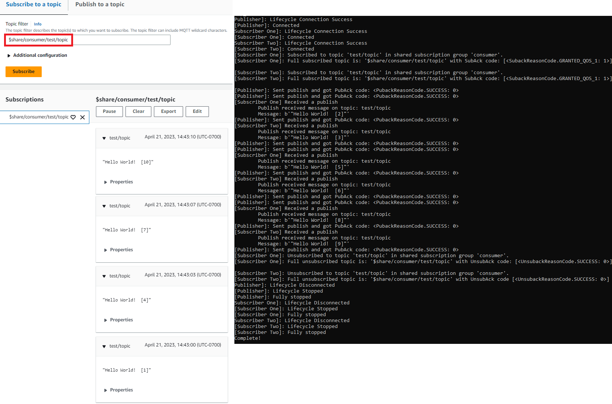

# Use your Windows or Linux

PC or Mac as an AWS IoT device

In this tutorial, you'll configure a personal computer for use with AWS IoT.
These instructions support Windows and Linux PCs and Macs. To accomplish this,
you need to install some software on your computer. If you don't want to install
software on your computer, you might try [Create a virtual device with
Amazon EC2](creating-a-virtual-thing.md "creating-a-virtual-thing.md"), which installs all software on a virtual machine.

###### In this tutorial, you'll:

- [Set up your personal computer](#gs-pc-prereqs "#gs-pc-prereqs")
- [Install Git, Python, and the AWS IoT Device
  SDK for Python](#gs-pc-sdk-node "#gs-pc-sdk-node")
- [Set up the policy and run the sample
  application](#gs-pc-python-app-run "#gs-pc-python-app-run")
- [View messages from the sample app in the
  AWS IoT console](#gs-pc-view-msg "#gs-pc-view-msg")
- [Run the Shared
  Subscription example in Python](#gs-pc-shared-subscription-example "#gs-pc-shared-subscription-example")

## Set up your personal computer

To complete this tutorial, you need a Windows or Linux PC or a Mac with a
connection to the internet.

Before you continue to the next step, make sure you can open a command
line window on your computer. Use **cmd.exe** on a Windows
PC. On a Linux PC or a Mac, use **Terminal**.

## Install Git, Python, and the AWS IoT Device

SDK for Python

In this section, you'll install Python, and the AWS IoT Device SDK for
Python on your computer.

### Install the latest version of Git

and Python

This procedure explains how to install the latest version of Git and
Python on your personal computer.

###### To download and install Git and Python on your computer

1. Check to see if you have Git installed on your computer. Enter
   this command in the command line.

```
git --version
```

If the command displays the Git version, Git is installed and
you can continue to the next step.

If the command displays an error, open [`https://git-scm.com/download`](https://git-scm.com/download "https://git-scm.com/download") and
install Git for your computer. 2. Check to see if you have already installed Python. Enter the
command in the command line.

```
python -V
```

###### Note

If this command gives an error: `Python was not
 found`, it might be because your operating system
calls the Python v3.x executable as `Python3`. In
that case, replace all instances of `python` with
`python3` and continue the remainder of this
tutorial.

If the command displays the Python version, Python is already
installed. This tutorial requires Python v3.7 or later. 3. If Python is installed, you can skip the rest of the steps in
this section. If not, continue. 4. Open [https://www.python.org/downloads/](https://www.python.org/downloads/ "https://www.python.org/downloads/") and download the
installer for your computer. 5. If the download didn't automatically start to install, run the
downloaded program to install Python. 6. Verify the installation of Python.

```
python -V
```

Confirm that the command displays the Python version. If the
Python version isn't displayed, try downloading and installing
Python again.

### Install the AWS IoT Device SDK

for Python

###### To install the AWS IoT Device SDK for Python on your

computer

1. Install v2 of the AWS IoT Device SDK for Python.

```
python3 -m pip install awsiotsdk
```

2. Clone the AWS IoT Device SDK for Python repository into the
   aws-iot-device-sdk-python-v2 directory of your home directory.
   This procedure refers to the base directory for the files you're
   installing as `home`.

The actual location of the `home`
directory depends on your operating system.

Linux/macOS
In macOS and Linux, the
`home` directory is
`~`.

```
cd ~
git clone https://github.com/aws/aws-iot-device-sdk-python-v2.git
```

Windows
In Windows, you can find the
`home` directory path by
running this command in the `cmd`
window.

```
echo %USERPROFILE%
cd %USERPROFILE%
git clone https://github.com/aws/aws-iot-device-sdk-python-v2.git
```

###### Note

If you're using Windows PowerShell as opposed to
**cmd.exe**, then use the following
command.

```

echo $home
```

For more information, see the [AWS IoT
Device SDK for Python GitHub repository](https://github.com/aws/aws-iot-device-sdk-python-v2 "https://github.com/aws/aws-iot-device-sdk-python-v2").

### Prepare to run the sample

applications

###### To prepare your system to run the sample application

- Create the `certs` directory. Into the
  `certs` directory, copy the private key, device
  certificate, and root CA certificate files you saved when you
  created and registered the thing object in [Create AWS IoT resources](create-iot-resources.md "create-iot-resources.md"). The file names of each
  file in the destination directory should match those in the
  table.

The commands in the next section assume that your key and
certificate files are stored on your device as shown in this
table.

Linux/macOS
Run this command to create the `certs`
subdirectory that you'll use when you run the sample
applications.

```
mkdir ~/certs
```

Into the new subdirectory, copy the files to the
destination file paths shown in the following
table.

| Certificate file names | File                           | File path |
| ---------------------- | ------------------------------ | --------- |
| Private key            | `~/certs/private.pem.key`      |
| Device certificate     | `~/certs/device.pem.crt`       |
| Root CA certificate    | `~/certs/Amazon-root-CA-1.pem` |

Run this command to list the files in the
`certs` directory and compare them to
those listed in the table.

```
ls -l ~/certs
```

Windows
Run this command to create the `certs`
subdirectory that you'll use when you run the sample
applications.

```
mkdir %USERPROFILE%\certs
```

Into the new subdirectory, copy the files to the
destination file paths shown in the following
table.

| Certificate file names | File                                       | File path |
| ---------------------- | ------------------------------------------ | --------- |
| Private key            | `%USERPROFILE%\certs\private.pem.key`      |
| Device certificate     | `%USERPROFILE%\certs\device.pem.crt`       |
| Root CA certificate    | `%USERPROFILE%\certs\Amazon-root-CA-1.pem` |

Run this command to list the files in the
`certs` directory and compare them to
those listed in the table.

```
dir %USERPROFILE%\certs
```

## Set up the policy and run the sample

application

In this section, you'll set up your policy and run the
`pubsub.py` sample script found in the
`aws-iot-device-sdk-python-v2/samples` directory of the
AWS IoT Device SDK for Python. This script shows how your device uses the MQTT library to
publish and subscribe to MQTT messages.

The `pubsub.py` sample app subscribes to a topic,
`test/topic`, publishes 10 messages to that topic, and
displays the messages as they're received from the message broker.

To run the `pubsub.py` sample script, you need the following
information:

| Application parameter values | Parameter                                                                                                                                                                                                                                                                        | Where to find the value |
| ---------------------------- | -------------------------------------------------------------------------------------------------------------------------------------------------------------------------------------------------------------------------------------------------------------------------------- | ----------------------- |
| `your-iot-endpoint`          | 1. In the [AWS IoT<br>console](https://console.aws.amazon.com/iot/home "https://console.aws.amazon.com/iot/home"), in the left menu, choose<br>**Settings**.<br>2. On the **Settings\*<br>• page,<br>your endpoint is displayed in the **Device<br>data endpoint\*<br>• section. |

The `your-iot-endpoint` value has a format of:
``endpoint_id`-ats.iot.`region`.amazonaws.com`,
 for example,
 `a3qj468EXAMPLE-ats.iot.us-west-2.amazonaws.com`.

Before running the script, make sure your thing's policy provides
permissions for the sample script to connect, subscribe, publish, and
receive.

###### To find and review the policy document for a thing resource

1. In the [AWS IoT
   console](https://console.aws.amazon.com/iot/home#/thinghub "https://console.aws.amazon.com/iot/home#/thinghub"), in the **Things** list, find
   the thing resource that represents your device.
2. Choose the **Name** link of the thing resource
   that represents your device to open the **Thing
   details** page.
3. In the **Thing details** page, in the
   **Certificates** tab, choose the certificate
   that is attached to the thing resource. There should only be one
   certificate in the list. If there is more than one, choose the
   certificate whose files are installed on your device and that will
   be used to connect to AWS IoT Core.

In the **Certificate** details page, in the
**Policies** tab, choose the policy that's
attached to the certificate. There should only be one. If there is
more than one, repeat the next step for each to make sure that at
least one policy grants the required access. 4. In the **Policy** overview page, find the JSON
editor and choose **Edit policy document** to
review and edit the policy document as required. 5. The policy JSON is displayed in the following example. In the
`"Resource"` element, replace
`region:account` with
your AWS Region and AWS account in each of the
`Resource` values.

JSON

```
`{
 "Version":"2012-10-17",
 "Statement": [
 {
 "Effect": "Allow",
 "Action": [
 "iot:Publish",
 "iot:Receive"
 ],
 "Resource": [
 "arn:aws:iot:`us-east-1`:`123456789012`:topic/test/topic"
 ]
 },
 {
 "Effect": "Allow",
 "Action": [
 "iot:Subscribe"
 ],
 "Resource": [
 "arn:aws:iot:`us-east-1`:`123456789012`:topicfilter/test/topic"
 ]
 },
 {
 "Effect": "Allow",
 "Action": [
 "iot:Connect"
 ],
 "Resource": [
 "arn:aws:iot:`us-east-1`:`123456789012`:client/test-*"
 ]
 }
 ]
}`

```

Linux/macOS

###### To run the sample script on Linux/macOS

1. In your command line window, navigate to the
   `~/aws-iot-device-sdk-python-v2/samples/node/pub_sub`
   directory that the SDK created by using these
   commands.

```
cd ~/aws-iot-device-sdk-python-v2/samples
```

2. In your command line window, replace
   `your-iot-endpoint` as
   indicated and run this command.

```
python3 pubsub.py --endpoint your-iot-endpoint --ca_file ~/certs/Amazon-root-CA-1.pem --cert ~/certs/device.pem.crt --key ~/certs/private.pem.key
```

Windows

###### To run the sample app on a Windows PC

1. In your command line window, navigate to the
   `%USERPROFILE%\aws-iot-device-sdk-python-v2\samples`
   directory that the SDK created and install the sample
   app by using these commands.

```
cd %USERPROFILE%\aws-iot-device-sdk-python-v2\samples
```

2. In your command line window, replace
   `your-iot-endpoint` as
   indicated and run this command.

```
python3 pubsub.py --endpoint your-iot-endpoint --ca_file %USERPROFILE%\certs\Amazon-root-CA-1.pem --cert %USERPROFILE%\certs\device.pem.crt --key %USERPROFILE%\certs\private.pem.key
```

The sample script:

1. Connects to the AWS IoT Core for your account.
2. Subscribes to the message topic, **test/topic**, and displays the messages it receives on
   that topic.
3. Publishes 10 messages to the topic, **test/topic**.
4. Displays output similar to the following:

```
Connected!
Subscribing to topic 'test/topic'...
Subscribed with QoS.AT_LEAST_ONCE
Sending 10 message(s)
Publishing message to topic 'test/topic': Hello World! [1]
Received message from topic 'test/topic': b'"Hello World! [1]"'
Publishing message to topic 'test/topic': Hello World! [2]
Received message from topic 'test/topic': b'"Hello World! [2]"'
Publishing message to topic 'test/topic': Hello World! [3]
Received message from topic 'test/topic': b'"Hello World! [3]"'
Publishing message to topic 'test/topic': Hello World! [4]
Received message from topic 'test/topic': b'"Hello World! [4]"'
Publishing message to topic 'test/topic': Hello World! [5]
Received message from topic 'test/topic': b'"Hello World! [5]"'
Publishing message to topic 'test/topic': Hello World! [6]
Received message from topic 'test/topic': b'"Hello World! [6]"'
Publishing message to topic 'test/topic': Hello World! [7]
Received message from topic 'test/topic': b'"Hello World! [7]"'
Publishing message to topic 'test/topic': Hello World! [8]
Received message from topic 'test/topic': b'"Hello World! [8]"'
Publishing message to topic 'test/topic': Hello World! [9]
Received message from topic 'test/topic': b'"Hello World! [9]"'
Publishing message to topic 'test/topic': Hello World! [10]
Received message from topic 'test/topic': b'"Hello World! [10]"'
10 message(s) received.
Disconnecting...
Disconnected!
```

If you're having trouble running the sample app, review [Troubleshoot problems with the
sample application](gs-device-troubleshoot.md "gs-device-troubleshoot.md").

You can also add the `--verbosity Debug` parameter to the
command line so the sample app displays detailed messages about what it’s
doing. That information might help you correct the problem.

## View messages from the sample app in the

AWS IoT console

You can see the sample app's messages as they pass through the message
broker by using the **MQTT test client** in the
**AWS IoT console**.

###### To view the MQTT messages published by the sample app

1. Review [View MQTT messages with the AWS IoT MQTT
   client](view-mqtt-messages.md "view-mqtt-messages.md"). This helps you learn how
   to use the **MQTT test client** in the
   **AWS IoT console** to view MQTT messages as they
   pass through the message broker.
2. Open the **MQTT test client** in the
   **AWS IoT console**.
3. In **Subscribe to a topic**, subscribe to the
   topic, **test/topic**.
4. In your command line window, run the sample app again and watch
   the messages in the **MQTT client** in the
   **AWS IoT console**.

Linux/macOS

```
cd ~/aws-iot-device-sdk-python-v2/samples
python3 pubsub.py --topic test/topic --ca_file ~/certs/Amazon-root-CA-1.pem --cert ~/certs/device.pem.crt --key ~/certs/private.pem.key --endpoint `your-iot-endpoint`
```

Windows

```
cd %USERPROFILE%\aws-iot-device-sdk-python-v2\samples
python3 pubsub.py --topic test/topic --ca_file %USERPROFILE%\certs\Amazon-root-CA-1.pem --cert %USERPROFILE%\certs\device.pem.crt --key %USERPROFILE%\certs\private.pem.key --endpoint `your-iot-endpoint`
```

For more information about MQTT and how AWS IoT Core supports the protocol,
see [MQTT](mqtt.md "mqtt.md").

## Run the Shared

Subscription example in Python

AWS IoT Core supports [Shared
Subscriptions](mqtt.md#mqtt5-shared-subscription "mqtt.md#mqtt5-shared-subscription") for both MQTT 3 and MQTT 5. Shared Subscriptions
allow multiple clients to share a subscription to a topic and only one
client will receive messages published to that topic using a random
distribution. To use Shared Subscriptions, clients subscribe to a Shared
Subscription's [topic
filter](topics.md#topicfilters "topics.md#topicfilters"): `$share/{ShareName}/{TopicFilter}`.

###### To set up the policy and run the Shared Subscription example

1. To run the Shared Subscription example, you must set up your
   thing's policy as documented in [MQTT 5 Shared Subscription](https://github.com/aws/aws-iot-device-sdk-python-v2/blob/main/samples/mqtt5_shared_subscription.md#mqtt5-shared-subscription "https://github.com/aws/aws-iot-device-sdk-python-v2/blob/main/samples/mqtt5_shared_subscription.md#mqtt5-shared-subscription").
2. To run the Shared Subscription example, run the following
   commands.

Linux/macOS

###### To run the sample script on Linux/macOS

    1. In your command line window, navigate to the
     `~/aws-iot-device-sdk-python-v2/samples`
     directory that the SDK created by using these
     commands.


    ```
    cd ~/aws-iot-device-sdk-python-v2/samples
    ```
    2. In your command line window, replace
     `your-iot-endpoint` as
     indicated and run this command.


    ```
    python3 mqtt5_shared_subscription.py --endpoint your-iot-endpoint --ca_file ~/certs/Amazon-root-CA-1.pem --cert ~/certs/device.pem.crt --key ~/certs/private.pem.key --group_identifier consumer
    ```

Windows

###### To run the sample app on a Windows PC

    1. In your command line window, navigate to the
     `%USERPROFILE%\aws-iot-device-sdk-python-v2\samples`
     directory that the SDK created and install the
     sample app by using these commands.


    ```
    cd %USERPROFILE%\aws-iot-device-sdk-python-v2\samples
    ```
    2. In your command line window, replace
     `your-iot-endpoint` as
     indicated and run this command.


    ```
    python3 mqtt5_shared_subscription.py --endpoint your-iot-endpoint --ca_file %USERPROFILE%\certs\Amazon-root-CA-1.pem --cert %USERPROFILE%\certs\device.pem.crt --key %USERPROFILE%\certs\private.pem.key --group_identifier consumer
    ```

###### Note

You can optionally specify a group identifier based on your
needs when you run the sample (e.g., `--group_identifier
 consumer`). If you don't specify one,
`python-sample` is the default group
identifier. 3. The output in your command line can look like the
following:

```
Publisher]: Lifecycle Connection Success
[Publisher]: Connected
Subscriber One]: Lifecycle Connection Success
[Subscriber One]: Connected
Subscriber Two]: Lifecycle Connection Success
[Subscriber Two]: Connected
[Subscriber One]: Subscribed to topic 'test/topic' in shared subscription group 'consumer'.
[Subscriber One]: Full subscribed topic is: '$share/consumer/test/topic' with SubAck code: [<SubackReasonCode.GRANTED_QOS_1: 1>]
[Subscriber Two]: Subscribed to topic 'test/topic' in shared subscription group 'consumer'.
[Subscriber Two]: Full subscribed topic is: '$share/consumer/test/topic' with SubAck code: [<SubackReasonCode.GRANTED_QOS_1: 1>]
[Publisher]: Sent publish and got PubAck code: <PubackReasonCode.SUCCESS: 0>
[Subscriber Two] Received a publish
        Publish received message on topic: test/topic
        Message: b'"Hello World!  [1]"'
[Publisher]: Sent publish and got PubAck code: <PubackReasonCode.SUCCESS: 0>
[Subscriber One] Received a publish
        Publish received message on topic: test/topic
        Message: b'"Hello World!  [2]"'
[Publisher]: Sent publish and got PubAck code: <PubackReasonCode.SUCCESS: 0>
[Subscriber Two] Received a publish
        Publish received message on topic: test/topic
        Message: b'"Hello World!  [3]"'
[Publisher]: Sent publish and got PubAck code: <PubackReasonCode.SUCCESS: 0>
[Subscriber One] Received a publish
        Publish received message on topic: test/topic
        Message: b'"Hello World!  [4]"'
[Publisher]: Sent publish and got PubAck code: <PubackReasonCode.SUCCESS: 0>
[Subscriber Two] Received a publish
        Publish received message on topic: test/topic
        Message: b'"Hello World!  [5]"'
[Publisher]: Sent publish and got PubAck code: <PubackReasonCode.SUCCESS: 0>
[Subscriber One] Received a publish
        Publish received message on topic: test/topic
        Message: b'"Hello World!  [6]"'
[Publisher]: Sent publish and got PubAck code: <PubackReasonCode.SUCCESS: 0>
[Subscriber Two] Received a publish
        Publish received message on topic: test/topic
        Message: b'"Hello World!  [7]"'
[Publisher]: Sent publish and got PubAck code: <PubackReasonCode.SUCCESS: 0>
[Subscriber One] Received a publish
        Publish received message on topic: test/topic
        Message: b'"Hello World!  [8]"'
[Publisher]: Sent publish and got PubAck code: <PubackReasonCode.SUCCESS: 0>
[Subscriber Two] Received a publish
        Publish received message on topic: test/topic
        Message: b'"Hello World!  [9]"'
[Publisher]: Sent publish and got PubAck code: <PubackReasonCode.SUCCESS: 0>
[Subscriber One] Received a publish
        Publish received message on topic: test/topic
        Message: b'"Hello World!  [10]"'
[Subscriber One]: Unsubscribed to topic 'test/topic' in shared subscription group 'consumer'.
[Subscriber One]: Full unsubscribed topic is: '$share/consumer/test/topic' with UnsubAck code: [<UnsubackReasonCode.SUCCESS: 0>]
[Subscriber Two]: Unsubscribed to topic 'test/topic' in shared subscription group 'consumer'.
[Subscriber Two]: Full unsubscribed topic is: '$share/consumer/test/topic' with UnsubAck code [<UnsubackReasonCode.SUCCESS: 0>]
Publisher]: Lifecycle Disconnected
[Publisher]: Lifecycle Stopped
[Publisher]: Fully stopped
Subscriber One]: Lifecycle Disconnected
[Subscriber One]: Lifecycle Stopped
[Subscriber One]: Fully stopped
Subscriber Two]: Lifecycle Disconnected
[Subscriber Two]: Lifecycle Stopped
[Subscriber Two]: Fully stopped
Complete!
```

4. Open **MQTT test client** in the **AWS IoT
   console**. In **Subscribe to a
   topic**, subscribe to the Shared Subscription’s topic such
   as: `$share/consumer/test/topic`. You can specify a group
   identifier based on your needs when you run the sample (e.g.,
   `--group_identifier consumer`). If you don't specify
   a group identifier, the default value is `python-sample`.
   For more information, see [MQTT 5 Shared Subscription Python example](https://github.com/aws/aws-iot-device-sdk-python-v2/blob/main/samples/mqtt5_shared_subscription.md#mqtt5-shared-subscription "https://github.com/aws/aws-iot-device-sdk-python-v2/blob/main/samples/mqtt5_shared_subscription.md#mqtt5-shared-subscription") and [Shared Subscriptions](mqtt.md#mqtt5-shared-subscription "mqtt.md#mqtt5-shared-subscription")
   from _AWS IoT Core Developer
   Guide_.

In your command line window, run the sample app again and watch
the distribution of messages in your **MQTT test
client** of the **AWS IoT console** and
the command line.


