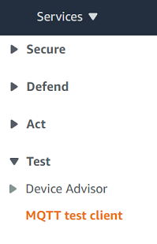
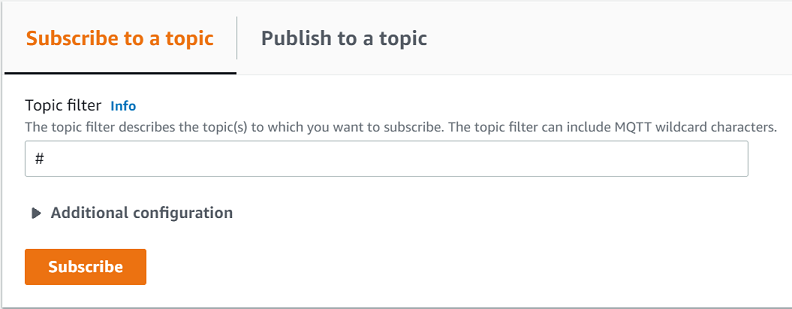
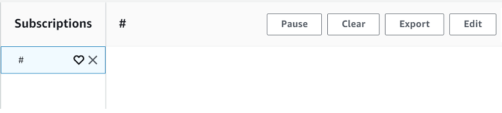
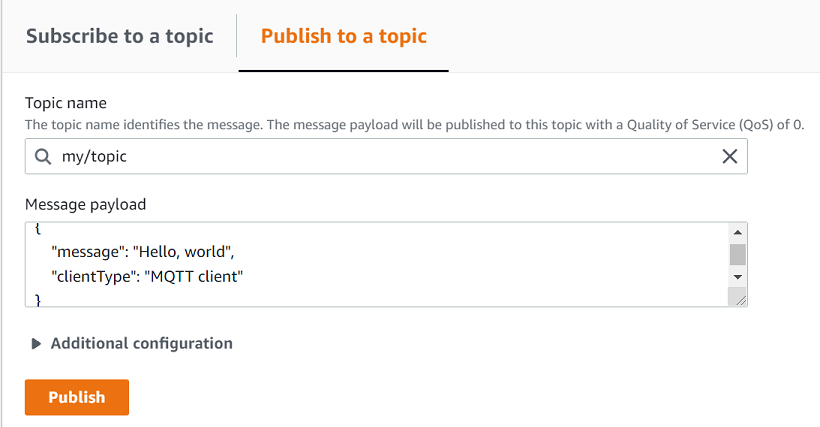
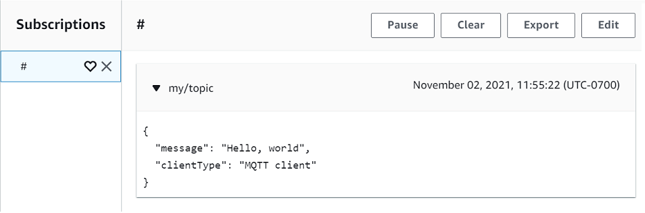
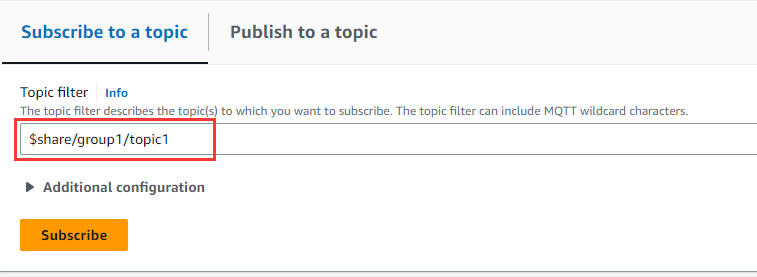
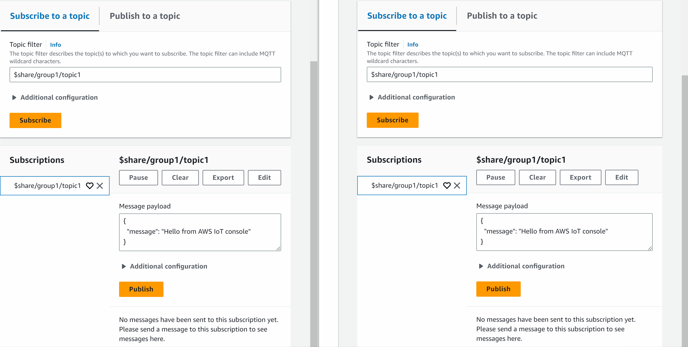

# View MQTT messages with the AWS IoT MQTT

client

This section describes how to use the AWS IoT MQTT test client in the [AWS IoT console](https://console.aws.amazon.com/iot/home "https://console.aws.amazon.com/iot/home") to watch the
MQTT messages sent and received by AWS IoT. The example used in this section relates to
the examples used in [Getting started with AWS IoT Core tutorials](iot-gs.md "iot-gs.md"); however, you can
replace the `topicName` used in the examples with any [topic name or topic filter](topics.md "topics.md") used by your IoT solution.

Devices publish MQTT messages that are identified by [topics](topics.md "topics.md") to communicate their state to AWS IoT, and AWS IoT publishes MQTT
messages to inform the devices and apps of changes and events. You can use the MQTT
client to subscribe to these topics and watch the messages as they occur. You can also
use the MQTT test client to publish MQTT messages to subscribed devices and services in
your AWS account.

###### Contents

- [Viewing MQTT messages in the MQTT
  client](#view-mqtt-subscribe "#view-mqtt-subscribe")
- [Publishing MQTT messages from the MQTT
  client](#view-mqtt-publish "#view-mqtt-publish")
- [Testing Shared Subscriptions in the
  MQTT client](#view-mqtt-shared-subscriptions "#view-mqtt-shared-subscriptions")

## Viewing MQTT messages in the MQTT

client

The following procedure explains how to subscribe to a specific MQTT topic that
your device publishes messages to and view those messages in the [AWS IoT console](https://console.aws.amazon.com/iot/home "https://console.aws.amazon.com/iot/home").

###### To view MQTT messages in the MQTT test client

1. In the [AWS IoT
   console](https://console.aws.amazon.com/iot/home "https://console.aws.amazon.com/iot/home"), in the left menu, choose **Test** and
   then choose **MQTT test client**.

 2. In the **Subscribe to a topic** tab, enter the
`topicName` to subscribe to the topic on which
your device publishes. For the getting started sample app, subscribe to
`#`, which subscribes to all message topics.

Continuing with the getting started example, on the **Subscribe to
a topic** tab, in the **Topic filter** field,
enter `#`, and then choose
**Subscribe**.



The topic message log page, **#** opens and
`#` appears in the
**Subscriptions** list. If the device that you
configured in [Configure your device](configure-device.md "configure-device.md") is running the example
program, you should see the messages it sends to AWS IoT in the
**#** message log. The message log entries will appear
below the **Publish** section when messages with the
subscribed topic are received by AWS IoT.

 3. On the **#** message log page, you can also publish
messages to a topic, but you'll need to specify the topic name. You cannot
publish to the **#** topic.

Messages published to subscribed topics appear in the message log as they
are received, with the most recent message first.

### Troubleshooting MQTT messages

###### Use the wild card topic filter

If your messages are not showing up in the message log as you expect, try
subscribing to a wild card topic filter as described in [Topic name filters](topics.md#topicfilters "topics.md#topicfilters"). The MQTT
multi-level wild card topic filter is the hash or pound sign
( `#` ) and can be used as the topic filter in the
**Subscription topic** field.

Subscribing to the `#` topic filter subscribes to every topic
received by the message broker. You can narrow the filter down by replacing
elements of the topic filter path with a `#` multi-level wild card
character or the '+' single-level wild-card character.

###### When using wild cards in a topic filter

- The multi-level wild card character must be the last character in the
  topic filter.
- The topic filter path can have only one single-level wild card
  character per topic level.

For example:

| Topic filter        | Displays messages with                                                                                             |
| ------------------- | ------------------------------------------------------------------------------------------------------------------ |
| `#`                 | Any topic name                                                                                                     |
| `topic_1/#`         | A topic name that starts with<br>`topic_1/`                                                                        |
| `topic_1/level_2/#` | A topic name that starts with<br>`topic_1/level_2/`                                                                |
| `topic_1/+/level_3` | A topic name that starts with `topic_1/`, ends<br>with `/level_3`, and has one element of any value<br>in between. |

For more information on topic filters, see [Topic name filters](topics.md#topicfilters "topics.md#topicfilters").

###### Check for topic name errors

MQTT topic names and topic filters are case sensitive. If, for example,
your device is publishing messages to `Topic_1` (with a capital
_T_) instead of `topic_1`, the topic to
which you subscribed, its messages would not appear in the MQTT test client.
Subscribing to the wild card topic filter, however would show that the
device is publishing messages and you could see that it was using a topic
name that was not the one you expected.

## Publishing MQTT messages from the MQTT

client

###### To publish a message to an MQTT topic

1. On the MQTT test client page, in the **Publish to a
   topic** tab, in the **Topic name** field,
   enter the `topicName` of your message. In this
   example, use `my/topic`.

###### Note

Do not use personally identifiable information in topic names, whether
using them in the MQTT test client or in your system implementation.
Topic names can appear in unencrypted communications and reports. 2. In the message payload window, enter the following JSON:

```
{
    "message": "Hello, world",
    "clientType": "MQTT test client"
}
```

3. Choose **Publish** to publish your message to
   AWS IoT.

###### Note

Make sure you are subscribed to the **my/topic**
topic before publishing your message.

 4. In the **Subscriptions** list, choose
**my/topic** to see the message. You should see the
message appear in the MQTT test client below the publish message payload
window.



You can publish MQTT messages to other topics by changing the
`topicName` in the **Topic name**
field and choosing the **Publish** button.

###### Important

When you create multiple subscriptions with overlapping topics (e.g.,
probe1/temperature and probe1/#), there is a possibility that a single message
published to a topic matching both subscriptions will be delivered multiple times,
once for each overlapping subscription.

## Testing Shared Subscriptions in the

MQTT client

This section describes how to use the AWS IoT MQTT client in the [AWS IoT console](https://console.aws.amazon.com/iot/home "https://console.aws.amazon.com/iot/home") to watch the
MQTT messages sent and received by AWS IoT using Shared Subscriptions. [Shared subscriptions](mqtt.md#mqtt5-shared-subscription "mqtt.md#mqtt5-shared-subscription") allow multiple clients to share a
subscription to a topic with only one client receiving messages published to that
topic using a random distribution. To simulate multiple MQTT clients (in this
example, two MQTT clients) sharing the same subscription, you open the AWS IoT MQTT
client in the [AWS IoT
console](https://console.aws.amazon.com/iot/home "https://console.aws.amazon.com/iot/home") from multiple web browsers. The example used in this section
doesn't relate to the examples used in [Getting started with AWS IoT Core tutorials](iot-gs.md "iot-gs.md"). For more information, see [Shared
Subscriptions](mqtt.md#mqtt5-shared-subscription "mqtt.md#mqtt5-shared-subscription").

###### To share a subscription to an MQTT topic

1. In the [AWS IoT
   console](https://console.aws.amazon.com/iot/home "https://console.aws.amazon.com/iot/home"), in the navigation pane, choose
   **Test** and then choose **MQTT test
   client**.
2. In the **Subscribe to a topic** tab, enter the
   `topicName` to subscribe to the topic on which
   your device publishes. To use Shared Subscriptions, subscribe to a Shared
   Subscription's topic filter as follows:

```
$share/{ShareName}/{TopicFilter}
```

An example topic filter can be
`$share/group1/topic1`, which subscribes to the message
topic `topic1`.

 3. Open another web browser and repeat step1 and step2. In this way, you are
simulating two different MQTT clients that share the same subscription
`$share/group1/topic1`. 4. Choose one MQTT client, in the **Publish to a topic**
tab, in the **Topic name** field, enter the
`topicName` of your message. In this example,
use `topic1`. Try publishing the message a few times.
From the **Subscriptions** list of both MQTT clients, you
should be able to see that the clients receive the message using a random
distribution. In this example, we publish the same message "Hello from AWS IoT
console" three times. The MQTT client on the left received the message twice
and the MQTT client on the right received the message once.


