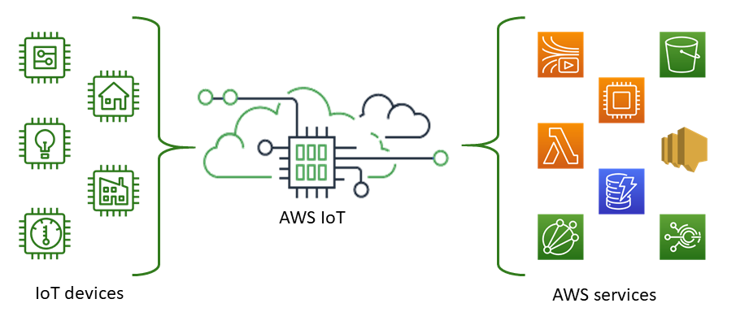

# What is AWS IoT?

AWS IoT provides the cloud services that connect your IoT devices to other devices and AWS
cloud services. AWS IoT provides device software that can help you integrate your IoT devices
into AWS IoT-based solutions. If your devices can connect to AWS IoT, AWS IoT can connect them to
the cloud services that AWS provides.

For a hands-on introduction to AWS IoT, visit [Getting started with AWS IoT Core tutorials](iot-gs.md "iot-gs.md").

With AWS IoT, you can select the most appropriate and up-to-date technologies for your solution.
To help you manage and support your IoT devices in the field, AWS IoT Core supports these
protocols:

- [MQTT (Message Queuing and Telemetry Transport)](mqtt.md "mqtt.md")
- [MQTT over WSS (Websockets Secure)](mqtt.md "mqtt.md")
- [HTTPS (Hypertext Transfer Protocol - Secure)](http.md "http.md")
- [LoRaWAN (Long
  Range Wide Area Network)](../../../iot-wireless/latest/developerguide/what-is-iot-lorawan.md "../../../iot-wireless/latest/developerguide/what-is-iot-lorawan.md")
  The AWS IoT Core message broker supports devices and clients that use MQTT and MQTT over WSS
  protocols to publish and subscribe to messages. It also supports devices and clients that
  use the HTTPS protocol to publish messages.

AWS IoT Core for LoRaWAN helps you connect and manage wireless LoRaWAN (low-power long-range Wide
Area Network) devices. AWS IoT Core for LoRaWAN replaces the need for you to develop and operate a
LoRaWAN Network Server (LNS).

If you don't require AWS IoT features such as device communications, [rules](iot-rules.md "iot-rules.md"), or [jobs](iot-jobs.md "iot-jobs.md"), see [AWS Messaging](https://aws.amazon.com/messaging/ "https://aws.amazon.com/messaging/") for information about
other AWS IoT messaging services that might better fit your requirements.

## How your devices and apps access AWS IoT

AWS IoT provides the following interfaces for [AWS IoT tutorials](iot-tutorials.md "iot-tutorials.md"):

- **AWS IoT Device SDKs**—Build applications on your
  devices that send messages to and receive messages from AWS IoT. For more
  information, see [AWS IoT Device SDKs, Mobile SDKs, and AWS IoT Device Client](iot-sdks.md "iot-sdks.md").
- **AWS IoT Core for LoRaWAN**—Connect and manage your long range
  WAN (LoRaWAN) devices and gateways by using [AWS IoT Core for LoRaWAN](../../../iot-wireless/latest/developerguide/what-is-iot-lorawan.md "../../../iot-wireless/latest/developerguide/what-is-iot-lorawan.md").
- **AWS Command Line Interface (AWS CLI)**—Run commands for AWS IoT on
  Windows, macOS, and Linux. These commands allow you to create and manage thing
  objects, certificates, rules, jobs, and policies. To get started, see the
  [AWS Command Line Interface User Guide](../../../cli/latest/userguide.md "../../../cli/latest/userguide.md"). For more information about the commands for AWS IoT, see [iot](../../../cli/latest/reference/iot/index.md "../../../cli/latest/reference/iot/index.md") in the
  _AWS CLI Command Reference_.
- **AWS IoT API**—Build your IoT applications using HTTP or
  HTTPS requests. These API actions allow you to programmatically create and
  manage thing objects, certificates, rules, and policies. For more information
  about the API actions for AWS IoT, see [Actions](../apireference/API_Operations.md "../apireference/API_Operations.md") in the
  _AWS IoT API Reference_.
- **AWS SDKs**—Build your IoT applications using
  language-specific APIs. These SDKs wrap the HTTP/HTTPS API and allow you to
  program in any of the supported languages. For more information, see [AWS SDKs and Tools](http://aws.amazon.com/tools/#sdk "http://aws.amazon.com/tools/#sdk").

You can also access AWS IoT through the [AWS IoT console](https://console.aws.amazon.com/iot/home "https://console.aws.amazon.com/iot/home"), which provides a graphical user interface (GUI) through
which you can configure and manage the thing objects, certificates, rules, jobs,
policies, and other elements of your IoT solutions.
