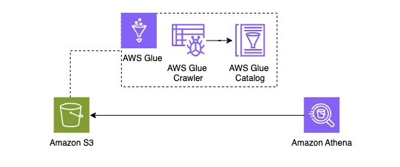

End of support notice:
On December 15, 2025, AWS will end support for AWS IoT Analytics. After December 15, 2025, you will no longer
be able to access the AWS IoT Analytics console, or AWS IoT Analytics resources.
For more information, see
[AWS IoT Analytics end of support](iotanalytics-end-of-support.md "iotanalytics-end-of-support.md").

# Run on-demand queries for both patterns

As you migrate your AWS IoT Analytics workloads to Amazon Kinesis Data Streams, or Amazon Data Firehose, leveraging AWS Glue and Amazon Athena
can further streamline your data analysis process. AWS Glue simplifies data preparation and
transformation, while Amazon Athena enables quick, serverless querying of your data.
Together, they provide a powerful, scalable, and cost-effective solution for analyzing AWS IoT data.

