End of support notice:
On December 15, 2025, AWS will end support for AWS IoT Analytics. After December 15, 2025, you will no longer
be able to access the AWS IoT Analytics console, or AWS IoT Analytics resources.
For more information, see
[AWS IoT Analytics end of support](iotanalytics-end-of-support.md "iotanalytics-end-of-support.md").

# Containerizing a notebook

This section includes information about how to build a Docker container using a Jupyter
notebook. There is a security risk if you re-use notebooks built by third parties: included
containers can execute arbitrary code with your user permissions. In addition, the HTML
generated by the notebook can be displayed in the AWS IoT Analytics console, providing a potential attack
vector on the computer displaying the HTML. Make sure you trust the author of any third-party
notebook before using it.

One option to perform advanced analytical functions is to use a [Jupyter Notebook](https://jupyter.org/ "https://jupyter.org/"). Jupyter Notebook provides powerful data science tools that can
perform machine learning and a range of statistical analyses. For more information, see [Notebook
templates](quickstart.md#aws-iot-analytics-notebook-templates "quickstart.md#aws-iot-analytics-notebook-templates"). (Note that we do not currently support containerization inside
JupyterLab.) You can package your Jupyter Notebook and libraries into a container that periodically runs
on a new batch of data as it is received by AWS IoT Analytics during a delta time window you define. You
can schedule an analysis job that uses the container and the new, segmented data captured
within the specified time window, then stores the job's output for future scheduled analytics.

If you have created a SageMaker AI Instance using the AWS IoT Analytics console after August 23, 2018, then
the installation of the containerization extension has been done for you automatically [and you
can begin creating a containerized image](automate.md#aws-iot-analytics-automate-containerized-image "automate.md#aws-iot-analytics-automate-containerized-image"). Otherwise, follow the steps listed in this
section to enable notebook containerization on your SageMaker AI instance. In what follows, you modify
your SageMaker AI Execution Role to allow you to upload the container image to Amazon EC2 and you install
the containerization extension.

## Enable containerization of notebook

instances not created via AWS IoT Analytics console

We recommend that you create a new SageMaker AI instance via the AWS IoT Analytics console instead of
following these steps. New instances automatically support containerization.

If you restart your SageMaker AI instance after enabling containerization as shown here, you
won't have to re-add the IAM roles and policies, but you must re-install the extension, as
shown in the final step.

1. To grant your notebook instance access to Amazon ECS, select your SageMaker AI instance on the
   SageMaker AI page:

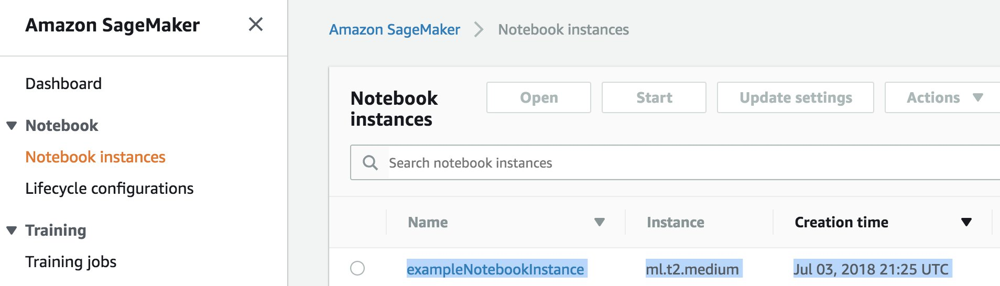 2. Under **IAM role ARN**, choose the SageMaker AI Execution Role.

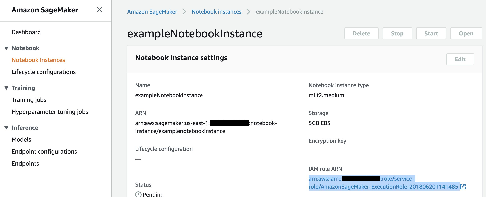 3. Choose **Attach Policy**, then define and attach the policy shown
in [Permissions](automate.md#aws-iot-analytics-automate-permissions "automate.md#aws-iot-analytics-automate-permissions"). If the `AmazonSageMakerFullAccess` policy is
not already attached, attach it as well.

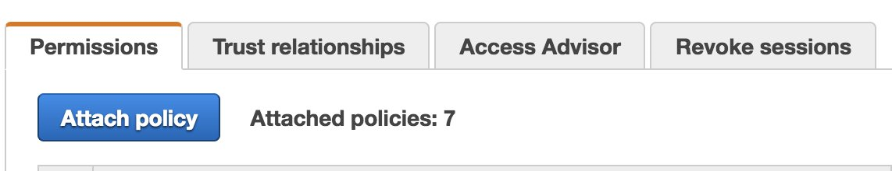

You also must download the containerization code from Amazon S3 and install it on your
notebook instance, The first step is to access the SageMaker AI instance's terminal.

1. Inside Jupyter, choose **New**.

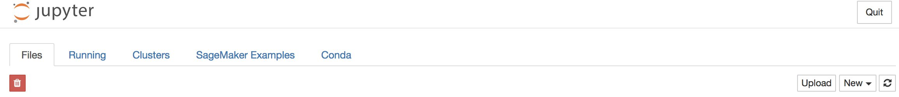 2. In the menu that appears, choose **Terminal**.

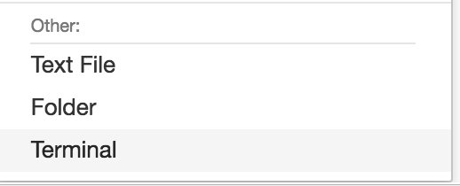 3. Inside the terminal, enter the following commands to download the code, unzip it,
and install it. Note that these commands kill any processes being run by your notebooks
on this SageMaker AI instance.

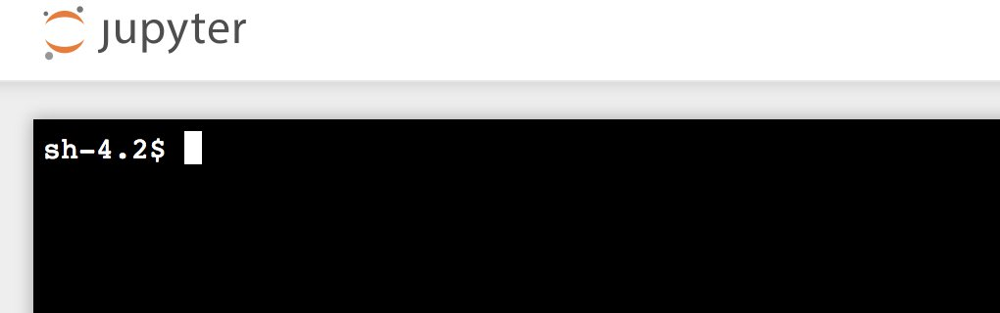

```
cd /tmp

aws s3 cp s3://iotanalytics-notebook-containers/iota_notebook_containers.zip /tmp

unzip iota_notebook_containers.zip

cd iota_notebook_containers

chmod u+x install.sh

./install.sh
```

Wait for a minute or two for the extension to be validated and installed.

## Update your notebook containerization

extension

If you created your SageMaker AI Instance via the AWS IoT Analytics console after August 23, 2018, then the
containerization extension was installed automatically. You can update the extension by
restarting your instance from SageMaker AI Console. If you installed the extension manually, then
you may update it by re-running the terminal commands listed in Enable Containerization Of
Notebook Instances Not Created Via AWS IoT Analytics Console.

## Create a containerized image

In this section we show the steps necessary to containerize a notebook. To begin, go to
your Jupyter Notebook to create a notebook with a containerized kernel.

1. In your Jupyter Notebook, choose **New**, then choose the kernel type you want
   from the dropdown list. (The kernel type should start with "Containerized" and end with
   whatever kernel you would have otherwise selected. For example, if you just want a plain
   Python 3.0 environment like "conda_python3", choose "Containerized
   conda_python3").

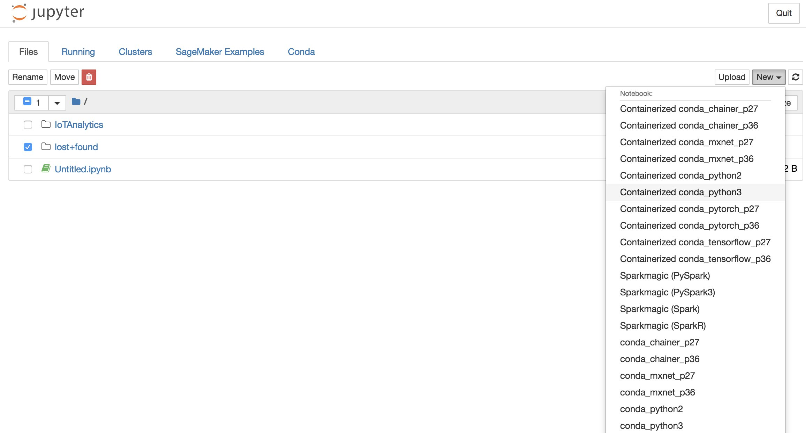 2. After you have completed work on your notebook and you want to containerize it,
choose **Containerize**.

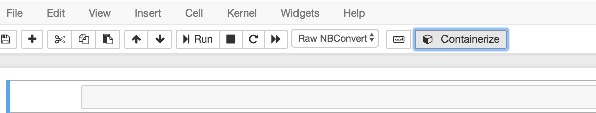 3. Enter a name for the containerized notebook. You can also enter an optional
description.

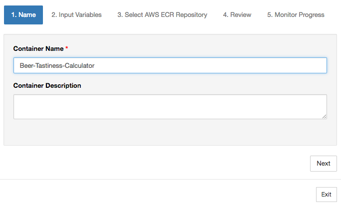 4. Specify the **Input Variables** (parameters) that your notebook
should be invoked with. You can select the input variables that are automatically
detected from your notebook or define custom variables. (Note that input variables are
only detected if you have previously executed your notebook.) For each input variable
choose a type. You can also enter an optional description of the input variable.

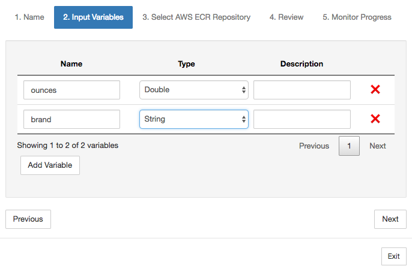 5. Choose the Amazon ECR repository where the image created from the notebook should be
uploaded.

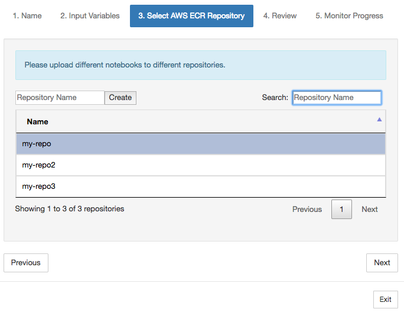 6. Choose **Containerize** to begin the process.

You are presented with an overview summarizing your input. Note that after you have
started the process you can't cancel it. The process might last up to an hour.

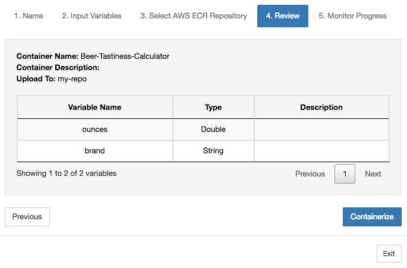 7. The next page shows the progress.

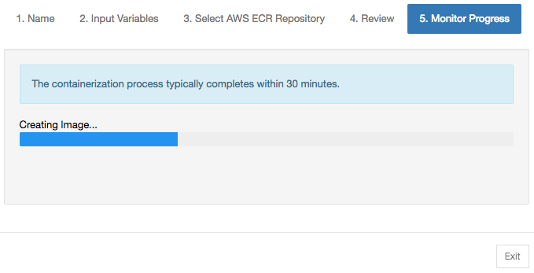 8. If you accidentally close your browser, you can monitor the status of the
containerization process from the **Notebooks** section of the AWS IoT Analytics
console. 9. After the process is complete, the containerized image is stored on Amazon ECR ready for
use.

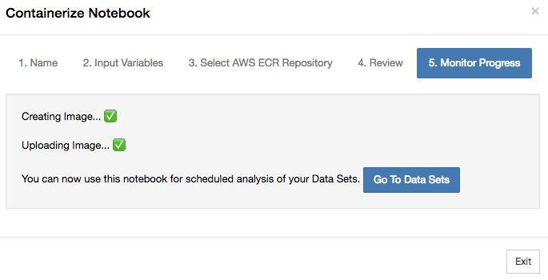
