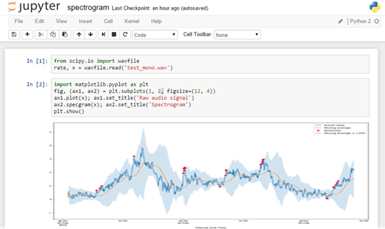
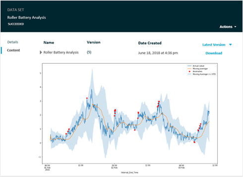
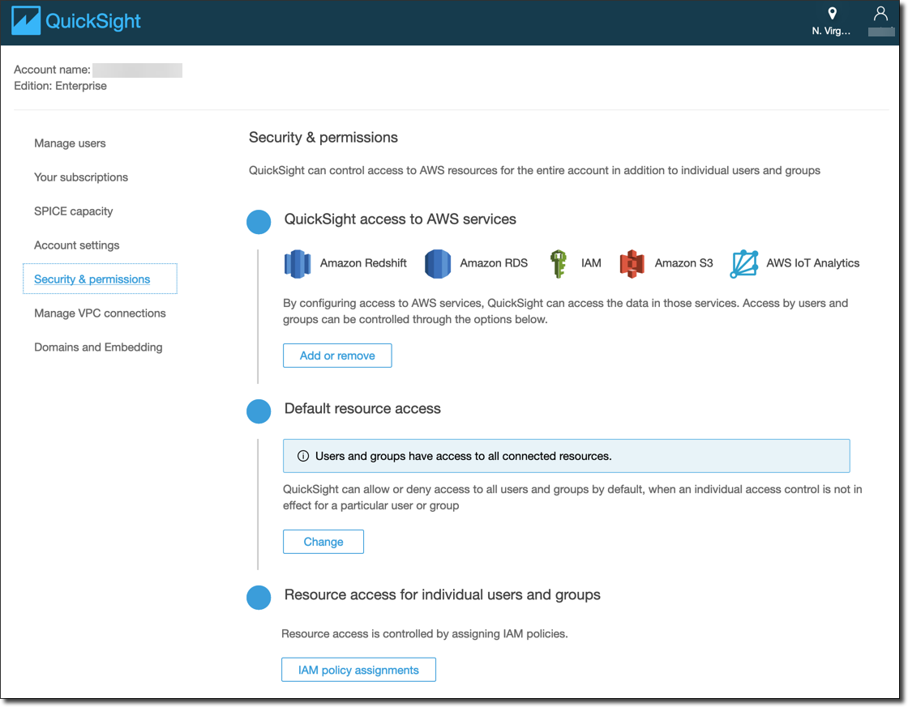
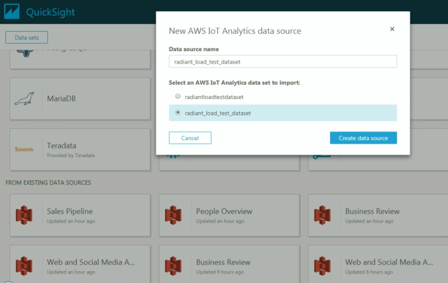
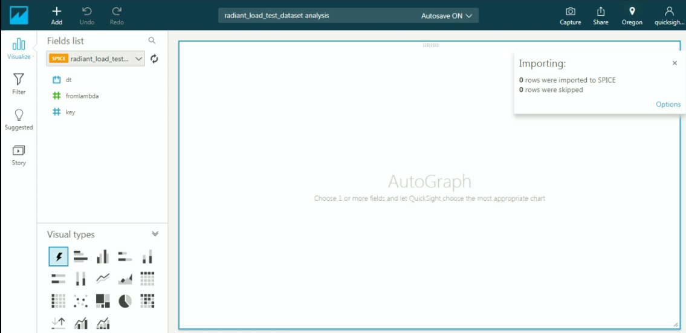

End of support notice:
On December 15, 2025, AWS will end support for AWS IoT Analytics. After December 15, 2025, you will no longer
be able to access the AWS IoT Analytics console, or AWS IoT Analytics resources.
For more information, see
[AWS IoT Analytics end of support](iotanalytics-end-of-support.md "iotanalytics-end-of-support.md").

# Visualizing AWS IoT Analytics data

To visualize your AWS IoT Analytics data, you can use the AWS IoT Analytics console or Quick Suite.

###### Topics

- [Visualizing AWS IoT Analytics data with the console](#visualization-console "#visualization-console")
- [Visualizing AWS IoT Analytics data with Quick Suite](#visualization-quicksight "#visualization-quicksight")

## Visualizing AWS IoT Analytics data with the console

AWS IoT Analytics can embed the HTML output of your container dataset (found in the file
`output.html`) on the container dataset content page of the [AWS IoT Analytics console](https://console.aws.amazon.com/iotanalytics/ "https://console.aws.amazon.com/iotanalytics/"). For example, if you define a
container dataset that runs a Jupyter notebook, and you create a visualization in your Jupyter notebook,
your dataset might look like the following.

Then, after the container dataset content is created, you can view this visualization on
the console's **Data Set** content page.

For information about creating a container dataset that runs a Jupyter notebook, see
[Automating your workflow](automate.md#aws-iot-analytics-automate "automate.md#aws-iot-analytics-automate").

## Visualizing AWS IoT Analytics data with Quick Suite

AWS IoT Analytics provides direct integration with [Quick Suite](https://aws.amazon.com/quicksight/ "https://aws.amazon.com/quicksight/"). Quick Suite is a fast business analytics service you can use to build visualizations,
perform ad-hoc analysis, and quickly get business insights from your data. Quick Suite enables
organizations to scale to hundreds of thousands of users, and delivers responsive performance by
using a robust in-memory engine (SPICE). You can select your AWS IoT Analytics datasets in the Quick Suite console
and start creating dashboards and visualizations. Quick Suite is available in [these Regions](../../../general/latest/gr/quicksight.md "../../../general/latest/gr/quicksight.md").

To get started with your Quick Suite visualizations, you must create a Quick Suite account. Make sure you
give Quick Suite access to your AWS IoT Analytics data when you set up you account. If you already have an account,
give Quick Suite access your AWS IoT Analytics data by choosing **Admin**, **Manage
QuickSight**, **Security & permissions**. Under
**QuickSight access to AWS services**, choose **Add or
remove**, then select the check box next to **AWS IoT Analytics** and choose
**Update**.

After your account is set up, from the admin Quick Suite console page choose **New
Analysis** and **New data set**, and then choose AWS IoT Analytics as the source.
Enter a name for your data source, choose a dataset to import, and then choose **Create
data source**.

After your data source is created, you can create visualizations in Quick Suite.

For information about Quick Suite dashboards and datasets, see the [Quick Suite documentation](../../../quicksight/index.md "../../../quicksight/index.md").
