End of support notice:
On December 15, 2025, AWS will end support for AWS IoT Analytics. After December 15, 2025, you will no longer
be able to access the AWS IoT Analytics console, or AWS IoT Analytics resources.
For more information, see
[AWS IoT Analytics end of support](iotanalytics-end-of-support.md "iotanalytics-end-of-support.md").

# Step 2: Export previously ingested data

For data previously ingested and stored in AWS IoT Analytics, you’ll need to export it to Amazon S3. To simplify this process, you can use a AWS CloudFormation
template to automate the entire data export workflow. You can use the script for partial (time range-based) data extraction.

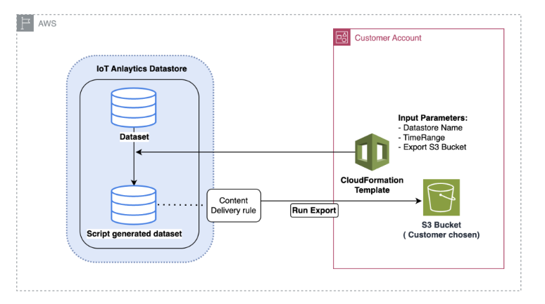

## AWS CloudFormation template to export data to Amazon S3

The diagram above illustrates the process of using a AWS CloudFormation template to create a dataset within the same AWS IoT Analytics datastore,
enabling selection based on a timestamp. This allows users to retrieve specific data points within a desired timeframe.
Additionally, a Content Delivery Rule is created to export the data into an Amazon S3 bucket.

The procedure below illustrates the steps.

1. Prepare the AWS CloudFormation template and save it as a YAML file. For example, `migrate-datasource.yaml`.

```

# Cloudformation Template to migrate an AWS IoT Analytics datastore to an external dataset
AWSTemplateFormatVersion: 2010-09-09
Description: Migrate an AWS IoT Analytics datastore to an external dataset
Parameters:
  DatastoreName:
    Type: String
    Description: The name of the datastore to migrate.
    AllowedPattern: ^[a-zA-Z0-9_]+$
  TimeRange:
    Type: String
    Description: |
      This is an optional argument to split the source data into multiple files.
      The value should follow the SQL syntax of WHERE clause.
      E.g. WHERE DATE(Item_TimeStamp) BETWEEN '09/16/2010 05:00:00' and '09/21/2010 09:00:00'.
    Default: ''
  MigrationS3Bucket:
    Type: String
    Description: The S3 Bucket where the datastore will be migrated to.
    AllowedPattern: (?!(^xn--|.+-s3alias$))^[a-z0-9][a-z0-9-]{1,61}[a-z0-9]$
  MigrationS3BucketPrefix:
    Type: String
    Description: The prefix of the S3 Bucket where the datastore will be migrated to.
    Default: ''
    AllowedPattern: (^([a-zA-Z0-9.\-_]*\/)*$)|(^$)
Resources:
  # IAM Role to be assumed by the AWS IoT Analytics service to access the external dataset
  DatastoreMigrationRole:
    Type: AWS::IAM::Role
    Properties:
      AssumeRolePolicyDocument:
        Version: 2012-10-17
        Statement:
          - Effect: Allow
            Principal:
              Service: iotanalytics.amazonaws.com
            Action: sts:AssumeRole
      Policies:
        - PolicyName: AllowAccessToExternalDataset
          PolicyDocument:
            Version: 2012-10-17
            Statement:
              - Effect: Allow
                Action:
                  - s3:GetBucketLocation
                  - s3:GetObject
                  - s3:ListBucket
                  - s3:ListBucketMultipartUploads
                  - s3:ListMultipartUploadParts
                  - s3:AbortMultipartUpload
                  - s3:PutObject
                  - s3:DeleteObject
                Resource:
                  - !Sub arn:aws:s3:::${MigrationS3Bucket}
                  - !Sub arn:aws:s3:::${MigrationS3Bucket}/${MigrationS3BucketPrefix}*

  # This dataset that will be created in the external S3 Export
  MigratedDataset:
    Type: AWS::IoTAnalytics::Dataset
    Properties:
      DatasetName: !Sub ${DatastoreName}_generated
      Actions:
        - ActionName: SqlAction
          QueryAction:
            SqlQuery: !Sub SELECT * FROM ${DatastoreName} ${TimeRange}
      ContentDeliveryRules:
        - Destination:
            S3DestinationConfiguration:
              Bucket: !Ref MigrationS3Bucket
              Key: !Sub ${MigrationS3BucketPrefix}${DatastoreName}/!{iotanalytics:scheduleTime}/!{iotanalytics:versionId}.csv
              RoleArn: !GetAtt DatastoreMigrationRole.Arn
      RetentionPeriod:
        Unlimited: true
      VersioningConfiguration:
        Unlimited: true

```

2. Determine the AWS IoT Analytics datastore that requires data to be exported. For this guide, we will use a sample datastore named `iot_analytics_datastore`.

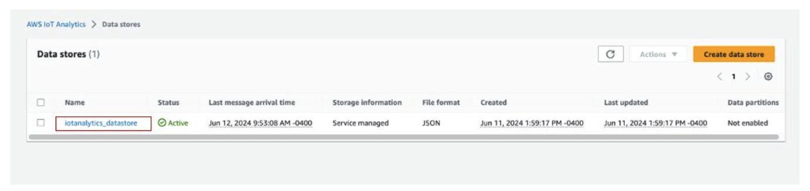 3. Create or identify an Amazon S3 bucket where the data will be exported. For this guide, we will use the `iot-analytics-export` bucket.

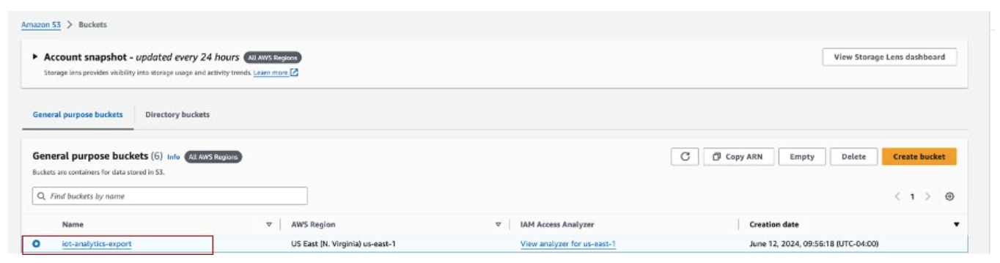 4. Create the AWS CloudFormation stack.

    * Navigate to the [https://console.aws.amazon.com/cloudformation](https://console.aws.amazon.com/cloudformation/ "https://console.aws.amazon.com/cloudformation/").
    * Click on **Create stack** and select
     **With new resources (standard)**.
    * Upload the `migrate-datasource.yaml` file.

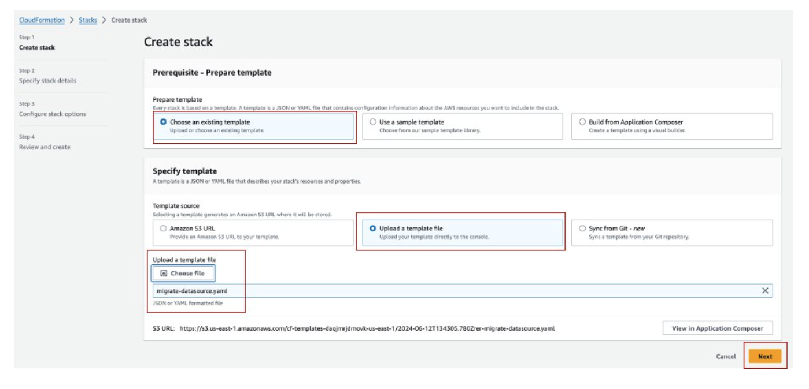 5. Enter a stack name and provide the following parameters:

    * **DatastoreName**: The name of the AWS IoT Analytics datastore you want to migrate.
    * **MigrationS3Bucket**: The Amazon S3 bucket where the migrated data is stored.
    * **MigrationS3BucketPrefix** (Optional) : The prefix for the Amazon S3 bucket.
    * **TimeRange** (Optional) : A `SQL WHERE` clause to filter the data being exported,
     allowing for splitting the source data into multiple files based on the specified time range.

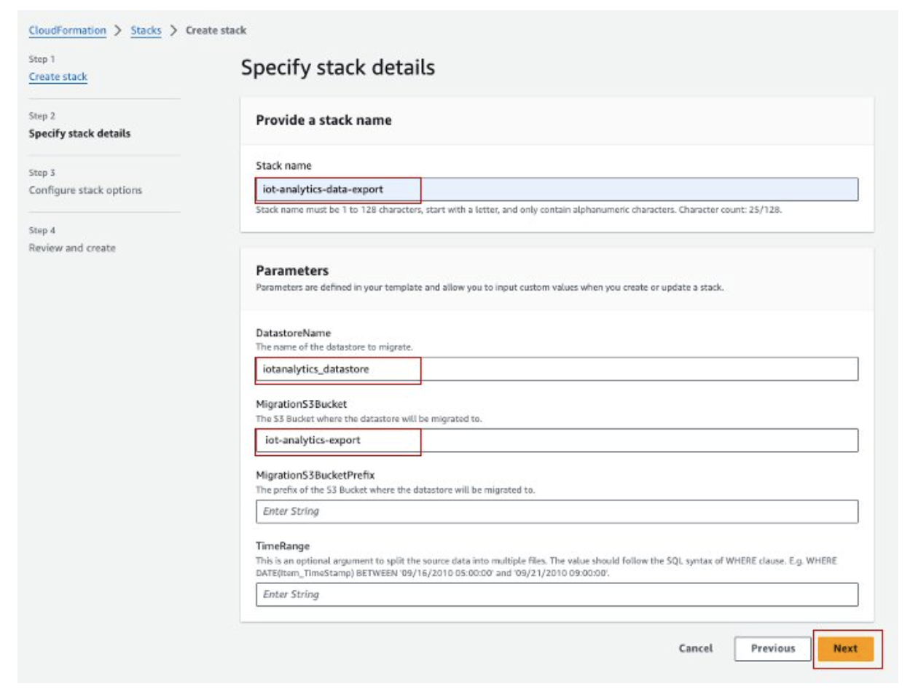 6. Click **Next** on the Configure stack options screen. 7. Selecting the checkbox to acknowledge creating IAM resources, and click **Submit**.

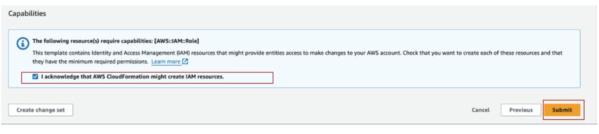 8. Review stack creation on the **Events** tab for completion.

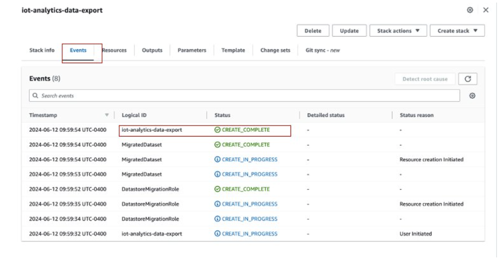 9. On successful stack completion, navigate to **AWS IoT Analytics → Datasets** to view the migrated dataset.

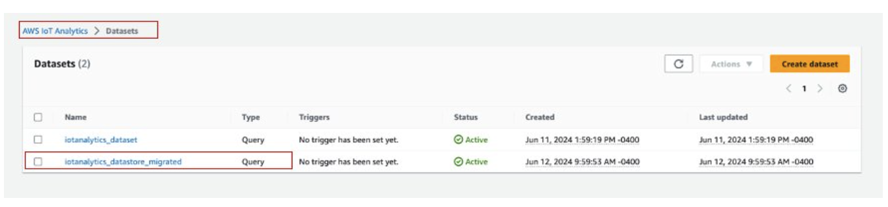 10. Select the generated dataset, and click **Run now** to export the dataset.

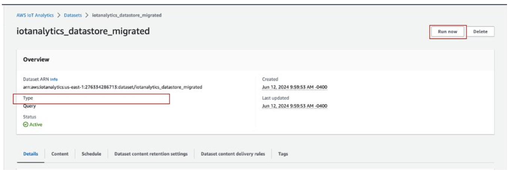 11. The content can be viewed on the **Content** tab of the dataset.

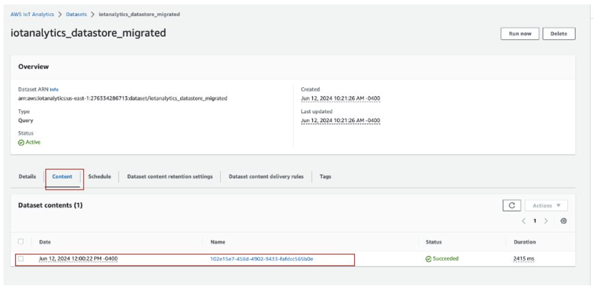 12. Finally, review the exported content by opening the **iot-analytics-export** bucket in the Amazon S3 console.

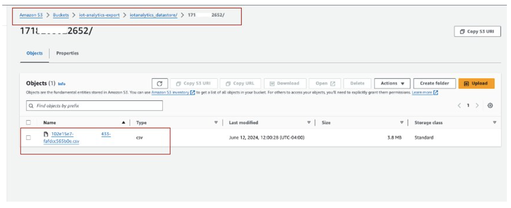
