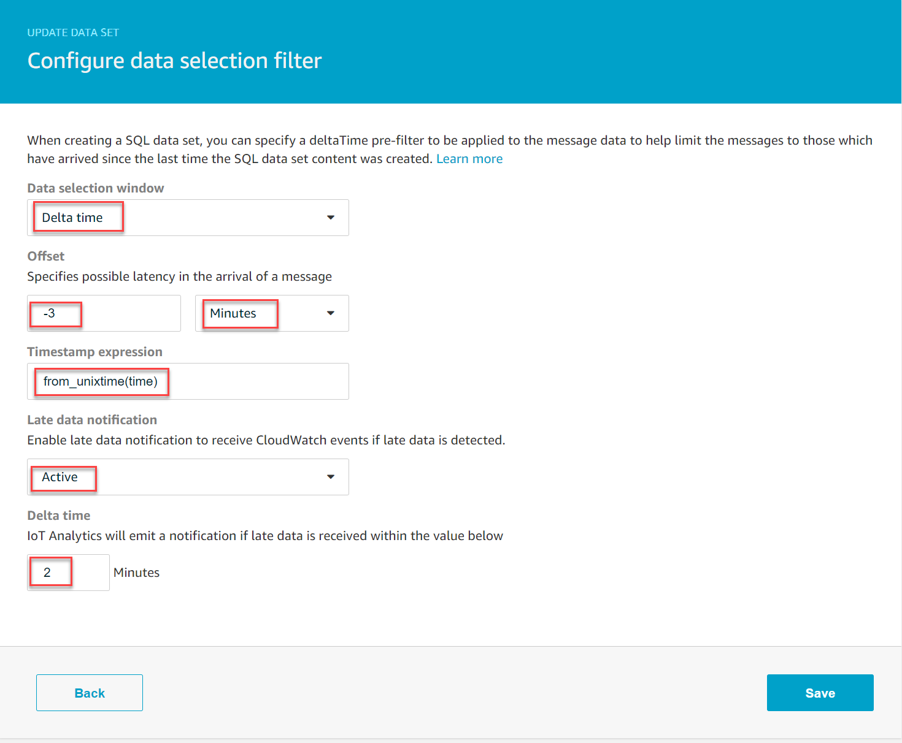

End of support notice:
On December 15, 2025, AWS will end support for AWS IoT Analytics. After December 15, 2025, you will no longer
be able to access the AWS IoT Analytics console, or AWS IoT Analytics resources.
For more information, see
[AWS IoT Analytics end of support](iotanalytics-end-of-support.md "iotanalytics-end-of-support.md").

# Getting late data notifications through Amazon CloudWatch Events

When you create dataset contents using data from a specified time frame, some data might not
arrive in time for processing. To allow for a delay, you can specify a `deltaTime`
offset for the `QueryFilter` when you [create a dataset](../APIReference/API_CreateDataset.md "../APIReference/API_CreateDataset.md") by applying a
`queryAction` (a SQL query). AWS IoT Analytics still processes the data that arrives within the
delta time, and your dataset contents have a time lag. The late data notification feature enables
AWS IoT Analytics to send notifications through [Amazon CloudWatch Events](../../../AmazonCloudWatch/latest/events/WhatIsCloudWatchEvents.md "../../../AmazonCloudWatch/latest/events/WhatIsCloudWatchEvents.md") when data arrives after the delta time.

You can use the AWS IoT Analytics console, [API](../APIReference.md "../APIReference.md"), [AWS Command Line Interface (AWS CLI)](../../../cli/latest/reference/iotanalytics/index.md "../../../cli/latest/reference/iotanalytics/index.md"), or [AWS SDK](../../../iot/latest/developerguide/iot-sdks.md "../../../iot/latest/developerguide/iot-sdks.md") to specify late data rules for a
dataset.

In the AWS IoT Analytics API, the `LateDataRuleConfiguration` object represents the late data
rule settings of a dataset. This object is part of the `Dataset` object associated with
the `CreateDataset` and `UpdateDataset` API operations.

## Parameters

When you create a late data rule for a dataset with AWS IoT Analytics, you must specify the following
information:

**`ruleConfiguration` (`LateDataRuleConfiguration`)**

A structure that contains the configuration information of a late data rule.

**`deltaTimeSessionWindowConfiguration`**

A structure that contains the configuration information of a delta time session
window.

[DeltaTime](../APIReference/API_DeltaTime.md "../APIReference/API_DeltaTime.md") specifies a time
interval. You can use `DeltaTime` to create dataset contents with data that has
arrived in the data store since the last execution. For an example of
`DeltaTime`, see [Creating a SQL
dataset with a delta window (CLI)](automate-create-dataset.md#automate-example6 "automate-create-dataset.md#automate-example6").

**`timeoutInMinutes`**

A time interval. You can use `timeoutInMinutes` so that AWS IoT Analytics can batch
up late data notifications that have been generated since the last execution. AWS IoT Analytics
sends one batch of notifications to CloudWatch Events at one time.

Type: Integer

Valid range: 1-60

**`ruleName`**

The name of the late data rule.

Type: String

###### Important

To specify `lateDataRules`, the dataset must use a `DeltaTime`
filter.

## Configure late data rules (console)

The following procedure shows you how to configure the late data rule of a dataset in the
AWS IoT Analytics console.

###### To configure late data rules

1.  Sign in to the [AWS IoT Analytics
    console](https://console.aws.amazon.com/iotanalytics/ "https://console.aws.amazon.com/iotanalytics/").
2.  In the navigation pane, choose **Data sets**.
3.  Under **Data sets**, choose the target data set.
4.  In the navigation pane, choose **Details**.
5.  In the **Delta window** section, choose **Edit**.
6.  Under **Configure data selection filter**, do the following:

        1. For **Data selection window**, choose **Delta
         time**.
        2. For **Offset**, enter a time period, and then choose a unit.
        3. For **Timestamp expression**, enter an expression. This can be the name
         of a timestamp field or a SQL expression that can derive the time, such as
         `from_unixtime(time)`.


        For more information about how to write a timestamp expression,
        see [Date and Time Functions and Operators](https://prestodb.io/docs/0.172/functions/datetime.html "https://prestodb.io/docs/0.172/functions/datetime.html")
        in the *Presto 0.172 Documentation*.
        4. For **Late data notification**, choose
         **Active**.
        5. For **Delta time**, enter an integer. The valid range is 1-60.
        6. Choose **Save**.

    

## Configure late data rules (CLI)

In the AWS IoT Analytics API, the `LateDataRuleConfiguration` object represents the late data
rule settings of a dataset. This object is part of the `Dataset` object associated
with `CreateDataset` and `UpdateDataset`. You can use the [API](../APIReference.md "../APIReference.md"), [AWS CLI](../../../cli/latest/reference/iotanalytics/index.md "../../../cli/latest/reference/iotanalytics/index.md"), or [AWS SDK](../../../iot/latest/developerguide/iot-sdks.md "../../../iot/latest/developerguide/iot-sdks.md") to specify late
data rules for a dataset. The following example uses the AWS CLI.

To create your dataset with specified late data rules, run the following command. The
command assumes that the `dataset.json` file is in the current
directory.

###### Note

You can use the [UpdateDataset](../APIReference/API_UpdateDataset.md "../APIReference/API_UpdateDataset.md")
API to update an existing dataset.

```
aws iotanalytics create-dataset --cli-input-json file://dataset.json
```

The `dataset.json` file should contain the following:

- Replace `demo_dataset` with the target dataset name.
- Replace `demo_datastore` with the target data store name.
- Replace `from_unixtime(time)` with the name of a timestamp field
  or a SQL expression that can derive the time.

For more information about how to write a timestamp expression,
see [Date and Time Functions and Operators](https://prestodb.io/docs/0.172/functions/datetime.html "https://prestodb.io/docs/0.172/functions/datetime.html")
in the _Presto 0.172 Documentation_.

- Replace `timeout` with an integer between 1–60.
- Replace `demo_rule` with any name.

```
{
    "datasetName": "`demo_dataset`",
    "actions": [
        {
            "actionName": "`myDatasetAction`",
            "queryAction": {
                "filters": [
                    {
                        "deltaTime": {
                            "offsetSeconds": `-180`,
                            "timeExpression": "`from_unixtime(time)`"
                        }
                    }
                ],
                "sqlQuery": "SELECT * FROM `demo_datastore`"
            }
        }
    ],
    "retentionPeriod": {
        "unlimited": false,
        "numberOfDays": 90
    },
    "lateDataRules": [
        {
            "ruleConfiguration": {
                "deltaTimeSessionWindowConfiguration": {
                    "timeoutInMinutes": `timeout`
                }
            },
            "ruleName": "`demo_rule`"
        }
    ]
}
```

## Subscribing to receive late data notifications

You can create rules in CloudWatch Events that defines how to process late data notifications sent from
AWS IoT Analytics. When CloudWatch Events receives the notifications, it invokes specified the target actions defined in
your rules.

### Prerequisites for creating CloudWatch Events rules

Before you create a CloudWatch Events rule for AWS IoT Analytics, you should do the following:

- Familiarize yourself with events, rules, and targets in CloudWatch Events.
- Create and configure the [targets](../../../eventbridge/latest/userguide/eventbridge-targets.md "../../../eventbridge/latest/userguide/eventbridge-targets.md") invoked by your CloudWatch Events rules. Rules can invoke many types of targets, such as
  the following:

      + Amazon Kinesis streams
      + AWS Lambda functions
      + Amazon Simple Notification Service (Amazon SNS) topics
      + Amazon Simple Queue Service (Amazon SQS) queues

  Your CloudWatch Events rule, and the associated targets must be in the AWS Region where you created
  your AWS IoT Analytics resources. For more information, see [Service endpoints and quotas](../../../general/latest/gr/aws-service-information.md "../../../general/latest/gr/aws-service-information.md") in the
  _AWS General Reference_.

For more information, see [What is
CloudWatch Events?](../../../AmazonCloudWatch/latest/events/WhatIsCloudWatchEvents.md "../../../AmazonCloudWatch/latest/events/WhatIsCloudWatchEvents.md") and [Getting started with
Amazon CloudWatch Events](../../../AmazonCloudWatch/latest/events/CWE_GettingStarted.md "../../../AmazonCloudWatch/latest/events/CWE_GettingStarted.md") in the _Amazon CloudWatch Events User Guide_.

### Late data notification event

The event for late data notifications uses the following format.

```
{
	"version": "0",
	"id": "7f51dfa7-ffef-97a5-c625-abddbac5eadd",
	"detail-type": "IoT Analytics Dataset Lifecycle Notification",
	"source": "aws.iotanalytics",
	"account": "123456789012",
	"time": "2020-05-14T02:38:46Z",
	"region": "us-east-2",
	"resources": ["arn:aws:iotanalytics:us-east-2:123456789012:dataset/demo_dataset"],
	"detail": {
		"event-detail-version": "1.0",
		"dataset-name": "demo_dataset",
		"late-data-rule-name": "demo_rule",
		"version-ids": ["78244852-8737-4650-aa4d-3071a01338fa"],
		"message": null
	}
}
```

### Create a CloudWatch Events rule to receive late data

notifications

The following procedure shows you how to create a rule that sends AWS IoT Analytics late data
notifications to an Amazon SQS queue.

###### To create a CloudWatch Events rule

1. Sign in to the [Amazon CloudWatch
   console](https://console.aws.amazon.com/cloudwatch/ "https://console.aws.amazon.com/cloudwatch/").
2. In the navigation pane, under **Events**, choose
   **Rules**.
3. On the **Rules** page, choose **Create rule**.
4. Under **Event Source**, choose **Event
   Pattern**.
5. In the **Build event pattern to match events by service** section, do
   the following:
   1. For **Service Name**, choose **IoT Analytics**
   2. For **Event Type**, choose **IoT Analytics Dataset Lifecycle
      Notification**.
   3. Choose **Specific dataset name(s)**, and then enter the name of the
      target dataset.

6. Under **Targets**, choose **Add target\***.
7. Choose **SQS queue**, and then do the following:
   1. For **Queue\***, choose the target queue.

8. Choose **Configure details**.
9. On the **Step 2: Configure rule details** page, enter a name and a
   description.
10. Choose **Create rule**.
