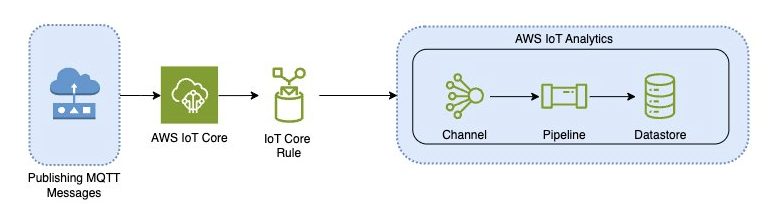

End of support notice:
On December 15, 2025, AWS will end support for AWS IoT Analytics. After December 15, 2025, you will no longer
be able to access the AWS IoT Analytics console, or AWS IoT Analytics resources.
For more information, see
[AWS IoT Analytics end of support](iotanalytics-end-of-support.md "iotanalytics-end-of-support.md").

# Migration guide

In the current architecture, AWS IoT data flows from AWS IoT Core to AWS IoT Analytics through an AWS IoT Core rule. AWS IoT Analytics
handles ingestion, transformation, and storage.

To complete the migration follow two steps:

###### Topics

- [Step 1: Redirect ongoing data ingestion](redirect-ongoing-data.md "redirect-ongoing-data.md")
- [Step 2: Export previously ingested data](export-previous-data.md "export-previous-data.md")
- [Run on-demand queries for both patterns](ad-hoc-both-patterns.md "ad-hoc-both-patterns.md")
- [Summary](summary.md "summary.md")
