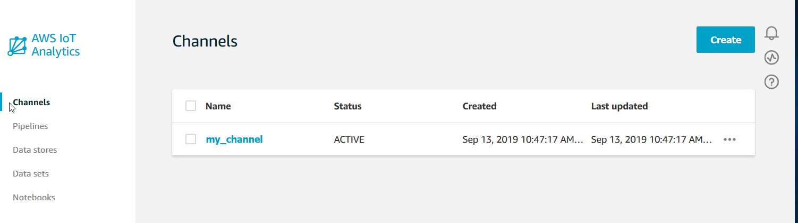
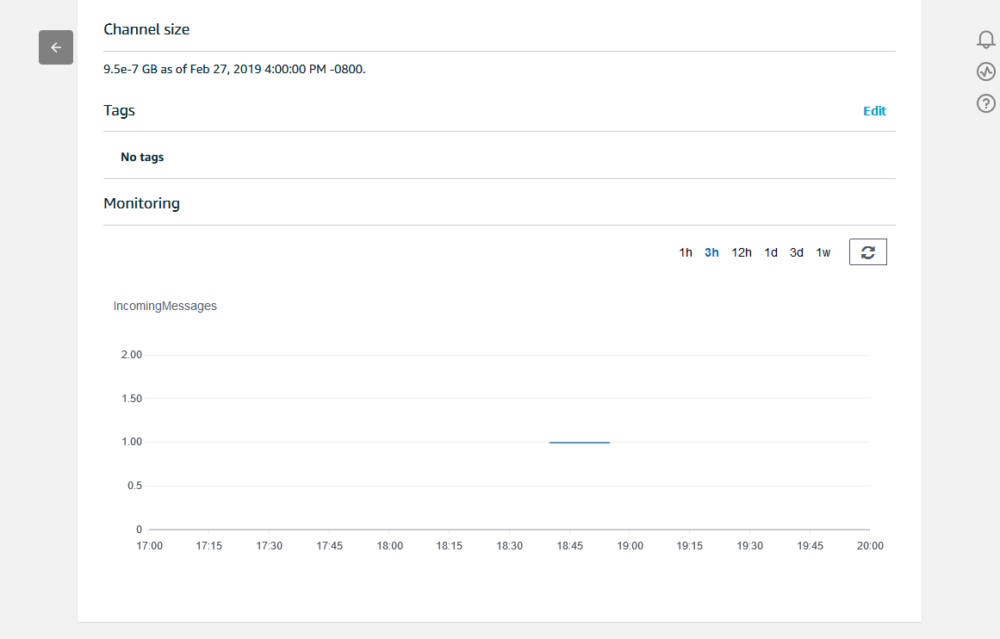
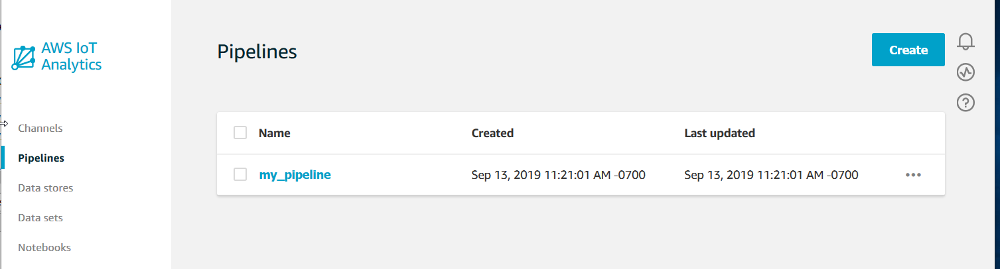
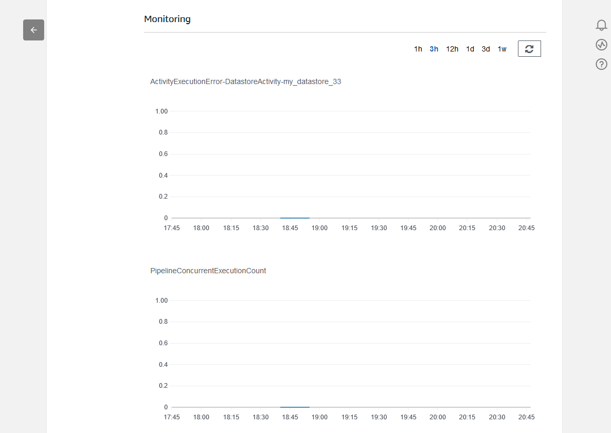

End of support notice:
On December 15, 2025, AWS will end support for AWS IoT Analytics. After December 15, 2025, you will no longer
be able to access the AWS IoT Analytics console, or AWS IoT Analytics resources.
For more information, see
[AWS IoT Analytics end of support](iotanalytics-end-of-support.md "iotanalytics-end-of-support.md").

# Monitoring the ingested data

You can check that the messages you sent are being ingested into your channel by using the
AWS IoT Analytics console.

1. In the [AWS IoT Analytics console](https://console.aws.amazon.com/iotanalytics/ "https://console.aws.amazon.com/iotanalytics/"), in the left
   navigation pane, choose **Prepare** and (if necessary) choose
   **Channel**, then choose the name of the channel you
   created earlier.

 2. On the channel detail page, scroll down to the **Monitoring** section.
Adjust the displayed time frame as necessary by choosing one of the time frame
indicators (**1h 3h 12h 1d 3d 1w**). You should see a graph
line indicating the number of messages ingested into this channel during the
specified time frame.

A similar monitoring capability exists for checking pipeline activity executions. You can
monitor activity execution errors on the pipeline's detail page. If you haven't
specified activities as part of your pipeline, then 0 execution errors should be
displayed.

1. In the [AWS IoT Analytics console](https://console.aws.amazon.com/iotanalytics/ "https://console.aws.amazon.com/iotanalytics/"), in the left
   navigation pane, choose **Prepare** and then choose
   **Pipelines**, then choose the name of a pipeline you
   created earlier.

 2. On the pipeline detail page, scroll down to the **Monitoring** section.
Adjust the displayed time frame as necessary by choosing one of the time frame
indicators (**1h 3h 12h 1d 3d 1w**). You should see a graph
line indicating the number of pipeline activity execution errors during the
specified time frame.

