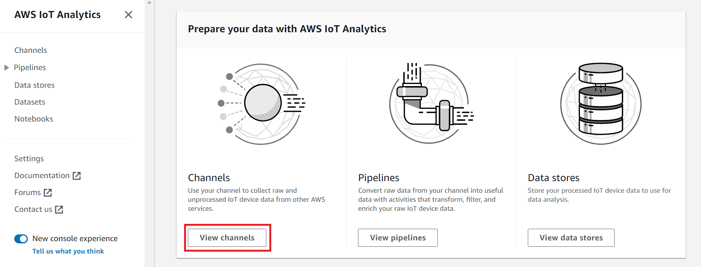

End of support notice:
On December 15, 2025, AWS will end support for AWS IoT Analytics. After December 15, 2025, you will no longer
be able to access the AWS IoT Analytics console, or AWS IoT Analytics resources.
For more information, see
[AWS IoT Analytics end of support](iotanalytics-end-of-support.md "iotanalytics-end-of-support.md").

# Getting started with AWS IoT Analytics (console)

Use this tutorial to create the AWS IoT Analytics resources (also known as components) that you need to
discover useful insights about your IoT device data.

###### Notes

- If you enter uppercase characters in the following tutorial, AWS IoT Analytics automatically changes
  them to lowercase.
- The AWS IoT Analytics console has a one-click getting started feature to create a channel, pipeline,
  data store, and dataset. You can find this feature when you sign in to the AWS IoT Analytics
  console.

      + This tutorial walks you through each step to create your AWS IoT Analytics resources.

  Follow the instructions below to create an AWS IoT Analytics channel, pipeline, data store, and dataset.
  The tutorial also shows you how to use the AWS IoT Core console to send messages that will be
  ingested into AWS IoT Analytics.

###### Topics

- [Sign in to the AWS IoT Analytics console](#quickstart-console-signin "#quickstart-console-signin")
- [Create a channel](#quickstart-create-channel "#quickstart-create-channel")
- [Create a data store](#quickstart-create-datastore "#quickstart-create-datastore")
- [Create a pipeline](#quickstart-create-pipeline "#quickstart-create-pipeline")
- [Create a dataset](#quickstart-create-dataset "#quickstart-create-dataset")
- [Send message data with AWS IoT](#send-iotcore-messages "#send-iotcore-messages")
- [Check the progress of AWS IoT messages](#check-iotcore-messages "#check-iotcore-messages")
- [Access query results](#access-query-results "#access-query-results")
- [Explore your data](#explore-data "#explore-data")
- [Notebook templates](#notebook-templates "#notebook-templates")

## Sign in to the AWS IoT Analytics console

To get started, you must have an AWS account. If you already have an AWS account,
navigate to the [https://console.aws.amazon.com/iotanalytics/](https://console.aws.amazon.com/iotanalytics/ "https://console.aws.amazon.com/iotanalytics/").

If you don't have an AWS account, follow these steps to create one.

###### To create an AWS account

1. Open [https://portal.aws.amazon.com/billing/signup](https://portal.aws.amazon.com/billing/signup "https://portal.aws.amazon.com/billing/signup").
2. Follow the online instructions.

Part of the sign-up procedure involves receiving a phone call or text message and entering
a verification code on the phone keypad.

When you sign up for an AWS account, an _AWS account root user_ is created. The root user has access to all AWS services
and resources in the account. As a security best practice, assign administrative access to a user, and use only the root user to perform [tasks that require root user access](../../../IAM/latest/UserGuide/id_root-user.md#root-user-tasks "../../../IAM/latest/UserGuide/id_root-user.md#root-user-tasks"). 3. Sign in to the AWS Management Console and navigate to the [https://console.aws.amazon.com/iotanalytics/](https://console.aws.amazon.com/iotanalytics/ "https://console.aws.amazon.com/iotanalytics/").

## Create a channel

A channel collects and archives raw, unprocessed, and unstructured IoT device data. Follow
these steps to create your channel.

###### To create a channel

1. In the [https://console.aws.amazon.com/iotanalytics/](https://console.aws.amazon.com/iotanalytics/ "https://console.aws.amazon.com/iotanalytics/"), in the
   **Prepare your data with AWS IoT Analytics** section, choose **View
   channels**.



###### Tip

You can also choose **Channels** from the navigation pane. 2. On the **Channels** page, choose **Create
channel**. 3. On the **Specify channel details** page, enter the details about your channel.

    1. Enter a channel name that is unique and that you can easily identify.
    2. (Optional) For **Tags**, add one or more custom tags (key-value pairs)
     to your channel. Tags can help you identify your resources that you create for AWS IoT Analytics.
    3. Choose **Next**.

4. AWS IoT Analytics stores your raw, unprocessed IoT device data in an Amazon Simple Storage Service (Amazon S3) bucket. You can
   choose your own Amazon S3 bucket, which you can access and manage, or AWS IoT Analytics can manage the Amazon S3
   bucket for you.
   1. In this tutorial, for **Storage type**, choose **Service
      managed storage**.
   2. For **Choose how long to store your raw data**, choose
      **Indefinitely**.
   3. Choose **Next**.

5. On the **Configure source** page, enter information for AWS IoT Analytics to collect
   message data from AWS IoT Core.
   1. Enter an AWS IoT Core topic filter, for example, `update/environment/dht1`. Later in this tutorial, you will use this topic filter to send message data to your channel.
   2. In the **IAM role** area, choose **Create new**. In
      the **Create a new role** window, enter a **name** for the
      role, then choose **Create role**. This automatically creates a role with an
      appropriate policy attached to it.
   3. Choose **Next**.

6. Review your choices and then choose **Create channel**.
7. Verify that your new channel appears on the **Channels** page.

## Create a data store

A data store receives and stores your message data. A data store isn't a database. Instead,
a data store is a scalable and queryable repository in an Amazon S3 bucket. You can use multiple data
stores for messages from different devices or locations. Or, you can filter message data
depending on your pipeline configuration and requirements.

Follow these steps to create a data store.

###### To create a data store

1. In the [https://console.aws.amazon.com/iotanalytics/](https://console.aws.amazon.com/iotanalytics/ "https://console.aws.amazon.com/iotanalytics/"), in the
   **Prepare your data with AWS IoT Analytics** section, choose **View data
   stores**.
2. On the **Data stores** page, choose **Create data
   store**.
3. On the **Specify data store details** page, enter basic
   information about your data store.
   1. For **Data store ID**, enter a unique data store ID.
      You can't change this ID after you create it.
   2. (Optional) For **Tags**, choose **Add new
      tag** to add one or more custom tags (key-value pairs) to
      your data store. Tags can help you identify your resources that you
      create for AWS IoT Analytics.
   3. Choose **Next**.

4. On the **Configure storage type** page, specify how to store
   your data.
   1. For **Storage type**, choose **Service
      managed storage**.
   2. For **Configure how long you want to keep your processed
      data**, choose **Indefinitely**.
   3. Choose **Next**.

5. AWS IoT Analytics data stores support JSON and Parquet file formats.
   For your data store data format,
   choose **JSON** or **Parquet**. See
   [File formats](iotanalytics-schema.md "iotanalytics-schema.md") for more information about
   AWS IoT Analytics supported file types.

Choose **Next**. 6. (Optional) AWS IoT Analytics supports custom partitions in your data store so you can query on pruned data to improve latency.
For more information about supported custom partitions, see [Custom partitions](custom-partitioning.md "custom-partitioning.md").

Choose **Next**. 7. Review your choices and then choose **Create data store**. 8. Verify that your new data store appears on the **Data stores**
page.

## Create a pipeline

You must create a pipeline to connect a channel to a data store. A basic pipeline only
specifies the channel that collects the data and identifies the data store to which the messages
are sent. For more information, see [Pipeline
activities](pipeline-activities.md#aws-iot-analytics-pipeline-activities "pipeline-activities.md#aws-iot-analytics-pipeline-activities").

For this tutorial, you create a pipeline that only connects a channel to a data store.
Later, you can add pipeline activities to process this data.

Follow these steps to create a pipeline.

###### To create a pipeline

1. In the [https://console.aws.amazon.com/iotanalytics/](https://console.aws.amazon.com/iotanalytics/ "https://console.aws.amazon.com/iotanalytics/"), in the
   **Prepare your data with AWS IoT Analytics** section, choose **View
   pipelines**.

###### Tip

You can also choose **Pipelines** from the navigation pane. 2. On the **Pipelines** page, choose **Create
pipeline**. 3. Enter the details about your pipeline.

    1. In **Setup pipeline ID and sources**, enter a pipeline name.
    2. Choose your pipeline's source, which is an AWS IoT Analytics channel that your pipeline will read
     messages from.
    3. Specify your pipeline's output, which is the data store where your processed message
     data is stored.
    4. (Optional) For **Tags**, add one or more custom tags (key-value pairs)
     to your pipeline.
    5. On the **Infer message attributes** page, enter an attribute name and
     an example value, choose a data type from the list, and then choose **Add
     attribute**.
    6. Repeat the previous step for as many attributes as you need, and then choose
     **Next**.
    7. You won't add any pipeline activities right now. On the **Enrich, transform, and
     filter messages** page, choose **Next**.

4. Review your choices and then choose **Create pipeline**.
5. Verify that your new pipeline appears on the **Pipelines** page.

###### Note

You created AWS IoT Analytics resources so that they can do the following:

- Collect raw, unprocessed IoT device message data with a
  _channel_.
- Store your IoT device message data in a _data store_.
- Clean, filter, transform, and enrich your data with a
  _pipeline_.
  Next, you will create an AWS IoT Analytics SQL dataset to discover useful insights about your IoT
  device.

## Create a dataset

###### Note

A dataset is typically a collection of data that might or might not be organized in
tabular form. In contrast, AWS IoT Analytics creates your dataset by applying a SQL query to data in your
data store.

You now have a channel that routes raw message data to a pipeline that stores data in a data
store where it can be queried. To query the data, you create a dataset. A dataset contains SQL
statements and expressions that you use to query the data store along with an optional schedule
that repeats the query at a day and time that you specify. You can use expressions similar to
[Amazon CloudWatch schedule expressions](../../../AmazonCloudWatch/latest/events/ScheduledEvents.md "../../../AmazonCloudWatch/latest/events/ScheduledEvents.md") to create
the optional schedules.

###### To create a dataset

1.  In the [https://console.aws.amazon.com/iotanalytics/](https://console.aws.amazon.com/iotanalytics/ "https://console.aws.amazon.com/iotanalytics/"), in the
    **left navigation pane**, choose **Datasets**.
2.  On the **Create dataset** page, choose **Create
    SQL**.
3.  On the **Specify dataset details** page, specify the details of your dataset.
    1. Enter a name for your dataset.
    2. For **Data store source**, choose the the unique ID that identifies the data store that you created earlier.
    3. (Optional) For **Tags**, add one or more custom tags (key-value pairs) to your dataset.

4.  Use SQL expressions to query your data and answer analytical questions.
    The results of your query are stored in this dataset.
    1. In the **Author query** field, enter a SQL query that uses a wildcard to show up to five rows of data.

    ```
    SELECT * FROM my_data_store LIMIT 5
    ```

    For more information about supported SQL functionality in AWS IoT Analytics, see [SQL expressions in AWS IoT Analytics](sql-support.md "sql-support.md"). 2. You can choose **Test query** to validate that your input is correct
    and display the results in a table following the query.

    ###### Note

        * At this point in the tutorial your datastore might be empty. Running a SQL query on an empty datastore won’t return results, so you might see only `__dt`.
        * You must be careful to limit your SQL query to a reasonable size so that it does not run for an extended period because
         Athena [limits the maximum number of running
         queries](../../../general/latest/gr/aws_service_limits.md#amazon-athena-limits "../../../general/latest/gr/aws_service_limits.md#amazon-athena-limits"). Because of this, you must be careful to limit the SQL query to a
         reasonable size.


        We suggest using a `LIMIT` clause in your query during testing. After the test succeeds, you can remove this clause.

5.  (Optional) When you create dataset contents using data from a specified time frame, some data might not arrive in time for processing. To allow for a delay, you can specify an offset, or delta. For more information, see [Getting late data notifications through Amazon CloudWatch Events](late-data-notification.md "late-data-notification.md").

You won't configure a data selection filter at this point. On the **Configure data selection filter** page, choose **Next**. 6. (Optional) You can schedule this query to run regularly to refresh the dataset. Dataset schedules can be created and edited at any time.

You won't schedule a recurring run of the query at this point, so on the
**Set query schedule** page choose **Next**. 7. AWS IoT Analytics will create versions of this dataset content and store your analytics results for the specified period. We recommend 90 days, however you can opt to set your custom retention policy. You may also limit the number of stored versions of your dataset content.

You can use the default dataset retention period as **Indefinitely** and
keep **Versioning** disabled. On the **Configure the results of your
analytics** page, choose **Next**. 8. (Optional) You can configure the delivery rules of your dataset results to a specific destination, such as AWS IoT Events.

You won't deliver your results elsewhere in this tutorial, so on the **Configure dataset content delivery rules** page, choose **Next**. 9. Review your choices and then choose **Create dataset**. 10. Verify that your new dataset appears on the **Datasets** page.

## Send message data with AWS IoT

If you have a channel that routes data to a pipeline, which stores data in a data store
where it can be queried, then you're ready to send IoT device data into AWS IoT Analytics. You can send data
into AWS IoT Analytics by using the following options:

- Use the AWS IoT message broker.
- Use the AWS IoT Analytics [BatchPutMessage](../APIReference/API_BatchPutMessage.md "../APIReference/API_BatchPutMessage.md") API operation.

In the following steps, you send message data from the AWS IoT message broker in the AWS IoT Core
console so that AWS IoT Analytics can ingest this data.

###### Note

When you create topic names for your messages, note the following:

- Topic names are not case sensitive. Fields named `example` and
  `EXAMPLE` in the same payload are considered duplicates.
- Topic names can't begin with the `$` character. Topics that begin with
  `$` are reserved topics and can only be used by AWS IoT.
- Don't include personally identifiable information in your topic names because this
  information can appear in unencrypted communications and reports.
- AWS IoT Core can't send messages between AWS accounts or AWS Regions.

###### To send message data with AWS IoT

1. Sign in to the [AWS IoT console](https://console.aws.amazon.com/iot "https://console.aws.amazon.com/iot").
2. In the navigation pane, choose **Test**, and then choose **MQTT
   test client**.
3. On the **MQTT test client** page, choose **Publish to a
   topic**.
4. For **Topic name**, enter a name that will match the topic filter that
   you entered when you created a channel. This example uses
   `update/environment/dht1`.
5. For **Message payload**, enter the following JSON contents.

```
{
  "thingid": "dht1",
  "temperature": 26,
  "humidity": 29,
  "datetime": "2018-01-26T07:06:01"
}
```

6. (Optional) Choose **Add Configuration** for additional message protocol
   options.
7. Choose **Publish**.

This publishes a message that is captured by your channel. Your pipeline then routes the
message to your data store.

## Check the progress of AWS IoT messages

You can check that messages are being ingested into your channel by following these
steps.

###### To check the progress of AWS IoT messages

1. Sign in to the [https://console.aws.amazon.com/iotanalytics/](https://console.aws.amazon.com/iotanalytics/ "https://console.aws.amazon.com/iotanalytics/").
2. In the navigation pane, choose **Channels**, and then choose the channel
   name that you created earlier.
3. On the **Channel's details** page, scroll down to the
   **Monitoring** section, and then adjust the displayed time frame (**1h 3h 12h 1d 3d 1w**).
   Choose a value such as **1w** to view data for the last week.

You can use a similar feature to monitor for pipeline activity runtime and errors on the
**Pipeline's details** page. In this tutorial, you haven't specified activities as part of the
pipeline, so you shouldn't see any runtime errors.

###### To monitor pipeline activity

1. In the navigation pane, choose **Pipelines**, and then choose the name of
   the pipeline that you created earlier.
2. On the **Pipeline's details** page, scroll down to the
   **Monitoring** section, and then adjust the displayed time frame
   by choosing one of the time frame indicators (**1h 3h 12h 1d 3d 1w**).

## Access query results

The dataset content is a file containing the result of your query, in CSV format.

1. In the [https://console.aws.amazon.com/iotanalytics/](https://console.aws.amazon.com/iotanalytics/ "https://console.aws.amazon.com/iotanalytics/"), in the left
   navigation pane, choose **Datasets**.
2. On the **Datasets** page, choose the name of the dataset that you
   created previously.
3. On the dataset information page, in the upper-right corner, choose **Run
   now**.
4. To check if the dataset is ready, look under the dataset for a message similar to
   **You’ve successfully started the query for your dataset**. The
   **Dataset content** tab contains the query results and displays
   **Succeeded**.
5. To preview the results of your successful query, on the **Dataset
   contents** tab, select the query name. To view or save the CSV file that contains the
   query results, choose **Download**.

###### Note

AWS IoT Analytics can embed the HTML portion of a Jupyter Notebook on the **Dataset contents**
page. For more information, see [Visualizing AWS IoT Analytics data with the console](data-visualization.md#visualization-console "data-visualization.md#visualization-console").

## Explore your data

You have several options for storing, analyzing, and visualizing your data.

Amazon Simple Storage Service

You can send dataset contents to an [Amazon S3](../../../AmazonS3/latest/userguide/GetStartedWithS3.md "../../../AmazonS3/latest/userguide/GetStartedWithS3.md") bucket, enabling integration with your existing data lakes or access from
in-house applications and visualization tools. See the field
`contentDeliveryRules::destination::s3DestinationConfiguration` in the [CreateDataset](api.md#cli-iotanalytics-createdataset "api.md#cli-iotanalytics-createdataset")
operation.

AWS IoT Events

You can send dataset contents as an input to AWS IoT Events, a service that enables you to monitor
devices or processes for failures or changes in operation, and to initiate additional actions
when such events occur.

To do this, create a dataset using the [CreateDataset](api.md#cli-iotanalytics-createdataset "api.md#cli-iotanalytics-createdataset") operation
and specify an AWS IoT Events input in the field `contentDeliveryRules :: destination ::
 iotEventsDestinationConfiguration :: inputName`. You must also specify the
`roleArn` of a role, which grants AWS IoT Analytics permissions to run
`iotevents:BatchPutMessage`. Whenever the datasets contents are created, AWS IoT Analytics
will send each dataset content entry as a message to the specified AWS IoT Events input. For example,
if your dataset contains the following content.

```
"what","who","dt"
"overflow","sensor01","2019-09-16 09:04:00.000"
"overflow","sensor02","2019-09-16 09:07:00.000"
"underflow","sensor01","2019-09-16 11:09:00.000"
...
```

Then AWS IoT Analytics sends messages that contain fields like the following.

```
{ "what": "overflow", "who": "sensor01", "dt": "2019-09-16 09:04:00.000" }
```

```
{ "what": "overflow", "who": "sensor02", "dt": "2019-09-16 09:07:00.000" }
```

You will want to create an AWS IoT Events input that recognizes the fields you are interested in
(one or more of `what`, `who`, `dt`) and to create an AWS IoT Events
detector model that uses these input fields in events to trigger actions or set internal
variables.

Jupyter Notebook

[Jupyter Notebook](https://jupyter.org/ "https://jupyter.org/") is an open source solution for using
scripting languages to run ad-hoc data exploration and advanced analyses. You can dive deep and
apply more complex analyses and use machine learning methods, such as k-means clustering and
regression models for prediction, on your IoT device data.

AWS IoT Analytics uses Amazon SageMaker AI notebook instances to host its Jupyter Notebooks. Before you create a
notebook instance, you must create a relationship between AWS IoT Analytics and Amazon SageMaker AI:

1. Navigate to the [SageMaker AI console](https://console.aws.amazon.com/sagemaker/ "https://console.aws.amazon.com/sagemaker/") and
   create a notebook instance:
   1. Fill in the details, and then choose **Create a new role**. Make a note
      the role ARN.
   2. Create a notebook instance.

2. Go to the [IAM console](https://console.aws.amazon.com/iam/ "https://console.aws.amazon.com/iam/") and modify the SageMaker AI
   role:
   1. Open the role. It should have one managed policy.
   2. Choose **Add inline policy**, and then for
      **Service**, choose **iotAnalytics**. Choose
      **Select actions**, and then enter `GetDatasetContent`
      in the search box and choose it. Choose **Review Policy**.
   3. Review the policy for accuracy, enter a name, and then choose **Create
      policy**.

This gives the newly created role permission to read a dataset from AWS IoT Analytics.

1. Return to the [https://console.aws.amazon.com/iotanalytics/](https://console.aws.amazon.com/iotanalytics/ "https://console.aws.amazon.com/iotanalytics/"), and in
   the left navigation pane, choose **Notebooks**. On the
   **Notebooks** page, choose **Create notebook**.
2. On the **Select a template** page, choose **IoTA blank
   template**.
3. On the **Set up notebook** page, enter a name for your notebook. In
   **Select dataset source**, choose and then choose the dataset you created
   earlier. In **Select a notebook instance**, choose the notebook instance you
   created in SageMaker AI.
4. After you review your choices, choose **Create Notebook**.
5. On the **Notebooks** page, your notebook instance will open in the [Amazon SageMaker AI](SMconsole_link.md "SMconsole_link.md") console.

## Notebook templates

The AWS IoT Analytics notebook templates contain AWS authored machine learning models and
visualizations to help you get started with AWS IoT Analytics use cases. You can use these notebook templates
to learn more or reuse them to fit your IoT device data and deliver immediate value.

You can find the following notebook templates in the AWS IoT Analytics console:

- **Detecting contextual anomalies** – Application of contextual
  anomaly detection in measured wind speed with a Poisson Exponentially Weighted Moving Average
  (PEWMA) model.
- **Solar panel output forecasting** – Application of piecewise,
  seasonal, and linear time series models to predict the output of solar panels.
- **Predictive maintenance on jet engines** – Application of
  multivariate Long Short-Term Memory (LSTM) neural networks and logistic regression to predict
  jet engine failure.
- **Smart home customer segmentation** – Application of k-means and
  Principal Component Analysis (PCA) analysis to detect different customer segments in data of
  smart home usage.
- **Smart city congestion forecasting** – Application of LSTM to
  predict the utilization rates for city highways.
- **Smart city air quality forecasting** – Application of LSTM to
  predict particulate pollution in city centers.
