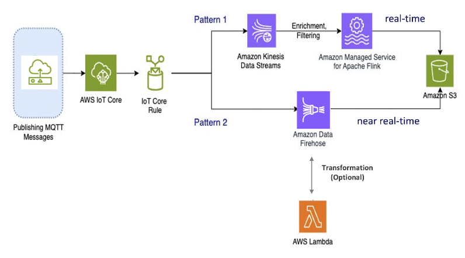

End of support notice:
On December 15, 2025, AWS will end support for AWS IoT Analytics. After December 15, 2025, you will no longer
be able to access the AWS IoT Analytics console, or AWS IoT Analytics resources.
For more information, see
[AWS IoT Analytics end of support](iotanalytics-end-of-support.md "iotanalytics-end-of-support.md").

# Step 1: Redirect ongoing data ingestion

The first step in your migration is to redirect your ongoing data ingestion to a new service. We recommend two patterns based on your specific use case:

## Pattern 1: Amazon Kinesis Data Streams with Amazon Managed Service for Apache Flink

In this pattern, you start by publishing data to AWS IoT Core which integrates with Amazon Kinesis Data Streams allowing you to collect, process, and analyze large bandwidth of data in real time.

###### Metrics and Analytics

1. **Ingest Data**: AWS IoT data is ingested into a Amazon Kinesis Data Streams in real-time.
   Amazon Kinesis Data Streams can handle a high throughput of data from millions of AWS IoT devices,
   enabling real-time analytics and anomaly detection.
2. **Process Data**: Use Amazon Managed Service for Apache Flink to process, enrich,
   and filter the data from the Amazon Kinesis Data Streams. Flink provides robust features for complex
   event processing, such as aggregations, joins, and temporal operations.
3. **Store Data**: Flink outputs the processed data to Amazon S3 for storage and
   further analysis. This data can then be queried using Amazon Athena or integrated with other AWS analytics services.

Use this pattern if your application involves high-bandwidth streaming data and
requires advanced processing, such as pattern matching or windowing, this pattern is the best fit.

## Pattern 2: Use Amazon Data Firehose

In this pattern, data is published to AWS IoT Core, which integrates with Amazon Data Firehose, allowing you
to store data directly in Amazon S3. This pattern also supports basic transformations using AWS Lambda.

###### Metrics and Analytics

1. **Ingest Data**: AWS IoT data is ingested directly from your devices or AWS IoT Core into Amazon Data Firehose.
2. **Process Data**: Amazon Data Firehose performs basic transformations and processing on the data,
   such as format conversion and enrichment. You can enable Firehose data
   transformation by configuring it to invoke AWS Lambda functions to transform the incoming source data before
   delivering it to destinations.
3. **Store Data**: The processed data is delivered to Amazon S3 in near real-time.
   Amazon Data Firehose automatically scales to match the throughput of incoming data, ensuring reliable and efficient data delivery.

Use this pattern for workloads that need basic transformations and processing. In addition, Amazon Data Firehose simplifies the process
by offering data buffering and dynamic partitioning capabilities for data stored in Amazon S3.
