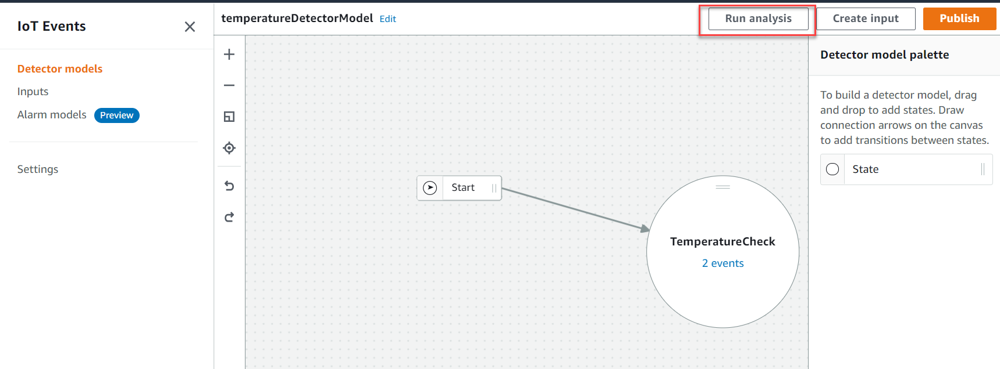
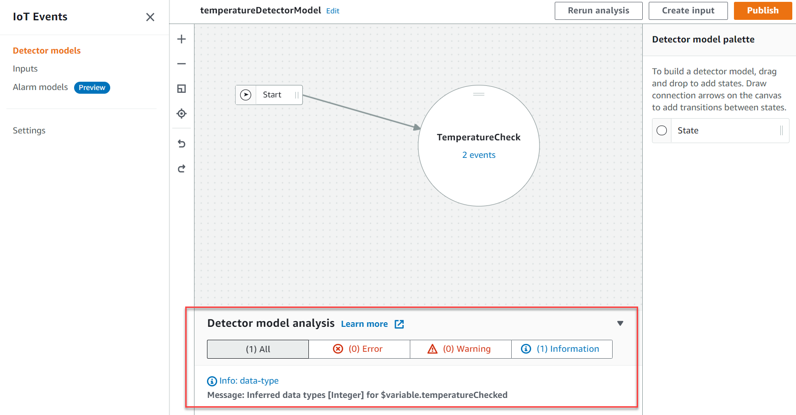

End of support notice: On May 20, 2026, AWS will end support for
AWS IoT Events. After May 20, 2026, you will no longer be able to access the AWS IoT Events console or AWS IoT Events
resources. For more information, see [AWS IoT Events end of
support](iotevents-end-of-support.md "iotevents-end-of-support.md").

# Analyze a detector model for AWS IoT Events (Console)

AWS IoT Events allows you to monitor and react to IoT data by detecting events and triggering
actions with the AWS IoT Events API. The following steps use the AWS IoT Events console to analyze a detector
model.

###### Note

After AWS IoT Events starts analyzing your detector model, you have up to 24 hours to retrieve
the analysis results.

A detector model analysis can help you optimize your models, identify potential issues,
and ensure they're functioning as intended. For example, on a windfarm, the detector model
analysis could reveal if the model correctly identifies potential gear failures based on
abnormal vibration patterns. Or, if the model accurately triggers maintenance alerts when
wind speeds exceed safe operating thresholds. By refining a model based on the analysis, you
can improve predictive maintenance, reduce downtime, and enhance overall energy production
efficiency.

###### To analyze a detector model

1. Sign in to the [AWS IoT Events
   console](https://console.aws.amazon.com/iotevents/ "https://console.aws.amazon.com/iotevents/").
2. In the navigation pane, choose **Detector models**.
3. Under **Detector models**, choose the target detector
   model.
4. On your detector model page, choose **Edit**.
5. In the upper-right corner, choose **Run analysis**.

The following is an example analysis result in the AWS IoT Events console.

