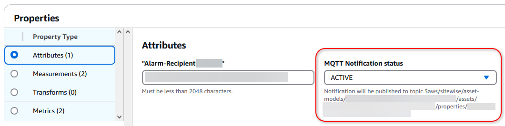
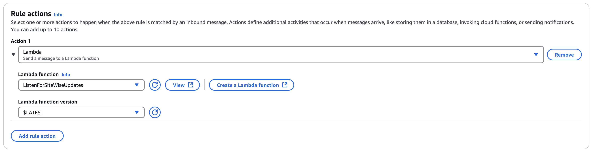

End of support notice: On May 20, 2026, AWS will end support for
AWS IoT Events. After May 20, 2026, you will no longer be able to access the AWS IoT Events console or AWS IoT Events
resources. For more information, see [AWS IoT Events end of
support](iotevents-end-of-support.md "iotevents-end-of-support.md").

# Migration procedure for AWS IoT SiteWise alarms in

AWS IoT Events

This section describes alternative solutions that deliver similar alarm functionality
as you migrate away from AWS IoT Events.

For AWS IoT SiteWise properties that use AWS IoT Events alarms, you can migrate to a solution using CloudWatch
alarms. This approach provides robust monitoring capabilities with established SLAs and
additional features like anomaly detection and grouped alarms.

## Comparing architectures

The current AWS IoT Events alarm configuration for AWS IoT SiteWise properties requires creating
`AssetModelCompositeModels` in the asset model, as described in
[Define external
alarms in AWS IoT SiteWise](../../../iot-sitewise/latest/userguide/define-external-alarms.md "../../../iot-sitewise/latest/userguide/define-external-alarms.md") in the _AWS IoT SiteWise User Guide_.
Modifications to the new solution are typically managed through the AWS IoT Events
console.

The new solution provides alarm management by leveraging CloudWatch alarms. This
approach uses AWS IoT SiteWise notifications to publish property data points to AWS IoT Core MQTT
topics, which are then processed by a Lambda function. The function transforms these
notifications into CloudWatch metrics, enabling alarm monitoring through CloudWatch's alarming
framework.

| Purpose                                                             | Solution                            | Differences                                                                                                   |
| ------------------------------------------------------------------- | ----------------------------------- | ------------------------------------------------------------------------------------------------------------- |
| \*_Data source_<br>• – Property<br>data from AWS IoT SiteWise       | AWS IoT SiteWise MQTT notifications | Replaces direct IoT Events integration with MQTT notifications<br>from AWS IoT SiteWise properties            |
| \*_Data processing_<br>• –<br>Transforms property data              | Lambda function                     | Processes AWS IoT SiteWise property notifications and converts them to<br>CloudWatch metrics                  |
| \*_Alarm evaluation_<br>• –<br>Monitors metrics and triggers alarms | Amazon CloudWatch alarms            | Replaces AWS IoT Events alarms with CloudWatch alarms, offering additional<br>features like anomaly detection |
| \*_Integration_<br>• –<br>Connection with AWS IoT SiteWise          | AWS IoT SiteWise external alarms    | Optional capability to import CloudWatch alarms back into AWS IoT SiteWise as<br>external alarms              |

## Step 1: Enable MQTT notifications

on the asset property

If you are using AWS IoT Events integrations for AWS IoT SiteWise alarms, you can turn on MQTT
notifications for each property to monitor.

1. Follow the [Configure alarms on assets in AWS IoT SiteWise](../../../iot-sitewise/latest/userguide/configure-alarms.md#configure-alarm-threshold-value-console "../../../iot-sitewise/latest/userguide/configure-alarms.md#configure-alarm-threshold-value-console") procedure until you each
   the step to **Edit** the asset model's properties.
2. For each property to migrate, change the **MQTT Notification
   status** to **ACTIVE**.

 3. Note the topic path to which the alarm publishes for each modified alarm
attribute.

For more information, see the following documentation resources:

- [Understand asset
  properties in MQTT topics](../../../iot-sitewise/latest/userguide/mqtt-topics.md "../../../iot-sitewise/latest/userguide/mqtt-topics.md") in the
  _AWS IoT SiteWise User Guide_.
- [MQTT topics](../../../iot/latest/developerguide/topics.md "../../../iot/latest/developerguide/topics.md") in the _AWS IoT Developer Guide_.

## Step 2: Create an AWS Lambda

function

Create an Lambda function for reading the TQV array published by the MQTT topic and
publish individual values to CloudWatch. We’ll use this Lambda function as a destination
action to trigger in AWS IoT Core Message Rules.

1. Open the [AWS Lambda console](https://console.aws.amazon.com/lambda "https://console.aws.amazon.com/lambda").
2. Choose **Create function**.
3. Enter a name for the **Function name**.
4. Select **NodeJS 22.x** as the
   **Runtime**.
5. In the **Change default execution role** dropdown, choose
   **Use existing role**, and then select the IAM role
   that you created in earlier steps.

###### Note

This procedure assumes that you've already migrated your detector
model. If you don't have an IAM role, see . 6. Choose **Create function**. 7. Paste in the following code snippet after replacing the hard coded
constants.

```
import json
import boto3
from datetime import datetime

# Initialize CloudWatch client
cloudwatch = boto3.client('cloudwatch')

def lambda_handler(message, context):
    try:
        # Parse the incoming IoT message
        # Extract relevant information
        asset_id = message['payload']['assetId']
        property_id = message['payload']['propertyId']

        # Process each value in the values array
        for value in message['payload']['values']:
            # Extract timestamp and value
            timestamp = datetime.fromtimestamp(value['timestamp']['timeInSeconds'])
            metric_value = value['value']['doubleValue']
            quality = value.get('quality', 'UNKNOWN')

            # Publish to CloudWatch
            response = cloudwatch.put_metric_data(
                Namespace='`IoTSiteWise/AssetMetrics`',
                MetricData=[
                    {
                        'MetricName': f'Property_`your-property-id`',
                        'Value': metric_value,
                        'Timestamp': timestamp,
                        'Dimensions': [
                            {
                                'Name': 'AssetId',
                                'Value': '`your-asset-id`'
                            },
                            {
                                'Name': 'Quality',
                                'Value': quality
                            }
                        ]
                    }
                ]
            )

        return {
            'statusCode': 200,
            'body': json.dumps('Successfully published metrics to CloudWatch')
        }

    except Exception as e:
        print(f'Error processing message: {str(e)}')
        return {
            'statusCode': 500,
            'body': json.dumps(f'Error: {str(e)}')
        }
```

## Step 3: Create AWS IoT Core message routing rule

- Follow the [Tutorial:
  Republishing an MQTT message](../../../iot/latest/developerguide/iot-repub-rule.md "../../../iot/latest/developerguide/iot-repub-rule.md") procedure entering the following
  information when prompted:
  1.  Name message routing rule
      `SiteWiseToCloudwatchAlarms`.
  2.  For the query, you can use the following:

  ```
  SELECT * FROM '$aws/sitewise/asset-models/`your-asset-model-id`/assets/`your-asset-id`/properties/`your-property-id`'
  ```

  3.  In **Rule actions**, select the
      **Lambda** action to send the data generated
      from AWS IoT SiteWise to CloudWatch. For example:

  

## Step 4: View CloudWatch metrics

As you ingest data to AWS IoT SiteWise, the property selected earlier in [Step 1: Enable MQTT notifications
on the asset property](#eos-alarms-mqtt-asset-property "#eos-alarms-mqtt-asset-property"), the routes data to the Lambda
function we created in [Step 2: Create an AWS Lambda
function](#eos-alarms-lambda-function "#eos-alarms-lambda-function"). In this step, you can check to see
the Lambda sending your metrics to CloudWatch.

1. Open the [CloudWatch
   AWS Management Console](https://console.aws.amazon.com/cloudwatch/ "https://console.aws.amazon.com/cloudwatch/").
2. In the left navigation, choose **Metrics**, then
   **All metrics**.
3. Choose an alarm's URL to open it.
4. Under the **Source** tab, the CloudWatch output looks similar
   to this example. This source information confirms that the metric data is
   feeding into CloudWatch.

```
{
    "view": "timeSeries",
    "stacked": false,
    "metrics": [
        [ "IoTSiteWise/AssetMetrics", "Property_`your-property-id-hash`", "Quality", "GOOD", "AssetId", "`your-asset-id-hash`", { "id": "m1" } ]
    ],
    "region": "`your-region`"
}
```

## Step 5: Create CloudWatch alarms

Follow the [Create a CloudWatch
alarm based on a static threshold](../../../AmazonCloudWatch/latest/monitoring/AlarmThatSendsEmail.md "../../../AmazonCloudWatch/latest/monitoring/AlarmThatSendsEmail.md") procedure in the
_Amazon CloudWatch User Guide_ to create alarms for each relevant
metric.

###### Note

There are many options for alarm configuration in Amazon CloudWatch For more
information on CloudWatch alarms, see [Using
Amazon CloudWatch alarms](../../../AmazonCloudWatch/latest/monitoring/AlarmThatSendsEmail.md "../../../AmazonCloudWatch/latest/monitoring/AlarmThatSendsEmail.md") in the _Amazon CloudWatch User Guide_.

## Step 6: (Optional) import the CloudWatch alarm into AWS IoT SiteWise

You can configure CloudWatch alarms to send data back to AWS IoT SiteWise using CloudWatch alarm actions
and Lambda. This integration enables you to view alarm states and properties in the
SiteWise Monitor portal.

1. Configure the external alarm as a property in an asset model. For more
   information, see [Define
   external alarms in AWS IoT SiteWise](../../../iot-sitewise/latest/userguide/define-external-alarms.md "../../../iot-sitewise/latest/userguide/define-external-alarms.md") in the
   _AWS IoT SiteWise User Guide_.
2. Create a Lambda function that uses the [BatchPutAssetPropertyValue](../../../iot-sitewise/latest/APIReference/API_BatchPutAssetPropertyValue.md "../../../iot-sitewise/latest/APIReference/API_BatchPutAssetPropertyValue.md") API found in the
   _AWS IoT SiteWise User Guide_ to send alarm data to
   AWS IoT SiteWise.
3. Set up CloudWatch alarm actions to invoke your Lambda function when alarm states
   change. For more information, see the [Alarm actions](../../../AmazonCloudWatch/latest/monitoring/AlarmThatSendsEmail.md#alarms-and-actions.html "../../../AmazonCloudWatch/latest/monitoring/AlarmThatSendsEmail.md#alarms-and-actions.html") section in the
   _Amazon CloudWatch User Guide_.
