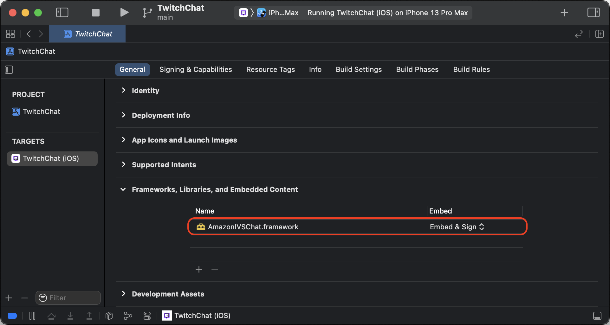

# Getting Started with the IVS Chat Client Messaging iOS SDK

We recommend that you integrate the SDK via [Swift Package Manager](#chat-ios-install-sdk-swiftpm "#chat-ios-install-sdk-swiftpm"). Alternatively,
you can [integrate the framework
manually](#chat-ios-install-sdk-manual "#chat-ios-install-sdk-manual").

After integrating the SDK, you can import the SDK by adding the following code at the
top of your relevant Swift file:

```
import AmazonIVSChatMessaging
```

## Swift Package Manager

To use the `AmazonIVSChatMessaging` library in a Swift Package Manager
project, add it to the dependencies for your package and the dependencies for your
relevant targets:

1. Download the latest `.xcframework` from [https://ivschat.live-video.net/1.0.1/AmazonIVSChatMessaging.xcframework.zip](https://ivschat.live-video.net/1.0.1/AmazonIVSChatMessaging.xcframework.zip "https://ivschat.live-video.net/1.0.1/AmazonIVSChatMessaging.xcframework.zip").
2. In your Terminal, run:

```
shasum -a 256 path/to/downloaded/AmazonIVSChatMessaging.xcframework.zip
```

3. Take the output of the previous step and paste it into the checksum
   property of `.binaryTarget` as shown below within your project’s
   `Package.swift` file:

```
let package = Package(
   // name, platforms, products, etc.
   dependencies: [
      // other dependencies
   ],
   targets: [
      .target(
         name: "<target-name>",
         dependencies: [
            // If you want to only bring in the SDK
            .binaryTarget(
               name: "AmazonIVSChatMessaging",
               url: "https://ivschat.live-video.net/1.0.1/AmazonIVSChatMessaging.xcframework.zip",
               checksum: "<SHA-extracted-using-steps-detailed-above>"
            ),
            // your other dependencies
         ],
      ),
      // other targets
   ]
)
```

## Manual Installation

1. Download the latest version from [https://ivschat.live-video.net/1.0.1/AmazonIVSChatMessaging.xcframework.zip](https://ivschat.live-video.net/1.0.1/AmazonIVSChatMessaging.xcframework.zip "https://ivschat.live-video.net/1.0.1/AmazonIVSChatMessaging.xcframework.zip").
2. Extract the contents of the archive.
   `AmazonIVSChatMessaging.xcframework` contains the SDK for
   both device and simulator.
3. Embed the extracted `AmazonIVSChatMessaging.xcframework` by
   dragging it into the **Frameworks, Libraries, and
   Embedded Content** section of the **General** tab for your application target:


