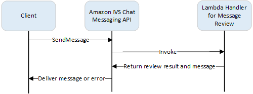

# IVS Chat Message Review Handler

A message review handler allows you to review and/or modify messages before they are
delivered to a room. When a message review handler is associated with a room, it is invoked
for each SendMessage request to that room. The handler enforces your application’s business
logic and determines whether to allow, deny, or modify a message. Amazon IVS Chat supports
AWS Lambda functions as handlers.

## Creating a Lambda Function

Before setting up a message review handler for a room, you must create a lambda
function with a resource-based IAM policy. The lambda function must be in the same AWS
account and AWS region as the room with which you will use the function. The
resource-based policy gives Amazon IVS Chat permission to invoke your lambda function.
For instructions, see [Resource-Based Policy for Amazon IVS Chat](security-iam.md#security-chat-policy-examples "security-iam.md#security-chat-policy-examples").

### Workflow



### Request Syntax

When a client sends a message, Amazon IVS Chat invokes the lambda function with a
JSON payload:

```
{
   "Content": "string",
   "MessageId": "string",
   "RoomArn": "string",
   "Attributes": {"string": "string"},
   "Sender": {
      "Attributes": { "string": "string" },
      "UserId": "string",
      "Ip": "string"
   }
}
```

### Request Body

| Field          | Description                                                                                                                                                                                                                                                                                                                                                                                                                                                                                                                                                               |
| -------------- | ------------------------------------------------------------------------------------------------------------------------------------------------------------------------------------------------------------------------------------------------------------------------------------------------------------------------------------------------------------------------------------------------------------------------------------------------------------------------------------------------------------------------------------------------------------------------- | ------------------------------------------------------------------------------------------------------------------------------------------------------------------------------------------------------------------------------------------------------------------------------------------------------------------------------------------------------------------------------------------------------------------------------------------------------------------------------------------------------------------------------------------------------------------------------------------------------------------------------------ |
| `Attributes`   | Attributes associated with the message.                                                                                                                                                                                                                                                                                                                                                                                                                                                                                                                                   |
| `Content`      | Original content of the message.                                                                                                                                                                                                                                                                                                                                                                                                                                                                                                                                          |
| `MessageId`    | The message ID. Generated by IVS Chat.                                                                                                                                                                                                                                                                                                                                                                                                                                                                                                                                    |
| `RoomArn`      | The ARN of the room where messages are sent.                                                                                                                                                                                                                                                                                                                                                                                                                                                                                                                              |
| `Sender`       | Information about the sender. This object has several fields: <br>• `Attributes` — Metadata about the sender established during authentication. This can be used to give the client more information about the sender; e.g., avatar URL, badges, font, and color. <br>• `UserId` — An application-specified identifier of the viewer (end user) who sent this message. This can be used by the client application to refer to the user in either the messaging API or application domains. <br>• `Ip` — The IP address of the client sending the message.                 | ### Response Syntax The handler lambda function must return a JSON response with the following syntax. Responses that do not correspond to the syntax below or satisfy the field constraints are invalid. In this case, the message is allowed or denied depending on the `FallbackResult` value that you specify in your message review handler; see [MessageReviewHandler](../ChatAPIReference/API_MessageReviewHandler.md "../ChatAPIReference/API_MessageReviewHandler.md") in the _Amazon IVS Chat API Reference_. `{ "Content": "string", "ReviewResult": "string", "Attributes": {"string": "string"}, }` ### Response Fields |
| Field          | Description                                                                                                                                                                                                                                                                                                                                                                                                                                                                                                                                                               |
| ---            | ---                                                                                                                                                                                                                                                                                                                                                                                                                                                                                                                                                                       |
| `Attributes`   | Attributes associated with the message returned from the lambda function. If `ReviewResult` is `DENY`, a `Reason` may be provided in `Attributes`; e.g.: `"Attributes": {"Reason": "denied for moderation` In this case, the sender client receives a WebSocket 406 error with the reason in the error message. (See [WebSocket Errors](../chatmsgapireference/error-messages.md#websocket-errors "../chatmsgapireference/error-messages.md#websocket-errors") in the _Amazon IVS Chat Messaging API Reference_.) <br>• Size Constraints: Maximum 1 KB <br>• Required: No |
| `Content`      | Content of the message returned from the Lambda function. It could be edited or original depending on the business logic. <br>• Length Constraints: Minimum length of 1. Maximum length of the `MaximumMessageLength` you defined when you created/updated the room. See the [Amazon IVS Chat API Reference](../ChatAPIReference/Welcome.md "../ChatAPIReference/Welcome.md") for more information. This applies only when `ReviewResult` is `ALLOW`. <br>• Required: Yes                                                                                                 |
| `ReviewResult` | The result of review processing on how to handle the message. If allowed, the message is delivered to all users connected to the room. If denied, the message is not delivered to any user. <br>• Valid Values: `ALLOW`                                                                                                                                                                                                                                                                                                                                                   | `DENY` <br>• Required: Yes                                                                                                                                                                                                                                                                                                                                                                                                                                                                                                                                                                                                           |

| ### Sample Code Below is a sample lambda handler in Go. It modifies the message content, keeps the message attributes unchanged, and allows the message. `package main import ( "context" "github.com/aws/aws-lambda-go/lambda" ) type Request struct { MessageId string Content string Attributes map[string]string RoomArn string Sender Sender } type Response struct { ReviewResult string Content string Attributes map[string]string } type Sender struct { UserId string Ip string Attributes map[string]string } func main() { lambda.Start(HandleRequest) } func HandleRequest(ctx context.Context, request Request) (Response, error) { content := request.Content + "modified by the lambda handler" return Response{ ReviewResult: "ALLOW", Content: content, }, nil }` ## Associating and Dissociating a Handler with a Room Once you have the lambda handler set up and implemented, use the [Amazon IVS Chat API](../ChatAPIReference/Welcome.md "../ChatAPIReference/Welcome.md"): <br>• To associate the handler with a room, call CreateRoom or UpdateRoom and specify the handler. <br>• To disassociate the handler from a room, call UpdateRoom with an empty value for `MessageReviewHandler.Uri`. ## Monitoring Errors with Amazon CloudWatch You can monitor errors occurring in message review with Amazon CloudWatch, and you can create alarms or dashboards to indicate or respond to the changes of specific errors. If an error occurs, the message is allowed or denied depending on the `FallbackResult` value you specify when you associate the handler with a room; see [MessageReviewHandler](../ChatAPIReference/API_MessageReviewHandler.md "../ChatAPIReference/API_MessageReviewHandler.md") in the _Amazon IVS Chat API Reference_. There are several types of errors: <br>• `InvocationErrors` occur when Amazon IVS Chat cannot invoke a handler. <br>• `ResponseValidationErrors` occur when a handler returns a response that is invalid. <br>• AWS Lambda `Errors` occur when a lambda handler returns a function error when it has been invoked. For more information on invocation errors and response-validation errors (emitted by Amazon IVS Chat), see [Monitoring Amazon IVS Chat](chat-health.md "chat-health.md"). For more information on AWS Lambda errors, see [Working with Lambda Metrics](../../../lambda/latest/dg/monitoring-metrics.md "../../../lambda/latest/dg/monitoring-metrics.md").
