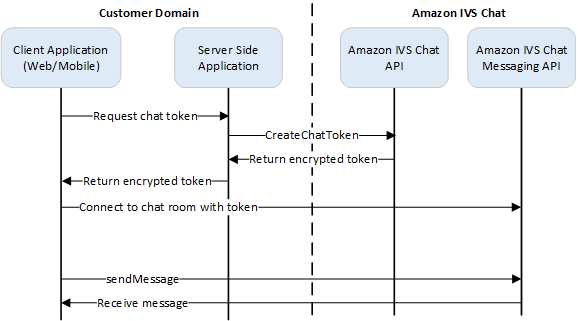

# Step 3: Create a Chat Token

For a chat participant to connect to a room and start sending and receiving messages, a
chat token must be created. Chat tokens are used to authenticate and authorize chat clients.

This diagram illustrates the workflow for creating an IVS chat token:


As shown above, a client application asks your server-side application for a
token, and the server-side application calls CreateChatToken using an AWS SDK or [SigV4](../../../IAM/latest/UserGuide/reference_aws-signing.md "../../../IAM/latest/UserGuide/reference_aws-signing.md") signed requests. Since AWS credentials are used to call the API, the
token should be generated in a secure server-side application, not the client-side
application.

A backend server application that demonstrates token generation is available at [Amazon IVS Chat Demo Backend](https://github.com/aws-samples/amazon-ivs-chat-web-demo/tree/main/serverless "https://github.com/aws-samples/amazon-ivs-chat-web-demo/tree/main/serverless").

_Session duration_ refers to how long an established
session can remain active before it is automatically closed. That is, the session
duration is how long the client can remain connected to the chat room before a new token
must be generated and a new connection must be established. Optionally, you can specify
session duration during token creation.

Each token can be used only once to establish a connection for an end user. If a
connection is closed, a new token must be created before a connection can be
re-established. The token itself is valid until the token-expiration timestamp included
in the response.

When an end user wants to connect to a chat room, the client should ask the server
application for a token. The server application creates a token and passes it back to
the client. Tokens should be created for end users on demand.

To create a chat auth token, follow the instructions below. When you create a chat
token, use the request fields to pass data about the chat end user and the end user’s
messaging capabilities; for details, see [CreateChatToken](../ChatAPIReference/API_CreateChatToken.md "../ChatAPIReference/API_CreateChatToken.md") in the _IVS Chat API
Reference_.

## AWS SDK Instructions

Creating a chat token with the AWS SDK requires that you first download and
configure the SDK on your application. Below are instructions for the AWS SDK using
JavaScript.

**Important:** This code must be executed on the
server side and its output passed to the client.

**Prerequisite:** To use the code sample below, you
need to load the AWS JavaScript SDK into your application. For details, see [Getting started with the AWS SDK for JavaScript](../../../sdk-for-javascript/v3/developer-guide/getting-started.md "../../../sdk-for-javascript/v3/developer-guide/getting-started.md").

```
async function createChatToken(params) {
  const ivs = new AWS.Ivschat();
  const result = await ivs.createChatToken(params).promise();
  console.log("New token created", result.token);
}
/*
Create a token with provided inputs. Values for user ID and display name are
from your application and refer to the user connected to this chat session.
*/
const params = {
  "attributes": {
    "displayName": "DemoUser",
  }",
  "capabilities": ["SEND_MESSAGE"],
  "roomIdentifier": "arn:aws:ivschat:us-west-2:123456789012:room/g1H2I3j4k5L6",
  "userId": 11231234
};
createChatToken(params);
```

## CLI Instructions

Creating a chat token with the AWS CLI is an advanced option and requires that you
first download and configure the CLI on your machine. For details, see the [AWS
Command Line Interface User Guide](../../../cli/latest/userguide/cli-chap-welcome.md "../../../cli/latest/userguide/cli-chap-welcome.md"). Note: generating tokens with the AWS
CLI is good for testing purposes, but for production use, we recommend that you
generate tokens on the server side with the AWS SDK (see instructions above).

1. Run the `create-chat-token` command along with room identifier
   and user ID for the client. Include any of the following capabilities:
   `"SEND_MESSAGE"`, `"DELETE_MESSAGE"`,
   `"DISCONNECT_USER"`. (Optionally, include session duration
   (in minutes) and/or custom attributes (metadata) about this chat session.
   These fields are not shown below.)

```
aws ivschat create-chat-token --room-identifier "arn:aws:ivschat:us-west-2:123456789012:room/g1H2I3j4k5L6" --user-id "11231234" --capabilities "SEND_MESSAGE"
```

2. This returns a client token:

```
{
  "token": "abcde12345FGHIJ67890_klmno1234PQRS567890uvwxyz1234.abcd12345EFGHI67890_jklmno123PQRS567890uvwxyz1234abcde12345FGHIJ67890_klmno1234PQRS567890uvwxyz1234abcde",
  "sessionExpirationTime": "2022-03-16T04:44:09+00:00",
  "tokenExpirationTime": "2022-03-16T03:45:09+00:00"
}
```

3. Save this token. You will need this to connect to the chat room and send
   or receive messages. You will need to generate another chat token before
   your session ends (as indicated by
   `sessionExpirationTime`).
