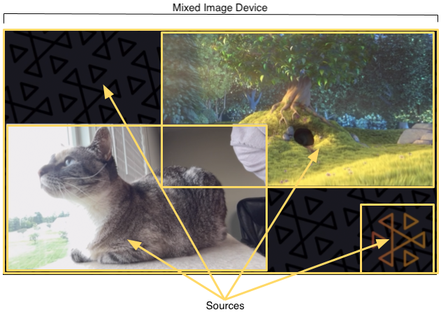
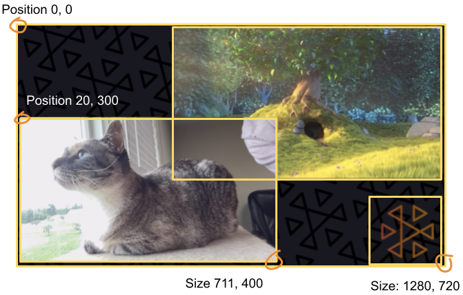

# IVS Broadcast SDK: Mixed Devices

Mixed devices are audio and video devices that take multiple input sources and generate a
single output. Mixing devices is a powerful feature that lets you define and manage multiple
on-screen (video) elements and audio tracks. You can combine video and audio from multiple
sources such as cameras, microphones, screen captures, and audio and video generated by your
app. You can use transitions to move these sources around the video that you stream to IVS,
and add to and remove sources mid-stream.

Mixed devices come in image and audio flavors. To create a mixed image device,
call:

`DeviceDiscovery.createMixedImageDevice()` on Android

`IVSDeviceDiscovery.createMixedImageDevice()` on iOS

The returned device can be attached to a `BroadcastSession` (low-latency
streaming) or `Stage` (real-time streaming), like any other device.

## Terminology



| Term                       | Description                                                                                                                                                                                                                                                                                                                                                                                                                                                                                                                                                                  |
| -------------------------- | ---------------------------------------------------------------------------------------------------------------------------------------------------------------------------------------------------------------------------------------------------------------------------------------------------------------------------------------------------------------------------------------------------------------------------------------------------------------------------------------------------------------------------------------------------------------------------- |
| Device                     | A hardware or software component that produces audio or image<br>input. Examples of devices are microphones, cameras, Bluetooth<br>headsets, and virtual devices such as screen captures or<br>custom-image inputs.                                                                                                                                                                                                                                                                                                                                                          |
| Mixed Device               | A `Device` that can be attached to a<br>`BroadcastSession` like any other<br>`Device`, but with additional APIs that allow<br>`Source` objects to be added. Mixed devices have<br>internal mixers that composite audio or images, producing a single<br>output audio and image stream.<br>Mixed devices come in either audio or image flavors.                                                                                                                                                                                                                               |
| Mixed device configuration | A configuration object for the mixed device. For mixed image<br>devices, this configures properties like dimensions and framerate.<br>For mixed audio devices, this configures the channel<br>count.                                                                                                                                                                                                                                                                                                                                                                         |
| Source                     | A container that defines a visual element’s position on screen<br>and an audio track’s properties in the audio mix. A mixed device can<br>be configured with zero or more sources. Sources are given a<br>configuration that affects how the source’s media are used. The<br>image above shows four image sources:<br>• Bottom left with camera input<br>• Top right with movie input<br>• Bottom right with the Amazon IVS logo<br>• A full-screen background image                                                                                                         |
| Source Configuration       | A configuration object for the source going into a mixed device.<br>The full configuration objects are described below..                                                                                                                                                                                                                                                                                                                                                                                                                                                     |
| Transition                 | To move a slot to a new position or change some of its<br>properties, use<br>`MixedDevice.transitionToConfiguration()`. This method<br>takes:<br>• A new source configuration that represents the next state<br>for the source.<br>• A duration that specifies how long the animation should<br>take, relative to the timeline of the video. If the duration<br>is set to 0, the transition happens on the next frame that<br>is mixed.<br>• An optional callback that informs you when the animation<br>is complete. The callback may be useful for chaining<br>animations. |

## Mixed Audio Device

### Configuration

`MixedAudioDeviceConfiguration` on Android

`IVSMixedAudioDeviceConfiguration` on iOS

| Name       | Type    | Description                                                                                                             |
| ---------- | ------- | ----------------------------------------------------------------------------------------------------------------------- |
| `channels` | Integer | Number of output channels from the audio mixer. Valid<br>values: 1, 2. 1 is mono audio; 2, stereo audio. Default:<br>2. |

### Source

Configuration

`MixedAudioDeviceSourceConfiguration` on Android

`IVSMixedAudioDeviceSourceConfiguration` on iOS

| Name   | Type  | Description                                                                                                                                      |
| ------ | ----- | ------------------------------------------------------------------------------------------------------------------------------------------------ |
| `gain` | Float | Audio gain. This is a multiplier, so any value above 1<br>increases the gain; any value below 1, decreases it. Valid<br>values: 0-2. Default: 1. |

## Mixed Image Device

### Configuration

`MixedImageDeviceConfiguration` on Android

`IVSMixedImageDeviceConfiguration` on iOS

| Name                  | Type    | Description                                                                                                                                                                                      |
| --------------------- | ------- | ------------------------------------------------------------------------------------------------------------------------------------------------------------------------------------------------ |
| `size`                | Vec2    | Size of the video canvas.                                                                                                                                                                        |
| `targetFramerate`     | Integer | Number of target frames per second for the mixed device. On<br>average, this value should be met, but the system may drop<br>frames under certain circumstances (e.g., high CPU or GPU<br>load). |
| `transparencyEnabled` | Boolean | This enables blending using the `alpha` property<br>on image source configurations. Setting this to<br>`true` increases memory and CPU consumption.<br>Default: `false`.                         |

### Source

Configuration

`MixedImageDeviceSourceConfiguration` on Android

`IVSMixedImageDeviceSourceConfiguration` on iOS

| Name        | Type       | Description                                                                                                                                                                                                                                                                                                                                                                                                                                                                                                                                                                                                                                                                |
| ----------- | ---------- | -------------------------------------------------------------------------------------------------------------------------------------------------------------------------------------------------------------------------------------------------------------------------------------------------------------------------------------------------------------------------------------------------------------------------------------------------------------------------------------------------------------------------------------------------------------------------------------------------------------------------------------------------------------------------- |
| `alpha`     | Float      | Alpha of the slot. This is multiplicative with any alpha<br>values in the image. Valid values: 0-1. 0 is fully transparent<br>and 1 is fully opaque. Default: 1.                                                                                                                                                                                                                                                                                                                                                                                                                                                                                                           |
| `aspect`    | AspectMode | Aspect-ratio mode for any image rendered in the slot. Valid<br>values:<br>• `Fill` — Maintain the aspect ratio of the<br>image but fill the slot. The image is cropped if<br>needed.<br>• `Fit` — Maintain the aspect ratio of the<br>image but fit the entire image into the slot. The slot<br>may have a letterbox or pillarbox if necessary. The<br>letter/pillarbox is in the `fillColor` if<br>that value was set; otherwise, transparent (which may<br>appear black if the canvas color behind the image is<br>black).<br>• `None` — Do not maintain the aspect ratio<br>of the image. The image is scaled to match the<br>dimensions of the slot.<br>Default: `Fit` |
| `fillColor` | Vec4       | Fill color to be used with `aspect Fit` when the<br>slot and image aspect ratios do not match. The format is (red,<br>green, blue, alpha). Valid value (for each channel): 0-1.<br>Default: (0, 0, 0, 0).                                                                                                                                                                                                                                                                                                                                                                                                                                                                  |
| `position`  | Vec2       | Slot position (in pixels), relative to the top-left corner<br>of the canvas. The origin of the slot also is<br>top-left.                                                                                                                                                                                                                                                                                                                                                                                                                                                                                                                                                   |
| `size`      | Vec2       | Size of the slot, in pixels. Setting this value also sets<br>`matchCanvasSize` to `false`. Default:<br>(0, 0); however, because `matchCanvasSize` defaults<br>to `true`, the rendered size of the slot is the<br>canvas size, not (0, 0).                                                                                                                                                                                                                                                                                                                                                                                                                                  |
| `zIndex`    | Float      | Relative ordering of slots. Slots with higher<br>`zIndex` values are drawn on top of slots with<br>lower `zIndex` values.                                                                                                                                                                                                                                                                                                                                                                                                                                                                                                                                                  |

## Creating and

Configuring a Mixed Image Device



Here, we create a scene similar to the one at the beginning of this guide, with three
on-screen elements:

- Bottom-left slot for a camera.
- Bottom-right slot for a logo overlay.
- Top-right slot for a movie.

Note that the origin for the canvas is the top-left corner and this is the same for
the slots. Hence, positioning a slot at (0, 0) puts it in the top-left corner with the
entire slot visible.

### iOS

```
let deviceDiscovery = IVSDeviceDiscovery()
let mixedImageConfig = IVSMixedImageDeviceConfiguration()
mixedImageConfig.size = CGSize(width: 1280, height: 720)
try mixedImageConfig.setTargetFramerate(60)
mixedImageConfig.isTransparencyEnabled = true
let mixedImageDevice = deviceDiscovery.createMixedImageDevice(with: mixedImageConfig)

// Bottom Left
let cameraConfig = IVSMixedImageDeviceSourceConfiguration()
cameraConfig.size = CGSize(width: 320, height: 180)
cameraConfig.position = CGPoint(x: 20, y: mixedImageConfig.size.height - cameraConfig.size.height - 20)
cameraConfig.zIndex = 2
let camera = deviceDiscovery.listLocalDevices().first(where: { $0 is IVSCamera }) as? IVSCamera
let cameraSource = IVSMixedImageDeviceSource(configuration: cameraConfig, device: camera)
mixedImageDevice.add(cameraSource)

// Top Right
let streamConfig = IVSMixedImageDeviceSourceConfiguration()
streamConfig.size = CGSize(width: 640, height: 320)
streamConfig.position = CGPoint(x: mixedImageConfig.size.width - streamConfig.size.width - 20, y: 20)
streamConfig.zIndex = 1
let streamDevice = deviceDiscovery.createImageSource(withName: "stream")
let streamSource = IVSMixedImageDeviceSource(configuration: streamConfig, device: streamDevice)
mixedImageDevice.add(streamSource)

// Bottom Right
let logoConfig = IVSMixedImageDeviceSourceConfiguration()
logoConfig.size = CGSize(width: 320, height: 180)
logoConfig.position = CGPoint(x: mixedImageConfig.size.width - logoConfig.size.width - 20,
                              y: mixedImageConfig.size.height - logoConfig.size.height - 20)
logoConfig.zIndex = 3
let logoDevice = deviceDiscovery.createImageSource(withName: "logo")
let logoSource = IVSMixedImageDeviceSource(configuration: logoConfig, device: logoDevice)
mixedImageDevice.add(logoSource)
```

### Android

```
val deviceDiscovery = DeviceDiscovery(this /* context */)
val mixedImageConfig = MixedImageDeviceConfiguration().apply {
    setSize(BroadcastConfiguration.Vec2(1280f, 720f))
    setTargetFramerate(60)
    setEnableTransparency(true)
}
val mixedImageDevice = deviceDiscovery.createMixedImageDevice(mixedImageConfig)

// Bottom Left
val cameraConfig = MixedImageDeviceSourceConfiguration().apply {
    setSize(BroadcastConfiguration.Vec2(320f, 180f))
    setPosition(BroadcastConfiguration.Vec2(20f, mixedImageConfig.size.y - size.y - 20))
    setZIndex(2)
}
val camera = deviceDiscovery.listLocalDevices().firstNotNullOf { it as? CameraSource }
val cameraSource = MixedImageDeviceSource(cameraConfig, camera)
mixedImageDevice.addSource(cameraSource)

// Top Right
val streamConfig = MixedImageDeviceSourceConfiguration().apply {
    setSize(BroadcastConfiguration.Vec2(640f, 320f))
    setPosition(BroadcastConfiguration.Vec2(mixedImageConfig.size.x - size.x - 20, 20f))
    setZIndex(1)
}
val streamDevice = deviceDiscovery.createImageInputSource(streamConfig.size)
val streamSource = MixedImageDeviceSource(streamConfig, streamDevice)
mixedImageDevice.addSource(streamSource)

// Bottom Right
val logoConfig = MixedImageDeviceSourceConfiguration().apply {
    setSize(BroadcastConfiguration.Vec2(320f, 180f))
    setPosition(BroadcastConfiguration.Vec2(mixedImageConfig.size.x - size.x - 20, mixedImageConfig.size.y - size.y - 20))
    setZIndex(1)
}
val logoDevice = deviceDiscovery.createImageInputSource(logoConfig.size)
val logoSource = MixedImageDeviceSource(logoConfig, logoDevice)
mixedImageDevice.addSource(logoSource)
```

## Removing Sources

To remove a source, call `MixedDevice.remove` with the `Source`
object you want to remove.

## Animations with

Transitions

The transition method replaces a source’s configuration with a new configuration. This
replacement can be animated over time by setting a duration higher than 0, in seconds.

### Which Properties Can

Be Animated?

Not all properties in the slot structure can be animated. Any properties based on
Float types can be animated; other properties take effect at either the start or end
of the animation.

| Name                                                                                                                                                                                                                                                                                                                             | Can It Be Animated? | Impact Point |
| -------------------------------------------------------------------------------------------------------------------------------------------------------------------------------------------------------------------------------------------------------------------------------------------------------------------------------- | ------------------- | ------------ |
| `Audio.gain`                                                                                                                                                                                                                                                                                                                     | Yes                 | Interpolated |
| `Image.alpha`                                                                                                                                                                                                                                                                                                                    | Yes                 | Interpolated |
| `Image.aspect`                                                                                                                                                                                                                                                                                                                   | No                  | End          |
| `Image.fillColor`                                                                                                                                                                                                                                                                                                                | Yes                 | Interpolated |
| `Image.position`                                                                                                                                                                                                                                                                                                                 | Yes                 | Interpolated |
| `Image.size`                                                                                                                                                                                                                                                                                                                     | Yes                 | Interpolated |
| `Image.zIndex`<br>Note: The `zIndex` moves 2D planes through 3D<br>space, so the transition happens when the two planes cross at<br>some point in the middle of the animation. This could be<br>computed, but it depends on the starting and ending<br>`zIndex` values. For a smoother transition,<br>combine this with `alpha`. | Yes                 | Unknown      |

### Simple

Examples

Below are examples of a full-screen camera takeover using the configuration
defined above in [Creating and Configuring a Mixed Image Device](#broadcast-mixed-image-device-creating-configuring "#broadcast-mixed-image-device-creating-configuring"). This is animated over 0.5
seconds.

#### iOS

```
// Continuing the example from above, modifying the existing cameraConfig object.
cameraConfig.size = CGSize(width: 1280, height: 720)
cameraConfig.position = CGPoint.zero
cameraSource.transition(to: cameraConfig, duration: 0.5) { completed in
    if completed {
        print("Animation completed")
    } else {
        print("Animation interrupted")
    }
}
```

#### Android

```
// Continuing the example from above, modifying the existing cameraConfig object.
cameraConfig.setSize(BroadcastConfiguration.Vec2(1280f, 720f))
cameraConfig.setPosition(BroadcastConfiguration.Vec2(0f, 0f))
cameraSource.transitionToConfiguration(cameraConfig, 500) { completed ->
    if (completed) {
        print("Animation completed")
    } else {
        print("Animation interrupted")
    }
}
```

## Mirroring the Broadcast

| To mirror an attached image device in the broadcast in this direction<br>… | Use a negative value for …            |
| -------------------------------------------------------------------------- | ------------------------------------- |
| Horizontally                                                               | The width of the slot                 |
| Vertically                                                                 | The height of the slot                |
| Both horizontally and vertically                                           | Both the width and height of the slot |

The position will need to be adjusted by the same value, to put the slot in the
correct position when mirrored.

Below are examples for mirroring the broadcast horizontally and vertically.

### iOS

Horizontal mirroring:

```
let cameraSource = IVSMixedImageDeviceSourceConfiguration()
cameraSource.size = CGSize(width: -320, height: 720)
// Add 320 to position x since our width is -320
cameraSource.position = CGPoint(x: 320, y: 0)
```

Vertical mirroring:

```
let cameraSource = IVSMixedImageDeviceSourceConfiguration()
cameraSource.size = CGSize(width: 320, height: -720)
// Add 720 to position y since our height is -720
cameraSource.position = CGPoint(x: 0, y: 720)
```

### Android

Horizontal mirroring:

```
val cameraConfig = MixedImageDeviceSourceConfiguration().apply {
    setSize(BroadcastConfiguration.Vec2(-320f, 180f))
   // Add 320f to position x since our width is -320f
    setPosition(BroadcastConfiguration.Vec2(320f, 0f))
}
```

Vertical mirroring:

```
val cameraConfig = MixedImageDeviceSourceConfiguration().apply {
    setSize(BroadcastConfiguration.Vec2(320f, -180f))
    // Add 180f to position y since our height is -180f
    setPosition(BroadcastConfiguration.Vec2(0f, 180f))
}
```

Note: This mirroring is different than the `setMirrored` method on
`ImagePreviewView` (Android) and `IVSImagePreviewView`
(iOS). That method affects only the local preview view on the device and does not
impact the broadcast.
