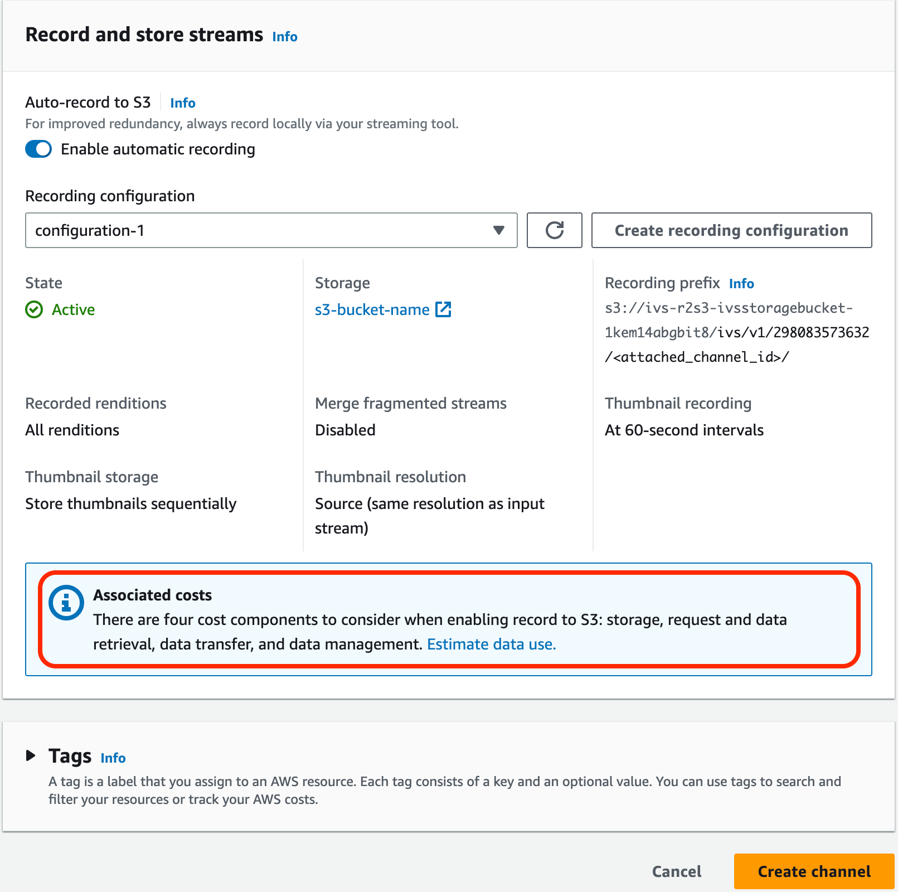
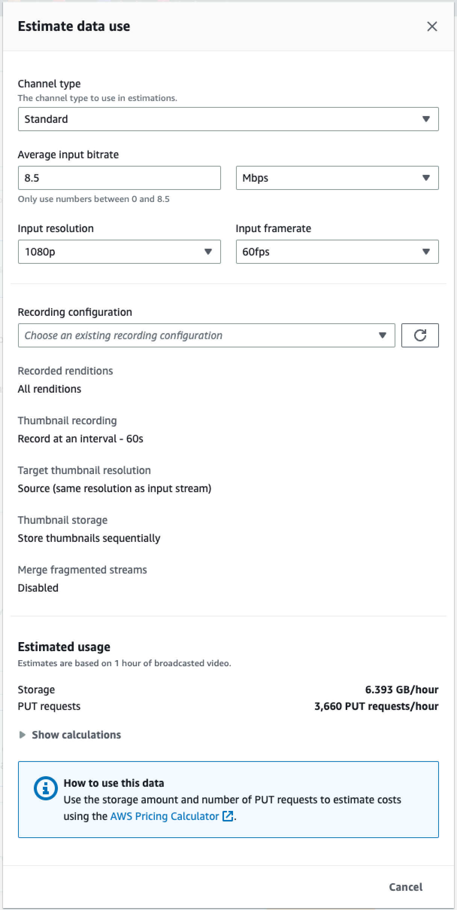

# IVS Costs | Low-Latency Streaming

There are separate costs for Amazon IVS live video and Amazon S3 storage related to the
auto-record-to-S3 feature.

## Live Video

The [Amazon IVS pricing](https://aws.amazon.com/ivs/pricing/ "https://aws.amazon.com/ivs/pricing/") model
incorporates separate fees for video input and output.

Video-input fees depend on your channel type. For details about channel types, see
[Channel Types](streaming-config.md#streaming-config-settings-channel-types "streaming-config.md#streaming-config-settings-channel-types") in _IVS Streaming Configuration_.

For help selecting the right channel type for your use case, use the "Help me choose"
tool in the console:

1. On the console’s **Create channel** page, select
   **Custom configuration**.
2. Under **Channel type**, select **Help me choose**.
3. Follow the prompts until a recommendation is made, then choose **Select recommendation**.

For video output, you pay an hourly rate for video delivered to viewers. Rates vary by
resolution and "billing region" (where the video is delivered from). There are several
tiers of video-output costs based on usage, including a free tier.

A useful interactive tool is the [IVS Cost
Estimator](https://ivs.rocks/calculator "https://ivs.rocks/calculator"). You can plug in values for channel type, resolution, hours
streamed, number of viewers, and billing region. When estimating costs, note the
following rules of thumb:

- Viewers come and go, and on average, 50% of a stream is "delivered." The Cost
  Estimator includes a selector for "Average viewer watch duration." This defaults
  to 50%. Expect viewership for paid events to be higher; even in this case,
  though, it’s likely that not all ticket-holders will view at the same
  time.
- Some viewers watch at a lower resolution than the source resolution of the
  broadcast. This is especially true for high-resolution streams: some viewers
  will watch at lower resolutions, which are less expensive. This is due to
  various viewer constraints, including bandwidth, network conditions, ISP, and
  hardware.
- Timing matters. For instance, if your stream competes with school, work, or
  vacation, this can affect your audience size.
- It is very hard to build a live audience from non-live users. Of course, there
  are exceptions; bringing in external talent (like influencers with their own
  following) can increase audience size.

## Auto-Record to Amazon S3

There are no Amazon IVS charges for using the auto-record to Amazon S3 feature or for
writing to S3. There are charges for Amazon S3 storage, S3 API calls that Amazon IVS
makes on behalf of the customer, and serving the stored video to viewers.

### Storing Recorded Video

Customers can generate estimates of S3 storage needs and costs by using the IVS
console. When a customer uses the console to set up recording for a channel (either
when the channel is created or later), a data-use estimator is offered. These
data-use estimates can be plugged into the [AWS Pricing Calculator for
S3](https://calculator.aws/#/createCalculator/S3 "https://calculator.aws/#/createCalculator/S3") to estimate the monthly cost of S3 storage and data movement.

In the console, when creating a new channel or editing an existing channel, turn
on **Enable automatic recording** in the **Record and store streams** area. This displays information
about **Associated costs**.

Select **Estimate data use** to display the data-use
calculator:

As noted on the screen, the estimates that are provided can be used with the
[AWS Pricing
Calculator](https://calculator.aws/#/createCalculator/S3 "https://calculator.aws/#/createCalculator/S3") to compute estimates of the monthly cost incurred by S3
storage and data movement.

### Serving Recorded Video

The cost of serving recorded video to viewers depends on the CDN that is used. For
example, see the Amazon CloudFront [pricing page](https://aws.amazon.com/cloudfront/pricing/ "https://aws.amazon.com/cloudfront/pricing/").
