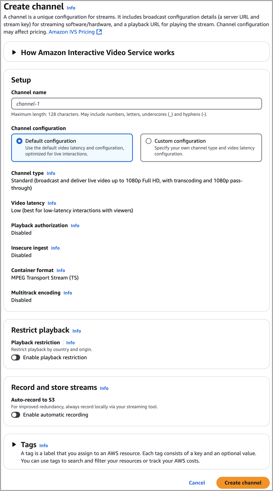
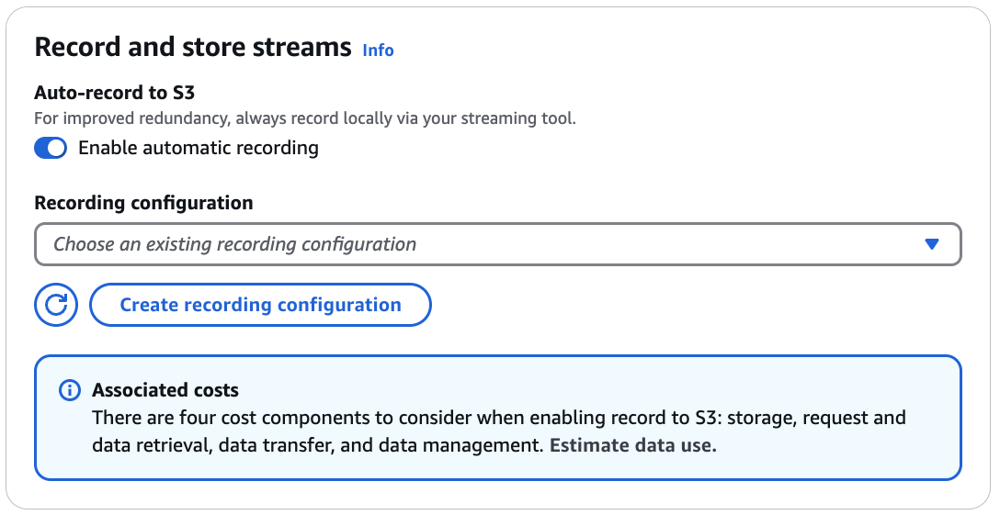
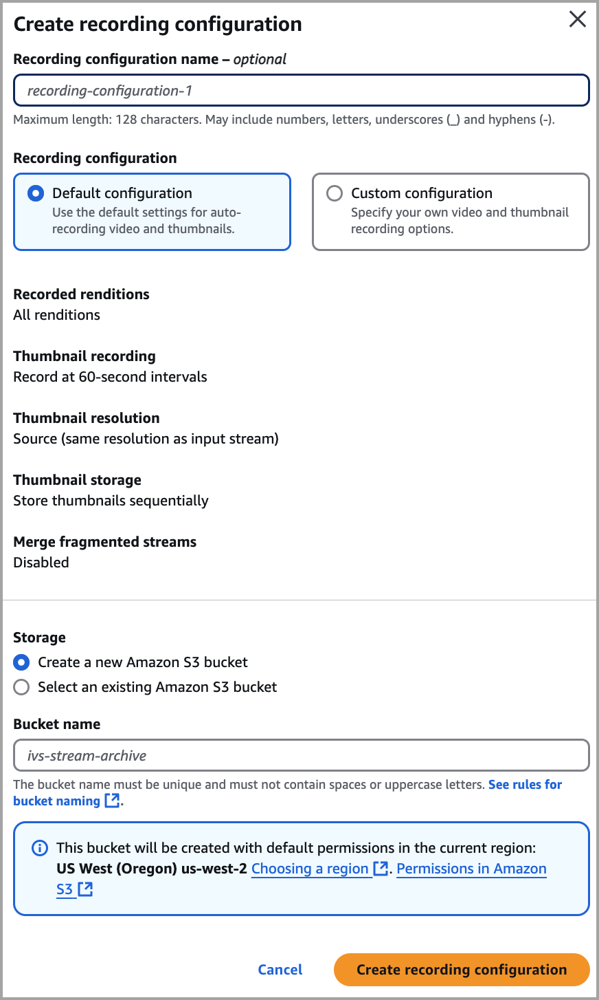
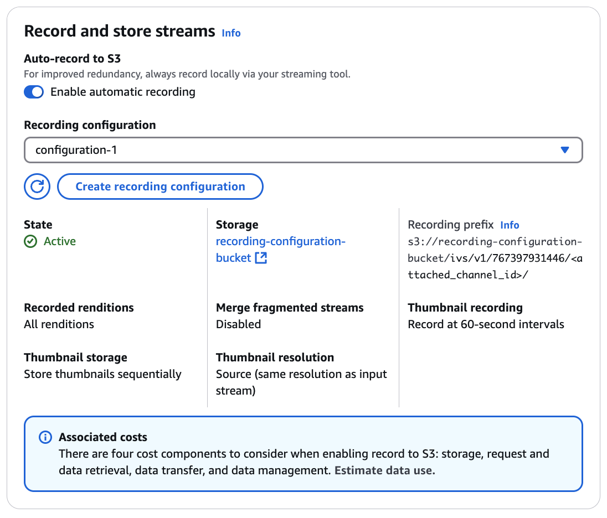
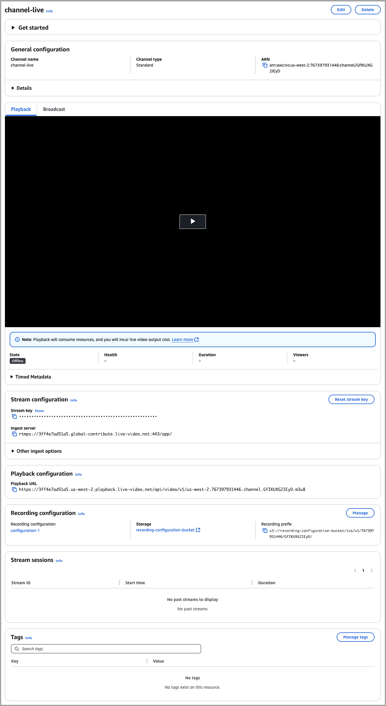

# Console Instructions for Creating an IVS

Channel

These steps are divided into three phases: initial channel setup, set up to
auto-record to Amazon S3 (optional), and final channel creation.

## Initial Channel Setup

1. Open the [Amazon IVS
   console](https://console.aws.amazon.com/ivs "https://console.aws.amazon.com/ivs").

(You can also access the Amazon IVS console through the [AWS Management
Console](https://console.aws.amazon.com "https://console.aws.amazon.com").) 2. From the navigation bar, use the **Select a
Region** drop-down to choose a region. Your new channel
will be created in this region. 3. In the **Get started** box (top right),
choose **Create Channel**. 4. Under **Channel configuration**, accept
the **Default configuration**. Optionally,
specify a **Channel name**. Channel names
are not unique, but they provide a way for you to distinguish channels
other than the channel ARN (Amazon Resource Name).

Note: **Custom configuration** can be
used for specifying certain non-default values, such as channel type or
RTMP (instead of RTMPS) ingest. Custom specifications are not documented
here.

 5. If you want to auto-record to Amazon S3, continue with [Set Up to
Auto-Record to Amazon S3 (Optional)](#getting-started-create-channel-console-record-s3 "#getting-started-create-channel-console-record-s3")
below. Otherwise, skip that and proceed directly to [Final
Channel Creation](#getting-started-create-channel-console-final-creation "#getting-started-create-channel-console-final-creation").

## Set Up to

Auto-Record to Amazon S3 (Optional)

Follow these steps to enable recording while creating a new channel:

1. On the **Create channel** page, under
   **Record and store streams**, turn on
   **Enable automatic recording.**
   Additional fields display, to choose an existing **Recording configuration** or create a new one.

 2. Choose **Create recording
configuration**. A new window opens, with options for creating
an Amazon S3 bucket and attaching it to the new recording
configuration.

 3. Fill out the fields:

    1. Optionally enter a **Recording
     configuration name**.
    2. Under **Recording configuration**
     accept the **Default
     configuration**. Note: **Custom
     configuration** can be used for specifying certain
     non-default values such as recorded renditions or merge
     fragmented streams. Custom specifications are not documented
     here.
    3. Enter a **Bucket name**.

4. Choose **Create recording
   configuration**, to create a new recording-configuration
   resource with a unique ARN. Typically, creation of the recording
   configuration takes a few seconds, but it can be up to 20 seconds. When
   the recording configuration is created, you are returned to the
   **Create channel** window. There, the
   **Record and store streams** area shows
   your new **Recording configuration**, with
   its **State** as **Active** and the S3 bucket (**Storage**) that you created.

## Final

Channel Creation

1. At the bottom of the **Create channel**
   window, choose **Create channel**, to create a
   new channel with a unique ARN. To see channel details, expand **Details**. (Note: if you did not enable recording,
   **Auto-record to S3** is set to **Disabled** and there is no **Recording configuration** section on the screen.)

 2. **Important**:

    * In the **Stream configuration** area,
     note the **Ingest server** and
     **Stream key**. You will use these
     in the next step, to set up streaming.
    * In the **Playback configuration**
     area, note the **Playback URL**. You
     will use it later, to play back your stream.

**Note**: To see SRT values (endpoint and
passphrase), expand **Other ingest options** in the
**Stream configuration** area.
