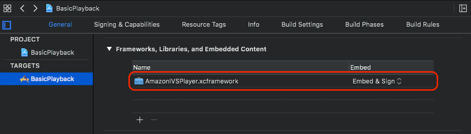

# Getting Started with the IVS iOS Player

SDK

This document takes you through the steps involved in getting started with the Amazon
IVS iOS player SDK.

We recommend that you integrate the player SDK via Swift Package Manager.
(Alternately, you can integrate via CocoaPods or manually add the framework to your
project.)

## Recommended: Integrate the Player SDK

(Swift Package Manager)

1. Download the Package.swift file from [https://player.live-video.net/1.46.0/Package.swift](https://player.live-video.net/1.46.0/Package.swift "https://player.live-video.net/1.46.0/Package.swift").
2. In your project, create a new directory named AmazonIVSPlayer and add it
   to version control.
3. Put the downloaded Package.swift file in the new directory.
4. In Xcode, go to **File > Add Package
   Dependencies** and select **Add
   Local...**
5. Navigate to and select the AmazonIVSPlayer directory that you created, and
   select **Add Package**.
6. When prompted to **Choose Package Products for
   AmazonIVSPlayer**, select **AmazonIVSPlayer** as your **Package
   Product** by setting your application target in the **Add to Target** section.
7. Select **Add Package**.

## Alternate Approach: Integrate the

Player SDK (CocoaPods)

**Important**: CocoaPods is in maintenance mode
(security fixes only) and after December 2026, no new packages or updates can be
published to the CocoaPods repository. Existing packages will remain available but
frozen. We recommend using Swift Package Manager for all new projects.

Releases are published via CocoaPods under the name `AmazonIVSPlayer`.
Add this dependency to your Podfile:

```
pod 'AmazonIVSPlayer'
```

Run `pod install` and the SDK will be available in your
`.xcworkspace`.

## Alternate Approach: Install the

Framework Manually

1. Download the latest version from [https://player.live-video.net/1.46.0/AmazonIVSPlayer.xcframework.zip](https://player.live-video.net/1.46.0/AmazonIVSPlayer.xcframework.zip "https://player.live-video.net/1.46.0/AmazonIVSPlayer.xcframework.zip").
2. Extract the contents of the archive.
   `AmazonIVSPlayer.xcframework` contains the SDK for both
   device and simulator.
3. Embed `AmazonIVSPlayer.xcframework` by dragging it into the
   **Frameworks, Libraries, and Embedded
   Content** section of the **General** tab for your application target:



## Create Player

The player object is `IVSPlayer`. It can be initialized as shown
below:

Swift

```
import AmazonIVSPlayer

let player = IVSPlayer()
```

Objective-C

```
#import <AmazonIVSPlayer/AmazonIVSPlayer.h>

IVSPlayer *player = [[IVSPlayer alloc] init];
```

## Set Up Delegate

Delegate callbacks provide information on playback state, events, and errors. All
callbacks are invoked on the main queue.

Swift

```
// Self must conform to IVSPlayer.Delegate
player.delegate = self
```

Objective-C

```
// Self must conform to IVSPlayer.Delegate
player.delegate = self
```

## Display Video

The player displays video in a custom layer, `IVSPlayerLayer`. The SDK
also provides `IVSPlayerView`, a `UIView` subclass backed by
this layer. Use whichever is more convenient for your application’s UI.

In both cases, display the video from a player instance by using the
`player` property.

Swift

```
// When using IVSPlayerView:
playerView.player = player

// When using IVSPlayerLayer:
playerLayer.player = player
```

Objective-C

```
// When using IVSPlayerView:
playerView.player = player;

// When using IVSPlayerLayer:
playerLayer.player = player;
```

## Load a Stream

The player loads the stream asynchronously. Its state indicates when it is ready
to play.

Swift

```
player.load(url)
```

Objective-C

```
[player load:url];
```

## Play a Stream

When the player is ready, use `play` to begin playback. Use the
delegate interface or key-value observing on the `state` property to
observe the state change. Here is an example of the delegate-based approach:

Swift

```
func player(_ player: IVSPlayer, didChangeState state: IVSPlayer.State) {
    if state == .ready {
        player.play()
    }
}
```

Objective-C

```
- (void)player:(IVSPlayer *)player didChangeState:(IVSPlayerState)state {
    if (state == IVSPlayerStateReady) {
        [player play];
    }
}
```

## Pause On App Backgrounding

The player does not support playback while the app is in the background, but it
does not need to be fully torn down. Pausing is sufficient; see the examples
below.

Swift

```
override func viewDidLoad() {
    super.viewDidLoad()

    NotificationCenter.default.addObserver(self,
        selector: #selector(applicationDidEnterBackground(_:)),
        name: UIApplication.didEnterBackgroundNotification,
        object: nil)
}

@objc func applicationDidEnterBackground(_ notification: NSNotification) {
    playerView?.player?.pause()
}
```

Objective-C

```
- (void)viewDidLoad {
    [super viewDidLoad];

    NSNotificationCenter *defaultCenter = NSNotificationCenter.defaultCenter;
    [defaultCenter addObserver:self
                      selector:@selector(applicationDidEnterBackground:)
                          name:UIApplicationDidEnterBackgroundNotification
                        object:nil];
}

- (void)applicationDidEnterBackground:(NSNotification *)notification {
    [playerView.player pause];
}
```

## Thread Safety

The player API is not thread safe. You should create and use a player instance
from the application main thread.

## SDK Size

The Amazon IVS player SDKs are designed to be as lightweight as possible. For
current information about SDK size, see the [Release
Notes](release-notes.md "release-notes.md").

**Important:** When evaluating size impact, the size
of the IPA produced by Xcode is not representative of the size of your app
downloaded to a user’s device. The App Store performs optimizations to reduce the
size of your app.

## Putting It All Together

The following simple, view-controller snippet loads and plays a URL in a player
view. Note that the `playerView` property is initialized from an
XIB/Storyboard, and its class is set to `IVSPlayerView` in Interface
Builder [using the Custom
Class section of the Identity Inspector.](https://developer.apple.com/tutorials/SwiftUI "https://developer.apple.com/tutorials/SwiftUI")

Swift

```
import AmazonIVSPlayer

class MyViewController: UIViewController {
...
    // Connected in Interface Builder
    @IBOutlet var playerView: IVSPlayerView!

    override func viewDidLoad() {
        super.viewDidLoad()

        NotificationCenter.default.addObserver(self,
            selector: #selector(applicationDidEnterBackground(_:)),
            name: UIApplication.didEnterBackgroundNotification,
            object: nil)
    }

    @objc func applicationDidEnterBackground(_ notification: NSNotification) {
        playerView?.player?.pause()
    }
...
    // Assumes this view controller is already loaded.
    // For example, this could be called by a button tap.
    func playVideo(url videoURL: URL) {
        let player = IVSPlayer()
        player.delegate = self
        playerView.player = player
        player.load(videoURL)
    }
}

extension MyViewController: IVSPlayer.Delegate {
    func player(_ player: IVSPlayer, didChangeState state: IVSPlayer.State) {
        if state == .ready {
            player.play()
        }
    }
}
```

Objective-C

```
// MyViewController.h

@class IVSPlayerView;

@interface MyViewController: UIViewController
...
// Connected in Interface Builder
@property (nonatomic) IBOutlet IVSPlayerView *playerView;
...
@end


// MyViewController.m

#import <AmazonIVSPlayer/AmazonIVSPlayer.h>

@implementation MyViewController <IVSPlayerDelegate>
...

- (void)viewDidLoad {
    [super viewDidLoad];

    NSNotificationCenter *defaultCenter = NSNotificationCenter.defaultCenter;
    [defaultCenter addObserver:self
                      selector:@selector(applicationDidEnterBackground:)
                          name:UIApplicationDidEnterBackgroundNotification
                        object:nil];
}

- (void)applicationDidEnterBackground:(NSNotification *)notification {
    [playerView.player pause];
}

// Assumes this view controller is already loaded.
// For example, this could be called by a button tap.
- (void)playVideoWithURL:(NSURL *)videoURL {
    IVSPlayer *player = [[IVSPlayer alloc] init];
    player.delegate = self;
    playerView.player = player;
    [player load:videoURL];
}

- (void)player:(IVSPlayer *)player didChangeState:(IVSPlayerState)state {
    if (state == IVSPlayerStateReady) {
        [player play];
    }
}

...
@end
```
