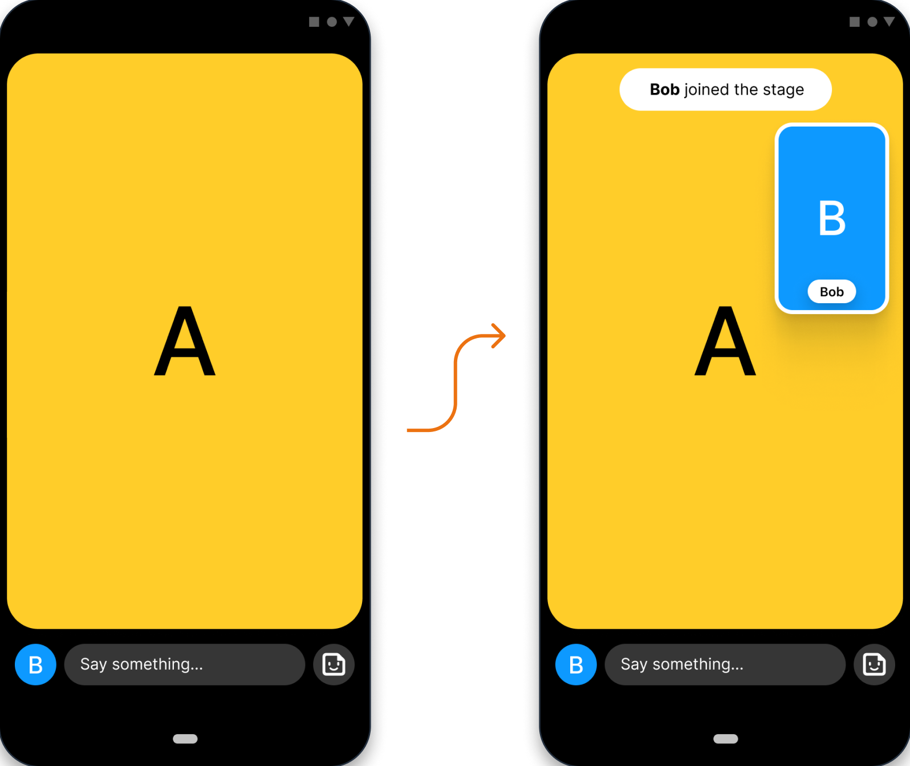
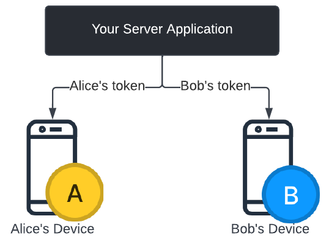
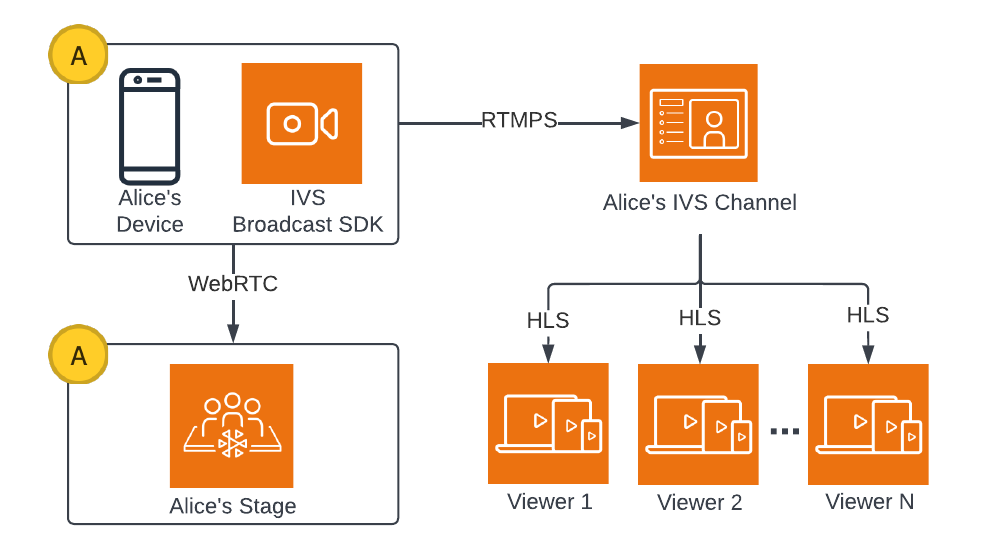
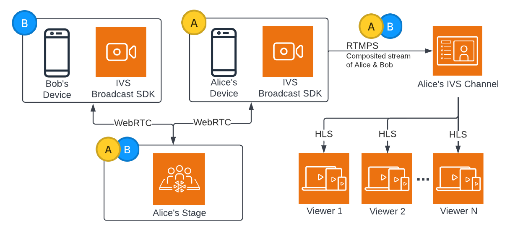
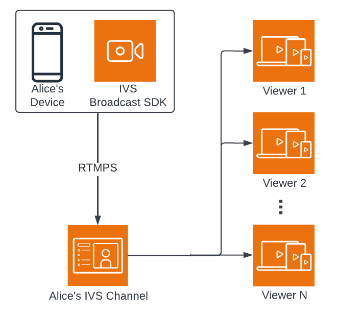
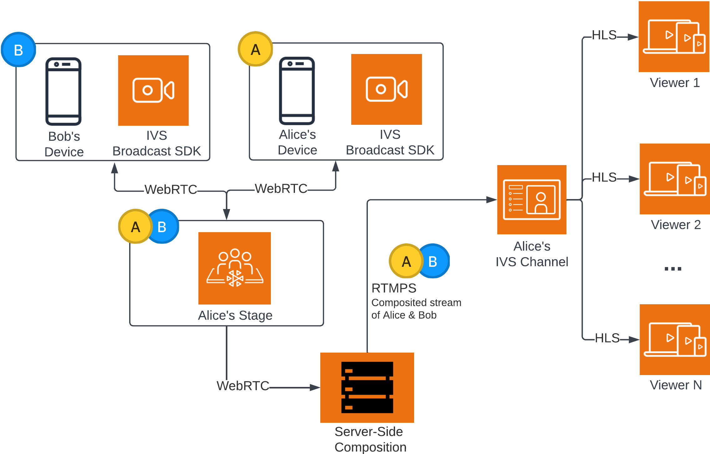

# Demo of Multiple Hosts in IVS

Scenario: Alice (A) is broadcasting to her Amazon IVS channel and wants to invite Bob
(B) on stage as a guest. (In a real broadcast, A and B would be images of Alice and
Bob.)



## 1. Create a Stage

Here is a [CreateStage](../RealTimeAPIReference/API_CreateStage.md "../RealTimeAPIReference/API_CreateStage.md")
request using the Amazon IVS Stage API:

```
POST /CreateStage HTTP/1.1
Content-type: application/json
{
   "name": "string",
   "participantTokenConfigurations": [
      {
         "userId": "9529828585",
         "attributes": {"displayName": "Alice"}
      },
      {
         "userId": "4875935192",
         "attributes": {"displayName": "Bob"}
      }
   ]
}
```

You can pre-create participant tokens when you create a stage, as is done here.
You also can create tokens for an existing stage, by calling [CreateParticipantToken](../RealTimeAPIReference/API_CreateParticipantToken.md "../RealTimeAPIReference/API_CreateParticipantToken.md"). For each participant, you can pass in a custom
`userId` and set of `attributes`. (**Important**: The `attributes` and `userId`
request fields are exposed to all stage participants. These should not be used for
personally identifying, confidential, or sensitive information.)

Here is the network response to the request above:

```
HTTP/1.1 200
Content-type: application/json
{
   "stage": {
      "arn": "arn:aws:ivs:us-west-2:123456789012:stage/abcdABCDefgh",
      "name": "alice-stage"
   },
   "participantTokens": [
      {
         "participantId": "e94e506e-f7...",
         "token": "eyJhbGci0iJ...",
         "userId": "9529828585",
         "attributes": {"displayName" : "Alice"},
         "expirationTime": number
      },
      {
         "participantId": "b5c6a79a-6e...",
         "token": "eyJhbGci0iJ...",
         "userId": "4875935192",
         "attributes": {"displayName" : "Bob"},
         "expirationTime": number
      }
   ]
}
```

## 2. Distribute Participant

Tokens

The client now has a token for Alice (A) and Bob (B). By default, tokens are valid
for 1 hour; optionally you can pass in a custom `duration` when you
create the stage. Tokens can be used to join a stage.



You will need a way to distribute tokens from your server to each client (e.g.,
via a WebSocket channel). We do not provide this functionality.

## 3. Join the Stage

Participants can join the stage via the Amazon IVS Broadcast SDK on Android or
iOS. You can configure the video quality of each participant. Here we show Alice
joining the stage first.

Here is an architecture overview:



And here is an Android code sample for joining the stage. The code snippet below
would run on Alice's device. In the `join()` call, Alice joins the stage.
The figure above shows the result of this code execution: Alice has joined the stage
and is publishing to it (in addition to broadcasting to her channel, which she
started doing in step 1).

```
// Create streams with the front camera and first microphone.
var deviceDiscovery = DeviceDiscovery(context)
var devices : List<Device> = deviceDiscovery.listLocalDevices()
var publishStreams = ArrayList<LocalStageStream>()

// Configure video quality if desired
var videoConfiguration = StageVideoConfiguration()

// Create front camera stream
var frontCamera = devices.find { it.descriptor.type == Device.Descriptor.DeviceType.Camera && it.descriptor.position == Device.Descriptor.Position.FRONT }
var cameraStream = ImageLocalStageStream(frontCamera, videoConfiguration)
publishStreams.add(cameraStream)

// Create first microphone stream
var microphone = devices.find { it.descriptor.type == Device.Descriptor.DeviceType.Microphone }
var microphoneStream = AudioLocalStageStream(microphone)
publishStreams.add(microphoneStream)

// A basic Stage.Strategy implementation that indicates the user always wants to publish and subscribe to other participants.
// Provides the front camera and first microphone as publish streams.

override fun shouldPublishFromParticipant(stage: Stage, participantInfo: ParticipantInfo) : Boolean {
   return true
}

override fun shouldSubscribeToParticipant(stage: Stage, participantInfo: ParticipantInfo) : Stage.SubscribeType {
   return Stage.SubscribeType.AUDIO_VIDEO
}

override fun stageStreamsToPublishForParticipant(stage: Stage, participantInfo: ParticipantInfo): List<LocalStageStream> {
   return publishStreams
}

// Create Stage using the strategy and join
var stage = Stage(context, token, strategy)

try {
   stage.join()
} catch (exception: BroadcastException) {
   // handle join exception
}
```

## 4. Broadcast the Stage

### Client-Side

Composition



Here is an Android code sample for broadcasting the stage:

```
var broadcastSession = BroadcastSession(context, broadcastListener, configuration, null)

// StageRenderer interface method to be notified when remote streams are available
override fun onStreamsAdded(stage: Stage, participantInfo: ParticipantInfo, streams: List<StageStream>) {

   var id = participantInfo.participantId

   // Create mixer slot for remote participant
   var slot = BroadcastConfiguration.Mixer.Slot.with { s ->
      s.name = id
      // Set other properties as desired
      ...
      s
   }

   broadcastSession.mixer.addSlot(slot)

   // Attach remote stream devices, bind to mixer slot
   streams.forEach { stream ->
      broadcastSession.attachDevice(stream.getDevice())
      broadcastSession.mixer.bind(stream.getDevice(), id)
   }
}

// Start broadcasting
try {
   broadcastSession.start(IVS_RTMPS_URL, IVS_STREAM_KEY)
} catch (exception: BroadcastException) {
   // handle exception
}
```

The Android and iOS Amazon IVS Broadcast SDKs have callbacks triggered by the
status of participants (e.g., `onStreamsAdded` and
`onStreamsRemoved`), to simplify building a dynamic UI. This is
shown in the first part of the code sample: when Bob’s video and audio are
available, Alice is notified via an `onStreamsAdded` callback.

Alice can then add Bob’s video and audio to the mixer, to be included in the
RTMP broadcast for the wider audience of her channel. This is shown in the
remainder of the code sample.

Now Alice is broadcasting to multiple viewers, via the Amazon IVS Android
Broadcast SDK. Here is what this looks like architecturally:



### Server-Side

Composition

For comparison, here is how [server-side
composition](multiple-hosts-broadcasting-client-vs-server.md "multiple-hosts-broadcasting-client-vs-server.md") works. (For details, see [Server-Side
Composition](../RealTimeUserGuide/server-side-composition.md "../RealTimeUserGuide/server-side-composition.md") in the _IVS Real-Time User
Guide_.)


