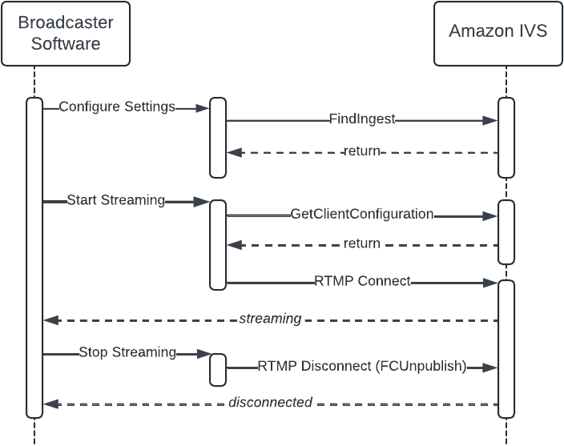
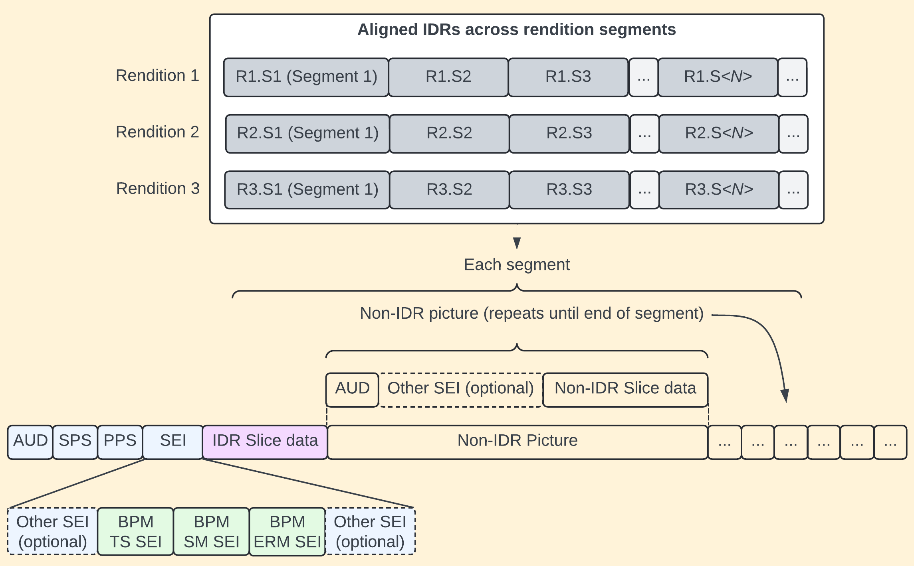
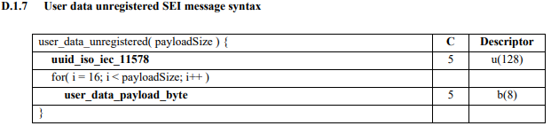

# Amazon IVS Multitrack Video: Broadcast Software Integration Guide

## Introduction

For a third-party broadcaster software tool or service to claim that it supports IVS multitrack video, it must follow this guide and implement the two required features, [automatic stream configuration](#multitrack-video-sw-integration-auto-stream "#multitrack-video-sw-integration-auto-stream") and [broadcast performance metrics](#multitrack-video-sw-integration-broadcast-perf-metrics "#multitrack-video-sw-integration-broadcast-perf-metrics"). We highly recommend also implementing the [Recommended Features](#multitrack-video-sw-integration-recommended-features "#multitrack-video-sw-integration-recommended-features").

The following diagram shows the high-level interactions between your broadcast software and Amazon IVS:

### Audience

This document is intended for software developers who want to implement client support for multitrack video for:

- _Creator broadcaster software_ designed to stream to Amazon IVS or to services that use Amazon IVS multitrack video.
- _Third-party streaming platforms_ that offer server-side simulcast or transcoding, with users who stream to Amazon IVS or services that use Amazon IVS multitrack video.

### Terminology

This document uses some terms interchangeably:

- **User, creator, broadcaster** — The end user who employs broadcast software to create and stream original content.
- **Service, platform** — A video platform or service like Amazon IVS.
- **Customer** — A business that may use a service like Amazon IVS to power a video site.

## Required Feature: Automatic Stream Configuration

Automatic stream configuration helps users get started quickly and automatically improves the quality of streams over time. Instead of users manually choosing settings (e.g., bitrate, resolution, framerate) that are set once and rarely tweaked, automatic stream configuration considers current software settings, hardware configuration, and platform support every time the user starts a new stream. For example, when a user upgrades the setup (e.g., with a new GPU), installs a new GPU driver, or the destination starts to support a new codec (e.g., H.265/HEVC), automatic stream configuration reacts and improves the quality of the user's next stream.

### Going Live

When a user starts streaming, your software must query information about the user’s hardware and software setup, call GetClientConfiguration, configure the video scaler/encoders, and open an [enhanced RTMP](https://veovera.org/docs/enhanced/enhanced-rtmp-v2 "https://veovera.org/docs/enhanced/enhanced-rtmp-v2") (E-RTMP) connection. These steps are described in more detail below.

### Use GetClientConfiguration

[GetClientConfiguration](../BroadcastSWIntegAPIReference/actions-GetClientConfiguration.md "../BroadcastSWIntegAPIReference/actions-GetClientConfiguration.md") requires information about the user’s hardware and software setup.

The algorithm considers many factors to deliver a configuration that:

- Optimizes for the best viewer experience – highest resolution, highest framerate, highest bitrate, highest number of tracks, newest/best codecs, and best video-encoder settings.
- Is safely supported by the streamer’s setup and broadcast software, the limits configured by the user, and the destination service.

In the real world, limitations include older GPUs, poor first-mile networks, specific user settings, contention of GPU resources, and limited platform codec support. When faced with these limitations, automatic stream configuration should fall back gradually and in sensible ways. For example:

- Vary the streaming bandwidth required between 10.2 Mbps (5 renditions) and 1.5 Mbps (2 renditions).
- Vary the highest quality track’s maximum resolution from 1080p (4 or 5 renditions) down to 480p (2 renditions).
- Vary the number of renditions between 5 (1080p, 720p, 480p, 360p, 160p) and 2 (480p, 360p).
- Vary the selection of renditions across an expansive set of supported resolutions (1080p, 720p, 540p, 480p, 360p, 240p, and 160p).
- Vary the bitrates of individual renditions from 6 Mbps (e.g., 1080p60 AVC) down to 200 Kbps (e.g., 160p AVC).
- Vary the frame rate between high (60, 50, or 48 fps) and standard (30, 25, or 24 fps).
- Vary the video codec to balance safety/viewer support and codec efficiency (e.g., H.264/AVC or H.265/HEVC).
- Vary the scaler algorithm to balance GPU resources (e.g., Lanczos, bicubic, and bilinear).
- Vary video-encoding settings (including codec profile, encoder preset, look-ahead window, psycho visual AQ, and number of B-frames), depending on the GPU vendor and driver version (e.g., P6 on NVIDIA GeForce RTX 4080 down to P4 on NVIDIA GeForce GTX 950).

#### Exposing Preferences to the User

You must enable the user to configure the following settings:

- Output resolution
- Output frame rate
- Maximum video tracks
- Maximum streaming bitrate

#### Optional: Setting Limits in the Broadcast Software

Your software or service may provide defaults or constrain the user’s ability to configure these settings. For example, if your software or service needs to retain GPU resources and you want to limit the number of video-encoder sessions used by multitrack video, you could choose to limit your users to 3 **Maximum Video Tracks** and clearly indicate to the user that **Auto** means "up to 3."

#### Limits Set by the Destination

The stream key in the GetClientConfiguration request is required so the service can identify the channel and determine if there are per-channel constraints. For example, Amazon IVS provides a `multitrackInputConfiguration.maximumResolution` property for `STANDARD` channels. This can be used to limit the resolution of any individual track, so customers can make available special qualities (e.g., 720p60 or 1080p60 streaming) to specific creators or otherwise control their output cost.

#### Handling Warnings and Errors

GetClientConfiguration returns warnings and errors in different circumstances, so you must implement user-facing support to handle both warnings and errors.

_Warnings_ are informational. The user should be permitted to either continue streaming or cancel. Here is an example of a warning:

- The NVIDIA driver version installed on the user’s machine will no longer be supported on date DD/MM/YYYY.

_Errors_ are considered fatal. The user should not be permitted to continue streaming. Here are examples of errors:

- The channel is not configured to support multitrack video.
- Out of date / Unsupported GPU driver version.
- Your GPU is not supported.
- The stream key provided is invalid.
- Your frame rate 59.94 is not supported by Amazon IVS Multitrack Video. In Settings > Video, select one of the following supported values: 24, 25, 30, 48, 50, 60.
- Configuration request is missing required data (GPU driver version, GPU model, etc).

### Configure Video Scaling and Encoding

[GetClientConfiguration](../BroadcastSWIntegAPIReference/actions-GetClientConfiguration.md "../BroadcastSWIntegAPIReference/actions-GetClientConfiguration.md") returns scaling and encoding settings that optimize for the best possible viewer experience, without impacting the performance of the application (e.g., game/broadcast software) and taking into account the user’s settings. Use the exact scaling and encoding settings returned by GetClientConfiguration. GetClientConfiguration takes into account the specific needs of different vendors and GPU architectures that change over time.

In addition to the scaling and encoding settings (like preset), you must:

- _Align all encoders and ensure that IDRs for all renditions have the same PTS._ This is required to avoid the need for server-side transcoding to align multiple renditions when video is distributed and viewed using segmented HLS. If IDRs are not aligned across video tracks, viewers will experience time shifting and stuttering during rendition switching in ABR playback. (For a visualization, see the figure in [Broadcast Performance Metrics](#multitrack-video-sw-integration-broadcast-perf-metrics "#multitrack-video-sw-integration-broadcast-perf-metrics").)
- _Clone SEI/OBU data (e.g., captions) across all video tracks._ This is required so the video player can access SEI/OBU data regardless of the individual quality being watched.

### Connect Using Enhanced RTMP

For documentation on multitrack streaming via enhanced RTMP, see the [Enhanced RTMP v2 specification](https://veovera.org/docs/enhanced/enhanced-rtmp-v2 "https://veovera.org/docs/enhanced/enhanced-rtmp-v2").

When connecting with enhanced RTMP, Amazon IVS multitrack video has several requirements:

- The primary, highest quality video track must be packaged and sent as enhanced RTMP single-track video packets. For example, `videoPacketType` can be `CodedFrames`, `CodedFramesX`, `SequenceStart`, and `SequenceEnd`.
- All additional video tracks must be packaged and sent as enhanced RTMP multitrack video packets (e.g., `videoPacketType` is `Multitrack`), with the multitrack packet type set to one track (e.g., `videoMultitrackType` is `OneTrack`).
- The stream key in the `authentication` field returned by [GetClientConfiguration](../BroadcastSWIntegAPIReference/actions-GetClientConfiguration.md "../BroadcastSWIntegAPIReference/actions-GetClientConfiguration.md") must be used to connect to the RTMP server.
- The `config_id` value returned by [GetClientConfiguration](../BroadcastSWIntegAPIReference/actions-GetClientConfiguration.md "../BroadcastSWIntegAPIReference/actions-GetClientConfiguration.md") must be appended as a query argument to the RTMP connection string with key `clientConfigId`.

The following is an example of a stream configuration:

| videoPacketType
| videoMultitrackType
| trackId
| Resolution
|
| --- | --- | --- | --- |
| CodedFrames CodedFramesX SequenceStart SequenceEnd | NA – videoMultitrackType is not sent with single-track enhanced RTMP. | NA – trackId is not sent with single-track enhanced RTMP. | 1920x1080 |
| Multitrack | OneTrack | 1 | 1280x720 |
| Multitrack | OneTrack | 2 | 852x480 |
| Multitrack | OneTrack | 3 | 640x360 | Your broadcast software should use the data returned by [GetClientConfiguration](../BroadcastSWIntegAPIReference/actions-GetClientConfiguration.md "../BroadcastSWIntegAPIReference/actions-GetClientConfiguration.md") in `ingest_endpoints` and the protocol (RTMP or RTMPS) selected by the user to identify the endpoint to connect to. Use the `url_template` and the stream key returned in `authentication` to create a URL and include `config_id` as the `clientConfigId` query argument. If you allow the user to specify RTMP query arguments (for example, `?bandwidthtest=1`), you must append them in addition to specifying `clientConfigId`. Here is an example of a response from GetClientConfiguration: `{ "ingest_endpoints": [ { "protocol": "RTMP", "url_template": "rtmp://iad05.contribute.live-video.net/app/{stream_key}", "authentication": "v1_5f2e593731dad88b6bdb03a3517d306ef88a73e29619ee4b49012d557e881484_65c5dc81_7b2276223a302c2262223a393939392c2274223a5b7b2277223a3634302c2268223a3336302c2262223a3530302c226330223a312c226331223a302c226332223a307d2c7b2277223a313238302c2268223a3732302c2262223a313730302c226330223a312c226331223a302c226332223a307d2c7b2277223a313932302c2268223a313038302c2262223a363030302c226330223a312c226331223a302c226332223a307d5d7d_live_495665160_FC45sNuCYUwLnCVtCnXSjEWkusXzJI" }, { "protocol": "RTMPS", "url_template": "rtmps://iad05.contribute.live-video.net/app/{stream_key}", "authentication": "v1_5f2e593731dad88b6bdb03a3517d306ef88a73e29619ee4b49012d557e881484_65c5dc81_7b2276223a302c2262223a393939392c2274223a5b7b2277223a3634302c2268223a3336302c2262223a3530302c226330223a312c226331223a302c226332223a307d2c7b2277223a313238302c2268223a3732302c2262223a313730302c226330223a312c226331223a302c226332223a307d2c7b2277223a313932302c2268223a313038302c2262223a363030302c226330223a312c226331223a302c226332223a307d5d7d_live_495665160_FC45sNuCYUwLnCVtCnXSjEWkusXzJI" } ], "meta": { "config_id": "d34c2f7e-ce3a-4be4-a6a0-f51960abbc4f", … } … }` Then, if the user selected RTMP, you would open the connection to: `rtmp://iad05.contribute.live-video.net/app/v1_5f2e593731dad88b6bdb03a3517d306ef88a73e29619ee4b49012d557e881484_65c5dc81_7b2276223a302c2262223a393939392c2274223a5b7b2277223a3634302c2268223a3336302c2262223a3530302c226330223a312c226331223a302c226332223a307d2c7b2277223a313238302c2268223a3732302c2262223a313730302c226330223a312c226331223a302c226332223a307d2c7b2277223a313932302c2268223a313038302c2262223a363030302c226330223a312c226331223a302c226332223a307d5d7d_live_495665160_FC45sNuCYUwLnCVtCnXSjEWkusXzJI?clientConfigId=d34c2f7e-ce3a-4be4-a6a0-f51960abbc4f` #### Handling Video Disconnections The multitrack video system enforces several limits. Broadly, the limitations are in place for three reasons: 1. System safety — IVS needs to constrain input for scalability. Examples include an streaming bandwidth limit on a per-channel basis that affects input processing, a bitrate entitlement on a track or resolution basis that affects output capacity/cost, and a number-of-tracks entitlement that affects CDN replication/delivery capacity. 2. System functionality — The service needs to constrain input for feature compatibility (e.g., platform support for individual codecs or delivery-container support for advanced codecs). 3. Viewer experience — The service needs to constrain input for viewer experience and brand reputation. For example, the service controls the player ABR algorithm that drives QoE across all target user devices (desktop, mobile, TV/OTT, etc.) and apps (browsers, native, etc.). The video system disconnects the client in several scenarios:  • The client tries to connect to the RTMP server with multitrack video but does not use the stream key returned by [GetClientConfiguration](../BroadcastSWIntegAPIReference/actions-GetClientConfiguration.md "../BroadcastSWIntegAPIReference/actions-GetClientConfiguration.md").  • The client provides multitrack video that does not match the specification returned by GetClientConfiguration; for example: + The number of tracks is mismatched. + An individual track has a mismatched codec. + An individual track has a mismatched resolution. + An individual track has a mismatched frame rate. + An individual track has a mismatched bitrate.  • The client does not provide video tracks that have aligned IDRs.  • Broadcast performance metrics do not precede every IDR on every track. Disconnections may occur at the beginning of the stream (i.e., the channel never goes live) or mid-stream (i.e., the channel is live, a mismatch is detected, and then the client is disconnected). #### Automatically Reconnecting The validity of the stream key returned by GetClientConfiguration is 48 hours or until the stream key is invalidated by calling DeleteStreamKey. The maximum duration of IVS streams is 48 hours; after that, the stream is terminated and the streaming session is disconnected. A successful reconnect (automatically or manually) starts a new stream. Your broadcast software may implement automatic reconnection. If you support automatic reconnection, you should allow users to enable/disable it and follow these guidelines:  • Implement an exponential backoff retry delay (including a small random deviation) between connection attempts.  • Retry for at most 25 connection attempts. For example, OBS Studio retries 25 times, with an exponentially increasing wait time between attempts that is capped at 15 minutes. In practice, this means the last retry happens roughly 3 hours after getting disconnected.  • If you get disconnected immediately after sending `publish` when connecting, call GetClientConfiguration, reconfigure the encoder settings, and then try to connect again. #### Stopping the Stream and Disconnecting When the user stops streaming, and if the TCP connection is still open (e.g., the lower-level connection was not reset), you must send FCUnpublish ([example implementation in OBS Studio](https://github.com/obsproject/obs-studio/blob/master/plugins/obs-outputs/librtmp/rtmp.c#L1973-L1999 "https://github.com/obsproject/obs-studio/blob/master/plugins/obs-outputs/librtmp/rtmp.c#L1973-L1999")) before closing the RTMP connection. This is critical to signal the user’s intent of the end of the stream, because downstream features rely on it to operate properly. ## Required Feature: Broadcast Performance Metrics (BPM) To enable ongoing improvement of automatic stream configuration, to deliver the best possible stream settings, broadcast performance metrics (BPM) must be measured and sent. The metrics are collected and sent in-band via SEI (for AVC/HEVC) messages. Two classes of data are collected:  • _Timestamps_ are collected to measure end-to-end latency between the broadcaster and the viewer. They are useful for: + Providing the broadcaster or audience with an estimate of end-to-end latency. + Analyzing timestamp jitter that may indicate system stress or poor first-mile network connectivity. + Referencing real-world event time for aligning and aggregating time-series counter data. The timestamp sent from the broadcaster is based on a global common reference clock, typically an NTP-synchronized clock using the UTC+0 timezone. RFC3339 is commonly used for this scenario of "Internet time." This provides an absolute reference, making temporal difference calculations trivial.  • _Frame counters_ are collected to measure the performance of the broadcast software and video encoders at the frame level. They are useful for: + Providing broadcasters with a performance dashboard that includes additional signals, to help them improve their streaming setup. + Providing a proactive signal that may correlated with environmental changes like newly released GPU drivers or OS versions/patches. + Providing feedback to enable video services to safely iterate and release improvements to GetClientConfiguration, including support for new hardware vendors, new GPU models, new codecs, new driver features, additional video-encoder setting tuning, and new user-controlled presets (e.g., “Dual PC Setup” vs. “Gaming+Streaming Setup”). ### Insert SEI/OBU Messages Refer to [BPM Message Definitions](#multitrack-video-sw-integration-performance-metrics-definitions "#multitrack-video-sw-integration-performance-metrics-definitions") for the specific message byte-stream definitions. BPM metrics must be inserted on all video tracks just prior to the IDR. The three messages (BPM TS, BPM SM, and BPM ERM) should be sent together, but each should be sent as a separate NUT (AVC/HEVC). BPM SM and BPM ERM sent in the first segment should have the frame counters set to 0. This may seem counterintuitive at first; however, counters such as number of frames encoded per rendition do not have meaningful data until after the encode is done, and the result is that the frame counters in segment N align with segment N-1. It is best to think about the BPM metrics as a timed-data series that is delivered in the video bitstream at the IDR interval. If necessary, precise realignment of the data series should be performed by the receiver using the timestamps provided. The illustration below depicts a typical scenario for a three-rendition multitrack stream. With a typical segment size of two seconds, metrics will be sent every two seconds for each rendition.  ## Recommended Features ### Allow Automatic Server Selection Automatic server selection helps users select the best ingest server to connect to for their live streams, given changes in global network conditions and ingest PoP (Point of Presence) availability. If your broadcast software supports automatic server selection, we expect the different behavior depending on whether the software implements GetClientConfiguration and/or FindIngest. Each scenario is listed separately below. If the broadcast software implements both GetClientConfiguration and FindIngest:
| User UI Selection | Connect to ingest endpoint specified by … | | --- | --- |
| Auto | GetClientConfiguration | | Specific ingest endpoint from FindIngest | User's selection |
| Specify Custom Server | User's selection | If the broadcast software implements GetClientConfiguration but does not implement FindIngest: | User UI Selection | Connect to ingest endpoint specified by …
| | --- | --- | | Auto | GetClientConfiguration |
| Specify Custom Server | User's selection | If the broadcast software does not implements GetClientConfiguration but does implement FindIngest: | User UI Selection | Connect to ingest endpoint specified by …
| | --- | --- | | Auto | FindIngest |
| Specific ingest endpoint from FindIngest | User's selection | | Specify Custom Server | User's selection | If the broadcast software does not implement GetClientConfiguration or FindIngest:
| User UI Selection | Connect to ingest endpoint specified by … | | --- | --- |
| Auto | Global ingest URL:  • For RTMP: rtmp://ingest.global-contribute.live-video.net/app  • For RTMPS: rtmps://ingest.global-contribute.live-video.net:443/app | | Specify Custom Server | User's selection | See [Using a FindIngest Server for Auto Streaming Destination](#multitrack-video-sw-integration-recommended-features-using-findingest "#multitrack-video-sw-integration-recommended-features-using-findingest") for more information about using ingest endpoints specified by FindIngest. ### Allow Users to Configure Streaming Destination When users are configuring their streaming destinations, you should query [FindIngest](../BroadcastSWIntegAPIReference/actions-FindIngest.md "../BroadcastSWIntegAPIReference/actions-FindIngest.md") and provide the user with the ability to:  • Choose between RTMP or RTMPS (default for Amazon IVS).  • Select **Auto** for the server.  • Select a specific server from the list returned by [FindIngest](../BroadcastSWIntegAPIReference/actions-FindIngest.md "../BroadcastSWIntegAPIReference/actions-FindIngest.md")  • Enter a custom server; e.g., use **Specify Custom Server**. You may filter the list returned by FindIngest based on the protocol selected by the user (RTMP vs. RTMPS) or other considerations. For example, the implementation of Amazon IVS in OBS Studio achieves this by providing a simple **Server** drop-down with the following options:  • Auto (RTMPS, Recommended)  • Auto (RTMP)  • US East: Ashburn, VA (5) (RTMPS)  • US East: New York, NY (50) (RTMPS)  • US East: New York, NY (RTMPS)  • US East: Ashburn, VA (5) (RTMP)  • US East: New York, NY (50) (RTMP)  • US East: New York, NY (RTMP)  • Specify Custom Server When **Specify Custom Server** is selected, a text box is provided for the user to enter an RTMP URL. ### Using a FindIngest Server for Auto Streaming Destination If you use ingest endpoints specified by FindIngest when Auto was specified for the streaming destination, use the entry with the lowest `priority` value returned by [FindIngest](../BroadcastSWIntegAPIReference/actions-FindIngest.md "../BroadcastSWIntegAPIReference/actions-FindIngest.md"). To reduce the time it takes for a stream to go live, you may cache the FindIngest response. If you do cache the response, update the cached value regularly. If the user selects RTMP, use the `url_template` string as the RTMP broadcast destination. If the user selects RTMPS, use the `url_template_secure` string as the RTMPS broadcast destination. In both cases, replace `{stream_key}` with the user’s stream key. ## Broadcast Performance Metrics (BPM) Message Definitions BPM messages are based on the [H.264 standard](https://www.itu.int/rec/T-REC-H.264 "https://www.itu.int/rec/T-REC-H.264") SEI syntax. For reference, the user data unregistered SEI syntax from the H.264 specification is:  For BPM messages, all parsing and notation rules from the H.264 standard apply, for example, “u(128)” means unsigned 128-bit integer, MSB first. Three SEI messages are defined for BPM:  • BPM TS SEI: [Timestamp message](#multitrack-video-sw-integration-performance-metrics-definitions-bpm-ts "#multitrack-video-sw-integration-performance-metrics-definitions-bpm-ts")  • BPM SM SEI: [Session Metrics message](#multitrack-video-sw-integration-performance-metrics-definitions-bpm-sm "#multitrack-video-sw-integration-performance-metrics-definitions-bpm-sm")  • BPM ERM SEI: [Encoded Rendition Metrics message](#multitrack-video-sw-integration-performance-metrics-definitions-bpm-erm "#multitrack-video-sw-integration-performance-metrics-definitions-bpm-erm") All BPM SEI messages send a 128-bit UUID required by the `user_data_unregistered()` syntax, followed by a loop of payload bytes. The resulting message is then encapsulated in higher-level semantics (e.g., NALU, RBSP, and start-code emulation prevention). ### BPM TS (Timestamp) SEI The BPM TS SEI message conveys one or more related timestamps. For example, the client can signal timestamps for frame composition, frame encode request, frame encode request complete, and packet interleaved in a single SEI message, and the client can decide if each of these timestamps should be sent as wall-clock (RFC3339/ISO8601-style) or delta (difference) clock or duration-since-epoch. There should be one timestamp that provides a reference for the delta type(s); this should be taken care of by the deployment, not by any syntactic constraints.
| | | | | --- | --- | --- |
| `user_data_unregistered_bpm_ts( payloadSize ) {` | **C** | **Descriptor** | |  • `uuid_iso_iec_11578`
| 5 | u(128) | |  • `ts_reserved_zero_4bits` | 5 | b(4) |
|  • `num_timestamps_minus1` | 5 | u(4) | |  • `for( i = 0; i <= num_timestamps_minus1; i++ ) {`
| | | |  • + `timestamp_type[i]` | 5 | u(8) |
|  • + `timestamp_event[i]` | 5 | u(8) | |  • + `if (timestamp_type[i] == 1)`
| | | |  • + - `rfc3339_ts[i]` | 5 | st(v) |
|  • + `else if (timestamp_type[i] == 2)` | | | |  • + - `duration_since_epoch_ts[i]`
| 5 | u(64) | |  • + `else if (timestamp_type[i] == 3)` | | |
|  • + - `delta_ts[i]` | 5 | i(64) | |  • `}`
| | | | `}` | | | #### BPM TS SEI Field Description Table
| Field | Description | | --- | --- |
| `uuid_iso_iec_11578` | Set to hex: `0aecffe752724e2fa62fd19cd61a93b5` With the usage of the unregistered SEI message, a UUID is required to disambiguate this message from any other unregistered messages. | | `ts_reserved_zero_4bits` | Reserved for future use. Set to `b('0000')`. Receiver shall ignore these bits. |
| `num_timestamps_minus1` | `num_timestamps=num_timestamps_minus1+1` `num_timestamps_minus1` shall be between 0 and 15, meaning between 1 and 16 timestamps can be signaled. | | `timestamp_type` | See [timestamp_type Table](#multitrack-video-sw-integration-performance-metrics-definitions-bpm-ts-types "#multitrack-video-sw-integration-performance-metrics-definitions-bpm-ts-types"). |
| `timestamp_event` | One of the following:  • `BPM_TS_EVENT_CTS = 1` // Composition Time Event  • `BPM_TS_EVENT_FER = 2` // Frame Encode Request Event  • `BPM_TS_EVENT_FERC = 3` // Frame Encode Request Complete Event  • `BPM_TS_EVENT_PIR = 4` // Packet Interleave Request Event There is no syntactic discriminator to identify uniqueness in cases where `num_timestamps_minus1` is greater than 0 (i.e., more than one timestamp is signaled); hence, `timestamp_event` should be unique within the SEI loop. Signaling multiple timestamps with the same `timestamp_event` is not precluded; however, the interpretation of the timestamps is outside the scope of the message. | #### timestamp_type Table `timestamp_type` specifies types such as:  • “Wall clock” formats where the calendar-based date and time are signaled.  • Duration since epoch.  • Delta timestamps where the difference between two events is signaled.  • Additional timestamp formats that may be needed in the future. | timestamp_type | Name
| Description | | --- | --- | --- |
| 0 | undefined | Undefined – do not use. | | 1 | `rfc3339_ts` | [RFC3339](https://www.rfc-editor.org/rfc/rfc3339 "https://www.rfc-editor.org/rfc/rfc3339") is a profile of [ISO8601](https://en.wikipedia.org/wiki/ISO_8601 "https://en.wikipedia.org/wiki/ISO_8601") for Internet usage, which restricts some of the options in ISO8601. `timestamp_type==1` shall use RFC3339-based time notation. Note that RFC3339 does not support timezones. All timestamps are relative to UTC (aka "Zulu" time), which by definition is a UTC offset of 00:00. r`fc3339_ts` shall be a string. `st(v)` is defined in section 7.2 of the [H.264 standard](https://www.itu.int/rec/T-REC-H.264 "https://www.itu.int/rec/T-REC-H.264"). See the note on leap seconds, below this table. Example: `2024-03-25T15:10:34.489Z` (489 refers to milliseconds) |
| 2 | `duration_since_epoch_ts` | Duration since epoch at 1970-01-01T00:00:00Z000 in milliseconds. See the note on leap seconds, below this table. | | 3 | `delta_ts` | Delta timestamp, expressing the difference in nanoseconds between 2 events. Signed integers allow positive and negative deltas to be signaled. |
| 4-255 | Reserved | Reserved. | **Note on leap seconds:** It is important to note that an agreement was made to phase out the use of leap seconds by 2035. See the [Wikipedia entry on leap seconds](https://en.wikipedia.org/wiki/Leap_second "https://en.wikipedia.org/wiki/Leap_second") for details. We recommend using timestamps that exclude leap seconds. This aligns with the expected practices by 2035 and avoids possible miscalculations in timing. ### BPM SM (Session Metrics) SEI The BPM SM SEI message conveys the set of metrics that relate to the overall sender session. In OBS Studio, this means sending the following frame counters:  • Session frames rendered  • Session frames dropped  • Session frames lagged  • Session frames output This SEI message also includes a timestamp. This is redundant with the BPM TS SEI; however, providing an explicit timestamp in each SEI message provides a unit of atomic behavior and reduces the load on the receiver to realign data. Also, should the need arise to drop or not send BPM TS SEI, there would still be an explicit timestamp in the BPM SM SEI message to use. | | | |
| --- | --- | --- | | `user_data_unregistered_bpm_sm( payloadSize ) {` | **C** | **Descriptor** |
|  • `uuid_iso_iec_11578` | 5 | u(128) | |  • `ts_reserved_zero_4bits`
| 5 | b(4) | |  • `num_timestamps_minus1` | 5 | u(4) |
|  • `for( i = 0; i <= num_timestamps_minus1; i++ ) {` | | | |  • + `timestamp_type[i]`
| 5 | u(8) | |  • + `timestamp_event[i]` | 5 | u(8) |
|  • + `if (timestamp_type[i] == 1)` | | | |  • + - `rfc3339_ts[i]`
| 5 | st(v) | |  • + `else if (timestamp_type[i] == 2)` | | |
|  • + - `duration_since_epoch_ts[i]` | 5 | u(64) | |  • + `else if (timestamp_type[i] == 3)`
| | | |  • + - `delta_ts[i]` | 5 | i(64) |
|  • `}` | | | |  • `ts_reserved_zero_4bits`
| 5 | b(4) | |  • `num_counters_minus1` | 5 | u(4) |
|  • `for( i = 0; i <= num_counters_minus1; i++ ) {` | | | |  • + `counter_tag[i]`
| 5 | b(8) | |  • + `counter_value[i]` | 5 | b(32) |
|  • `}` | | | | `}` | | | #### BPM SM SEI Field Description Table Many fields in this SEI message are similar to BPM TS SEI fields. The significant differences are the UUID value, number of timestamps expected, and counters being transmitted.
| Field | Description | | --- | --- |
| `uuid_iso_iec_11578` | Set to hex: `ca60e71c-6a8b-4388-a377-151df7bf8ac2` With the usage of the unregistered SEI message, a UUID is required to disambiguate this message from any other unregistered messages. | | `ts_reserved_zero_4bits` | Reserved for future use. Set to `b('0000')`. Receiver shall ignore these bits. |
| `num_timestamps_minus1` | `num_timestamps=num_timestamps_minus1+1` `num_timestamps_minus1` shall be between 0 and 15, meaning between 1 and 16 timestamps can be signaled. Currently, this should be 0 (indicating a single timestamp). | | `timestamp_type` | See [timestamp_type Table](#multitrack-video-sw-integration-performance-metrics-definitions-bpm-ts-types "#multitrack-video-sw-integration-performance-metrics-definitions-bpm-ts-types"). For BPM SM SEI, this shall be type 1 - RFC3339 string. |
| `timestamp_event` | One of the following:  • `BPM_TS_EVENT_CTS = 1` // Composition Time Event  • `BPM_TS_EVENT_FER = 2` // Frame Encode Request Event  • `BPM_TS_EVENT_FERC = 3` // Frame Encode Request Complete Event  • `BPM_TS_EVENT_PIR = 4` // Packet Interleave Request Event There is no syntactic discriminator to identify uniqueness in cases where `num_timestamps_minus1` is greater than 0 (i.e., more than one timestamp is signaled); hence, `timestamp_event` should be unique within the SEI loop. Signaling multiple timestamps with the same `timestamp_event` is not precluded; however, the interpretation of the timestamps is outside the scope of the message. **Note:** Amazon IVS expects BPM SM SEI using `timestamp_event` only set to 4 (`BPM_TS_EVENT_PIR`). This will evolve as support for additional timestamp events are added. | | `num_counters_minus1` | `num_counters=num_counters_minus1+1` `num_counters_minus1` shall be between 0 and 15, meaning between 1 and 16 counters can be signaled. For BPM SM SEI, this should be 3 (meaning 4 counters). |
| `counter_tag` | One of the following:  • `BPM_SM_FRAMES_RENDERED = 1` // Frames rendered by compositor  • `BPM_SM_FRAMES_LAGGED = 2` // Frames lagged by compositor  • `BPM_SM_FRAMES_DROPPED = 3` // Frames dropped due to network congestion  • `BPM_SM_FRAMES_OUTPUT = 4` // Total frames output (sum of all video encoder rendition sinks) | | `counter_value` | The 32-bit difference value for the specified `counter_tag`, relative to the last time it was sent. For example, with 60 fps rendering, each 2 seconds `counter_value` should be 120. | #### BPM SM Example Here is an example of a BPM SM SEI sent to Amazon IVS:  • `uuid_iso_iec_11578` (16 bytes): ca60e71c-6a8b-4388-a377-151df7bf8ac2  • `ts_reserved_zero_4bits` (4 bits): 0x0  • `num_timestamps_minus1` (4 bits): 0x0 (meaning 1 timestamp is being sent)  • `timestamp_type` (1 byte): 0x01 (RFC3339 timestamp - string format)  • `timestamp_event` (1 byte): 0x04 (BPM_TS_EVENT_PIR)  • `rfc3339_ts`: "2024-03-25T15:10:34.489Z"  • `ts_reserved_zero_4bits` (4 bits): 0x0  • `num_counters_minus1` (4 bits): 0x3 (meaning 4 counters are being sent)  • `counter_tag` (1 byte): 0x01 (frames rendered by compositor since last message)  • `counter_value` (4 bytes)  • `counter_tag` (1 byte): 0x02 (frames lagged by compositor since last message)  • `counter_value` (4 bytes)  • `counter_tag` (1 byte): 0x03 (frames dropped due to network congestion since last message)  • `counter_value` (4 bytes)  • `counter_tag` (1 byte): 0x04 (total frames output (sum of all video encoder rendition sinks since last message)  • `counter_value` (4 bytes) ### BPM ERM (Encoded Rendition Metrics) SEI The BPM ERM SEI message conveys the set of metrics that relate to each encoded rendition. In OBS Studio, this means sending the following frame counters:  • Rendition frames input  • Rendition frames skipped  • Rendition frames output This SEI message also includes a timestamp. This is redundant with the BPM TS SEI; however, providing an explicit timestamp in each SEI message provides a unit of atomic behavior and reduces the load on the receiver to realign data. Also, should the need arise to drop or not send BPM TS SEI, there would still be an explicit timestamp in the BPM ERM SEI message to use.
| | | | | --- | --- | --- |
| `user_data_unregistered_bpm_erm( payloadSize ) {` | **C** | **Descriptor** | |  • `uuid_iso_iec_11578`
| 5 | u(128) | |  • `ts_reserved_zero_4bits` | 5 | b(4) |
|  • `num_timestamps_minus1` | 5 | u(4) | |  • `for( i = 0; i <= num_timestamps_minus1; i++ ) {`
| | | |  • + `timestamp_type[i]` | 5 | u(8) |
|  • + `timestamp_event[i]` | 5 | u(8) | |  • + `if (timestamp_type[i] == 1)`
| | | |  • + - `rfc3339_ts[i]` | 5 | st(v) |
|  • + `else if (timestamp_type[i] == 2)` | | | |  • + - `duration_since_epoch_ts[i]`
| 5 | u(64) | |  • + `else if (timestamp_type[i] == 3)` | | |
|  • + - `delta_ts[i]` | 5 | i(64) | |  • `}`
| | | |  • `ts_reserved_zero_4bits` | 5 | b(4) |
|  • `num_counters_minus1` | 5 | u(4) | |  • `for( i = 0; i <= num_counters_minus1; i++ ) {`
| | | |  • + `counter_tag[i]` | 5 | b(8) |
|  • + `counter_value[i]` | 5 | b(32) | |  • `}`
| | | | `}` | | | #### BPM ERM SEI Field Description Table Many fields in this SEI message are similar to the BPM TS SEI fields and the BPM SM SEI fields. The significant differences are the UUID value, number of timestamps expected, and counters being transmitted.
| Field | Description | | --- | --- |
| `uuid_iso_iec_11578` | Set to hex: `f1fbc1d5-101e-4fb5-a61e-b8ce3c07b8c0` With the usage of the unregistered SEI message, a UUID is required to disambiguate this message from any other unregistered messages. | | `ts_reserved_zero_4bits` | Reserved for future use. Set to `b('0000')`. Receiver shall ignore these bits. |
| `num_timestamps_minus1` | `num_timestamps=num_timestamps_minus1+1` `num_timestamps_minus1` shall be between 0 and 15, meaning between 1 and 16 timestamps can be signaled. Currently, this should be 0 (indicating a single timestamp). | | `timestamp_type` | See [timestamp_type Table](#multitrack-video-sw-integration-performance-metrics-definitions-bpm-ts-types "#multitrack-video-sw-integration-performance-metrics-definitions-bpm-ts-types"). This shall be a type 1 - RFC3339 string. |
| `timestamp_event` | One of the following:  • `BPM_TS_EVENT_CTS = 1` // Composition Time Event  • `BPM_TS_EVENT_FER = 2` // Frame Encode Request Event  • `BPM_TS_EVENT_FERC = 3` // Frame Encode Request Complete Event  • `BPM_TS_EVENT_PIR = 4` // Packet Interleave Request Event There is no syntactic discriminator to identify uniqueness in cases where `num_timestamps_minus1` is greater than 0 (i.e., more than one timestamp is signaled); hence, `timestamp_event` should be unique within the SEI loop. Signaling multiple timestamps with the same `timestamp_event` is not precluded; however, the interpretation of the timestamps is outside the scope of the message. **Note:** Amazon IVS expects BPM ERM SEI using `timestamp_event` set only to 4 (`BPM_TS_EVENT_PIR`). This will evolve as support for additional timestamp events are added. | | `num_counters_minus1` | `num_counters=num_counters_minus1+1` `num_counters_minus1` shall be between 0 and 15, meaning between 1 and 16 counters can be signaled. For BPM ERM SEI, this should be 2 (meaning 3 counters). |
| `counter_tag` | One of the following:  • `BPM_ERM_FRAMES_INPUT = 1` // Frames input to the encoder rendition  • `BPM_ERM_FRAMES_SKIPPED = 2` // Frames skipped by the encoder rendition  • `BPM_ERM_FRAMES_OUTPUT = 3` // Frames output (encoded) by the encoder rendition | | `counter_value` | The 32-bit difference value for the specified `counter_tag`, relative to the last time it was sent. For example, with 60 fps rendering, each 2 seconds `counter_value` should be 120. | #### BPM ERM Example Here is an example of a BPM ERM SEI sent to Amazon IVS:  • `uuid_iso_iec_11578` (16 bytes): f1fbc1d5-101e-4fb5-a61e-b8ce3c07b8c0  • `ts_reserved_zero_4bits` (4 bits): 0x0  • `num_timestamps_minus1` (4 bits): 0x0 (Meaning 1 timestamp is being sent)  • `timestamp_type` (1 byte): 0x01 (RFC3339 timestamp - string format)  • `timestamp_event` (1 byte): 0x04 (BPM_TS_EVENT_PIR)  • `rfc3339_ts`: "2024-03-25T15:10:34.489Z"  • `ts_reserved_zero_4bits` (4 bits): 0x0  • `num_counters_minus1` (4 bits): 0x2 (Meaning 3 counters are being sent)  • `counter_tag` (1 byte): 0x01 (Encoded rendition frames input since last message)  • `counter_value` (4 bytes)  • `counter_tag` (1 byte): 0x02 (Encoded rendition frames skipped since last message)  • `counter_value` (4 bytes)  • `counter_tag` (1 byte): 0x03 (Encoded rendition frames output since last message)  • `counter_value` (4 bytes)
