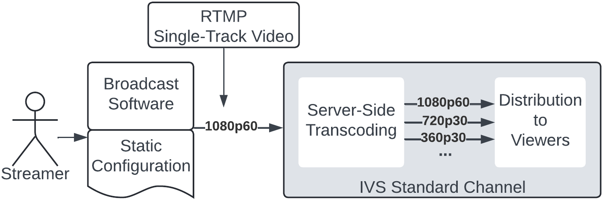
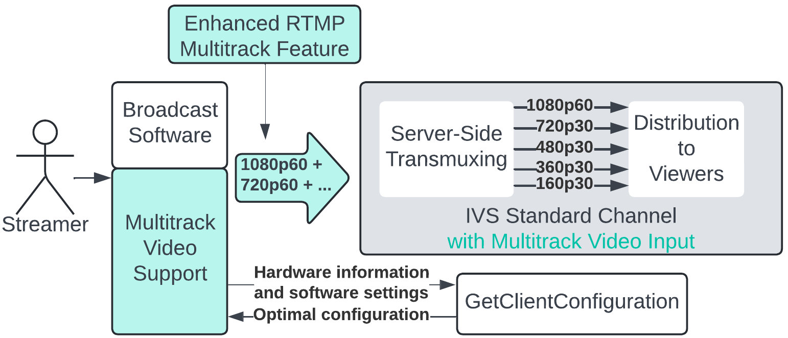

# Amazon IVS Multitrack Video

Multitrack video is a new, low-latency streaming paradigm supported by Amazon Interactive Video Service (IVS) and services that use Amazon IVS.

Here is single-track video:

In contrast, here is multitrack video:

Multitrack video streaming allows broadcaster software tools (e.g., OBS Studio) to:

- Encode and stream multiple video qualities directly from their GPU-powered computer.
- Automatically configure encoder settings for the best possible stream.
- Deliver a high quality Adaptive Bitrate (ABR) viewing experience.
  Multitrack enables this to be done without requiring expensive, server-side transcoding, which is required to deliver ABR viewing experiences for single-track video streams.

Streams that use multitrack video can exhibit higher visual quality by taking advantage of underutilized encoder silicon already in consumer GPUs. Because multitrack video is encoded only once at the edge, it delivers lower glass-to-glass latency and avoids generation loss (as opposed to being decoded, scaled, and lossily re-encoded in a data center).

Also, creators and other end users no longer need to worry about encoder settings like resolution, framerate, bitrate, and profiles. Instead, broadcast software tools use the GetClientConfiguration API operation. GetClientConfiguration automatically configures multiple encoders to optimize for the best viewer experience at the highest visual quality, given the constraints of the content creator’s preferences and the capabilities of their CPU, GPU, OS, driver, and network.

## Resolutions for IVS

Resolutions for IVS are defined as follows:

- Standard Definition (SD) — less than or equal to 480 resolution
- High Definition (HD) — more than 480, but less than or equal to 720 resolution
- Full High Definition (Full HD) — more than 720, but less than or equal to 1080 resolution

## Further Reading

If you are interested in integrating IVS APIs and SDKs into your applications, see the [Multitrack Video Setup Guide](multitrack-video-setup.md "multitrack-video-setup.md").

If you are interested in integrating support for multitrack video into creator broadcast software or a third-party streaming service, see the [Multitrack Video Broadcast Software Integration Guide](multitrack-video-sw-integration.md "multitrack-video-sw-integration.md") and the Veovera Software Organization’s [Enhanced RTMP Specification v2](https://veovera.org/docs/enhanced/enhanced-rtmp-v2 "https://veovera.org/docs/enhanced/enhanced-rtmp-v2").
