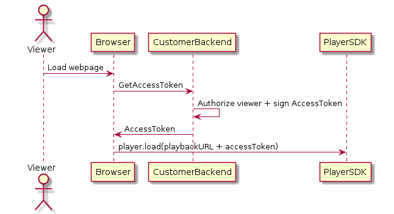

# Workflow for IVS Private Channels

This diagram illustrates the workflow for setting up IVS private channels:

1. When a viewer tries to load the webpage for a private stream, the browser
   requests an access token. (The customer provides the browser code to do
   this.)
2. The customer’s backend app receives the access-token request and determines
   whether that viewer should be authorized to view the stream. If yes, the backend
   generates a JWT, uses the customer’s private key to sign it, and returns the
   signed JWT in a playback request to the browser.
3. The browser loads the stream, using a request to the Amazon IVS player (or
   other player) SDK. The request contains the stream playback URL and the signed
   JWT.
4. Amazon IVS uses the customer’s public key to verify that the JWT was signed
   using the correct private key.
5. If the JWT is verified, Amazon IVS plays the private stream for the
   viewer.
   Customers are responsible for creating:

- The browser code to request access tokens.
- The backend server app that generates and signs JWTs.
- A playback authorization key pair. This has two parts: a public key that AWS
  retains and a private key that you download. With the private key, you sign the
  JWTs that authorize access to your private channel.
  The method described above — using a network request from the browser to fetch tokens
  — is not the only way to implement playback authorization. Alternately, customers could
  send the signed playback tokens in the initial webpage, to reduce the number of network
  round trips that a viewer needs to make.

In the sections below, we describe how to make a channel private (enable playback
authorization), generate and sign playback tokens, and work with playback key
pairs.

**Note:** In the console instructions below, if the left
navigation menu is not displaying, you can open it by choosing the hamburger icon in the
top left.
