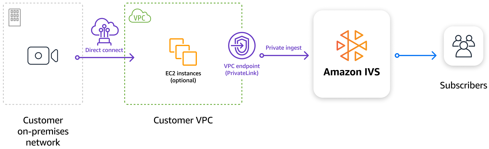

# IVS Private Ingest

For workloads that require secure, live video ingestion, you can use an interface VPC
(Virtual Private Cloud) endpoint to establish a secure private connection between your
Amazon VPC and IVS. This keeps your IVS ingest traffic within the AWS network and off the
public internet. Interface VPC endpoints are powered by AWS PrivateLink, an AWS technology
that enables private communication between AWS services, using an elastic network interface
with private IPs in your Amazon VPC. For more information, see [Amazon
Virtual Private Cloud](../../../AmazonVPC/latest/UserGuide/VPC_Introduction.md "../../../AmazonVPC/latest/UserGuide/VPC_Introduction.md") and [Access an AWS service using an interface VPC endpoint](../../../vpc/latest/userguide/vpce-interface.md#create-interface-endpoint "../../../vpc/latest/userguide/vpce-interface.md#create-interface-endpoint") (AWS PrivateLink).


You can ingest RTMP(S) streams into IVS from your Amazon VPC or through AWS Direct
Connect, and send video privately to either IVS low-latency channels or IVS real-time
stages. You are billed for standard interface VPC endpoint hourly usage and data-processing
charges; for details, see [Interface
endpoint pricing](https://aws.amazon.com/privatelink/pricing/ "https://aws.amazon.com/privatelink/pricing/"). There is no additional cost from Amazon IVS for enabling this
capability.

Ensure that your Amazon VPC is in a supported region:

- ap-northeast-1
- ap-northeast-2
- ap-south-1
- ap-southeast-1
- ap-southeast-2
- eu-central-1
- eu-north-1
- eu-west-1
- eu-west-3
- sa-east-1
- us-east-1
- us-east-2
- us-west-2
  **Note:** While your Amazon VPC must be in one of these
  supported regions, IVS control-plane resources need not be in the same region or AWS account
  as the Amazon VPC. For more details, see [Global Solution, Regional
  Control](what-is.md#what-is-aws "what-is.md#what-is-aws").

To ingest a stream through an interface VPC endpoint, use a private ingest URL composed of
the VPC endpoint’s DNS name and the stream key for the IVS resource (channel or stage ingest
configuration), in this format:

`rtmps://<VPC_ENDPOINT_DNS_NAME>/app/<STREAM_KEY>`

To stream to a channel, create a channel and retrieve its stream key as explained in
[set up
streaming software](getting-started-set-up-streaming.md "getting-started-set-up-streaming.md"). To stream to a stage using RTMP(S) or E-RTMP(S), create an [RTMP
ingest configuration](../RealTimeUserGuide/rt-rtmp-publishing.md "../RealTimeUserGuide/rt-rtmp-publishing.md") and use its associated stream key.

Below is a quick walkthrough of streaming from an EC2 instance to an IVS channel or stage
using an interface VPC endpoint:

1. [Create an interface
   VPC endpoint](#private-ingest-create-interface-vpc-endpoint "#private-ingest-create-interface-vpc-endpoint").
2. [Launch an EC2
   instance](#private-ingest-launch-ec2-instance "#private-ingest-launch-ec2-instance").
3. [Install FFmpeg on your
   instance](#private-ingest-install-ffmpeg "#private-ingest-install-ffmpeg").
4. [Stream to an IVS channel
   or stage](#private-ingest-stream-to-channel-or-stage "#private-ingest-stream-to-channel-or-stage").

## Step 1: Create an

Interface VPC Endpoint

Each VPC endpoint needs to be associated with a VPC in your account. If your account
already has a default VPC, you can use that; otherwise, create a new VPC. If you want to
use IPv6 or dualstack with your VPC endpoint, ensure that your VPC has subnets with IPv6
CIDRs assigned.

To create a VPC endpoint, see the instructions in [Create a VPC endpoint](../../../vpc/latest/privatelink/create-interface-endpoint.md#create-interface-endpoint-aws "../../../vpc/latest/privatelink/create-interface-endpoint.md#create-interface-endpoint-aws") (in the Amazon VPC documentation). Once you are on
the **Create endpoint** page:

1. Select **AWS services**. Then in the **Services** section, search for **IVS**. You should see a service like **com.amazonaws.<region>.ivs.contribute**.
2. In the **Network settings** section, select the
   VPC where you want to create the endpoint. In the **Subnets** section, select which subnets and other network settings
   you want to configure for the endpoint.
3. In the **Security groups** section, select a
   security group that allows inbound traffic on TCP ports 443 and 1935 from
   wherever you will be streaming. You can edit this later, after creating the
   endpoint, so if you don’t know what security group you want to use yet, leave it
   unselected for now.

After you select **Create endpoint**, you will be taken
back to the VPC **Endpoints** overview page, where you will
see the VPC endpoint you just created:

- The **Status** of the new endpoint is **Pending** for about 30 seconds, then it will be
  auto-accepted and its Status will change to a green **Available**.
- On the right side of the VPC endpoint information panel, you will see several
  **DNS names** associated with your VPC
  endpoint. Copy and save the first one listed; you will need to specify it as
  your stream-ingestion server URL in a future step.

## Step 2: Launch an EC2

Instance

There are many options that customers can use to broadcast a stream from AWS. The
example here uses an Ubuntu EC2 instance with FFmpeg installed.

First, create an EC2 instance (a t2.micro is fine). Be sure to create the instance
within the same VPC where you created your VPC endpoint.

The security group you assign to this instance will need egress to the VPC endpoint
for TCP ports 443 and 1935. Also be sure to enable ingress on TCP port 22 if using SSH
to access the instance, as well as egress on TCP port 80 for the package manager
operations in step 3 below.

Launch the instance. Once it initializes, use SSH or AWS Session Manager to connect to
the instance.

## Step 3: Install FFmpeg on your

Instance

Once connected to your instance, run the following commands on your machine (assuming
you created the instance with Ubuntu) to install FFmpeg:

```
sudo add-apt-repository ppa:savoury1/ffmpeg4
sudo apt-get update
sudo apt-get install ffmpeg
```

## Step 4: Stream to an IVS

Channel or Stage

The private ingest URL format is:

`rtmps://<VPC_ENDPOINT_DNS_NAME>/app/<STREAM_KEY>`

For example:

`rtmps://vpce-0a8dfb0b7a4611439-xyzabc12.contribute.ivs.us-west-2.vpce.amazonaws.com/app/sk-usw2-abc123example456`

Run the following example FFmpeg command, replacing
`<VPC_ENDPOINT_DNS_NAME>` with the DNS name from Step 1 and
`<STREAM_KEY>` with the appropriate stream key (for a channel or
ingest configuration):

```
ffmpeg -re -f lavfi -i "testsrc=duration=360:size=1024x768:rate=30" -f lavfi -i "sine=frequency=1000" -pix_fmt yuv420p -profile:v baseline -level 3.0 -r 30 -g 60 -shortest -vcodec libx264 -acodec aac -f flv "rtmps://<VPC_ENDPOINT_DNS_NAME>/app/<STREAM_KEY>"
```

If all the above was successful, your stream should be running. A stream ingested
through a VPC endpoint should be processed and treated the same as a stream ingested
through a public IVS endpoint; the only difference is the ingestion path.

When you are done using them, be sure to delete the created EC2 instance and VPC
endpoint to avoid any unnecessary charges.
